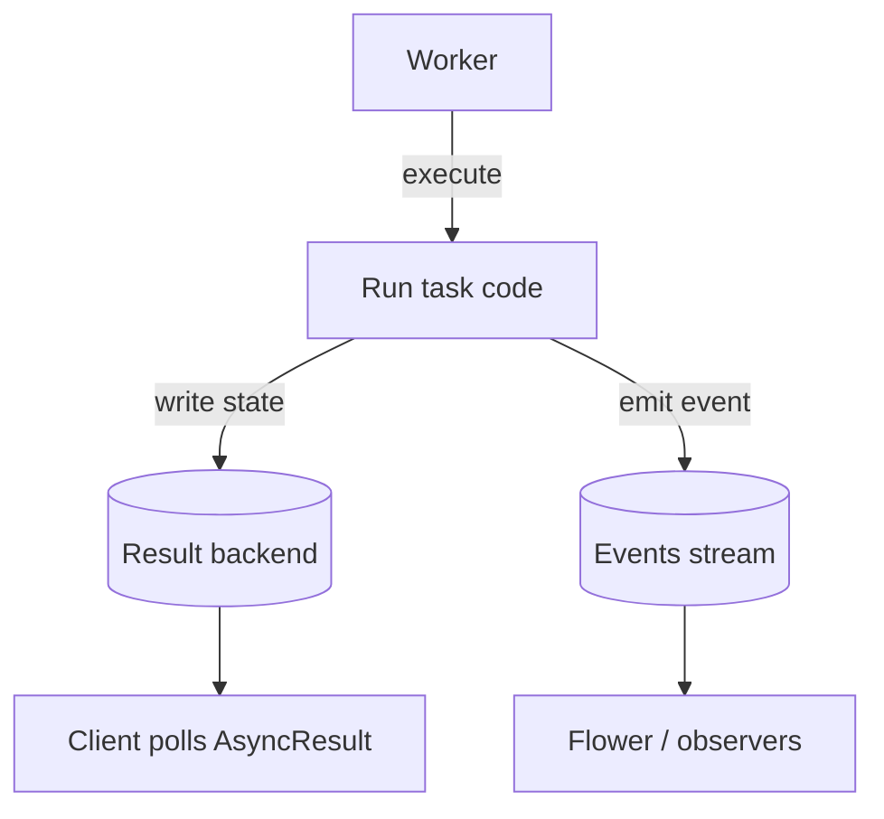

[← Назад к индексу части](index.md)
[↑ К глобальному плану](../mastery_plan.md)

## 4.4. Result backend как отдельная подсистема

### Цель раздела

Понять, зачем result backend нужен именно как отдельная подсистема: какие сценарии ему требуют, какие данные он хранит (метаданные, traceback, состояния), как устроены TTL/очистка, и почему backend может стать “узким местом” по стоимости или нагрузке.

### В этом разделе главное

- Result backend нужен не всем задачам.
- Backend хранит **метаданные**: статусы, иногда результат и traceback.
- Есть TTL/очистка: результаты не вечны.
- Backend — это ресурс с нагрузкой, стоимостью и failure modes.
- Backend тесно связан с опытом “наблюдать состояние” и с orchestration’ом, использующим результаты.

### Термины

- **Task state** — состояние задачи (pending/started/success/failure и др.).
- **Traceback** — текст/структура стека ошибки при падении.
- **TTL результатов** — политика времени жизни сохраненных записей.
- **Cleanup** — процесс удаления устаревших результатов.
- **Cost profile** — профиль нагрузки/стоимости для выбранного backend’а.

### Теория и правила

#### Зачем нужен backend

#### Проверь себя (доп.)

1. Почему result backend обычно нужен не “всем задачам”, а только в сценариях, где требуется чтение по `task_id` или последующая зависимость?
<details><summary>Ответ</summary>

Потому что backend — это витрина/хранилище статусов и результатов. Если бизнес не требует узнавать итог по `task_id` (или подтверждение есть в другом контуре), то запись/очистка backend добавляют стоимость и сложность без очевидной пользы.

</details>

2. Какое “инженерное решение” ты принимаешь, когда выбираешь включать backend?
<details><summary>Ответ</summary>

Принимаешь решение про observability и стоимость: где хранить state/result/traceback, как долго, и что делать при недоступности backend. Это влияет и на продуктовый UX (polling/статусы), и на надежность (деградация).

</details>

Список типичных причин, почему backend вообще существует в архитектуре:
- приложение хочет читать статус по `task_id`,
- UI/интерфейсы требуют polling,
- orchestration цепочек (группы, chord/unlock) использует результаты для следующего шага,
- нужен аудит/история выполнения задач (в рамках политики хранения),
- нужно диагностировать ошибки по traceback/метаданным.

Но есть и другая сторона:
- если ты не читаешь результат и статус,
- и подтверждение выполнения происходит другими способами,

то backend может быть необязательным или частично отключаемым.

#### Сценарии, где backend действительно нужен

#### Проверь себя (доп.)

1. Чем сценарий “нужен UI-поллинг статуса” принципиально отличается от “достаточно events/логов”?
<details><summary>Ответ</summary>

UI-поллинг требует **персонального состояния по `task_id`** и предсказуемого read-path (backend/events+API). Events/логирование часто достаточно для инженеров/мониторинга и не дает удобного “ответа клиенту” в формате, который обычно нужен продукту.

</details>

2. Почему оркестрация на уровне Celery часто приводит к необходимости backend?
<details><summary>Ответ</summary>

Потому что последующие шаги композиции (группы/chain/chord-паттерны) зависят от outcomes/результатов предыдущих. Чтобы понять outcome, нужен канал данных (backend или альтернативная витрина), иначе orchestration становится “слепой”.

</details>

- UI/интерфейсы ожидают polling по `task_id` (статусы “в работе”, “успешно”, “ошибка”).
- Оркестрация/compose на уровне Celery использует результаты следующего шага (когда outcome предыдущих влияет на следующий шаг).
- Нужна диагностика “почему упало” на уровне инженера: traceback и метаданные по конкретной задаче.
- Нужна история/audit действий (в рамках политики хранения: не “вечно”, а сколько разумно).

#### Сценарии, где можно обойтись без backend (или сделать его минимальным)

#### Проверь себя (доп.)

1. Как понять, что твой текущий “need backend” на практике является привычкой, а не необходимостью?
<details><summary>Ответ</summary>

Если бизнес-эффект подтверждается **другими записями/контуром истины** (БД/внешний сервис/апдейт индекса), а `AsyncResult` и traceback не используются для принятия решений и UX, значит backend — лишняя витрина.

</details>

2. Почему “событий достаточно” не означает “backend не нужен никогда”?
<details><summary>Ответ</summary>

Потому что events дают наблюдаемость событий во времени, но не всегда дают удобный read-path “статус по `task_id`” с нужной семантикой для продукта/оркестрации. Если нужен именно запрос состояния, часто требуется backend или сопоставимая витрина.

</details>

- Fire-and-forget: задача запускается ради side-effect, а факт успешности подтверждается записью в БД/внешнем сервисе.
- Достаточно events/логирования: для “что происходило” достаточно мониторинга, а `AsyncResult` не нужен продукту.
- Сознательное ограничение стоимости: не читаешь результат для большинства задач и используешь “best effort visibility”.

#### Важное последствие “обойтись без backend”

#### Проверь себя (доп.)

1. Что становится “невалидным” источником правды, если backend отключен, но приложение продолжает полагаться на `AsyncResult`?
<details><summary>Ответ</summary>

`AsyncResult` перестает быть надежным источником истины: он может долго показывать `PENDING` или вообще не отражать реальное выполнение. Значит нельзя использовать его как доказательство outcome.

</details>

2. Какой должен появиться альтернативный канал доказательства выполнения?
<details><summary>Ответ</summary>

Альтернатива должна уметь подтвердить outcome и/или дать “read path” по `task_id`: запись в БД/таблицу статуса, публикация события в другой поток, отдельная витрина метаданных и т.п.

</details>

Если backend отключен/не настроен, `AsyncResult` перестает быть надежным источником истины. Тогда система должна иметь другой канал “доказательства выполнения” (например, запись в БД, события, отдельные метрики).

#### Что именно хранится

#### Проверь себя (доп.)

1. Почему backend хранит не только итог, но и метаданные/traceback — и в чём это помогает?
<details><summary>Ответ</summary>

Метаданные (state) дают возможность понимать жизненный цикл задачи, а traceback/ошибки помогают диагностировать причины падений. Это ускоряет расследование и поддерживает UX/оркестрацию, если они опираются на эти данные.

</details>

2. Какие риски появляются, если в backend случайно хранить “слишком большие” или “хрупкие” данные?
<details><summary>Ответ</summary>

Риски: рост write/load amplification, увеличение объема хранения и задержек/стоимости, а также рост вероятности проблем с очисткой и доступностью. Поэтому хранить нужно компактные и стабильные значения (часто идентификаторы).

</details>

В общем виде backend хранит:
- текущий state (например, PENDING/STARTED/RETRY/SUCCESS/FAILURE),
- результат (если он нужен и не отключен),
- traceback/метаданные при ошибках,
- иногда дополнительные поля доставки (зависит от реализации).

И это означает: backend — не “лог без структуры”, а хранилище жизненного цикла задачи. Поэтому он подвержен:
- нагрузке от записи state,
- нагрузке от чтения через `AsyncResult`,
- необходимости чистки записей.

#### TTL и очистка

#### Проверь себя (доп.)

1. Почему TTL — это не “оптимизация ради экономии”, а часть надежности и предсказуемости?
<details><summary>Ответ</summary>

Потому что без TTL backend превращается в бесконтрольное хранилище мусора. С TTL ты управляешь жизненным циклом read-path: понимаешь, когда записи исчезают, и поэтому UI/клиенты не могут ждать “вечно”.

</details>

2. Какой типичный симптом возникает, когда запись уже почистили, но приложение ещё ожидает статус?
<details><summary>Ответ</summary>

`AsyncResult` может показывать `PENDING` или “нет записи/необновление”, даже если выполнение уже завершилось. Внешне это выглядит как “ничего не произошло”, но причина — исчезновение state/result.

</details>

В production почти всегда нужно думать о том, что делать со старыми записями:
- результаты могут становиться мусором,
- запись traceback увеличивает объем,
- чтение старых результатов может замусорить логику продукта.

Поэтому TTL и cleanup — не “опционально”, а часть архитектурного дизайна.

#### Картинка в голове (TTL): “табло живет ограниченное время”

```mermaid
flowchart LR
  A[Worker завершил задачу\nи пытается записать state/result] --> B[Запись в backend\n(табло свежих данных)]
  B --> C[Ожидаемое время жизни (TTL)\nданные доступны по task_id]
  C --> D[Cleanup/истечение TTL\nзаписи удалены/не доступны]
  note1[Симптом: AsyncResult долго PENDING/не находит запись,\nесли backend уже почистили или не успели записать финальное состояние] -.-> D
```

#### Нагрузка и стоимость хранения

#### Проверь себя (доп.)

1. От чего чаще всего растет нагрузка на backend в системе с большим количеством задач?
<details><summary>Ответ</summary>

От двух факторов: **частые записи state/result** (write amplification) и **частые чтения статусов** (polling `AsyncResult` или интеграции, которые постоянно дергают backend). Плюс рост объема при больших payload.

</details>

2. Почему нельзя воспринимать backend как “бесплатный лог”, если у тебя высокие throughput и много клиентов статусов?
<details><summary>Ответ</summary>

Потому что он становится узким местом по стоимости/latency и может отказать. Это влияет на надежность наблюдаемости и поведение UX/оркестрации.

</details>

Backend может стать узким местом:
- при очень большом количестве задач (state write amplification),
- при большом throughput чтения статусов,
- при хранении больших payload (в том числе “случайно” сериализованных объектов).

Правило для инженера: **backend — ресурс, а не бесплатная удобность**.

### Пошагово

1) Спроси себя: “Мы действительно хотим/нужно читать статус и результат?”
2) Если да — определись с:
   - уровнем детализации (что именно нужно),
   - временем жизни (TTL),
   - частотой запросов статуса (polling vs webhook/события).
3) Если нет — используй стратегию “минимальной observability”: минимальные записи, ignore_result, или отдельное прикладное подтверждение.

### Простыми словами

Result backend — это “табло результатов”.
- worker выполняет работу,
- backend записывает “табло: начато/успешно/упало, и чем упало”.

Если табло сломалось — работа может идти, но вы не сможете смотреть табло.

### Картинка в голове



### Как запомнить

Backend — это “хранилище последствий и заметок”. Если заметки не нужны — экономь.

### Примеры

#### Пример: сценарий “мы хотим показывать прогресс”

Если UI показывает “задача в процессе”, тебе нужен backend:
- без него ты не сможешь обновлять прогресс по `task_id`,
- можно перейти на другой механизм (например, писать прогресс в БД приложения), но это уже другая архитектура.

#### Пример: сценарий “fire-and-forget”

Если задача отправляет уведомление, а подтверждение идет через лог/внешний сервис:
- backend может быть избыточен,
- ты либо не хранишь результат, либо хранишь минимально.

### Практика / реальные сценарии

1) “Веб-сервис стал медленнее, хотя worker’ы не изменились”.
- возможно, это не CPU worker’ов, а рост нагрузки на backend из-за polling/статусов.

2) “Через час я не могу получить traceback задачи”.
- это может быть TTL/очистка backend’а. Нужно понимать политику хранения.

### Типичные ошибки

- Включать backend “на всякий случай” и не задавать TTL/очистку.
- Хранить большие результаты/объекты (вместо устойчивых идентификаторов), что увеличивает write amplification.
- Считать, что backend “гарантирует надежность выполнения”. Он отвечает только за видимость результата.

### Что будет если…

#### ...backend не доступен во время записи state

#### Проверь себя (доп.)

1. Что именно становится “невалидным” для наблюдаемости, когда backend недоступен в момент записи state?
<details><summary>Ответ</summary>

Нарушается read-path статусов: `AsyncResult` может не обновляться, а отображаемые состояния остаются на старом значении/в ожидании. Execution может происходить, но финальный outcome не фиксируется (или фиксируется не полностью).

</details>

2. Какое архитектурное требование появляется к приложению, чтобы оно не падало из-за невозможности записать state в backend?
<details><summary>Ответ</summary>

Нужно спроектировать деградацию observability: таймауты на чтение/запись, fallback/кеш или “unknown + later update”, ограничение polling, и чтобы failure backend не превращало его в failure execution.

</details>

Тогда ты получишь:
- отсутствие обновлений в `AsyncResult`,
- возможные ретраи/поведение Celery зависят от настроек и реализации (в этой части мы фиксируем идею: backend — отдельная зона отказа),
- и, главное, ты должен деградировать observability так, чтобы приложение не “падало” из-за невозможности прочитать табло.

### Проверь себя

1. Почему backend — не просто “дополнительный конфиг”, а часть архитектуры и стоимости?

<details><summary>Ответ</summary>

Потому что backend принимает записи state/result и обслуживает чтение. Это создает нагрузку, требует хранения и очистки и может стать узким местом по стоимости/latency. Кроме того, backend может отказать и тогда поведение чтения статусов меняется.

</details>

2. Какие сценарии обычно не требуют backend?

<details><summary>Ответ</summary>

Сценарии, где тебе нужен только side effect и подтверждение выполнения можно получить в другом месте (БД, внешняя система, индекс), а чтение `AsyncResult` не требуется.

</details>

3. Что чаще всего “всплывает” позже: проблема доставки или проблема backend’а?

<details><summary>Ответ</summary>

По практике часто сначала заметно delivery (публикация/очереди), но проблемы backend (TTL, стоимость, отказ при записи state, polling) становятся видны при росте throughput и нагрузки на observability.

</details>

### Запомните

Backend — это “счетчик и табло”. **Работу делает worker, записать итог и статус помогает backend**.

---
