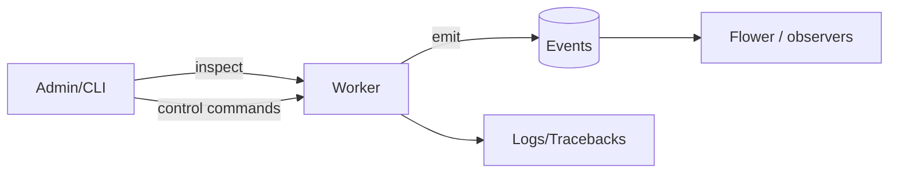

[← Назад к индексу части](index.md)
[↑ К глобальному плану](../../mastery_plan.md)

## 4.5. Event system и remote control

### Цель раздела

Понять event system и remote control как две разные вещи:
- **events** — наблюдение (кто что делал),
- **remote control** — управление/команды (кто что должен сделать).

Ты научишься видеть, как observer-ы (Flower, inspect) помогают расследовать инциденты, и почему remote control требует безопасной сетевой модели.

### В этом разделе главное

- Worker и task могут отправлять **события**: received/started/succeeded/failed (и др.).
- **Flower** и другие наблюдатели потребляют события и дают удобную визуализацию.
- Celery позволяет делать **broadcast-команды** и **inspect/control**: remote control.
- Remote control может:
  - раскрывать метаданные,
  - отменять задачи,
  - ограничивать rate,
  - менять поведение worker’ов.
- Поэтому remote control — это зона безопасности: нужен контроль доступа и сетевых путей.

### Термины

- **Events** — поток событий о выполнении и lifecycle task’ов.
- **Flower** — UI-наблюдатель за Celery через events/метрики.
- **Broadcast-команды** — команда, которую отправляют всем (или набору) worker’ов.
- **Inspect/control** — механизмы удаленного чтения статусов worker’ов и управления.

### Теория и правила

#### Events: что и зачем

#### Проверь себя (доп.)

1. Чем events как поток наблюдения отличаются от backend как хранилища статусов по `task_id`?
<details><summary>Ответ</summary>

Events — это “телеметрия во времени”: наблюдатель видит события lifecycle. Backend — “read model” для конкретной задачи (по `task_id`) и часто с TTL. Они отвечают на разные вопросы: “что происходило сейчас?” vs “какой статус/результат у этой конкретной задачи?”.

</details>

2. Почему events часто помогают расследованию быстрее, чем ожидание ответа из backend?
<details><summary>Ответ</summary>

Потому что events — поток и может быть почти realtime для наблюдателей: ты раньше увидишь “worker начал/закончил/упал”, чем столкнешься с отсутствием или задержкой записи в backend (или TTL/очисткой).

</details>

Events нужны не “для выполнения задачи”, а для наблюдения:
- чтобы понять, что worker вообще начал обработку,
- чтобы визуализировать последовательность,
- чтобы строить метрики и алерты.

Если ты расследуешь production-инцидент, events часто дают более быстрые доказательства, чем backend, потому что events — поток, который можно потреблять наблюдателями почти “в реальном времени”.

#### Remote control: управление и inspect

#### Проверь себя (доп.)

1. Что делает remote control по отношению к “запуску задач в фоне” — наблюдает или меняет поведение?
<details><summary>Ответ</summary>

Remote control — это управление/команды (включая inspect). Он может менять поведение worker’ов (ограничивать rate, отзыв/отмену), а не просто сообщать о том, что уже произошло.

</details>

2. Какой риск появляется, если remote control доступен без сетевой изоляции?
<details><summary>Ответ</summary>

Появляется риск злоупотребления: посторонний может отменять задачи, ограничивать исполнение, раскрывать метаданные о задачах/worker’ах и провоцировать отказ в обслуживании.

</details>

Remote control — это команды, которые могут:
- вызвать инспекцию (“покажи registered tasks”, “ping worker”, “какие очереди слушает”),
- выполнить команды управления (“revoke task”, “rate limit”),
- транслировать ограничения на рабочие процессы.

С практической точки зрения: remote control помогает тебе не перезапускать сервисы “вслепую”.

#### Broadcast-команды: что меняется и что не меняется

#### Проверь себя (доп.)

1. Почему broadcast обычно влияет не “на уже зарезервированные задачи немедленно”, а скорее на будущие обработки?
<details><summary>Ответ</summary>

Потому что broadcast-команда — это управление поведением worker’а на уровне управления/конфига, а не механический “перепросмотр” уже исполняющегося контекста. Часто действие отражается в обработке следующих сообщений/пулов.

</details>

2. После broadcast какой evidence обязательно стоит проверить?
<details><summary>Ответ</summary>

Сначала — events/логи worker’ов и факт, что команда действительно применена. То есть ищешь evidence “поведение изменилось” (например, события о throttling/смене обработки или изменение темпа исполнения) — а не просто факт отправки команды.

</details>

Broadcast-команда — это управляющее сообщение, которое Celery control транслирует множеству worker’ов (или всем “активным” в рамках мониторинга). Типично такие команды используются для изменения административных параметров (например, лог-уровня или ограничений обработки).

Важно мыслить так:
- broadcast не “переписывает историю” уже зарезервированных задач мгновенно;
- чаще всего эффект проявляется на будущих действиях worker’а (как он будет обрабатывать новые сообщения).

Поэтому после broadcast всегда проверяй evidence: события/events и/или логи worker’ов с фактами применения.

#### Rate limit: почему он стабилизирует, но не лечит backlog сам по себе

#### Проверь себя (доп.)

1. Почему rate limit уменьшает нагрузку на downstream, но может увеличивать время ожидания в очереди?
<details><summary>Ответ</summary>

Потому что rate limit ограничивает скорость исполнения worker’ом: задачи продолжают копиться/ждать, но downstream не получает чрезмерный fan-out. Итог — меньше давления на зависимость, но выше latency очереди.

</details>

2. Как “не перепутать” ситуацию “backlog растет из-за rate limit” с ситуацией “worker не резервирует сообщения”?
<details><summary>Ответ</summary>

Смотри на evidence исполнения: если worker жив и появляются started/executed events, значит он исполняет, просто медленнее (rate limit). Если нет execution evidence и reserve не происходит, это другая failure domain — delivery/execution stall.

</details>

Команда `rate_limit` задаёт ограничение на скорость исполнения (как правило, по имени задачи) на стороне worker’а. Это помогает избежать “storm” при сбоях downstream’а: worker начинает “тормозить” и не перегружает зависимость.

Но это не магия доставки: сообщения остаются в очередях. Следовательно, ограничение rate уменьшает нагрузку на downstream, но увеличивает задержку обработки (latency) при росте очереди.

#### Безопасностные и сетевые последствия remote control

#### Проверь себя (доп.)

1. Назови два разных класса последствий от утечки remote control: “операционные” и “безопасностные”.
<details><summary>Ответ</summary>

Операционные: можно сорвать обработку (revoke/rate limit), вызвать задержки/SLA. Безопасностные: раскрыть метаданные о задачах и worker’ах, а также получить возможность манипулировать контуром выполнения.

</details>

2. Какие меры снижают риск, не разрушая эксплуатацию?
<details><summary>Ответ</summary>

Сетевой firewall/изолирование брокера и контрольного канала, отдельные credentials/vhost для админ-действий, ограничение “кто может выполнять inspect/control”, плюс логирование control-действий.

</details>

Remote control — это фактически API управления частью вычислительного контура. Следствия:
- если брокер или control-канал доступен извне сети, злоумышленник может:
  - узнать информацию о задачах,
  - вызвать отмену или ограничение исполнения,
  - создать отказ в обслуживании.
- если права/разделение vhost/учеток неправильные, команды может отсылать кто угодно из той же сети/аккаунта.

Минимальная “инженерная дисциплина”:
- изолировать брокер по сети (firewall),
- использовать разные credentials/vhost для prod-инфраструктуры и админ-утилит,
- ограничивать, кто может запускать `celery inspect/control` в рамках инфраструктуры,
- логировать remote control действия (где это возможно).

### Пошагово

1) Для наблюдения: включай/потребляй events (например, `celery events`) и/или запускай Flower.
2) Для расследования: используй `inspect` чтобы проверить очереди/registered tasks/worker alive.
3) Для управления: применяй control-команды аккуратно (revoke/rate_limit) и всегда подтверждай эффект через evidence (events/logs).
4) Для безопасности: убедись, что доступ к control-командам не является “открытой дверью”.

### Простыми словами

Events — это “телеметрия на радио”: что происходит прямо сейчас.
Remote control — это “кнопки управления”: можно сказать worker’у “остановись/ограничься/покажи статус”.

Как и любые кнопки, remote control без охраны превращается в риск.

### Картинка в голове



### Как запомнить

**Events = видеть. Remote control = управлять.** Всегда различай это при расследовании: ты либо “наблюдаешь доказательства”, либо “изменяешь поведение”.

### Примеры

#### Пример: инспекция и события (команды)

Команды могут немного отличаться по версии Celery/конфига, но смысл один:

1) Inspect/ping:
```sh
celery -A <your_app> inspect ping
celery -A <your_app> inspect registered
celery -A <your_app> inspect active
```

2) Events (телеметрия):
```sh
celery -A <your_app> events --dump
```

3) Remote control (примеры управления):
```sh
celery -A <your_app> control rate_limit <task_name> 10/m
celery -A <your_app> control revoke <task_id>
```

Главный момент: после remote control команды подтверждай результат через evidence:
- что worker действительно получил/применил команду,
- что events/логика изменения поведение отразили.

#### Пример: когда remote control спасает расследование

Если ты видишь “шторм ретраев” и подозреваешь downstream-ошибку:
- ты можешь сначала ограничить rate (control),
- и только потом разбираться “почему”, не убивая систему.

### Практика / реальные сценарии

1) “В очереди backlog растет, но backend говорит, что ничего не меняется”.
- проверь events: действительно worker работает и “emit” ли events,
- проверь inspect registered/active: жив ли worker и слушает ли он очередь,
- если нужно — управляй rate limit для стабилизации.

2) “Команда хочет остановить конкретную задачу пользователя”.
- remote control revoke позволяет остановить задачу до фактического выполнения (или в зависимости от фазы — сложнее),
- важно понимать, что revoke — не “волшебная отмена кода”, а действие в контур доставки/обработки.

### Типичные ошибки

- Считать events и backend взаимозаменяемыми “табло”: events могут быть включены/выключены независимо, и они отражают другое “окно времени”.
- Запускать remote control с теми же credentials, что и для обычного подключения приложения, без изоляции сети.
- Применять rate limit “вслепую” и потом забывать убрать ограничение.

### Что будет если…

#### ...remote control доступен из незащищенной сети

#### Проверь себя (доп.)

1. Какие два “класса” угроз remote control в незащищенной сети ты здесь видишь?
<details><summary>Ответ</summary>

(1) Операционные угрозы: злоумышленник может отзывать/отменять задачи или ограничивать исполнение (rate/revoke). (2) Информационные угрозы: раскрытие метаданных о задачах и worker’ах, что помогает дальнейшим атакам.

</details>

2. Почему firewall/изоляция — это не “лишняя безопасность”, а часть надежности эксплуатации?
<details><summary>Ответ</summary>

Потому что без изоляции появляется риск внешних команд, которые могут устроить “самоподдерживающиеся” сбои (например, резкий revoke/rate limit). Тогда remote control становится переменной отказа для контуров выполнения.

</details>

В худшем случае можно получить:
- отмену/отзыв задач,
- раскрытие информации о задачах и worker’ах,
- деградацию производительности (rate limiting, принудительное вмешательство),
- лавинообразные сбои при “случайных” командах от неуполномоченных пользователей.

Это не абстракция: control-команды — часть вычислительного контура и требуют как минимум сетевой изоляции и контроля доступа.

### Проверь себя

#### Проверь себя (4.5)

1. Почему broker и result backend лучше рассматривать как две разные зоны отказа?

<details><summary>Ответ</summary>

Потому что отказ broker влияет на доставку сообщений (задача может не попадать к worker), а отказ result backend влияет на видимость статусов/результатов (задача может исполняться, но ты не увидишь это через `AsyncResult`).

</details>

2. В чём разница между хранением результата и публикацией событий?

<details><summary>Ответ</summary>

Хранение результата (result backend) — это постоянное (или TTL-ограниченное) хранилище статусов/результатов, доступное по `task_id`. Публикация событий — это поток телеметрии о lifecycle задач, обычно предназначенный для наблюдателей и мониторинга, а не обязательно для долговременного “исторического” хранения.

</details>

3. Почему детали транспорта влияют на гарантию доставки и поведение retry?

<details><summary>Ответ</summary>

Потому что гарантия доставки и механизм повторной выдачи зависят от того, как транспорт реализует очереди, ack/visibility, persistence и поведение при сбоях. Celery “строит” retry на основании этих механик.

</details>

### Запомните

Events помогают видеть, что происходит. Remote control помогает вмешиваться. И то, и другое требует дисциплины безопасности и доказательной проверки эффекта.

---
