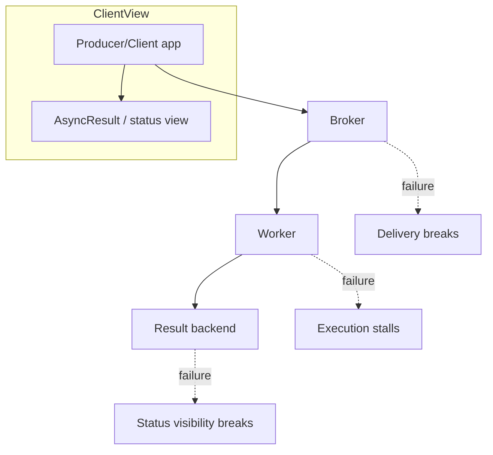

[← Назад к индексу части](index.md)
[↑ К глобальному плану](../celery_mastery_plan.md)

## 4.6. Разделение зон отказа

### Цель раздела

Научиться локализовать проблемы по границам компонентов: broker, worker, result backend. Ты должен уметь ответить на вопрос “что доступно клиенту/приложению при падении каждого компонента” и как спроектировать деградацию при недоступности backend.

### В этом разделе главное

- Каждая компонента — отдельная **зона отказа**: сбой broker, result backend и worker дают разные симптомы.
- Клиенту важны не только “успех/неуспех”, но и то, что он может узнать:
  - факт доставки,
  - факт старта,
  - финальный статус/результат.
- Backend — ресурс с отказами: при его недоступности нужно планировать деградацию наблюдаемости.
- Диагностика должна начинаться с вопроса “какая зона отказа наиболее вероятна по симптомам?”.

### Термины

- **Failure symptom** — наблюдаемый симптом (например, `PENDING` слишком долго, backlog растет, сообщения не исчезают).
- **Degradation strategy** — стратегия “как жить дальше”, когда подсистема отказала.

### Теория и правила

#### Два разных “мира” для клиента: доставка vs статус

#### Проверь себя (доп.)

1. Почему один и тот же инцидент может выглядеть “по-разному” для продукта/UX и для инженера?

Ответ

Потому что продукт часто видит только “статус по backend” (read model), а доставка/исполнение могут происходить в другом контуре. Поэтому возникает иллюзия “задача не работает”, хотя фактически она может исполняться.

2. Как эта разница помогает быстрее локализовать причину “тишины”?

Ответ

Ты начинаешь проверять, какая плоскость сломалась: delivery (broker/worker reserve) или visibility (backend/events/TTL). Если в delivery evidence есть execution, но статус не обновляется — проблема в visibility/backend.

Клиент часто живет в двух восприятиях:
- “доставка”: дошла ли задача до worker,
- “статус”: доступно ли чтение состояния через backend.

Когда backend недоступен, клиент может видеть “тишину”, даже если worker продолжает исполнять.

#### Матрица “что ломается → что видим”

#### Проверь себя (доп.)

1. Как матрица помогает выбрать “первую гипотезу” при диагностике?

Ответ

По симптомам ты выбираешь вероятную зону failure domain: если “не видно сообщений/нет delivery evidence” — сначала проверяешь broker; если “worker жив, но status пустой” — смотри backend/visibility.

2. Почему важно смотреть именно “что видит клиент”, а не только “что ты предполагаешь”?

Ответ

Потому что разные компоненты отказают в разной точке жизненного цикла. “Похоже по внешним симптомам” может означать разные внутренние причины, и только соответствие симптомов той части мира, которую видит клиент, сокращает область поиска.

Ниже — базовая матрица, которая помогает не путать причины.

| Зона отказа | Что происходит внутри | Что обычно видит клиент |
|---|---|---|
| **Broker падает** | Producer не может доставлять/публиковать, очередь не принимает сообщения | публикации могут падать, `delay()`/`apply_async()` может завершаться ошибкой или зависать |
| **Worker падает** | сообщения в очереди не резервируются и не исполняются | backlog растет, статусы долго остаются ожиданием (если backend доступен) |
| **Result backend падает** | задачи исполняются, но запись/чтение статусов ограничены | `AsyncResult` не обновляется/ошибается, но execution в реальности может идти |

Эта матрица — практический инструмент: по симптомам ты выбираешь “зону, которую проверять первой”.

#### Деградация при недоступном backend

#### Проверь себя (доп.)

1. Что самое опасное, если UI/HTTP бесконечно опрашивает `AsyncResult`, когда backend недоступен?

Ответ

Каскадные нагрузки и ухудшение SLA: ты усиливаешь отказ backend (или создаешь новую точку отказа) постоянным polling, плюс получаешь плохой UX “вечное ожидание”.

2. Какая архитектурная идея стоит за рекомендацией “показывать неизвестно / обновление позже”?

Ответ

Разорвать связность “основной контур выполнения” и “контур наблюдаемости”: деградация visibility не должна превращаться в деградацию execution. Поэтому ограничиваешь ожидание, используешь backoff и/или другие каналы (events/кеш/табло в приложении).

Если backend — “табло”, то при его отказе приложение должно:
- перестать полагаться на backend как на единственный источник истины,
- ограничить время ожидания и retries чтения backend,
- по возможности использовать:
  - отдельное прикладное хранилище статуса,
  - events/логирование,
  - кэширование или “последнее известное состояние” (если это допустимо бизнесом).

Практическая рекомендация: если backend недоступен, клиенту (UI/HTTP) почти всегда лучше показывать **“статус неизвестен / обновление позже”** с backoff-поллингом (или событиями), чем бесконечно ждать `AsyncResult`. Это защищает SLA веб-сервиса и снижает риск каскадных задержек.

Идея: **observability не должна превращаться в отказ основного контура выполнения**.

### Пошагово

1. Зафиксируй симптом:
   - `PENDING` слишком долго,
   - backlog растет,
   - публикации падают,
   - задачи “исчезают”, но статус не меняется.
2. По симптомам оцени зоны:
   - если publish не проходит — сначала broker,
   - если очередь копится — дальше worker/queues,
   - если исполнение видно в логах, а статус пустой — backend.
3. Проведи проверку доказательствами:
   - worker logs/events,
   - метрики очереди (depth/lag),
   - backend наличие записей по `task_id`.
4. Выбери деградацию:
   - если backend недоступен — переключись на другой источник статуса и сократи ожидание.

### Простыми словами

Ты смотришь на “наблюдаемые эффекты” и пытаешься понять, какая часть почтовой системы сломалась:
- доставка не работает (broker),
- письма лежат, но никто не читает (worker),
- письма читают и работают, но учет не ведется (backend).

### Картинка в голове

### Как запомнить

Фраза: **Delivery, Execution, Visibility**.

Сначала выясни, в какой из трех плоскостей проблема.

### Примеры

#### Пример: `PENDING` слишком долго

Возможные объяснения:
- задача еще не reserved worker’ом (worker dead/queues mismatch),
- или backend не обновляет статусы (backend dead).

Как различить:
- смотри worker logs/events (видишь ли “started”),
- смотри backlog в broker (растет ли очередь),
- проверь наличие записей state в backend.

#### Пример: backlog растет, а worker “жив”

Тогда часто:
- worker не слушает нужную очередь (`-Q` mismatch),
- routing отправляет сообщения в другую queue,
- worker не смог импортировать приложение/задачи (задача не зарегистрирована).

### Практика / реальные сценарии

1) Production инцидент “задачи зависли”.
- Сначала определяешь: растет ли queue depth? есть ли events started? доступен ли backend.
- Потом принимаешь решение: перезапуск worker, правка routing/queues, или деградация интерфейса ожидания.

2) “Веб интерфейс перестал показывать прогресс”.
- backend мог быть перегружен или отказал.
- worker может продолжать исполнять, но интерфейс “слепой”.

### Типичные ошибки

- Путать “не видно статусов” с “не выполняется работа”.
- Проверять только backend, игнорируя broker/worker logs.
- Не иметь стратегии деградации: когда backend отказывает, приложение должно продолжать жить.

### Что будет если…

#### ...backend недоступен, но UI продолжает бесконечно опрашивать `AsyncResult`

#### Проверь себя (доп.)

1. Почему бесконечный polling UI при недоступном backend может ухудшить ситуацию даже после восстановления backend?

Ответ

Потому что backlog запросов/нагрузка на read-path выстреливают при восстановлении (thundering herd), а клиенты всё равно продолжают дергать `AsyncResult`. Это может усилить латентность и нагрузку.

2. Назови две меры, которые уменьшают риск каскадных проблем, не “ломая” UX полностью.

Ответ

(1) Ввести backoff/timeout на polling (“unknown + обновление позже”). (2) Использовать другие источники статуса/события (events/прикладной кеш/табло в БД), чтобы не полагаться на постоянный read-path через backend.

Последствия:
- рост нагрузки на backend при восстановлении,
- ухудшение UX (постоянные ошибки),
- возможные cascading failures (очередь задач на чтение/таймауты).

Решение на уровне архитектуры:
- внедрить ограничение на polling (timeout/backoff),
- использовать events или прикладный кеш,
- приоритетно “отсоединить” основное выполнение от наблюдаемости.

### Проверь себя

1. Какой один симптом сильнее всего помогает начать с broker, а не с backend?

Ответ

Если publish/очередь не принимают сообщения: публикации падают или очередь depth почти не растет, а сообщения “не появляются”. Это указывает на проблемы доставки.

2. Какие два доказательства обычно помогают отличить “worker не исполняет” от “backend не показывает”?

Ответ

Логи/events worker (есть ли started/executed) и метрики broker (queue depth/backlog). Если execution видно, а backend молчит — проблема в visibility.

3. Почему деградация observability — часть архитектуры надежности, а не “UX-опция”?

Ответ

Потому что без деградации система может превратить отказ backend’а в отказ основного контура (через бесконечные ожидания/таймауты/polling). Деградация защищает SLA и предотвращает cascading failures.

### Запомните

Сбой разделяется по плоскостям **Delivery / Execution / Visibility**. Если ты проверяешь именно плоскости, ты не теряешь время на неверные гипотезы.

---
