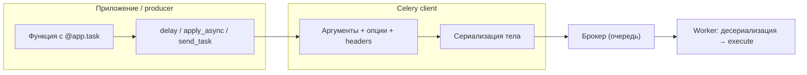
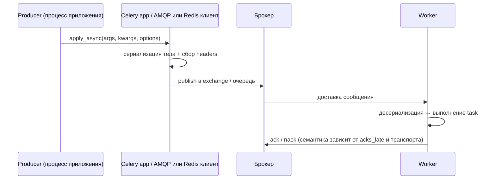

[← Назад к индексу части](index.md)
[↑ К глобальному плану](../../mastery_plan.md)

## Карта API: от кода до сообщения

Перед разделами полезно зафиксировать **одну** картину: что ты делаешь в Python и что из этого становится **сообщением** в брокере.

**Интуиция:** `delay()` — это «положить заказ на конвейер». Конвейер — брокер. Сборщик на фабрике — worker. То, что ты кладёшь на ленту, должно быть **упаковано** (сериализация), **адресовано** (queue/routing) и **иметь наклейки** (headers, id).

### Sequence: кто вызывает кого при публикации

Ниже — **упрощённый** порядок для `apply_async` (детали bootsteps и consumer — в частях 8–9):

#### Проверь себя: карта API и sequence публикации

1. Что именно из твоего Python-процесса **не перелетает** в брокер «как есть», а попадает в сообщение уже в **перекодированном** виде?

Ответ

**Аргументы вызова** (`args`/`kwargs` задачи): Celery **сериализует** их в байты по выбранному `serializer`. Живые объекты памяти, функции, открытые ресурсы не переносятся. Вместе с телом уходят **опции доставки** и **метаданные** (очередь, заголовки и т.д.) в структуре сообщения протокола.

2. На диаграмме sequence **кто** отвечает за сериализацию тела и сбор заголовков — worker или код в процессе producer?

Ответ

**Клиент Celery в процессе producer** (приложение + библиотека) **перед** `publish`: именно там формируется сообщение. Worker занимается **десериализацией** после доставки.

3. Почему на схеме после `W->>B` указаны и **ack**, и зависимость от **acks_late**?

Ответ

**Ack** — подтверждение брокеру, что сообщение обработано (или что consumer взял его на себя — зависит от режима). **`acks_late`** сдвигает **момент** ack относительно начала/конца исполнения задачи, что меняет баланс «потерять работу при kill» vs «получить повторную доставку». Это не деталь сообщения, а **политика consumer** (§ 5.6 и части 8–9).

---
