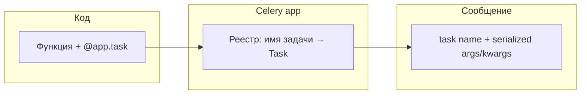

[← Назад к индексу части](index.md)
[↑ К глобальному плану](../../mastery_plan.md)

## 5.1. Декларация задач

### Цель раздела

Научиться превращать обычную функцию в **задачу Celery** осознанно: с правильным именем, опциями по умолчанию и, при необходимости, доступом к **`Task`-объекту** через `self`.

### В этом разделе главное

- `@app.task` регистрирует задачу в **конкретном приложении** `Celery` (`app`).
- У задачи есть **строковое имя** (важно для `send_task` и для совпадения кода на producer и worker).
- `bind=True` меняет сигнатуру: первый аргумент — **`self` как инстанс `Task`**.
- Общую логику (ретраи, hooks) можно выносить в **свой класс**, наследуя `celery.Task`.

### Термины

| Термин | Кратко |
| --- | --- |
| **Celery app** | Объект приложения: конфигурация, реестр задач, подключение к брокеру. |
| **Task name** | Строковой идентификатор задачи в сообщении. |
| **`Task` (класс)** | Обёртка исполнения: вызов, ретраи, запись результата и т.д. |

### Теория и правила

**Базовая декларация** выглядит так: ты подвешиваешь декоратор на функцию, и Celery строит вокруг неё объект задачи. Имя по умолчанию обычно строится из **модуля и имени функции** (это удобно, пока структура пакетов стабильна).

**Явное имя** (`name="payments.charge"`) полезно, когда:

- хочешь **стабильный контракт** независимо от рефакторинга файлов;
- разные сервисы используют **общее соглашение** об именах;
- есть **legacy** и нельзя ломать уже существующие сообщения в очереди.

**Опции декоратора** — это «дефолты публикации/исполнения» для этой задачи: таймлимиты, сериализатор, политика результата, retry-параметры и т.д. Их можно переопределить в `apply_async`, но хороший стиль — зафиксировать **безопасные дефолты** на уровне задачи.

**`bind=True`** нужен почти всегда для «взрослых» задач, потому что даёт:

- `self.request` (id, retries, headers…);
- доступ к API `retry`, `replace` и некоторым внутренним hook-ам;
- единое место для логирования контекста.

**Кастомный базовый класс** (через `base=MyTask`) позволяет централизовать:

- обёртку логирования;
- единый формат метрик;
- политику «что считается временной ошибкой».

Это предпочтительнее «копировать один и тот же try/except в 200 задач».

#### Повторное использование логики через класс `Task`

Наследник `celery.Task` может переопределять хуки (точные имена зависят от версии; проверяй документацию), например:

- **`on_failure`** — единообразный алерт/лог при финальном падении;
- **`on_retry`** — метрика «ещё одна попытка»;
- **`before_start`** — последняя точка «до бизнес-кода» для обогащения контекста.

Интуиция: `base=AppTask` подключает **сквозную политику**, а тело конкретной задачи остаётся про бизнес. Глубже про сигналы и bootsteps — часть 8/38.

#### Проверь себя: базовый класс `Task` и хуки

1. Чем **`on_failure`** на уровне `base=AppTask` принципиально отличается от «обернуть каждую задачу в свой `try/except`**?

<details><summary>Ответ</summary>

Хук **`on_failure`** вызывается в **контексте Celery** при **финальном** провале задачи (после политики ретраев — уточни семантику в доке версии), едино для всех задач на базисе: один стиль логов, метрик и алертов. Разрозненные `try/except` дублируют код и легко дают разное поведение на одинаковых сбоях.

</details>

2. Зачем что-то делать в **`before_start`**, если вся «настоящая работа» в теле функции?

<details><summary>Ответ</summary>

Это стандартная точка **сразу перед** вызовом бизнес-кода: обогатить контекст логов/метрик, проверить окружение, избежать копирования одной и той же «преамбулы» в каждую задачу.

</details>

#### Регистрация задачи в приложении (картинка из плана)

Декларация связывает **Python-функцию**, **строковое имя** и **дефолтные опции** внутри объекта `Celery`. Worker при старте загружает те же модули и строит тот же **реестр имя → исполняемая обёртка**; в сообщении брокера путешествует прежде всего **имя** и **тело вызова**, а не «ссылка на функцию».



#### Проверь себя: реестр и сообщение

1. Почему в брокере в сообщении есть **строковое имя** задачи, а не «указатель на функцию» из памяти producer?

<details><summary>Ответ</summary>

Процессы **разделены**: worker не разделяет память с producer. Контракт — **имя + сериализованные аргументы** (+ опции), по которым worker в **своём** реестре находит зарегистрированный `Task` и вызывает код.

</details>

2. Что пойдёт не так, если producer и worker запущены с **разным** `Celery`-приложением (другой `-A`, другой реестр, другой префикс имён), но брокер общий?

<details><summary>Ответ</summary>

Сообщения могут доставляться, но **имя задачи** может **не зарегистрироваться** на worker, либо зарегистрируется **другая** реализация. Получаются `NotRegistered`, неверное исполнение или тихая несовместимость — нужен **единый** app и согласованный деплой кода задач.

</details>

3. Зачем явно фиксировать **`name="..."`**, если автоимя из модуля и функции «и так уникально»?

<details><summary>Ответ</summary>

При **рефакторинге** путей модулей автоимя меняется, а **старые сообщения** в очереди ещё ссылаются на **старое** имя — класс поломки при деплое. Явное имя стабилизирует **контракт очереди** независимо от структуры пакетов.

</details>

### Пошагово: как спроектировать декларацию

1. Выбери **стабильное имя**, если задача живёт долго и очереди не пустые.
2. Если нужен контекст исполнения — **`bind=True`**.
3. Зафиксируй **`acks_late`**/лимиты/рейтлимиты на уровне задачи или конфига (часть 7–8 углубит worker-сторону).
4. Вынеси общее поведение в **`base` класс**, если задач много.

### Простыми словами

Декоратор — это не «магия скорости», а **регистрация контракта**: «вот функция, которую можно вызывать удалённо, вот как она называется для остального мира».

### Картинка в голове

`@app.task` — это **паспорт профессии** для функции: имя, категория, правила работы.

### Как запомнить

**Имя — контракт очереди. `bind` — контекст. `base` — общие правила дома.**

### Примеры

```python
# celery_app.py — условный каркас
from celery import Celery, Task

app = Celery("demo")

class AppTask(Task):
    autoretry_for = (ConnectionError,)
    retry_kwargs = {"max_retries": 5}

@app.task(
    bind=True,
    base=AppTask,
    name="billing.enqueue_invoice",
    ignore_result=True,
    soft_time_limit=60,
    time_limit=90,
)
def enqueue_invoice(self, invoice_id: int) -> None:
    # self.request.task_id, retries и т.д. доступны
    ...
```

#### `@app.task` и `@shared_task`

- **`@app.task`** привязывает функцию к **конкретному** объекту `app = Celery(...)`. Так делают в сервисах, где приложение явно создаётся в `celery_app.py`.
- **`@shared_task`** (из `celery import shared_task`) регистрирует задачу на **текущем «дефолтном» приложении** Celery. Это частый стиль в **Django**: одна настройка `app` в конфиге, а модули задач не импортируют `celery_app` явно.

**Правило:** в одном процессе worker **не путай** два разных `Celery()` с разными брокерами — задача должна жить на том же app, что и worker `-A`.

#### Проверь себя: `@app.task` и `@shared_task`

1. Почему в **Django** часто выбирают `@shared_task`, а не `@my_celery_app.task` в каждом модуле?

<details><summary>Ответ</summary>

Чтобы не тянуть **явный импорт** экземпляра приложения в десятки модулей и опереться на **одно** «текущее» app из конфигурации фреймворка. Цена — ты обязан понимать, какое app реально **default** при импорте задач и при старте worker.

</details>

2. В каком случае **`@shared_task`** — **плохой** выбор по сравнению с **`@app.task`** на конкретном `app`?

<details><summary>Ответ</summary>

Когда в одном репозитории или рантайме осознанно живут **несколько** Celery-приложений (разные брокеры, разные реестры) и важно **жёстко** привязать задачу к **конкретному** `app`, а не к «дефолту», который мог перетереться импортами.

</details>

3. Что проверить, если задача с `@shared_task` **не видна** worker при том, что модуль импортируется?

<details><summary>Ответ</summary>

Что worker стартует с **тем же** default app / `include` / `autodiscover` (в Django — что `app.autodiscover_tasks()` вызывается), что пакет с задачами в **INSTALLED_APPS**, и что нет **двух** competing `Celery()` до регистрации. Диагностика: список зарегистрированных задач через inspect/лог при старте.

</details>

### Практика / реальные сценарии

- **Платёжные и биллинговые** задачи: стабильное имя + строгие лимиты времени.
- **Уведомления**: часто `ignore_result=True`, чтобы не раздувать backend.

### Типичные ошибки

- Полагаться на автогенерируемое имя и затем **переименовать модуль** — в очереди остаются старые сообщения.
- Забыть `bind=True`, а потом «непонятно почему нет `self.request`».

### Что будет, если…

**…имя задачи изменилось, а сообщения старые ещё лежат в брокере?** Worker может **не найти** обработчик (зависит от режима/конфигурации) или начнутся ошибки импорта/регистрации. Это классический мотив для **явных имён** и аккуратных миграций (см. части 16, 30 в плане).

#### Проверь себя: политика retry и видимость

1. Зачем тебе может понадобиться `base=MyTask`, если уже есть `bind=True`?

<details><summary>Ответ</summary>

`bind=True` даёт **экземпляр** задачи в конкретной функции. `base=MyTask` задаёт **класс** для всех задач на этом базисе: общие дефолты (`autoretry_for`), переопределения `__call__`, единые хуки. Это масштабирование практики на много задач.

</details>

2. Что может сломаться, если две разные функции случайно получили **одинаковое** `name=`?

<details><summary>Ответ</summary>

Реестр задач и маршрутизация ожидают **уникальность** имён как **логического ID**. Коллизия имен ведёт к непредсказуемому поведению: «выполнилась не та реализация», затёрлись регистрации, сложные баги в проде.

</details>

3. Когда **`bind=False`** допустим, а когда почти всегда берут **`bind=True`** в продакшене?

<details><summary>Ответ</summary>

**`bind=False`** уместен для совсем простых **чистых** функций без доступа к `request`, `retry`, `replace` и без единого логирования контекста Celery. **`bind=True`** нужен, если ты хочешь **`self.request`**, ручные/контекстные **`retry`**, **`replace`**, сквозные логи с `task_id` и попытками — то есть почти все «взрослые» фоновые сценарии.

</details>

### Запомните

Декларация задачи — это **контракт очереди**: имя и опции должны жить так же долго, как и сообщения, которые ты готов пережить при деплое.

---
