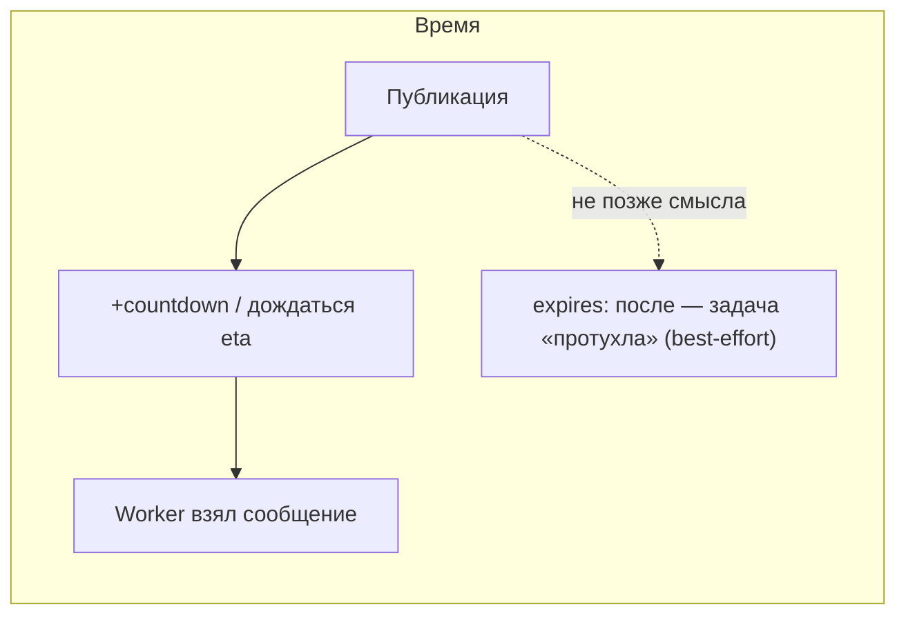
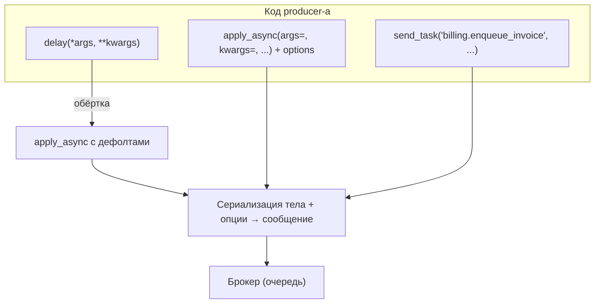

[← Назад к индексу части](index.md)
[↑ К глобальному плану](../mastery_plan.md)

## 5.2. Вызов задач

### Цель раздела

Уверенно публиковать работу в очередь: быстро в простых случаях и **полностью контролируемо** в сложных.

### В этом разделе главное

- `delay(*args, **kwargs)` → почти всегда внутри зовёт `apply_async`.
- `apply_async(args=..., kwargs=..., **options)` — главный инструмент **опций доставки**.
- `send_task(name, args=..., kwargs=..., **options)` — вызов **по имени** (другой сервис, динамический роутинг, изоляция модулей).
- **ETA / countdown / expires** управляют временем (и «свежестью») исполнения.

### Термины

| Термин | Кратко |
| --- | --- |
| **Publish / enqueue** | Отправить сообщение в брокер. |
| **ETA** | Запланировать на абсолютное время `datetime`. |
| **Countdown** | Запланировать через `N` секунд. |
| **Expires** | «Не исполнять после» (ограничение актуальности). |

### Теория и правила

**`delay()`** удобен для учебных примеров и простых сценариев. Как только тебе нужны: очередь, routing, headers, связки `link`, приоритет, отложенный запуск с особыми правилами — переходи на **`apply_async`**.

**`send_task`** применяют, когда producer **не хочет импортировать** модуль с определением задачи.

**Когда уместен вызов по имени без импорта (чек-лист плана):**

| Ситуация | Зачем `send_task` |
| --- | --- |
| **Другой сервис / репозиторий** публикует работу | В контейнере producer нет кода задачи — только **строковый контракт** имени |
| **Плагины и динамические имена** | Имя определяется конфигом или реестром на лету |
| **Жёсткие циклические импорты** | Иногда выгоднее контракт по строке, чем выравнивать граф модулей |
| **Стабильное имя важнее пути модуля** | Рефакторинг пакетов не должен ломать сообщения в очереди — держишь `name="..."` и `send_task` |

Цена всегда одна: **нет статической проверки** имени на стороне producer — нужны тесты контракта, мониторинг «task not registered», соглашения о версиях.

**Countdown vs ETA**:

- `countdown=10` — относительная задержка от момента публикации;
- `eta=datetime(...)` — абсолютное время (осторожнее с **таймзонами** и DST — см. часть 11).

**Expires** помогает отбросить **устаревшую** работу (например, кэш-прогрев, который уже не нужен). В API обычно допускают **число секунд** или **datetime** «не исполнять после»; если заданы и **`eta`**, и **`expires`**, в документации Celery отмечено, что **момент протухания считается от `eta`** — перепроверь для своей мажорной версии, не гадай в проде.

#### ETA, countdown и expires на одной шкале (ментальная модель)

**Countdown** откладывает **первую возможность** исполнения относительно **момента публикации**. **ETA** якорит исполнение к **абсолютному времени** (с учётом timezone). **Expires** — граница «данные/смысл работы уже неактуальны»; это не замена **time_limit** на worker и не гарантия мгновенного исчезновения из брокера — это **подсказка планировщику/consumer**, реализуемая по-разному на транспортах.



**Практика:** для «свежее 5 минут» моделируй **expires от события**, а для «ровно в 15:00» — **timezone-aware ETA** + отдельно продумай, что если очередь перегружена к этому часу (часть 11 про beat/DST — см. таймзоны).

#### Проверь себя: время публикации (countdown, ETA, expires)

1. Почему **`countdown=3600`** и **`eta=now+1h`** схожи по смыслу, но **не** всегда взаимозаменяемы?

<details><summary>Ответ</summary>

**Countdown** якорится на **момент публикации** в процессе producer. **ETA** — на **абсолютные часы** (календарь, таймзона, DST). При перегруженной очереди ни то ни другое не гарантирует «исполнение ровно в T», но ошибки **таймзон** и **перевода времени** бьют в основном по **ETA**.

</details>

2. Если ты задал **`expires`**, значит ли это, что worker **гарантированно** не начнёт тяжёлую работу после этой отметки?

<details><summary>Ответ</summary>

Нет. **`expires`** — **подсказка** «сообщение устарело» для планирования/consumer; на разных брокерах и нагрузках семантика отличается. Не substitute для **идемпотентности** и **бизнес-проверок** «ещё актуально ли». Сверяй с докой версии и своим транспортом.

</details>

3. При одновременном **`eta`** и **`expires`** к чему в документации Celery привязывают расчёт протухания, и зачем это знать?

<details><summary>Ответ</summary>

В официальной доке указано, что при **обоих** параметрах отсчёт **`expires` может считаться от `eta`**, а не от момента publish. Иначе ты неверно моделируешь «окно актуальности» относительно запланированного старта. Перепроверь формулировку для своей мажорной версии.

</details>

#### Аргументы, `kwargs` и `options`

| Что передаёшь | Куда попадает |
| --- | --- |
| Первые позиционные в `delay(a, b, key=v)` | В тело задачи как `args` / `kwargs` функции |
| `apply_async(args=(1,2), kwargs={"k": 3})` | Явное разделение: только то, что пойдёт в **сериализуемый** контракт вызова |
| Всё остальное именованное в `apply_async(..., queue=..., countdown=...)` | В **`options` доставки**: очередь, ETA, headers, link, и т.д. — **не** путай с аргументами пользовательской функции |

**Типичная ошибка:** положить «служебное» в kwargs функции (`def task(self, queue_name):`), хотя `queue` должен быть option `apply_async`. Держи **бизнес-аргументы** и **опции доставки** в разных слоях мышления.

#### Карта вызовов: кто куда ведёт



**Инвариант:** независимо от входной точки, в брокер уходит **однотипное сообщение**; отличается только то, **знаешь ли ты объект задачи** (`delay`/`apply_async`) или только **строковое имя** (`send_task`).

#### Проверь себя: таблица «что куда» и три входа в брокер

1. Почему **`queue="urgent"`** в `apply_async` — это **не** аргумент твоей функции `def work(queue):`?

<details><summary>Ответ</summary>

Потому что `queue` относится к **опциям доставки сообщения** в брокер, а не к **сериализуемому контракту** вызова пользовательской функции. Перепутав слои, ты либо сломаешь сигнатуру задачи, либо отправишь параметр не туда, где его ждёт маршрутизатор.

</details>

2. Чем **инженерно** отличается ветка **`delay` → apply_async с дефолтами** от ветки **`send_task`** на одной и той же очереди?

<details><summary>Ответ</summary>

По **сообщению** в брокере итог похож; отличие в **producer-коде**: в первом случае ты импортировал **объект задачи** и пользуешься типобезопасностью имени; во втором — только **строка** имени: выше риск опечатки и «рассинхрона версий» без контрактных тестов.

</details>

3. Зачем в таблице отдельно выделяют `apply_async(args=(42,), kwargs={...})`, а не всё передать позиционно через `delay`?

<details><summary>Ответ</summary>

**Явные `args`/`kwargs`** исключают двусмысленность «что из этого бизнес-параметр, а что опция» и обязательны, когда нужно **не передавать** kwargs или аккуратно смешивать кортеж позиционных аргументов с опциями вида `countdown`, которые иначе могли бы путаться с именованными аргументами `delay`.

</details>

### Пошагово: выбрать способ вызова

1. Нужны ли нестандартные опции? **Да** → `apply_async`.
2. Можешь ли импортировать функцию задачи? **Нет** → `send_task` с **явным** именем.
3. Это периодика? Обычно beat (часть 11), но иногда `ETA` из бизнес-события.

### Простыми словами

`delay()` — как нажать кнопку «сделай». `apply_async()` — как заполнить форму заказа: куда, когда, с какими пометками.

### Картинка в голове

Сравни с **курьерским ярлыком**: адресат (queue), срочность (priority), время доставки (ETA), срок годности (expires).

### Примеры

```python
# Простой путь
enqueue_invoice.delay(42)

# Полный контроль
enqueue_invoice.apply_async(
    args=(42,),
    queue="billing",
    countdown=30,
    expires=3600,  # число секунд или datetime — сверь семантику с докой версии
    headers={"correlation_id": "req-9f3a"},
)

# По имени — например, из другого репозитория
app.send_task(
    "billing.enqueue_invoice",
    args=(42,),
    kwargs={},
    queue="billing",
)
```

### Практика / реальные сценарии

- Постановка задачи из **Django view** после коммита транзакции (важно не гонять «раньше времени» — паттерны части 18/20).
- Отложенная задача **после cooldown** (антиспам).

#### Что возвращают `delay()` и `apply_async()`

Оба вызова (в типичном использовании) возвращают **`AsyncResult`** — «ручку» к записи в **result backend** по `task_id`, если backend настроен и задача не `ignore_result`.

```python
ar = enqueue_invoice.apply_async(args=(42,), queue="billing")
tid = ar.id
# ar.get(timeout=30)  # ждать результат — осторожно в HTTP-запросе: блокировка и таймауты
```

**Простыми словами:** `AsyncResult` — это не «результат уже готов», а **способ опросить/дождаться** метасостояние, которое пишет worker. Если backend выключен или `ignore_result=True`, опрос часто бессмысленен — закладывайся на логи и метрики.

#### Проверь себя: `AsyncResult` и result backend

1. **`AsyncResult.state == SUCCESS`** гарантирует, что **бизнес-эффект** (деньги, письмо) точно произошёл?

<details><summary>Ответ</summary>

Нет. Backend фиксирует **исход выполнения задачи с точки зрения Celery**. Рассинхрон с БД, частичный побочный эффект до падения, баг после return — всё остаётся на **прикладной** модели. Проверяй инварианты там, где лежит источник истины.

</details>

2. Почему при **`ignore_result=True`** часто **бессмысленно** создавать `AsyncResult` и крутить опрос в UI?

<details><summary>Ответ</summary>

Потому что **запись результата/статуса** в result backend **не ведётся** (или минимальна). Ты не получишь надёжную «витрину прогресса» без другой модели: логи, метрики, строка **job** в БД, события.

</details>

3. Чем **`ar.id`** после `apply_async` полезен **операционно**, кроме вызова `get()`?

<details><summary>Ответ</summary>

Как **scaffolding**: передать пользователю «номер операции», связать **логи** HTTP и worker, вызвать **`revoke`**, искать в мониторинге. Это не гарантия уникальности бизнес-операции без отдельного ключа.

</details>

### Типичные ошибки

- Передавать в `args` **не итерируемое** «как одно число» — путаница со скобками: `args=(42)` vs `args=(42,)`.
- Путать **время постановки** и **время исполнения** при высокой нагрузке: ETA не гарантирует «ровно в эту секунду» как у реального таймера ОС.
- Делать **`ar.get()` без таймаута** в синхронном веб-обработчике — риск **заморозки** воркера приложения при сбое очереди.

### Что будет, если…

**…истёк `expires`, а worker занят?** Поведение зависит от версии/брокера/настроек; в инженерной голове это должно читаться как: **не полагаться на expires как на строгую транзакционную семантику** без проверки документации для твоего транспорта.

#### Проверь себя: headers и приоритет

1. Почему `send_task` опаснее, чем прямой импорт функции?

<details><summary>Ответ</summary>

Потому что компилятор/линтер **не связывает** строковое имя с реальной функцией: ошибки в именах всплывают **в рантайме** на worker. Нужны тесты контракта, соглашения о версиях, мониторинг «unknown task».

</details>

2. Когда `delay()` — разумный выбор в production?

<details><summary>Ответ</summary>

Когда задача **простая**, опции дефолтные, маршрутизация централизована в конфиге, а тебе не нужны headers/link/priority/expiry. Во многих командах всё равно стандартизируют `apply_async` ради единообразия.

</details>

3. Почему опасно в HTTP-обработчике вызывать **`result.get()` без таймаута** после `apply_async`?

<details><summary>Ответ</summary>

Потому что обработчик **блокируется**, пока не придёт результат или не случится сбой backend. При проблемах с worker/очередью это превращает веб-воркер в «зависший» поток, ухудшает latency и может исчерпать пул процессов. Обычно либо **fire-and-forget** + опрос статуса по id, либо `get(timeout=…)`, либо отдельный асинхронный контракт (WebSocket/polling).

</details>

4. Чем опасна конструкция **`args=(id)`** вместо **`args=(id,)`** при одном аргументе?

<details><summary>Ответ</summary>

`(id)` в Python — это **не кортеж**, а выражение в скобках: в `args` уедет **не итерируемый** объект как один элемент протокола (или возникнет путаница Celery с распаковкой), что даёт трудноуловимые ошибки. Кортеж из одного элемента — **`(id,)`**.

</details>

5. Назови сценарий из **плана**, где **`send_task`** предпочтительнее импорта функции из сервиса-исполнителя.

<details><summary>Ответ</summary>

**Другой микросервис/репозиторий** публикует работу: в образе producer **нет кода** задачи, есть только соглашённое **строковое имя** и контракт аргументов; также **плагины** с динамическим именем задачи.

</details>

### Запомните

Публикация задачи — это **отправка сообщения**. Сообщение должно нести **минимальный, стабильный контракт**.

---
