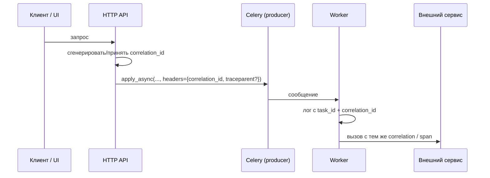

[← Назад к индексу части](index.md)
[↑ К глобальному плану](../../mastery_plan.md)

## 5.4. Контекст задачи (`self.request`)

### Цель раздела

Научиться читать **контекст исполнения**: что Celery знает о конкретном запуске и как это связать с **логами, метриками и трассировкой**.

### В этом разделе главное

- `self.request.id` — идентификатор **этого** выполнения.
- `self.request.retries` — сколько раз уже **пытались** (интерпретация зависит от момента вызова).
- `self.request.delivery_info` — подсказки о доставке (exchange, routing_key и т.п. — зависит от транспорта).
- `self.request.hostname` — какой worker исполняет.
- `self.request.headers` — кастомные заголовки, часто для **корреляции**.

### Теория и правила

**Корреляция**: когда пользователь жалуется на операцию `order_id=123`, ты в логах ищешь **единый correlation id**, который прошёл через HTTP → Celery → внешний API.

**Tracing context** (OpenTelemetry и т.п.) часто прокидывают через `headers` при `apply_async` и восстанавливают в worker. Детали интеграций — часть 14/26, но **модель** закладывается здесь.

#### Паттерны корреляции и трассировки (correlation patterns)

| Паттерн | Суть | Когда применять |
| --- | --- | --- |
| **Один `correlation_id`** | UUID/строка из шлюза; кладётся в `headers` и в логи HTTP и Celery | Минимум для поддержки; хватает многим командам |
| **W3C Trace Context** | Заголовки вроде `traceparent` / `tracestate` в `headers` (или совместимые аналоги) | Связка с **Jaeger/Tempo/Datadog APM** и единый трейс |
| **`task_id` как вторичный ключ** | Тот же id в логах БД (`jobs.celery_task_id`) | Когда продукт показывает пользователю «номер фоновой операции» |

Сквозной поток (упрощённо):



**Запомните:** `headers` — место для **сквозных идентификаторов наблюдаемости**, а не для тяжёлого JSON целиком.

#### Проверь себя: корреляция и трассировка

1. Почему **одного** лога HTTP с `correlation_id` недостаточно, если worker потом ходит во внешний API?

<details><summary>Ответ</summary>

Worker — **отдельный процесс**: без переноса идентификатора **в сообщении** (`headers`) исходящие вызовы из задачи **рвут** цепочку сквозного поиска. Ты не сможешь связать инцидент «ответ API» с исходным запросом пользователя.

</details>

2. Чем **`traceparent`** выгоднее «самодельной строки в заголовке» при связке с APM?

<details><summary>Ответ</summary>

Это **стандарт W3C**, который APM и шлюзы понимают **единообразно**: меньше проприетарных договорённостей, проще склеивать spans между сервисами и библиотеками.

</details>

3. Почему в таблице **`task_id` как вторичный ключ** отнесён к паттерну наблюдаемости/продукта, а не к «бизнес-args» задачи?

<details><summary>Ответ</summary>

`task_id` генерируется **инфраструктурой** Celery для **запуска**; продуктовый смысл часто — «номер джоба» в UI. Дублирование в БД связывает **продукт** и **логи Celery** без засорения сигнатуры задачи лишними полями в каждом сообщении (хотя `id` всегда есть в `request`).

</details>

#### Поля `self.request`, с которыми ты чаще всего работаешь

Объект **Request** — «снимок» текущего запуска. Точный набор атрибутов может слегка меняться по версии Celery, но инженерный минимум такой:

| Поле / группа | Зачем нужно |
| --- | --- |
| **`id` / `task_id`** | Сквозной id запуска; клади в логи и метрики. |
| **`args` / `kwargs`** | Уже **десериализованные** параметры вызова задачи (удобно для отладочного лога и asserting в тестах; не свети PII и секреты). |
| **`retries`** | Счётчик попыток **на момент исполнения**; полезно отличать «первый прогон» от повтора. |
| **`eta` / `expires`** | Если задача поставлена с отложенным запуском / сроком годности — здесь может отражаться контекст планирования. |
| **`delivery_info`** | Подсказки маршрута: `exchange`, `routing_key`, `queue` (зависит от транспорта). |
| **`hostname`** | Имя узла worker — критично при расследовании «на каком поде упало». |
| **`headers`** | Твои и системные метаданные (корреляция, трейсинг, тенант). |
| **`called_directly` / `is_eager`** (в разных версиях встречается схожая идея) | Понять, исполняемся ли мы **локально/eager** или через брокер. |
| **`parent_id` / canvas-связи** (при orchestration) | Для `chain`/`chord` в запросе могут появляться идентификаторы родителя — полезно для **разборов вложенных** задач (подробнее часть 10). |

**Картинка в голове (поток метаданных):**

```mermaid
flowchart TB
  subgraph pub["Публикация"]
    H["apply_async("..., headers=...")"]
  end
  subgraph msg["Сообщение в брокере"]
    MH["headers в теле/метаданных"]
  end
  subgraph run["Исполнение"]
    R["self.request.headers + delivery_info + id"]
  end
  H --> MH --> R
```

#### Проверь себя: поля `self.request`

1. Зачем логировать **`delivery_info`**, если в коде producer ты и так передал `queue="billing"`?

<details><summary>Ответ</summary>

Потому что на пути от producer до worker могут сработать **дефолты роутинга**, **брокерные** перезаписи или ошибка конфигурации. **`delivery_info` показывает факт**, а не намерение — незаменимо при «задача ушла не туда».

</details>

2. Когда полезно читать **`self.request.args`** вместо повторной загрузки сущности из БД?

<details><summary>Ответ</summary>

Для **отладочного** лога «с чем реально вызвали», регрессионных проверок и тестов — с **редакцией** PII. Не подменять ими **бизнес-источник истины**: аргументы могли устареть, а транзакции в БД — уже другие.

</details>

3. Что означает наличие **`parent_id`** (или аналога) в контексте **canvas**?

<details><summary>Ответ</summary>

Признак **вложенного** запуска: задача порождена **оркестрацией** (`chain`/`chord` и т.д.). Полезно связать логи дочернего шага с родителем при расследовании частичных сбоев (детали — часть 10).

</details>

### Пошагово: добавить сквозной лог

1. На HTTP-границе сгенерируй `correlation_id`.
2. Передай в `apply_async(headers={"correlation_id": ...})` (или стандартизированные OTel заголовки).
3. В `bind=True` задаче залогируй `self.request.id` + correlation.

### Простыми словами

`self.request` — это **паспорт текущего запуска**: кто я, как меня доставили, какой у меня номер попытки.

### Картинка в голове

Представь **багажную бирку**: flight code (task id), leg (delivery), retry sticker.

### Примеры

```python
@app.task(bind=True)
def process_webhook(self, payload: dict):
    cid = (self.request.headers or {}).get("correlation_id")
    delivery = self.request.delivery_info or {}
    logger.info(
        "webhook.start",
        extra={
            "task_id": self.request.id,
            "correlation_id": cid,
            "routing_key": delivery.get("routing_key"),
            "hostname": self.request.hostname,
        },
    )
    ...
```

**Зачем тащить `delivery_info` в лог:** при инциденте «задача ушла не в ту очередь» ты видишь **фактический** маршрут доставки, а не предположение в коде producer.

### Типичные ошибки

- Ожидать, что `headers` всегда `dict` одинаковой формы на всех транспортах — проверяй фактические ключи.

### Проверь себя

1. Чем `task_id` полезен в поддержке инцидентов?

<details><summary>Ответ</summary>

Он связывает **логи worker**, записи result backend (если включено), события мониторинга и иногда записи в БД. Это главный **сквозной идентификатор** исполнения Celery.

</details>

2. Почему `retries` нельзя интерпретировать как «точное число ошибок бизнес-логики»?

<details><summary>Ответ</summary>

Ретраи могут триггериться на **инфраструктурные** исключения, бывают **ручные** повторы, а также нюансы момента чтения. Это метрика попыток исполнения, а не учёт бизнес-причин.

</details>

3. Зачем выносить `traceparent` / OTel-контекст в `headers`, а не только писать в лог HTTP-запроса?

<details><summary>Ответ</summary>

Потому что worker — **другой процесс** и другой «хвост» трейса. Без передачи контекста в сообщении spans **рвутся**, и ты не увидишь единую цепочку «запрос → задача → исходящий вызов». Headers доставляют минимальный **слепок** контекста до исполнителя.

</details>

4. Почему нельзя полагаться, что **`self.request.headers`** всегда обычный `dict` с теми же ключами на Redis и RabbitMQ?

<details><summary>Ответ</summary>

Транспорт и версия Celery могут **нормализовать** заголовки иначе (вложенность, строковые ключи, префиксы). В коде — **безопасный доступ** `(headers or {}).get("...")` и интеграционные проверки на целевом брокере.

</details>

### Запомните

Без `self.request` ты слеп к **распределённости**. С ним — можешь строить нормальную observability.

---
