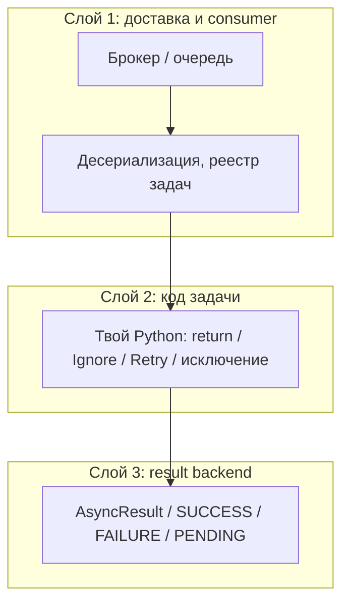
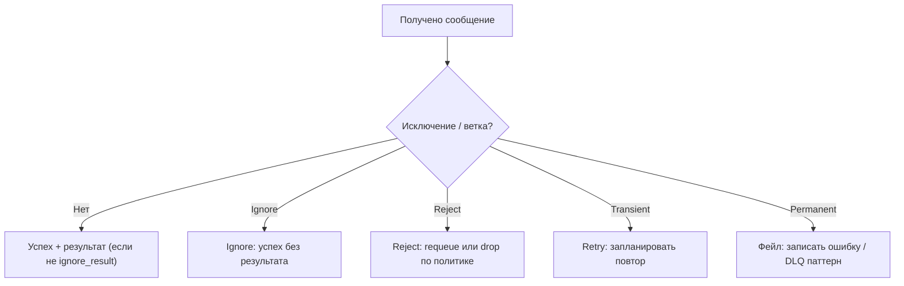

[← Назад к индексу части](index.md)
[↑ К глобальному плану](../mastery_plan.md)

## 5.5. Состояния и ошибки

### Цель раздела

Различать **«задача ждёт»**, **«задача игнорируется намеренно»**, **«задача отвергнута»**, **«задача повторяется»** и **«задача отозвана»**.

### В этом разделе главное

- **`PENDING`** часто означает «ничего ещё не известно result backend» — не путай с отсутствием исполнения.
- **`Ignore`** — «считай задачу успешно завершённой без результата» (намеренное гашение).
- **`Reject`** — отказ от сообщения с семантикой **возврата/отказа** на уровне брокера (используй осторожно и осознанно).
- **`Retry`** — поднять исключение повтора (или вызвать `self.retry`) — запланировать новую попытку.
- **`TaskRevokedError`** — отмена; важно отличать от бизнес-отмены.
- **Traceback** хранится в backend при определённых настройках — следи за **PII**.

### Теория и правила

Интуиция: у задачи есть **два слоя**:

1) что произошло в Python (исключения, `return`),  
2) что записалось/не записалось в **result backend** и что решил **broker** про сообщение.

На диагностику влияет ещё **третий** измерение — **«дошло ли сообщение и смог ли worker его принять»** (брокер, сеть, несовпадение имени задачи, ошибка десериализации **до** входа в твою функцию):



**Практика:** симптом «вечный PENDING» сначала мапь на **слой 3 и 1**, а не сразу на «баг в теле задачи».

`PENDING` как минимум в API `AsyncResult` часто читается как «статус ещё не установлен». В распределённой системе это может значить и «ещё не дошло», и «backend недоступен», и `ignore_result`.

**Семантика `PENDING` (важно не напугать себя):** `AsyncResult(task_id).state` может долго оставаться `PENDING`, если result backend ещё **не получил** ни одной записи — например, задача в длинной очереди, worker мёртв, или ты передал **чужой** id. Это не доказательство «ничего не исполняется»; это доказательство «**на витрине результатов пусто**». Истинность исполнения проверяй по логам worker и метрикам брокера (часть 4).

**`self.retry`** обычно предпочтительнее «наивного sleep + повторить всё заново», потому что интегрируется с механизмами Celery ( backoff опции, отметки попыток ) — но финальная семантика зависит от ack/retry/nack на конкретном транспорте (углубление в частях 8–9).

#### Проверь себя: три слоя и `PENDING`

1. Пользователь видит **`PENDING`** в API статуса, но в логах worker задача уже отработала. На какие **два слоя** из трёх ты смотришь в первую очередь?

<details><summary>Ответ</summary>

Сначала **слой 3** (result backend: `ignore_result`, сбой записи, неверный id) и **слой 1** (сообщение ушло, но статус на витрине не обновился). Только потом — «логика в теле» как единственное объяснение.

</details>

2. Почему «вечный `PENDING`» **не доказывает**, что worker простаивает?

<details><summary>Ответ</summary>

`PENDING` в `AsyncResult` часто значит **отсутствие записи** в backend о данном id: задача может исполняться/ждать/уже завершиться с политикой без записи результата. Нужны **логи worker** и **метрики брокера**.

</details>

3. Зачем выделять отдельно **слой десериализации до входа в твою функцию**?

<details><summary>Ответ</summary>

Потому что ошибка **протокола/версий** выглядит как «задача ломается», хотя **бизнес-код** даже не вызван; другие ретраи и DLQ, чем у исключения внутри `run()`.

</details>

#### `Ignore` vs `Reject` (не путать!)

| Механизм | Простыми словами | Что обычно происходит с сообщением / статусом |
| --- | --- | --- |
| **`Ignore`** | «Считаем задачу **успешно** завершённой без полезного результата» | Для внешнего наблюдателя это **не ошибка**; подходит для idempotent «нечего делать». |
| **`Reject`** | «Мы **отказываемся** обрабатывать это сообщение **на уровне протокола**» | Брокер может **requeue** или **отбросить** сообщение в зависимости от флагов (`requeue=True/False`) и транспорта. Это уже **инженерное решение про недоставку/ядовитое сообщение**, не про «тихий успех». |

**Когда думать про `Reject`:** сообщение **битое навсегда** deserialization error на уровне, где повтор бессмысленен, политика DLQ/requeue настроена осознанно, и ты понимаешь последствия для очереди. Если сомневаешься — сначала модель **poison message → DLQ** и алерты (часть 9).

#### Проверь себя: `Ignore` и `Reject`

1. Почему **`Reject(requeue=True)`** на системно битом сообщении может **удсугубить** шторм в очереди?

<details><summary>Ответ</summary>

Сообщение **возвращается** в очередь и снова потребляется → бесконечный цикл без прогресса, рост задержек и нагрузки. Для «навсегда плохих» данных обычно **`requeue=False`** + DLQ/ручная обработка + алерт.

</details>

2. В каком случае **`Ignore`** предпочтительнее **`return None`** в задаче с result backend?

<details><summary>Ответ</summary>

Когда нужна **семантика Celery** «успешное завершение без результата»/гашение стандартного исхода так, как ожидает обвязка мониторинга. Обычный `return` даёт **SUCCESS с результатом `None`** — для внешних систем это может отличаться от «намеренного noop» в метриках и обработчиках (сверь с версией и политикой команды).

</details>

3. Сравни **UX поддержки** для алерта по **`Ignore`** и по **`Reject`**.

<details><summary>Ответ</summary>

`Ignore` часто **не** триггерит «ошибку» в привычных дашбордах — без явных логов легко принять за «всё хорошо». `Reject` ближе к **инфраструктурному** событию (requeue/drop) и обычно требует явной политики очереди; оба пути нуждаются в **структурных логах**.

</details>

#### `TaskRevokedError` и отзыв

Если задача **отозвана** (`revoke`) в момент, когда worker уже исполняет её (или заходит внутрь), исполнение может завершиться исключением **`TaskRevokedError`** (или сигналом отмены в зависимости от версии и режима). Для прикладного кода важно:

- отличать **бизнес-«отмена заказа»** (флаг в БД) от **операционного revoke**;
- не ловить `TaskRevokedError` «в один common except Exception» так, чтобы превратить отмену в «успешный skip» без логов.

#### Проверь себя: отзыв и `TaskRevokedError`

1. Чем **операционный** `revoke` принципиально отличается от **бизнес-отмены заказа** в БД?

<details><summary>Ответ</summary>

**Revoke** — рычаг Celery «**не исполняй / останови**» сообщение с этим id. **Бизнес-отмена** — смысловое состояние сущности, переживающее рестарты и понятное продукту. Одно не подменяет другое: `revoke` не ставит флаг в БД автоматически.

</details>

2. Почему опасно в `except Exception: log(); pass` засунуть и **`TaskRevokedError`**?

<details><summary>Ответ</summary>

Ты **маскируешь отмену** как «тихо прошло», ломаешь учёт отменённых job и усложняешь расследование. Отзыв должен быть **видимым** в логах/метриках как отдельный класс исхода.

</details>

#### Пользовательские исключения (твои классы `Error`)

Любое «обычное» исключение из задачи — это **провал исполнения**, который, при включённом result backend и типичных настройках, отразится как **FAILURE** и может сохранить **traceback** (если не отключено политикой безопасности). Практика:

- для **ожидаемых** бизнес-ситуаций (например, «позиция уже отменена») либо возвращай управляемый результат, либо `Ignore`, либо **свой** тип ошибки, который **верхний уровень** умеет отличать от инфраструктурного;
- не используй огромные связанные исключения с тяжёлыми `__str__`, если они улетают в backend.

**Свой класс + `autoretry_for`:** включай в автоповтор **только** то, что правда **временное** (сеть, **503**). Бизнес-ошибка — **не подмешивай** в `autoretry_for`, иначе получишь бессмысленные долги или poison message.

```python
class InvalidInvoiceState(Exception):
    """Постоянная ошибка домена — ретраи не помогут."""

@app.task(bind=True, autoretry_for=(ConnectionError, TimeoutError))
def finalize_invoice(self, invoice_id: int):
    state = load_state(invoice_id)
    if state not in {"ready", "paid"}:
        raise InvalidInvoiceState(f"invoice {invoice_id} in {state!r}")
    ...
```

В мониторинге группируй `FAILURE` по **типу исключения**: отдельный дашборд на `InvalidInvoiceState` vs `ConnectionError`.

#### Проверь себя: доменные исключения и `autoretry_for`

1. Почему **`InvalidInvoiceState`** не добавляют в `autoretry_for`, даже если иногда «само пройдёт»?

<details><summary>Ответ</summary>

Потому что это **детерминированное** нарушение инварианта до внешнего мира: ретраи раздувают нагрузку и маскируют **poison message** с плохими данными. Нужен **фикс процесса/данных**, а не ожидание.

</details>

2. Как **одна** ошибка партнёра (`503`) может попасть и в **retry**, и в **отдельный дашборд**?

<details><summary>Ответ</summary>

Классифицируй исключения: `503` → временный → `ConnectionError`/`HTTPError` в `autoretry_for` + метрики «временные». Доменные **4xx** после исчерпания — отдельный поток в поддержку.

</details>

#### Хранение traceback и «расширенные» метаданные результата

Чтобы в result backend появился traceback и подробности, обычно нужны соответствующие настройки приложения (в разных версиях встречаются **`result_extended`**, флаги отслеживания). **Продакшен-правило:** если логируешь traceback **наружу** (в Redis/S3/Elastic), продумай **PII**, **retention** и доступы (часть 31). Иногда достаточно **короткой причины** в backend, а полный стек — только во **внутреннем** лог-потоке worker.

#### Проверь себя: traceback и метаданные в backend

1. Почему «включить всё `result_extended` в проде» может быть **хуже**, чем короткая причина + полный стек только в закрытом логе worker?

<details><summary>Ответ</summary>

Расширенные структуры часто тянут **PII**, большие строки, внутренние пути кода — они **живут** в общем result backend с иными политиками доступа и retention. Рост поверхности утечки и стоимости хранения.

</details>

2. Чем **лог агрегатора** с маскированием отличается от **сырого traceback** в Redis backend с точки зрения комплаенса?

<details><summary>Ответ</summary>

Агрегатор можно **централизованно** настроить на маскирование, роли доступа, TTL. Отдельный backend результатов часто забывают в **матрице данных** — и получают «тихий архив» чувствительных стеков.

</details>

#### Retry state vs final failure (как читать «что случилось»)

| Стадия | Признаки | Смысл |
| --- | --- | --- |
| **Промежуточный retry** | Растёт `self.request.retries`, в логах новые попытки с тем же `task_id` (или связанным, зависит от режима retry) | Временная ошибка; «ещё не приговор». |
| **Финальный провал** | Исчерпан `max_retries` или исключение вне `autoretry_for` | Задача зафиксирована как ошибка (и, возможно, попала под DLQ-политику на стороне брокера/обвязки). |
| **Финальный успех после ретраев** | Успешный return после нескольких попыток | Нормальный паттерн для «дрожащих» зависимостей при идемпотентности. |

#### Проверь себя: retry vs финал

1. Как по логам отличить **«ещё ретраим»** от **«финальный провал»**, если смотришь только на **один** `task_id`?

<details><summary>Ответ</summary>

Смотри **`retries`** и **смену состояний** в backend (`RETRY` → `FAILURE`), метрики повторов и **временную шкалу** попыток. Один id может пережить несколько попыток — важен **последний** итог и потолок `max_retries`.

</details>

2. Почему **финальный успех после ретраев** всё равно требует **идемпотентности**?

<details><summary>Ответ</summary>

Потому что **каждая** попытка могла частично сделать эффект до падения; успех на последней попытке не отменяет необходимости **безопасных** повторов на предыдущих.

</details>

#### Состояния `AsyncResult` (витрина result backend)

Когда result backend подключён и запись статуса не отключена, через `AsyncResult(task_id).state` ты видишь **не «истину Вселенной»**, а **то, что успели записать**. Типичный набор имён (формулировки могут чуть отличаться по версии):

| Состояние | Простыми словами |
| --- | --- |
| **`PENDING`** | О записи ещё не узнали или задача не стартовала с точки зрения backend. |
| **`STARTED`** | (Если включён `track_started`) worker зафиксировал старт. |
| **`RETRY`** | Запланирован/идёт повтор после ошибки. |
| **`SUCCESS` / `FAILURE`** | Нормальное завершение или исключение с traceback (если разрешено). |
| **`REVOKED`** | Отзыв до/во время исполнения — смотри `TaskRevokedError` и политику worker. |

Связь с двумя слоями (код vs backend): **SUCCESS в AsyncResult** не отменяет необходимости проверять бизнес-инварианты в БД, если ты не доверяешь цепочке записи.

#### Проверь себя: состояния `AsyncResult`

1. Почему **`STARTED`** не появится, даже если worker уже жуёт CPU, если не включить соответствующую политику?

<details><summary>Ответ</summary>

**`STARTED`** пишется **только при включённом** `track_started` и работающем result backend без `ignore_result`. Без этого витрина долго может казаться «висящей» на `PENDING`.

</details>

2. Чем **`RETRY`** в таблице состояний отличается от просто «исключения, пойманного внутри задачи и залогированного»?

<details><summary>Ответ</summary>

`RETRY` — **договорённость Celery** с backend о том, что идёт **очередная попытка** по политике ретраев; это не произвольный лог, а **согласованное** состояние для опроса API.

</details>

3. Почему **`REVOKED`** в `AsyncResult` не гарантирует, что **бизнес-операция** не совершилась?

<details><summary>Ответ</summary>

Отзыв конкурирует с **частичным исполнением** и внешними эффектами; revoke останавливает **контур Celery**, а не откатывает автоматически списания/письма. Нужны компенсации и флаги в БД.

</details>

### Простыми словами

- `Ignore` — «тихо закрыли тему».  
- `Retry` — «давай ещё разок, это временно».  
- `Revoke` — «отмени билет».

### Картинка в голове

Три телефонные кнопки: **молчок**, **перезвонить**, **отклонить вызов**.

### Примеры

```python
from celery.exceptions import Ignore, Reject

@app.task(bind=True)
def ingest_row(self, row_id: int):
    if not row_exists(row_id):
        # бизнес-кейс: нечего делать, не считать ошибкой
        raise Ignore()

    try:
        call_external_api()
    except transient_error:
        raise self.retry(exc=transient_error, countdown=2)

@app.task(bind=True)
def strictly_validated(self, payload: dict):
    if payload.get("format_version") != 2:
        # Навсегда битый контракт: не ретраим бесконечно — отклоняем с requeue=False (осознанно!)
        raise Reject("unsupported format", requeue=False)
```

### Типичные ошибки

- Ловить `except Exception` и «глотать» — теряешь сигнал и получаешь **ложный SUCCESS**.

### Что будет, если…

**…смешать инфраструктурную и бизнес-ошибку?** Бесконечные ретраи на «клиент всегда шлёт плохие данные» — **poison message** сценарий.

### Проверь себя

1. Почему `Ignore` опасен без хороших логов?

<details><summary>Ответ</summary>

Потому что внешне задача «успешна», а бизнес-действие мог **не произойти**. Без структурных логов/метрик ты не увидишь, что это ожидаемый путь, а не тишина из-за сбоя.

</details>

2. Когда `Retry` **не** поможет?

<details><summary>Ответ</summary>

Когда ошибка **детерминированная** (битые входные данные, нарушенный инвариант) — повторы только увеличат нагрузку. Нужна **мёртвая очередь**, ручная обработка, фиксы клиента.

</details>

3. В каких случаях `Ignore`, а в каких `Reject` — и почему перепутать опасно?

<details><summary>Ответ</summary>

`Ignore` говорит: «завершить **успешно** без результата» — уместно для ожидаемого no-op. `Reject` говорит брокеру: «я **не беру** это сообщение» с политикой requeue/drop — это сценарий **ядовитого/неподдерживаемого** сообщения. Перепутать опасно: можно спрятать реальную ошибку как «успех» или устроить бесконечный requeue яда.

</details>

### Запомните

Ошибка в задаче — это **решение**: повторить, отказать, игнорировать или эскалировать. Это часть контракта.

### Диаграмма: упрощённый поток решений worker



На схеме нет отдельной ветви **отзыва** (`revoke` / `TaskRevokedError`): это **внешнее** вмешательство в жизненный цикл, а не «обычная» ветка `return`/исключения из бизнес-кода — см. [§ 5.9](#59-замена-задачи-и-отмена).

---
