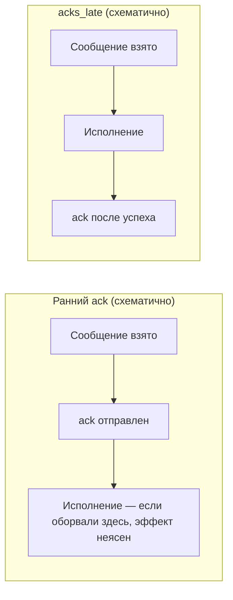

[← Назад к индексу части](index.md)
[↑ К глобальному плану](../mastery_plan.md)

## 5.6. Опции задач

### Цель раздела

Свести воедино опции, которые **реально меняют эксплуатацию**: ack, retry, лимиты, rate limit, результаты, сериализация.

### Термины

| Термин | Кратко |
| --- | --- |
| **Ack** | Подтверждение брокеру: сообщение обработано / можно не отдавать снова (точка ack зависит от `acks_late` и транспорта). |
| **Идемпотентность** | Повторное исполнение с тем же входом **не меняет** итог или меняет его предсказуемо — обязательна при позднем ack и ретраях. |
| **Backoff / jitter** | Растущие паузы между ретраями + случайный разброс — против синхронных волн нагрузки. |
| **Soft / hard time limit** | Мягкий сигнал «пора завершаться» vs жёсткое обрывание долгой задачи. |

#### Проверь себя: термины § 5.6

1. Почему **идемпотентность** упоминают в одном ряду с **ack**?

<details><summary>Ответ</summary>

Потому что поздний **ack** и ретраи увеличивают вероятность **повторной доставки** одного и того же сообщения. Идемпотентный шаг делает повтор **безопасным** для бизнес-эффекта.

</details>

2. Чем **`rate_limit` Celery** отличается от **rate limit API** партнёра?

<details><summary>Ответ</summary>

`rate_limit` в Celery — **локальный** дроссель **на тип задачи** внутри процесса воркера (`10/s` и т.д.), не глобальный по кластеру и не договор с внешним HTTP API. Партнёра защищают **отдельные** квоты/429/токены.

</details>

### В этом разделе главное

| Опция | Зачем |
| --- | --- |
| `acks_late` | Ack после работы → меньше потерь при kill worker, больше риска дублей при ошибках — компенсируется идемпотентностью. |
| `autoretry_for` | Авто-повтор на типах ошибок. |
| `retry_kwargs` / `retry_backoff` / `retry_backoff_max` / `retry_jitter` | План повторов: не долбить зависимость синхронно. |
| `default_retry_delay` | Базовая задержка, если не переопределили. |
| `rate_limit` | Защитить внешние API/БД от «топа». |
| `time_limit` / `soft_time_limit` | Ограничить runaway-задачи. |
| `track_started` | Писать факт старта в backend (полезно для UX прогресса, цена — записи). |
| `ignore_result` | Не хранить результат. |
| `serializer` / `compression` | Эффективность и совместимость. |

#### `retry_kwargs`: что обычно кладут в словарь

`retry_kwargs` передаётся в **`self.retry()`** / автоповтор и типично содержит (имена проверь по версии Celery):

| Ключ | Назначение |
| --- | --- |
| **`max_retries`** | Потолок попыток после первой ошибки |
| **`countdown`** | Базовая задержка до следующей попытки, если не переопределил явно в `retry()` |

Часто его **дублируют** с полями на `@app.task(retry_kwargs={...})` и `autoretry_for`: общая политика в одном месте (`base=AppTask`) упрощает сопровождение.

#### Проверь себя: `retry_kwargs` и политика повторов

1. Зачем дублировать **`max_retries`** и в декораторе задачи, и в `self.retry(...)`?

<details><summary>Ответ</summary>

Часто **не нужно**: базовая политика — в **`@app.task` / `base`**, а в `retry()` переопределяют **точечно** (например, другой `countdown` для конкретной ветки). Дубли без правил дают «какой потолок настоящий?».

</details>

2. Что произойдёт с очередью, если **`max_retries` завышен**, а `autoretry_for=(Exception,)`?

<details><summary>Ответ</summary>

**Poison message** и долгие «бесконечные» циклы: битая бизнес-ошибка будет долбить систему, пока не исчерпает попытки. Нужна **классификация** исключений и DLQ.

</details>

### Теория и правила (выжимка)

**Экспоненциальный backoff** превращает «все воркеры бьют упавший сервис одновременно» в **растянутые** попытки. **Jitter** добавляет случайность, чтобы не создавать **ритмические пики**.

**Rate limit** в Celery — механизм **на тип задачи**, он не заменяет полноценный **token bucket** на периметре API, но снимает острые шипы нагрузки.

**Soft time limit** позволяет поймать `SoftTimeLimitExceeded` и **аккуратно** завершить; hard — жёстче.

**`default_retry_delay` vs `retry_backoff`:** `default_retry_delay` — базовая **секундная** задержка между попытками, если ты вызываешь `self.retry(countdown=...)` без явного `countdown` или для простых автоповторов. Когда включаешь **`retry_backoff=True`**, задержки становятся **растущими** (экспоненциально от базы), а `retry_backoff_max` задаёт потолок; **`retry_jitter`** добавляет разброс. Практика: не дублируй конкурирующие настройки «на глаз» — выбери один понятный профиль и закрепи его в `base`-классе.

#### Числовой смысл backoff + jitter (без привязки к точной формуле версии)

Интуиция: при базе **10 с** и экспоненциальном росте ты получаешь порядок **10 → 20 → 40 → 80 → …** секунд между попытками, пока не упрёшься в **`retry_backoff_max`** (например, 600 с — дальше задержка не растёт). **`retry_jitter=True`** «размазывает» каждое ожидание (например, не все задачи просыпаются ровно через 40 с), что снижает **синхронные волны** нагрузки на упавший сервис после инцидента. Точные множители смотри в доке своей версии Celery — важна **форма поведения**, а не одно магическое число.

#### Проверь себя: backoff, jitter, `retry_backoff_max`

1. Зачем нужен **`retry_backoff_max`**, если «чем дольше ждём, тем лучше для упавшего сервиса»?

<details><summary>Ответ</summary>

Без потолка задержка может стать **неприемлемой** для SLA и UX: задача «проснётся» через часы. Потолок балансирует **вежливость к зависимости** и **максимальное ожидание** восстановления.

</details>

2. Может ли **jitter** ухудшить ситуацию, если все ретраи **должны** быть строго упорядочены?

<details><summary>Ответ</summary>

Jitter **намеренно** нарушает синхронность. Если нужен строгий порядок между разными задачами — это уже **другой уровень** координации (очередь одного consumer-а, saga, orchestrator), а не только параметры retry.

</details>

**`track_started=True`:** в result backend появляется отметка **`STARTED`** (если backend включён и не `ignore_result`). Это полезно для UX «задача реально пошла в работу», но даёт **дополнительные записи** и нагрузку на backend. Для чистого fire-and-forget чаще `ignore_result=True` и метрики на уровне worker.

**`serializer` / `compression` на уровне задачи** дополняют то, что ты уже читал в п. 5.3: можно задать **узкий** JSON только для пары критичных задач, оставив глобально другой формат — но **согласуй** с `accept_content`, иначе worker отвергнет сообщение.

#### Проверь себя: `track_started`, backend и сериализация на задаче

1. Почему сочетание **`ignore_result=True`** и **`track_started=True`** часто выглядит странно и что ты проверяешь в своей версии?

<details><summary>Ответ</summary>

При **`ignore_result=True`** приложение обычно **не** хранит результат и часто **минимизирует** запись в result backend; **`STARTED`** тоже идёт туда. Если тебе нужен только прогресс — иногда достаточно **метрик/логов**, а не backend. Важно прочитать **фактическое** поведение пары флагов в твоей версии Celery и не полагаться на интуицию.

</details>

2. Зачем задавать **`serializer="json"`** на одной задаче, если глобально уже стоит JSON?

<details><summary>Ответ</summary>

Как **явный контракт** для критичного пути: рефакторинг глобального `accept_content` не сломает эту задачу незаметно; новые воркеры с другим дефолтом всё равно получат **ожидаемый** формат. Для смешанных кластеров это снижает класс ошибок «producer послал X, worker ждёт Y».

</details>

3. Что сломается первым, если на задаче **`serializer="pickle"`**, а у воркера в конфиге **`accept_content=["json"]`**?

<details><summary>Ответ</summary>

**Десериализация на worker**: сообщение не примет контент, задача не дойдёт до бизнес-кода (ошибка совместимости на границе). Лечится **согласованием** списка разрешённых форматов и версий кода на всех consumer-ах.

</details>

#### `acks_late`: ранняя vs поздняя точка подтверждения

**Ack** — сигнал брокеру «сообщение обработано (или взято), можешь не отдавать другому consumer». **Ранний ack** (по умолчанию во многих конфигурациях): подтверждение **до** или **в начале** исполнения — если worker убит посередине, работа **потеряна**. **`acks_late=True`**: ack обычно **после** успешного выполнения — при kill меньше «тихих потерь», но при сбое после части эффекта выше шанс **повторной доставки** → **идемпотентность обязательна**.



Полная картина зависит от пула (prefork/solo), ОС и транспорта — деталь в частях 8–9. На уровне **API задач** тебе важно помнить компромисс: **поздний ack = реже потеря работы, чаще at-least-once**.

#### Проверь себя: ранний vs поздний ack

1. Почему при **раннем ack** «тихая потеря» работы при `kill -9` воркера **вероятнее**, чем при **`acks_late`?

<details><summary>Ответ</summary>

Потому что брокер уже **снял** сообщение с ответственности consumer до завершения работы; при убийстве процесса посередине **нет** гарантии, что задача будет **поставлена снова**.

</details>

2. Какую цену платишь за **`acks_late=True`** при сбое **после** необратимого внешнего эффекта?

<details><summary>Ответ</summary>

Сообщение может быть **доставлено повторно** → без идемпотентности получишь **удвоение** эффекта. Нужен дизайн **компенсаций** или идемпотентных границ.

</details>

**`rate_limit`:** строка вида **`"10/s"`** (10 задач **этого типа** в секунду на worker), **`"100/m"`** в минуту и т.д. Это **не** глобальный лимит кластера и не замена rate limit у партнёра — локальный дроссель Celery.

#### Сводная таблица опций п. 5.6 (по глобальному плану)

| Опция | Одна строка смысла |
| --- | --- |
| `acks_late` | Ack обычно **после** работы: меньше потерь при kill, чаще **повторная** доставка → нужна идемпотентность. |
| `autoretry_for` | Автоматический retry только для перечисленных **временных** классов исключений. |
| `retry_kwargs` | Параметры повтора (`max_retries`, `countdown`, …) — единая политика для задачи/`base`. |
| `retry_backoff` | Экспоненциальное **растягивание** пауз между попытками. |
| `retry_backoff_max` | Потолок паузы backoff (не расти бесконечно). |
| `retry_jitter` | Случайный разброс к задержке — борьба с **thundering herd**. |
| `default_retry_delay` | Базовая секундная задержка, если не задаёшь каждый раз в `retry()`. |
| `rate_limit` | Дроссель **на тип задачи** внутри воркера (`10/s`, `100/m`, …). |
| `time_limit` | Жёсткий лимит времени исполнения (прерывание сильнее, чем soft). |
| `soft_time_limit` | «Мягкий» сигнал: успей **аккуратно** завершить до hard limit. |
| `track_started` | Писать **STARTED** в result backend (видимость прогресса, цена — записи). |
| `ignore_result` | Не хранить результат/метастатус в backend — дешевле и проще. |
| `serializer` | Формат упаковки `args/kwargs` (**json**, **pickle**, …) + согласование с `accept_content`. |
| `compression` | Сжатие тела (`gzip`, …) при крупных или часто повторяющихся payload. |

#### Проверь себя: сводная таблица опций (сопоставление)

1. Какая пара опций из таблицы **напрямую** уменьшает нагрузку на **result backend**?

<details><summary>Ответ</summary>

**`ignore_result`** (не писать результат/метастатус) и снижение **`track_started`** (меньше промежуточных записей). Обе уменьшают объём данных в backend при цене видимости.

</details>

2. Перечисли опции, которые одновременно влияют на **поведение при сбоях** и на **дубли сообщений**.

<details><summary>Ответ</summary>

В первую очередь **`acks_late`** (компромисс потеря/дубль) и вся группа **retry** (`autoretry_for`, `retry_kwargs`, backoff, jitter) — они задают, **сколько раз** и **как** система повторит доставку/исполнение при ошибках.

</details>

### Примеры

```python
@app.task(
  bind=True,
  autoretry_for=(ConnectionError, TimeoutError),
  retry_kwargs={"max_retries": 8},
  default_retry_delay=30,
  retry_backoff=True,
  retry_backoff_max=600,
  retry_jitter=True,
  soft_time_limit=50,
  time_limit=60,
  rate_limit="10/s",
  ignore_result=True,
  serializer="json",
  compression="gzip",
  track_started=False,
)
def call_partner_api(self, order_id: str):
    ...
```

### Типичные ошибки

- Ставить огромные `max_retries` на **любую** ошибку.
- Не иметь **hard time limit** на задачах с риском зависания.

### Проверь себя

1. Что даёт jitter в `retry_jitter` интуитивно?

<details><summary>Ответ</summary>

Случайный разброс задержек, чтобы много задач не проснулись для повтора **в один и тот же** момент и не создали повторный всплеск нагрузки (thundering herd).

</details>

2. Почему `ignore_result` часто правильный дефолт для «фоновых побочек»?

<details><summary>Ответ</summary>

Потому что хранение статусов/результатов в backend стоит **денег и операционной сложности**, а клиенту и не нужно опрашивать `AsyncResult`.

</details>

3. Чем `track_started=True` полезен и чем может аукнуться?

<details><summary>Ответ</summary>

Полезен для **видимости прогресса** в APIх статусов (`STARTED` vs `PENDING`). Аукнется **нагрузкой на result backend** и дополнительной задержкой/точками отказа — если backend медленный, статусы искажаются.

</details>

#### Проверь себя: ack и лимиты времени/скорости
1. Почему `acks_late=True` почти всегда требует **идемпотентности** бизнес-шага?

<details><summary>Ответ</summary>

Потому что при падении worker **после** части побочного эффекта, но **до** ack, сообщение может быть **доставлено снова**. Без идемпотентности повтор даст **удвоение** списаний, писем, событий и т.д. Поздний ack меняет баланс: реже «тихо потерять» работу, чаще «безопасно повторить».

</details>

2. Чем **`soft_time_limit`** полезен для **корректного** завершения по сравнению с **`time_limit`**?

<details><summary>Ответ</summary>

Soft даёт шанс поймать **`SoftTimeLimitExceeded`** и **дозакрыть** ресурсы, откатить мелкие инварианты, записать контрольную точку. Hard — жёстче обрывает, риск «оборвали посередине транзакции» выше.

</details>

3. Почему **`rate_limit="10/s"`** не спасёт от **storm** из **десяти разных** типов задач по `1/s` каждый?

<details><summary>Ответ</summary>

Лимит **на тип задачи** внутри воркера: десять разных задач могут суммарно давать **10×** нагрузку на общий ресурс. Нужны **глобальные** квоты, семафоры или отдельные очереди/пулы.

</details>

### Запомните

Retry + backoff — это **вежливость к зависимостям**. Time limits — **страховка от катастрофы**.

---
