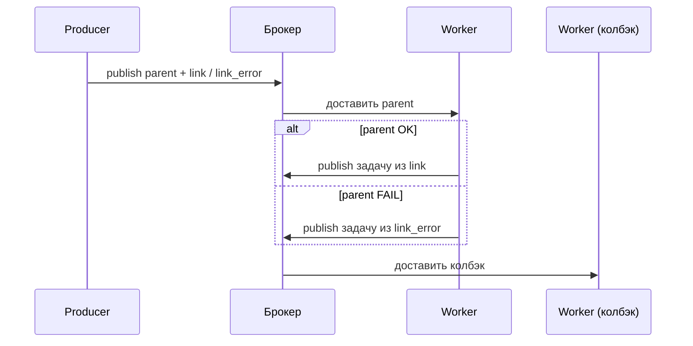

[← Назад к индексу части](index.md)
[↑ К глобальному плану](../mastery_plan.md)

## 5.7. Заголовки, приоритет, routing key в `apply_async`

### Цель раздела

Научиться передавать **метаданные сообщения** и управлять **маршрутом** на уровне вызова.

### В этом разделе главное

- `headers` — для бизнес-корреляции и трассировки (не смешивай с kwargs задачи).
- `priority` — поддерживается **не везде** и не бесконечной глубины; проверяй broker.
- `routing_key`, `exchange`, `queue` — управление маршрутом (AMQP-мира богаче; Redis-проще).
- `link` / `link_error` — коллбеки на успех/ошибку **следующей** стадии (осторожно с семантикой и цепями).

### Теория и правила

**Приоритеты** в реальной жизни часто требуют:

- поддержки брокером,
- отдельных очередей и worker-пулов (иногда проще иметь `queue=urgent` отдельно).

**Routing** — тема части 12; здесь важно понимать: `apply_async` — точка, где ты **перекрываешь** дефолты.

#### Картинка: куда попадают `queue` / `routing_key` / `exchange`

```text
  apply_async(queue=..., routing_key=..., exchange=...)
              |
              v
  +------------------+     +------------------+
  | Брокер (AMQP)    |     | Брокер (Redis)   |
  | exchange -> bind |     | простая очередь  |
  | -> очередь       |     | / list / stream  |
  +------------------+     +------------------+
              \               /
               v             v
            Worker consumer (тот же task name, другая физическая очередь)
```

На **AMQP** тройка exchange/routing_key/queue — полноценный **дизайн маршрутизации**. На **Redis** часто достаточно **имени очереди**; лишние поля могут быть **проигнорированы** — проверяй фактическое поведение Kombu для твоего URL.

#### Проверь себя: `queue` / `routing_key` / `exchange` на разных брокерах

1. Почему **`routing_key="documents.process"`** на Redis-транспорте может «ничего не менять»?

<details><summary>Ответ</summary>

Потому что без топологии exchange→bind как в AMQP ключ маршрутизации **не участвует** в выборе физической очереди так, как ты ожидаешь; Kombu может **игнорировать** поле или свести эффект к простому имени очереди. Единственный надёжный путь — **измерить** на своём URL и версии.

</details>

2. В одном предложении: зачем в **`apply_async`** вообще передавать **`exchange`**, если есть **`queue`**?

<details><summary>Ответ</summary>

На AMQP **`exchange`** — точка **публикации** и правил маршрутизации; **`queue`** — куда сообщение попадёт после bind. Ты перекрываешь дефолты приложения, когда нужен **другой** маршрут (отдельный контур, A/B, изоляция).

</details>

3. Чем опасно копировать из туториала вызов с **`routing_key`**, не проверив объявление очередей в проде?

<details><summary>Ответ</summary>

Сообщение может уйти **не в ту очередь** или **в default**, consumer нужной очереди **никогда не увидит** задачу — симптом «всё зелёное, а job не выполняется». Нужна согласованность **declare/bind** между деплоем и кодом (часть 12).

</details>

#### `priority` и транспорт: не стреляй себе в ногу «виртуальным приоритетом»

Поле **`priority`** в `apply_async` **не волшебное**: брокер и очередь должны **уметь** приоритизацию, иначе параметр станет **no-op**.

| Среда | О чём помнить инженеру |
| --- | --- |
| **RabbitMQ** | Приоритеты обычно требуют **объявления очереди** с поддержкой приоритета (например, `x-max-priority` в политике аргумента очереди) и согласованного диапазона чисел. Иначе сообщения идут как обычно. |
| **Redis (Kombu)** | Поддержка и смысл `priority` зависят от **конкретного транспорта/бэкенда** и конфигурации; в части сценариев приоритет **ограничен** или ведёт себя иначе, чем в AMQP. |
| **Любой брокер** | Приоритет не заменяет **capability planning**: при полном пуле «низкий» приоритет может ждать очень долго (head-of-line blocking внутри воркера тоже возможен). |

**Практика:** после внедрения `priority` сделай **контрольный эксперимент** под нагрузкой: метрика latency по уровням приоритета. Если эффекта нет — смотри объявление очереди и доку Kombu для твоего URL (часть 12, 15).

#### Проверь себя: приоритет и очередь в RabbitMQ / Redis

1. Почему **`x-max-priority`** на очереди RabbitMQ — обязательная часть пазла, а не «достаточно передать `priority=5` из кода»?

<details><summary>Ответ</summary>

Без объявления очереди с поддержкой приоритета брокер **не хранит** и **не упорядочивает** сообщения по уровням так, как задумано: поле в публикации может стать **no-op**. Код и **операционная** конфигурация очереди должны совпадать.

</details>

2. Почему даже «работающий» приоритет не гарантирует верхнюю границу latency для urgent-задач?

<details><summary>Ответ</summary>

Потому что узкое место — **количество воркеров**, длина очереди и **head-of-line blocking**: высокоприоритетное сообщение всё равно ждёт, пока worker освободится, а впереди могут быть долгие задачи. Иногда выгоднее **отдельная очередь + пул**.

</details>

3. Чем **`priority` внутри одной очереди** принципиально проще для операций, чем **три отдельные очереди** `low`/`med`/`high`?

<details><summary>Ответ</summary>

Одна очередь — **меньше** объектов для мониторинга, declare, бэкапа политик. Цена — **хуже изоляция** capacity и сложнее рассуждать SLO; отдельные очереди дают **жёсткое** разделение пулов.

</details>

### Пошагово: headers → observability

1. На входе (HTTP/gRPC) создай или прими `correlation_id` / trace id.
2. Прокинь его в `apply_async(..., headers={...})` — это попадёт в `self.request.headers` на worker (формат может слегка отличаться по транспорту).
3. В логах worker используй **единый** ключевой набор полей: `task_id`, `correlation_id`, бизнес-id (`order_id`).
4. В метриках алерт по росту ошибок группируй **по типу задачи и классу исключения**, а расследование веди по correlation.

#### Проверь себя: headers и observability

1. Почему **`tenant_id` в headers** удобнее, чем **первый позиционный аргумент** задачи `process(job_id, tenant_id)`?

<details><summary>Ответ</summary>

Headers остаются **сквозным слоем метаданных**: одинаковый паттерн логирования для **разных** задач, меньше дублирования в сигнатурах, проще фильтровать логи/метрики без знания порядка args. Бизнес-аргументы остаются **минимальными** и стабильными.

</details>

2. Как потеря **единого формата** `correlation_id` между HTTP-слоем и worker ломает расследование инцидента?

<details><summary>Ответ</summary>

Запрос в API и trace в логах worker **не склеиваются** по одному ключу; приходится гадать по времени и `task_id`. Контракт: **генерация/принятие** id на границе и **обязательная** передача в `apply_async(headers=...)`.

</details>

3. Зачем в п. 4 упомянуты **и** тип задачи, **и** класс исключения в группировке алертов?

<details><summary>Ответ</summary>

Тип задачи отвечает на «**где** ломаемся», класс исключения — на «**почему** по инфраструктурной природе» (сеть, таймаут, валидация). Вместе это даёт **actionable** триаж без смешивания разных корней в одном шумном алерте.

</details>

### `link` и `link_error`

**`link`** — сигнатура(ы) «что запустить после **успеха** текущей задачи»; **`link_error`** — после **ошибки**. Это не замена canvas-оркестрации (часть 10), но удобный **точечный** крючок.

Интуиция: ты говоришь брокеру/клиенту Celery: «когда эта задача завершится с результатом X, поставь в очередь ещё одну».

Практические правила:

- Следи за **идемпотентностью** callback: успех «родителя» не гарантирует, что callback не вызовется в странных edge cases при сбоях — проектируй как к **at-least-once**.
- Не строй глубокие цепочки только через `link`, если читаемость страдает — `chain()` часто выразительнее.
- `link_error` полезен для **компенсаций** (откат статуса в БД, отмена резерва), но компенсации должны быть **или сами идемпотентны**, или защищены ключом.

Пример (эскиз):

```python
notify = send_notification.si()  # immutable: без случайного «накапливания» аргументов

process_pdf.apply_async(
    args=(doc_id,),
    link=notify,           # осторожно: сигнатура callback обычно получает результат родителя — см. доку версии
    link_error=mark_failed.si(doc_id),
)
```

Точная форма аргументов callback зависит от версии Celery и настроек; перед продом **прогоняй интеграционный тест** на своём стеке.

**Поток «родитель → колбэк» (упрощённо):** после завершения родительской задачи Celery **ставит в очередь** сигнатуры из `link` или `link_error`; отдельный consumer выполнит их так же, как любую другую задачу. Это не «вызов функции в том же стеке».



#### Проверь себя: `link` и `link_error`

1. Почему колбэк по `link` нужно проектировать как **at-least-once**, даже если родитель «успешно завершился»?

<details><summary>Ответ</summary>

Потому что **публикация** колбэка — отдельное сообщение: сбой после успеха родителя, повтор доставки, ретраи брокера могут привести к **повторному** постановлению/исполнению колбэка. Идемпотентный ключ или **безопасное** повторение обязательны.

</details>

2. Когда **`link_error` с компенсацией** опаснее, чем явный **`chain`** с ветвлением в canvas?

<details><summary>Ответ</summary>

Когда логика компенсации **разрастается**, скрыта в опциях одного `apply_async`, и команда **не видит** полный граф. `chain`/группы canvas делают сценарий **явным** и тестируемым; `link_error` оставляют для **узких** хуков.

</details>

3. Чем **выполнение колбэка отдельным worker** отличается от «просто вызвать функцию после `return` в той же задаче»?

<details><summary>Ответ</summary>

Колбэк — **новая** единица работы в очереди: свои **ретраи**, **time limits**, изоляция сбоя. Встроенный вызов после `return` держит всё в **одном** сообщении и одном окне отказа; при долгом колбэке ты рискуешь **удлинить** критический путь и упереться в лимиты родителя.

</details>

### Сравнение: приоритет сообщения vs отдельная очередь

| Подход | Плюсы | Минусы |
| --- | --- | --- |
| `priority` на сообщении | Тонкая градация без множества очередей | Не везде поддержано; ограниченная глубина; сложнее рассуждать SLO |
| Отдельная очередь `urgent` + отдельный pool worker | Простая модель capacity: «N воркеров только для срочного» | Больше объектов для мониторинга |

На практике многие команды комбинируют: **критичный трафик** выносят в отдельную очередь, а `priority` используют вторично.

#### Проверь себя: приоритет vs отдельная очередь

1. В каком случае **отдельная очередь `urgent`** однозначно выигрывает у **`priority`**?

<details><summary>Ответ</summary>

Когда нужно **гарантировать долю capacity**: отдельный пул воркеров обслуживает только срочное и **не block**-ится длинным хвостом общей очереди. Приоритет в одной очереди не даёт такого жёсткого разделения CPU/конкуренции.

</details>

2. Почему таблица говорит, что **priority** «сложнее для SLO»?

<details><summary>Ответ</summary>

Потому что задержка зависит от **смеси** уровней приоритета, глубины, политики брокера и поведения consumer — формула «p99 для класса 9» менее прозрачна, чем «отдельная очередь с N воркерами».

</details>

3. Зачем в реальном проде **комбинировать** оба подхода?

<details><summary>Ответ</summary>

Отдельная очередь **изолирует** критичный контур; внутри неё `priority` даёт **микро-градацию** (например, уровни внутри одного платящего тарифа) без множества очередей на каждый уровень.

</details>

### Примеры

```python
process_pdf.apply_async(
    args=(doc_id,),
    queue="documents",
    routing_key="documents.process",
    priority=5,
    headers={"correlation_id": "abc", "tenant": "t1"},
)
```

### Практика / реальные сценарии

- **Мульти-тенантность:** `tenant_id` в headers помогает фильтровать логи и строить метрики по клиентам, не смешивая с бизнес-полями функции.
- **Приоритет «внутри одного клиента»:** осторожно — один крупный клиент может монополизировать приоритет; иногда справедливее **fair scheduling** отдельными очередями по планам обслуживания.

### Типичные ошибки

- Ставить приоритет там, где брокер **игнорирует** поле — «лечим симптомы» без эффекта.

### Проверь себя

1. Почему корреляцию лучше класть в `headers`, а не в «просто ещё один kwarg задачи»?

<details><summary>Ответ</summary>

Потому что headers — это **метаданные инфраструктуры** (логирование, tracing, маршрутизация наблюдаемости), их проще **единообразно** доставлять сквозь слои, не смешивая с бизнес-данными функции и не раздувая сигнатуру.

</details>

2. Почему **`priority=9` в `apply_async`** может не ускорить задачу в production?

<details><summary>Ответ</summary>

Потому что эффект зависит от **брокера и объявления очереди**: без поддержки приоритета на стороне очереди значение игнорируется. Даже при поддержке узкое место может быть **количеством воркеров** или долгими задачами впереди в той же очереди.

</details>

#### Проверь себя: link vs chain и immutable колбэк
1. Когда предпочесть **`chain(...)`** вместо пары **`apply_async(..., link=...)`**?

<details><summary>Ответ</summary>

Когда оркестрация **читается как цельный сценарий** из нескольких шагов, нужны встроенные примитивы canvas (часть 10) и ты не хочешь размазывать логику по «колбэкам», спрятанным в опциях одного вызова. `link`/`link_error` уместны как **точечные** хуки (уведомление, компенсация), а не как замена полноценного pipeline.

</details>

2. Почему в примере для `link` используют **`send_notification.si()`**, а не `.s()`?

<details><summary>Ответ</summary>

**Immutable** сигнатура не «подцепит» лишние аргументы при композиции с другими примитивами и снижает риск случайно изменить цепочку аргументов при рефакторинге; для колбэка после родителя это частый безопасный выбор (часть 5.3).

</details>

### Запомните

Тонкие параметры доставки — **инструмент дизайна очередей**, не «украшение».

---
