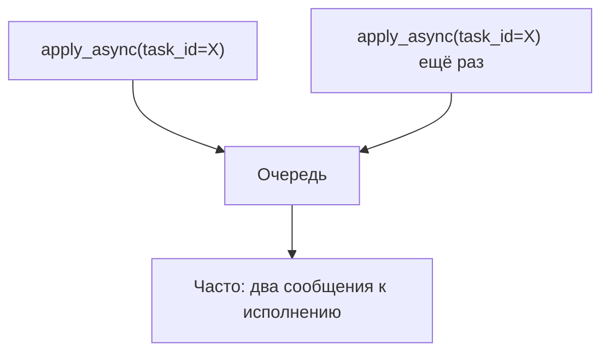
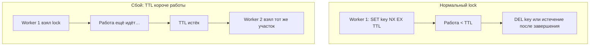

[← Назад к индексу части](index.md)
[↑ К глобальному плану](../mastery_plan.md)

## 5.8. Идентичность и дедупликация на уровне приложения

### Цель раздела

Понять, как избежать **двойных эффектов** при at-least-once: стабильный `task_id`, дедуп по бизнес-ключу.

### В этом разделе главное

- Celery **не заменяет** распределённые блокировки «из коробки» для бизнес-логики.
- Стабильный `task_id` (`apply_async(task_id=...)`) помогает связать **повторную публикацию** с одним ID — но это **не волшебная** дедупликация на всех брокерах.
- Надёжнее комбинировать: **уникальный ключ операции в БД** + **идемпотентный** обработчик.

#### Проверь себя: границы ответственности Celery

1. Почему фраза «Celery **не заменяет** распределённые блокировки из коробки» не отменяет использование **`task_id`** и очереди?

<details><summary>Ответ</summary>

Celery решает **доставку и исполнение** сообщений, а **бизнес-инвариант** «ровно один платёж на `order_id`» живёт в **данных и транзакциях**. `task_id` помогает **связать** запуски и UI с result backend, но не подменяет **уникальный ключ** в БД или осознанную политику дедупа на API.

</details>

2. Чем **стабильный `task_id`** полезен **операционно**, даже если он не гарантирует одну доставку?

<details><summary>Ответ</summary>

Один id на **повторную постановку** из UI упрощает **поиск в логах**, склейку с `AsyncResult`, расследование «тот же job». Это про **наблюдаемость** и клиентский контракт, не про автоматическое слияние сообщений в брокере.

</details>

3. Зачем в списке «главного» явно сочетают **уникальный ключ в БД** и **идемпотентный обработчик**?

<details><summary>Ответ</summary>

Ключ **решает гонку** «кто первый взял работу», идемпотентность **страхует** повторную доставку **после** захвата или при частичных сбоях. Вместе они закрывают и **конкуренцию**, и **at-least-once** доставки.

</details>

### Теория и правила

**Паттерн «claim в БД»**: таблица вроде `job_claim(business_key UNIQUE, task_id, status, ...)`; в начале обработки — `INSERT ... ON CONFLICT DO NOTHING` (PostgreSQL) или эквивалент. Если вставка не удалась — другой worker уже взял работу → **корректно выходим**. Если удалась — продолжаем idempotent-операцию.

Почему это работает с at-least-once: даже если задача пришла дважды, **второй** заход упрётся в уникальность и не выполнит эффект повторно.

#### Проверь себя: claim в БД

1. Почему **`ON CONFLICT DO NOTHING`** (или эквивалент) предпочтительнее «`SELECT` есть ли строка, потом `INSERT`»?

<details><summary>Ответ</summary>

Два worker могут оба увидеть «нет строки» и оба выполнить `INSERT` — гонка. Граница уникальности в СУБД делает исход **атомарным**: один успех, второй получает конфликт и **корректно** выходит без эффекта.

</details>

2. Что должно произойти в коде задачи, если claim **не удался** (другой владелец)?

<details><summary>Ответ</summary>

**Идемпотентный выход**: не бросать «фатальную» бизнес-ошибку, не делать побочный эффект; возможно лог «уже обрабатывается» и метрика. Иначе ты превратишь нормальную дедупликацию в шум ретраев.

</details>

3. Как claim в БД помогает при **повторной доставке того же сообщения** брокером?

<details><summary>Ответ</summary>

Второй прогон снова попытается занять ту же бизнес-строку — упрётся в **уникальный ключ** и не выполнит оплату/отгрузку повторно. Сообщение «обработано» с точки зрения эффекта даже если физически пришло два раза.

</details>

**Redis lock (`SET key NX EX ttl`)** — быстрый вариант:

- `NX` — установить только если ключа не было (атомарный «захват»).
- `EX ttl` — автоматическое освобождение при падении worker (**внимание**: TTL должен быть **больше** худшего времени задачи, иначе lock истечёт, пока работа идёт, и второй worker займёт слот).

#### Проверь себя: Redis lock

1. Зачем в **`SET ... NX`** без **`EX`** (TTL) lock на долгой задаче опасен при падении воркера?

<details><summary>Ответ</summary>

Ключ остаётся **навсегда** после kill процесса — «вечная» блокировка, пока кто-то вручную не снимет. TTL — **страховка от мёртвого владельца**, цена — нужно подобрать и **продлевать** для долгих job.

</details>

2. Почему TTL **строго больше** p99 времени задачи — не «достаточное», а **необходимое** условие без продления?

<details><summary>Ответ</summary>

Иначе lock **истекает, пока первая копия ещё работает**, второй worker захватывает тот же ресурс → **параллельное** исполнение и дубль эффекта. Продление (heartbeat) или claim в БД снимают проблему.

</details>

3. В каком случае **Redis lock** всё равно нужно **дублировать записью в БД** для аудита?

<details><summary>Ответ</summary>

Когда нужен **юридически значимый** след «кто и когда взял работу», восстановление после падения Redis, или отчётность: lock в памяти/кэше **эфемерен**, БД — естественный журнал.

</details>

**Детерминированный `task_id`**: иногда передают `task_id=hash_to_uuid(business_key)` в `apply_async`, чтобы **повторная постановка** из UI давала «тот же» id. Это помогает **логировать и искать** в мониторинге, но не отменяет необходимость **идемпотентности** и на некоторых путях может дать коллизии — обрабатывай явно.

**Критично не напутать:** два вызова `apply_async(..., task_id=X)` подряд — это **два акта публикации**. В типичной конфигурации Celery **не обещает** «второе с тем же id исчезнет само»: в брокере часто окажутся **два сообщения**, а `task_id` в основном связывает записи в **result backend** и логи. Реальная «ровно одна постановка на бизнес-ключ» — на уровне **API** (уникальный ключ, claim, outbox) или осознанной политики брокера, а не «магия id».

#### Проверь себя: детерминированный `task_id` и двойная публикация

1. Зачем вообще использовать **`hash_to_uuid(business_key)`**, если идемпотентность всё равно обязательна?

<details><summary>Ответ</summary>

Чтобы **склеить** повторный клик в UI, логи и `AsyncResult` с **одним** видимым id, упростить поддержку и отладку. Это не замена защиты эффекта, а **наблюдаемость** и единый внешний идентификатор операции.

</details>

2. Могут ли **два разных бизнес-кейса** получить один **`task_id`**, если генератор «чисто» от ключа?

<details><summary>Ответ</summary>

Теоретически при **коллизии** хеша или ошибке моделирования ключа — да; поэтому в тексте сказано «коллизии — обрабатывай явно». На практике выбирают достаточно длинный стабильный ключ и мониторят аномалии.

</details>

3. Почему «магия id» не работает при двух быстрых **`apply_async`** из двух инстансов API?

<details><summary>Ответ</summary>

Каждый вызов — **отдельная публикация** в брокер; Celery в общем случае **не дедуплицирует** вторую по совпадению `task_id`. Нужен **идемпотентный ключ на API** (409, outbox) или claim **до** постановки.

</details>



#### Дедуп в БД vs дедуп в Redis: что выбрать

| Критерий | **Уникальный ключ / claim в БД** | **Блокировка / idempotency-ключ в Redis** |
| --- | --- | --- |
| **Надёжность модели** | Транзакция и ограничения СУБД — «золотой стандарт» для денег | Быстро, но TTL, гонки и отказ ноды — отдельный дизайн |
| **Скорость внедрения** | Чуть больше схемы SQL | Часто быстрее для прототипов |
| **Аудит** | Естественная строка «кто взял работу» | Нужно отдельно продумать запись в БД |
| **Долгие job** | Хорошо с полем статуса + heartbeat | Нужен **продление** lock или риск истечения TTL |

На практике: **деньги и юридический эффект** → БД; **краткоживущий throttle** → Redis; **гибрид**: Redis как кэш «уже в работе» + БД как источник истины при коммите.

#### Проверь себя: БД vs Redis (таблица выбора)

1. Почему для **денег** в таблице прямо указан БД-путь, даже если Redis «быстрее»?

<details><summary>Ответ</summary>

Денежный эффект требует **транзакционной** фиксации и воспроизводимого аудита; Redis-память и отказ ноды без жёсткой модели дают **другой класс рисков**. БД + уникальный ключ — проверенный контракт для учётных операций.

</details>

2. В каком сценарии **гибрид** «Redis + БД» оправдан, а не overengineering?

<details><summary>Ответ</summary>

Когда нужен **быстрый** внутренний сигнал «уже крутится» для thundering herd, но **commit** и юридически значимое состояние фиксируются в БД при успехе. Redis снижает параллельный шторм, БД — источник истины после транзакции.

</details>

3. Почему строка «долгие job» в таблице хуже для Redis **без продления**?

<details><summary>Ответ</summary>

Фиксированный TTL **истечёт раньше** окончания работы → ложное «свободно» и второй worker. В БД проще хранить **статус** и heartbeat; в Redis нужен **lease renewal**.

</details>

#### Гонки и TTL lock-ов (картинка из плана)



**Вывод:** TTL lock — это **страховка от мёртвого владельца**, а не таймер «максимум времени задачи». Для долгих job — **продление** lock или **claim в БД**.

#### Проверь себя: диаграмма TTL и гонки

1. В «нормальном» subgraph почему допустимо **`DEL key` или истечение после завершения**?

<details><summary>Ответ</summary>

После **успешного** завершения либо ключ **явно снимают**, либо TTL отработал **когда работы уже нет** — второй worker не должен получить ложное окно, пока первая копия жива. Идеальный путь — явное освобождение; TTL — подстраховка.

</details>

2. Какая цепочка на диаграмме **`bad`** приводит к **двум исполнителям одного ресурса**?

<details><summary>Ответ</summary>

`B1 → B2`: работа идёт → **`B3` TTL истёк** (слишком короткий или нет продления) → **`B4` Worker 2 взял тот же слот**, пока Worker 1 ещё мог бить по данным.

</details>

3. Почему вывод разделяет роль TTL и **«максимального времени задачи»**?

<details><summary>Ответ</summary>

TTL отвечает на «**владелец жив?**» при сбоях; **time_limit** задачи — на «**сколько эта функция может крутиться?**». Путаница приводит к излишне короткому TTL и **преждевременному** захвату вторым процессом.

</details>

### Пошагово: выбрать стратегию дедупликации

1. **Эффект денежный/юридический?** Почти наверняка **уникальный ключ в БД** + идемпотентный шаг.
2. **Эффект «дорогой, но не опасный»?** Lock в Redis + TTL + heartbeat продления lock для длинных job.
3. **Нужна только защита от двойного клика в UI?** Уникальный ключ + короткое окно + `409 Conflict` в API, а в очередь не кладём второй раз.

#### Проверь себя: пошаговый выбор стратегии

1. Почему для «двойного клика» акцент на **`409` в API**, а не только на идемпотентности в worker?

<details><summary>Ответ</summary>

Клиент и продукт получают **явный** ответ «уже принято» без лишней нагрузки на брокер и без гонки двух сообщений. Worker-идемпотентность остаётся **страховкой** at-least-once, но UX и стоимость очереди контролируются **на входе**.

</details>

2. Когда шаг 2 (Redis + heartbeat) **не подходит** без добавления БД?

<details><summary>Ответ</summary>

Когда нужен **юридически значимый** учёт «кто владеет операцией» или финальный commit только в СУБД: один Redis может **потерять** состояние или не удовлетворить аудит. Тогда статус и claim **материализуют** в БД.

</details>

3. Чем шаг 1 (деньги) принципиально отличается от шага 3 по **месту главного барьера**?

<details><summary>Ответ</summary>

В шаге 1 барьер и истина — **транзакция и уникальность в БД до/во время эффекта**. В шаге 3 барьер сдвигают **на HTTP/API**, а очередь стараются **вообще не кормить** дубликатом; глубина защиты разная по стоимости и риску.

</details>

### Картинка в голове

Две кассы не должны пробить один и тот же чек дважды: нужен **номер чека с уникальностью**, а не надежда, что покупатель один.

### Примеры

```python
def enqueue_once(business_key: str, *, payload):
    deterministic_id = stable_uuid_from(business_key)  # свой детерминированный генератор
    return do_work.apply_async(kwargs=payload, task_id=deterministic_id)
```

Эскиз idempotency внутри задачи (PostgreSQL-стиль):

```python
@app.task(bind=True)
def fulfill_order(self, order_id: str):
    try:
        claim(db, key=f"fulfill:{order_id}", owner=self.request.id)
    except UniqueViolation:
        return  # уже обрабатываем или обработали
    charge_payment(order_id)
```

### Что будет, если…

**…TTL lock в Redis короче, чем задача?** Второй worker может начать **параллельное** исполнение → дублирование эффекта. Решения: увеличить TTL, продлевать lock heartbeat-ом, перейти на claim в БД.

### Типичные ошибки

- Думать, что одинаковый `task_id` гарантирует **одну доставку** сообщения во всех конфигурациях.

### Простыми словами

Идемпотентность и уникальный ключ — это **страховка**, потому что «ровно один раз» в распределённом мире редко достижимо дёшево.

### Проверь себя

1. Почему уникальный индекс в БД сильнее, чем «просто проверим перед вставкой»?

<details><summary>Ответ</summary>

Потому что два worker могут дойти до проверки **параллельно**. Уникальный индекс делает гонку **детерминированной**: один успех, второй получает отказ и должен корректно выйти.

</details>

2. Чем опасна дедупликация **только** на уровне «один `task_id` на постановку» без идемпотентного эффекта?

<details><summary>Ответ</summary>

Потому что сообщение всё равно могут **доставить повторно** (сбой после ack, репликация, особенности брокера). `task_id` помогает мониторингу и иногда клиентскому API, но не заменяет защиту **на границе побочного эффекта**.

</details>

3. Ты дважды вызвал **`apply_async` с одним и тем же `task_id`** из-за повтора запроса в UI. Гарантированно ли в очереди останется **одно** сообщение?

<details><summary>Ответ</summary>

Нет. Два вызова — две **публикации**; одинаковый `task_id` **не заменяет** дедупликацию на брокере «из коробки» в общем случае. Могут появиться **два сообщения** (и два запуска worker), пока ты сам не введёшь **claim/уникальный ключ/API-идемпотентность**. `task_id` — про **сквозную идентификацию** запуска и result backend, а не про «слить дубликаты публикации».

</details>

4. В примере `fulfill_order`: зачем **`owner=self.request.id`**, а не только ключ `order_id`?

<details><summary>Ответ</summary>

Чтобы в аудите различить **какой запуск Celery** взял claim, упростить расследование гонок и «зависших» владельцев; чистый `order_id` без владельца хуже для эксплуатации при долгих job.

</details>

5. Что даёт комбинация **`enqueue_once` + idempotency внутри задачи** против только одного уровня?

<details><summary>Ответ</summary>

API-уровень снижает **лишние сообщения** и нагрузку; уровень задачи ловит **повторную доставку** брокером и сбои после частичного эффекта. Защита на **обоих** концах типична для денег.

</details>

### Запомните

**Деньги и учёт** требуют ключей и идемпотентности, а не надежды на «очередь сама».

---
