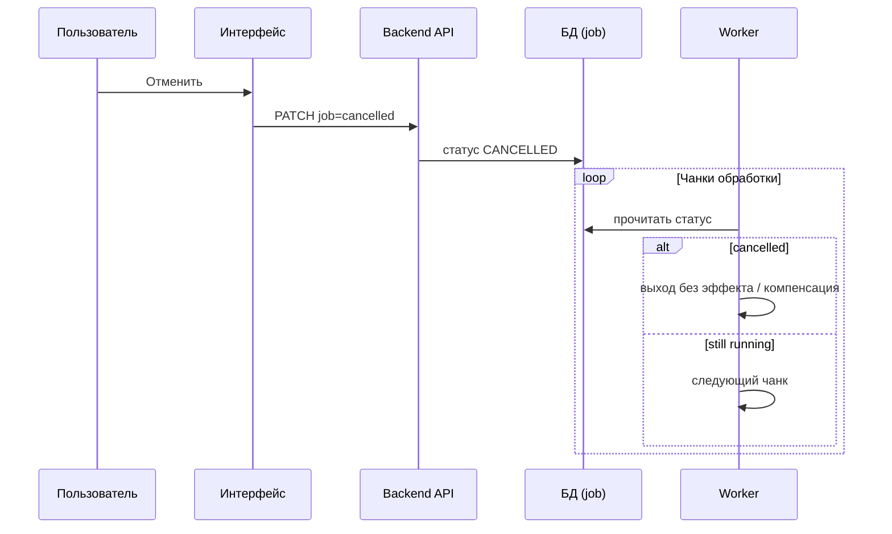

[← Назад к индексу части](index.md)
[↑ К глобальному плану](../../mastery_plan.md)

## 5.9. Замена задачи и отмена

### Цель раздела

Различать **замену** (`replace`), **отзыв** API (`revoke`) и **продуктовую отмену** (флаги, компенсации).

### В этом разделе главное

- **`replace`** (`self.replace(sig)` внутри `bind=True`) — продвинутый приём **перепланировать** работу: вместо текущего шага исполняется новая сигнатура. Нужен, когда бизнес-логика понимает, что вместо одного «большого» шага нужен другой или обновлённый ETA.
- **`app.control.revoke`** — попытка сказать системе «не исполняй/останови». Реальный эффект зависит от состояния сообщения, пула, ОС.
- **Продуктовая отмена** — почти всегда отдельное состояние сущности в БД (`CANCELLED`) + кооперативные проверки в длинном коде.

#### Проверь себя: три слоя отмены

1. Почему **`replace`** отнесён к «замене работы», а не к продуктовой отмене?

<details><summary>Ответ</summary>

`replace` — механизм **перепланирования** того, что делает Celery дальше (другая сигнатура, ETA), изнутри `bind=True`. Продуктовая отмена — про **бизнес-состояние** сущности; она может **инициировать** replace/revoke, но сама по себе живёт в БД и контракте API.

</details>

2. Зачем в одном разделе рядом **`revoke`** и **«сообщение ещё в очереди»**?

<details><summary>Ответ</summary>

Потому что `revoke` полезен прежде всего, пока задача **не взята** или в определённых состояниях worker-а; для уже бегущего кода без кооперации он **не гарантирует** мгновенный стоп. Смысл — снять **лишние** сообщения и согласовать с операционной политикой.

</details>

3. Чем **кооперативные проверки** дополняют любые вызовы `control.revoke`?

<details><summary>Ответ</summary>

Длинный CPU/IO цикл не читает «внешний сигнал» Celery между инструкциями; только **явные** точки в коде (`if cancelled: return`) дают предсказуемое завершение. `revoke` с terminate — грубее и с побочками для соседних задач.

</details>

### Теория и правила

**Кооперативная отмена** для длинных job: разбей работу на чанки, между чанками проверяй `if order.cancelled: return`. Celery управляет **сообщением**, а не каждым внутренним циклом приложения.

**Семантика revoke vs ignore:**

- `revoke` — внешнее «перестань как задачу Celery».
- `Ignore` — внутреннее «мы сознательно завершаем без результата».

#### Проверь себя: `revoke` vs `Ignore`

1. Кто **инициатор** в типичном сценарии: оператор вызывает `revoke`, а `Ignore` — из кода задачи?

<details><summary>Ответ</summary>

`revoke` — **внешний** control-plane (админка, runbook, инцидент). `Ignore` — **внутреннее** решение воркера завершить обработку **без** «ошибки» по бизнес-логике (например, «сообщение устарело»), с иной семантикой для result backend по сравнению с «упали исключением».

</details>

2. Почему нельзя заменить **все** «нам не нужен результат» одним `revoke` снаружи?

<details><summary>Ответ</summary>

Потому что **семантика и момент** разные: `Ignore` выбирается, когда **сам worker** понял, что работу **корректно** бросить, возможно до внешнего вмешательства; `revoke` не знает внутренние ветки бизнес-кода и может приехать поздно или быть грубым (`terminate`).

</details>

3. С точки зрения **UX API**, чем опасно путать **HTTP 204 после `Ignore`** и **успешный revoke**?

<details><summary>Ответ</summary>

Клиент может неправильно решить, **завершилась** ли работа «как задумано» vs «операционно снята»; статусы в БД и Celery разойдутся. Нужна единая **модель состояния job** в хранилище, а не только «тишина» в очереди.

</details>

#### `replace` и перенос ETA: зачем и как читать API

**`self.replace(sig)`** (внутри `bind=True`) позволяет **подменить** оставшееся исполнение **другой сигнатурой** — например, ты начал общий шаг, понял, что дальше нужен **другой** вариант работы или **новая задержка**, и не хочешь вручную плодить вторую задачу с гонками «кто последний прав».

**Обновление ETA** на уровне приложения часто делают так:

- если исполнение **ещё не началось** — новая постановка с `eta` / `countdown` (с идемпотентным ключом, см. п. 5.8);
- если ты **уже внутри** `bind=True` задачи — **`self.replace`** с сигнатурой, у которой выставлены нужные `countdown` / `eta`.

Эскиз (сверь с документацией своей мажорной версии Celery):

```python
@app.task(bind=True)
def maybe_reschedule(self, job_id: int):
    plan = fetch_plan(job_id)  # псевдокод
    if plan.postpone_seconds:
        raise self.replace(
            maybe_reschedule.si(job_id).set(countdown=plan.postpone_seconds)
        )
    do_real_work(job_id)
```

**Важно:** `replace` — не замена **cooperative cancel** в длинных циклах; это смена **запланированной** работы на уровне задачи Celery.

```mermaid
flowchart LR
  A["Текущее выполнение задачи"]
  R["self.replace("new_signature")"]
  B["Новая сигнатура в очереди / планировщике"]
  A --> R --> B
```

#### Проверь себя: `replace` и ETA

1. Почему в тексте **`raise self.replace(...)`**, а не «просто вернуть и поставить задачу»?

<details><summary>Ответ</summary>

`replace` — это **согласованный** с Celery способ **заменить** текущее продолжение на новую сигнатуру из контекста исполнения, чтобы фреймворк корректно **закрыл** текущий путь и **не** оставил дублирующих постановок «вручную». Точная форма API — по доке версии.

</details>

2. Когда **новый `apply_async` с ETA** из API предпочтительнее **`replace`**?

<details><summary>Ответ</summary>

Когда исполнение **ещё не стартовало** и проще **идемпотентно** перепубликовать из веб-уровня с ключом из § 5.8; `replace` нужен чаще, когда решение о переносе принимается **уже внутри** running task.

</details>

3. Почему `replace` **не решает** проблему «пользователь нажал отмену в середине цикла»?

<details><summary>Ответ</summary>

Это **cooperative cancel**: нужны проверки флага в БД между чанками. `replace` меняет **что дальше в очереди Celery**, а не останавливает **текущий** долгий участок кода.

</details>

### Пошагово: спроектировать отмену пользователем

1. Пользователь жмёт «Отмена» → API ставит `jobs.status=CANCELLED` транзакционно.
2. Worker на каждом этапе читает статус (кэш + TTL или прямой SELECT).
3. Если нужно снять из очереди ещё не взятое — `revoke` может помочь (с оговорками).
4. Если уже исполняется — полагаемся на кооперативные проверки и компенсации.

#### Проверь себя: пошаговая отмена пользователем

1. Зачем в шаге 2 worker читает статус **и из кэша с TTL, и иногда из БД** (как в реальных системах)?

<details><summary>Ответ</summary>

Кэш снижает нагрузку на БД в **тесном цикле** обработки, но может дать **устаревшее** «ещё RUNNING»; периодический или критический **SELECT** гарантирует свежесть для отмены. Баланс — между нагрузкой и корректностью.

</details>

2. Почему шаг 3 (`revoke`) помечен «с оговорками», а не как обязательный?

<details><summary>Ответ</summary>

Эффект revoke зависит от **того, взято ли сообщение**, пула worker-а и политики terminate; без флага в БД (шаг 1) продукт всё равно **не знает**, отменилось ли смысловое задание.

</details>

3. Что пойдёт не так, если сделать только шаг 3 без шагов 1–2?

<details><summary>Ответ</summary>

Сообщение могут **снять** с брокера, но UI и учётные системы будут считать job **активным**; при повторной доставке или другом worker без проверки статуса эффект **продолжится**. Продукт и Celery рассинхронизируются.

</details>

#### Пример операционного `revoke` (эскиз)

Отзыв обычно идёт через **control API** того же приложения (из shell, админки, сигнала инцидента):

```python
# Псевдокод: остановить конкретный task_id (параметры terminate/signal зависят от версии)
app.control.revoke(task_id, terminate=True)
```

**Осторожно:** `terminate=True` посылает сигнал процессу worker — это жёстко по отношению к остальным задачам в том же воркере при использовании prefork (часть 8). Для production решай политику с SRE и учитывай изоляцию очередей/воркеров.

#### Проверь себя: `revoke` и `terminate=True`

1. Почему **`terminate=True`** — это не «аккуратная отмена одной задачи», а **операционный удар**?

<details><summary>Ответ</summary>

Сигнал идёт **процессу** worker-а; при prefork в одном процессе могут жить **другие** задачи — они тоже страдают. Это инструмент инцидент-реагирования с осознанным collateral damage, а не замена **cooperative cancel**.

</details>

2. В каком случае **`revoke` без terminate** всё же полезен в проде?

<details><summary>Ответ</summary>

Когда задача **ещё в очереди** или worker **не начал** исполнение: сообщение можно **снять** из жизненного цикла без убийства процесса. Это мягче для соседних job на том же воркере.

</details>

3. Почему для долгих ML/batch job часто выносят **тяжёлые** задачи в **отдельные пулы** перед тем, как полагаться на terminate?

<details><summary>Ответ</summary>

Чтобы **изолировать** blast radius сигнала и длинные критические секции; убивая общий pool, ты рискуешь остановить **массу** несвязанной работы.

</details>

#### UX долгих job: отмена с точки зрения продукта

Для задач на **минуты и часы** пользователю нужен предсказуемый ход: «идёт», «отменено», «ошибка». Celery сам по себе **не** рисует UI: источник истины — **БД / объект хранилища**, а worker **подчиняется** ему между чанками работы.



**Границы:** `revoke` можно добавить как ускоритель «убрать из очереди», но **без** флага в БД продукт всё равно будет врапиться в рассинхрон.

#### Проверь себя: UX и sequence отмены

1. Почему в диаграмме **источник истины — БД**, а не `AsyncResult`?

<details><summary>Ответ</summary>

UI переживает **рестарты** и должен показывать продуктовый статус **офлайн** от Celery; result backend может быть выключен, с `ignore_result` или рассинхронен. **Job** в БД — контракт для пользователя и биллинга.

</details>

2. Что означает ветка **«выход без эффекта / компенсация»** для уже сделанной части работы?

<details><summary>Ответ</summary>

Если чанк **уже изменил** внешний мир, «просто return» недостаточен — нужна **компенсация** (обратная операция, пометка, ручной разбор). Отмена в UI — не откат времени.

</details>

3. Зачем в цикле worker **снова и снова** читает статус, а не один раз в начале?

<details><summary>Ответ</summary>

Отмена приходит **во время** длинной работы; одна проверка в начале пропустит событие «отменили через минуту». Chunked loop + перечитывание — типичный паттерн кооперативной отмены.

</details>

### Простыми словами

`revoke` — как отменить заказ, если курьер ещё не выехал; если выехал — нужны другие меры.

### Картинка в голове

Автобус: **диспетчер** может отменить рейс до отправления; если автобус уже едет — пассажирам нужна **внутренняя процедура высадки**, а не только радиосигнал.

### Типичные ошибки

- Думать, что `revoke` **гарантированно** остановит уже идущий вычислительный процесс (часто нужен **внутренний cancel flag**).

### Что будет, если…

**…забыть компенсацию после частичного выполнения?** Пользователь видит «отменено», но деньги списаны / файл создан / письмо ушло. Нужны **саги/компенсации** или чёткая модель «до какой стадии атомарно».

### Проверь себя

1. Почему для «отмены пользователем» почти всегда нужен флаг в БД?

<details><summary>Ответ</summary>

Потому что это **единая правда**, видимая продуктом, переживающая рестарты. Worker должен периодически **проверять** отмену и завершаться корректно.

</details>

2. Когда `replace` уместнее, чем новая «ручная» постановка задачи из кода?

<details><summary>Ответ</summary>

Когда нужно **на уровне Celery** переключить оставшуюся работу на другую сигнатуру/расписание из уже выполняющегося контекста, не плодя внешние гонки «поставь другую, эту забудь». Узкий advanced-сценарий — читай актуальную документацию и покрывай тестами.

</details>

3. Чем **продуктовая отмена** (флаг в БД) отличается от **`app.control.revoke`**, и зачем нужны оба?

<details><summary>Ответ</summary>

Флаг в БД — **смысловая** отмена для бизнеса и UI, переживает рестарты; worker **сам** решает остановиться при проверках. `revoke` — **операционный** рычаг «убери задачу из жизни Celery» для конкретного id; он не заменяет бизнес-модель и не гарантирует мгновенную остановку произвольного кода. В зрелых системах почти всегда есть **оба слоя**: продукт знает *что* отменено, платформа знает *как* снять сообщение.

</details>

4. Что произойдёт с продуктом, если **только** поставили `CANCELLED` в БД, но worker **игнорирует** статус?

<details><summary>Ответ</summary>

Пользователь увидит «отменено», а **эффекты** продолжат выполняться — классический рассинхрон и комплаенс-риск. Нужны **обязательные** точки проверки или остановка через архитектуру (отдельный этап, компенсации).

</details>

5. Когда **`replace` с новым ETA** уместен в сценарии «пользователь перенёс время», а когда — отдельный API-вызов с идемпотентностью?

<details><summary>Ответ</summary>

`replace` — если решение принимается **внутри** уже запущенной задачи и нужно **атомарно** переключить план Celery. Новый `apply_async` из API — если перенос инициирует **внешний** слой до старта или проще вести учёт постановок в БД.

</details>

### Запомните

Отмена — **продуктовый** контракт; Celery даёт лишь низкоуровневые рычаги.

---
