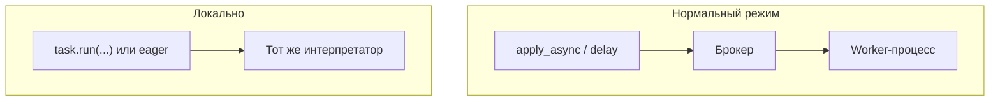

[← Назад к индексу части](index.md)
[↑ К глобальному плану](../celery_mastery_plan.md)

## 5.10. Локальный вызов и отладка

### Цель раздела

Уметь **гонять логику** без брокера там, где это уместно, и не путать это с продовой семантикой.

### В этом разделе главное

- **`Task.run(*args, **kwargs)`** выполняет тело **в текущем процессе** — удобно для unit-тестов **чистой бизнес-логики**.
- Для **`bind=True`** Celery обычно подставляет `self` при `.run()` на объекте зарегистрированной задачи — **проверь** поведение своей версии при кастомном `Task.__call__`.
- **`task_always_eager` / `CELERY_TASK_ALWAYS_EAGER`**: все задачи исполняются синхронно в процессе вызывателя — **другая** модель ошибок, нет реального prefetch/ack поведения брокера.
- **Трассировка аргументов** в логах: маскируй секреты; не логируй целые payload персональных данных.

#### Проверь себя: локально vs прод

1. Чем **`add.run(2, 3)`** принципиально отличается от **`add.delay(2, 3)`** с точки зрения процесса и очереди?

<details><summary>Ответ</summary>

`.run()` исполняет тело **в текущем интерпретаторе** без публикации в брокер; `delay` создаёт **сообщение** и асинхронную модель исполнения (в нормальном режиме — другой процесс worker). Первая не проверяет транспорт, prefetch, ack.

</details>

2. Зачем отдельно предупреждают про **`bind=True`** и **кастомный `Task.__call__`** при `.run()`?

<details><summary>Ответ</summary>

Инфраструктура подстановки `self` и обхода **может отличаться** от дефолта, если переопредели магические методы задачи; без проверки версии получишь **ложно зелёные** локальные тесты.

</details>

3. Почему **структурированные логи с `task_id`** важнее «просто verbose в консоль»?

<details><summary>Ответ</summary>

В проде ты ищешь инциденты **по идентификаторам** и строишь алерты; неструктурированный поток не склеивается с traces из API и метриками.

</details>

### Теория и правила

Уровни тестирования (подробно — часть 15):

1. **Unit:** `.run()` с моками зависимостей.
2. **Интеграция с брокером:** реальный worker и broker.
3. **E2E:** продуктовый сценарий + наблюдаемость.

Eager **не отменяет** необходимости уровня 2 для production-уверенности.

#### Проверь себя: пирамида тестов Celery

1. Что именно **не проверяет** unit-тест через `.run()`, что всплывёт только на уровне 2?

<details><summary>Ответ</summary>

Сериализацию тела сообщения, совместимость **`accept_content`**, поведение брокера при **redelivery**, prefetch, ack/retry на реальном pool, видимость в result backend. Это всё «вокруг» вызова функции.

</details>

2. Почему E2E без наблюдаемости (логи, метрики) почти бесполезен для расследования «иногда ломается»?

<details><summary>Ответ</summary>

Распределённый баг **не воспроизводится** в одном стеке; без correlation и трасс ты не свяжешь HTTP, публикацию и worker. E2E доказывает сценарий, observability — позволяет **понять разрыв**.

</details>

3. Зачем в CI держать **хотя бы один** тест с реальным брокером, если основной объём на eager?

<details><summary>Ответ</summary>

Чтобы хотя бы раз на merge ловить регрессии **транспорта**, прав доступа, несовместимых версий kombu/redis/amqp, которые eager **маскирует**.

</details>

**Где задаётся eager:** обычно это **`task_always_eager`** (или эквивалентное поле) в объекте конфигурации приложения и/или **`CELERY_TASK_ALWAYS_EAGER`** в окружении или настройках фреймворка (частый случай — **Django**: булев флаг в `settings.py`). Смысл везде один: задачи исполняются **синхронно** в процессе **вызывателя** `delay`/`apply_async`. Имя ключа перепроверь в доке своей мажорной версии; **никогда** не оставляй режим eager включённым в production «для простоты».

#### Проверь себя: `task_always_eager` в конфиге

1. Почему включённый eager в **production** ломает не только «масштаб», но и **семантику отказов**?

<details><summary>Ответ</summary>

Запрос HTTP может **синхронно ждать** тяжёлую задачу и упереться в таймаут балансировщика; ретраи и изоляция сбоев между сервисами исчезают. Плюс нет реальной очереди — **backpressure** переносится на вызывателя.

</details>

2. Зачем явно проверять, что **тестовые** settings не подтягивают `CELERY_TASK_ALWAYS_EAGER` в **staging**, имитирующем прод?

<details><summary>Ответ</summary>

Staging должен ловить класс багов **транспорта и конкуренции**; eager превращает его в «толстый unit» и даёт **ложную уверенность** перед релизом.

</details>

3. Чем **Django `settings.py`** как место флага опасен для новичков?

<details><summary>Ответ</summary>

Легко закоммитить «удобный» eager в ветке, забыть выключить при деплое или перепутать файлы окружений. Нужны **guardrails**: запрет в prod-конфиге, проверка при старте, явные профили.

</details>

#### Распределённый путь vs локальный: не смешивай ментальные модели



В локальном режиме **нет** реального разделения по процессам и очереди: не проверяются те же тайминги доставки, конкуренция за prefetch и поведение ack, что в проде.

#### Проверь себя: диаграмма локального vs нормального режима

1. Почему **«тот же интерпретатор»** в ветке local **не доказывает** thread-safety твоей задачи в проде?

<details><summary>Ответ</summary>

В проде задача часто идёт в **другом процессе** с другим **prefork/concurrency**; гонки по глобальному состоянию и файлам проявятся иначе. Локальный вызов не эмулирует изоляцию памяти между worker-ами.

</details>

2. Может ли задача **успешно** пройти `.run()`-тест и **упасть** в проде из‑за **сериализации kwargs**?

<details><summary>Ответ</summary>

Да: локально объекты не проходят через тот же **pickle/json** контур, что сообщение в брокере; типы/циклические ссылки/нестандартные классы всплывают уже на worker. Нужен интеграционный вызов или явная проверка упаковки.

</details>

3. Чем **eager** на диаграмме семантически ближе к `.run()`, чем к нормальному `delay`?

<details><summary>Ответ</summary>

Оба **выполняют** тело в процессе вызывателя без полноценного «путешествия» через брокер как в проде; различия в деталях обёртки Celery, но **не** в реальной очереди и задержках доставки.

</details>

#### `trace`, подробные логи и безопасность

Под **trace** в эксплуатации Celery обычно понимают сочетание:

- **уровня логирования** worker (`--loglevel=debug` / `info`) и **структурированных** логов приложения;
- флагов приложения вроде **`task_send_sent_event`** / событий (часть 14) — чтобы видеть жизненный цикл;
- **осторожного** логирования **аргументов** задачи: никогда не логируй секреты, токены, целиком PII-большие payload.

#### Проверь себя: что входит в trace

1. Зачем **`task_send_sent_event`** упоминается рядом с уровнем `loglevel`, хотя это **разные** каналы?

<details><summary>Ответ</summary>

Лог — **текст** для человека и grep; события — **структурированные** сигналы для мониторинга/трассировки жизненного цикла задачи. Для полной картины нужны оба слоя, иначе теряешь либо корреляцию, либо детализацию.

</details>

2. Почему **`debug` на постоянке** в проде часто вреднее, чем кажется?

<details><summary>Ответ</summary>

Объём и **PII** в логах растут, стоимость хранения и риск утечки увеличиваются, полезный сигнал тонет в шуме. Обычно держат **info** + выборочный debug по **feature flag** / короткому окну инцидента.

</details>

3. Как **неосторожный trace args** ухудшает не только комплаенс, но и **расследование**?

<details><summary>Ответ</summary>

Большие payload **режутся** агрегаторами, тормозят поиск и маскируют важные поля; при утечке секретов логи **запрещают** хранить, и ты теряешь доказательную базу для RCA.

</details>

Паттерн «безопасный trace»:

```python
REDACT = {"password", "card_cvv", "api_secret"}

def safe_args_repr(kwargs: dict) -> dict:
    sanitized = {}
    for k, v in kwargs.items():
        if k in REDACT:
            sanitized[k] = "***"
        else:
            sanitized[k] = v
    return sanitized
```

#### Проверь себя: маскирование и `safe_args_repr`

1. Почему фиксированный **`REDACT` по именам ключей** — только первый уровень защиты?

<details><summary>Ответ</summary>

Секреты могут лежать **вложенно** (`{"user": {"token": ...}}`), под другими именами или в **списках**; нужны рекурсивные правила или запрет логировать **весь** объект, если структура нестабильна.

</details>

2. Чем опасно логировать **`v` как есть** для нерекурсивных, но **больших** значений?

<details><summary>Ответ</summary>

Утечка **PII по объёму**, перегруз лог-системы, обрезка в середине полезного поля. Для больших полей — **хеш/длина/первые N символов** по политике.

</details>

3. Зачем явно говорить «полный `repr` только в **dev** под флагом»?

<details><summary>Ответ</summary>

В dev можно жертвовать объёмом ради отладки; в prod даже «временное» включение полного repr без guardrail быстро превращается в **инцидент** при включённом флаге по ошибке.

</details>

В `bind=True` задаче: логируй `task_id`, `correlation_id`, **обезличенный** срез args. Полный `repr` оставь только за фичефлагом **в dev**.

Отдельно: **`CELERY_TASK_ALWAYS_EAGER`** полезен локально, но в **CI** смешивай с хотя бы одним интеграционным тестом против реального брокера (часть 15).

#### Проверь себя: eager в CI и проброс ошибок

1. Почему одного интеграционного теста с брокером **мало**, если остальной пакет — на eager?

<details><summary>Ответ</summary>

Один тест покрывает **узкий** happy-path; регрессии маршрутизации, race при нагрузке и конфигурации пула могут остаться. Это **минимум**, а не потолок (часть 15).

</details>

2. Чем **`EagerResult`** без `eager_propagates` обманывает **assert на статус** в тесте?

<details><summary>Ответ</summary>

Исключение может быть **упаковано** в результат, а тест проверяет только «вернулось что-то»; реальный worker бы отметил **FAILURE** и запустил ретраи. Нужно явно проверять **исключение** или статус.

</details>

3. Когда **намеренно** оставляют `propagates=False`?

<details><summary>Ответ</summary>

Когда тестируют **ветку обработки ошибок** на уровне приложения, которая ожидает «задача завершилась с ошибкой, но процесс не упал» — редко и осознанно; в большинстве unit-тестов нужен **fail fast**.

</details>

**`CELERY_TASK_EAGER_PROPAGATES`** (или эквивалент в конфиге твоей версии): если `True`, исключения из задачи в eager-режиме **пробрасываются** вызывателю как в обычном Python — удобно для тестов «ожидаем упасть». Если `False`, ошибка может быть «проглочена» по дороге к `EagerResult` — читай доку, чтобы не получить **ложноположительные** зелёные тесты.

### Пошагово: отладить «зависание»

1. Воспроизвести **с одним** worker и `--loglevel=debug`.
2. Проверить **soft/hard time limits** — не игнорируются ли они пулом/OS.
3. Снять **stack** процесса worker (`py-spy`, `faulthandler`) при подозрении на deadlock в C-расширениях.

#### Проверь себя: зависший worker

1. Зачем в шаге 1 важен **ровно один** worker?

<details><summary>Ответ</summary>

Чтобы исключить путаницу «какой consumer держит сообщение» и упростить воспроизведение: один процесс — **один** поток рассуждений о prefetch, локах и логах.

</details>

2. Почему **`time_limit` «не сработал»** — не всегда значит «баг Celery»?

<details><summary>Ответ</summary>

Пул процессов, платформа и C-расширения могут **игнорировать** или откладывать сигналы; часть кода может блокировать GIL/системный вызов так, что soft/hard срабатывают не так, как в чистом Python. Нужна диагностика **OS/pool**.

</details>

3. Когда **шаг 3 (stack dump)** предпочтительнее бесконечного увеличения логирования?

<details><summary>Ответ</summary>

Если задача **застряла** в нативном коде или deadlock без исключений — логи не покажут **где** стек; нужен внешний sampler (`py-spy`) или `faulthandler`, чтобы увидеть **реальные** фреймы.

</details>

### Примеры

```python
from celery import shared_task

@shared_task
def add(x, y):
    return x + y

# add.run(2, 3)  # типично вернёт 5

@shared_task(bind=True)
def echo(self, msg: str) -> str:
    return msg

# echo.run("hi")  # self подставляет инфраструктура Task
```

Если в твоей версии поведение отличается — зафиксируй **официальный** пример как регрессионный тест.

### Типичные ошибки

- Закладываться на eager, как будто это доказывает корректность **распределённой** обработки.

### Что будет, если…

**…в лог пишется полный dict webhook с персональными данными?** Комплаенс-инцидент: **редакция полей**, политики retention (часть 31).

### Проверь себя

1. Чем опасен `task_always_eager=True` в неверных тестах?

<details><summary>Ответ</summary>

Он скрывает проблемы сериализации, транспорта, конкуренции и ack/retry семантики. Тест «зелёный», прод «красный».

</details>

2. Почему отладка через `print` внутри задачи на production-worker — слабая практика?

<details><summary>Ответ</summary>

Потому что логи должны быть **структурированы**, с контекстом (`task_id`, correlation), уровнями и возможностью поиска. `print` теряется в stdout агрегаторах и затрудняет корреляцию инцидентов.

</details>

3. Зачем в тестах с **eager** включать **`task_eager_propagates`** (или аналог в конфиге), и чего ты лишаешься, если оставить «глотание» ошибок?

<details><summary>Ответ</summary>

Чтобы исключение из задачи **в эмуляции очереди** вело себя как «обычный» Python-fail: тесты **падают**, а не показывают ложный успех через обёртку результата. Если ошибки **не пробрасываются**, часть сценариев молча зелёная, хотя в реальном worker задача бы ушла в **FAILURE**. Имя флага проверь в доке версии (`CELERY_TASK_EAGER_PROPAGATES` / `task_eager_propagates`).

</details>

4. Почему пример **`echo.run("hi")`** не заменяет тест **`echo.delay("hi")` + worker** для регрессии на `self.request`?

<details><summary>Ответ</summary>

В `.run()` часть полей `self.request` может быть **заглушена** или другой по наполнению, чем при доставке из брокера; баги в **middleware**, заголовках и retry-контексте не проявятся.

</details>

5. Как **логирование полного webhook** бьёт по retention даже без немедленной утечки наружу?

<details><summary>Ответ</summary>

Долгое хранение **увеличивает** окно компрометации и усложняет GDPR-удаление («забыть пользователя»); архивы логов становятся **второй** базой PII.

</details>

### Запомните

Локальный вызов — **дрель по дереву на верстаке**, не стройка дома. Полезно, но не эквивалент.

---
