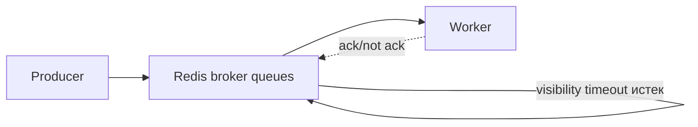

[← Назад к индексу части](index.md)
[↑ К глобальному плану](../celery_mastery_plan.md)

## 6.2. Redis как broker

### Цель раздела

Научиться видеть реальные ограничения Redis как broker’а для Celery и понимать, почему Redis часто отличный выбор для старта, но требует дисциплины при ожиданиях “как в AMQP”.

### В этом разделе главное

- Redis прост для старта и обычно даёт низкую latency.
- Но Redis — это in-memory store с режимами persistence, и поведение при рестартах зависит от настроек RDB/AOF.
- Семантика “visibility timeout-подобного поведения” приводит к redelivery при сбоях, и это нужно учитывать при идемпотентности задач.
- Большие очереди упираются в память и вызывают деградацию.
- Упорядочивание и приоритеты обычно ограничены или требуют отдельного дизайна (иногда проще разделять очереди, чем полагаться на priority).
- Redis может быть частью компромисса: удобно, быстро, но долгосрочная надежность требует продуманного persistence и capacity planning.

### Термины

- **In-memory store** — хранение в памяти: быстро, но надежность зависит от persistence режима и устойчивости инфраструктуры.
- **RDB/AOF** — способы сохранения состояния Redis на диск: влияют на то, сколько данных потеряется при сбое.
- **Visibility timeout-подобная семантика** — время “невидимости” сообщения для других consumer’ов до повторной доставки.
- **Backlog/memory pressure** — когда очередь растет быстрее, чем обрабатывается, и Redis начинает деградировать.
- **Ordering/priority limits** — отличия от AMQP-поведения и ограничения по гарантированности порядка/приоритетов.

### Теория и правила

#### Redis как быстрый in-memory broker: что это значит

Redis часто выбирают потому что:

- публикация и consumption быстрые,
- схема подключения простая,
- обычно меньше ops по сравнению с self-hosted RabbitMQ.

Но интуиция “быстро = надежно” неверна без понимания persistence.

#### Persistence и риск потери сообщений

Redis имеет режимы сохранения:

- **RDB**: “срезы состояния” с определенной периодичностью.
- **AOF**: запись операций в журнал (уменьшает риск потери, но может увеличить write amplification и нагрузку).

Риск для delivery:

- если Redis упал/перезапустился, сообщения, которые не успели сохраниться согласно выбранному режиму, могут исчезнуть.

Это значит: надежность доставки с Redis — это не “из коробки”, а результат согласования:

- режима persistence,
- требований к допустимой потере,
- стратегии идемпотентности и ретраев.

#### Visibility timeout-подобные нюансы: redelivery как часть реальности

Даже если сообщения хранятся быстро, в модели delivery почти всегда есть сценарии, когда ack не “фиксируется” вовремя:

- worker упал,
- сеть/брокер перегрузился,
- произошёл таймаут.

Тогда сообщение становится доступным снова, и задачу могут выполнить повторно.

Итоговое правило: на уровне приложения ты должен проектировать обработку как **идемпотентную** или с внешними дедупликациями.

#### Проблемы с большими очередями и памятью

Redis хранит данные в памяти.

Если очереди растут:

- память расходуется,
- latency может увеличиться,
- возможны OOM/eviction/тормоза (в зависимости от конфигурации).

Поэтому capacity planning и backpressure (в Celery/приложении) становятся “частью broker’а”.

#### Single node vs sentinel/cluster

Для Celery важно, как происходит failover.

- В single node сценарии отказ — это рестарт и потенциальная потеря части данных (зависит от persistence).
- Sentinel/cluster добавляют доступность, но усложняют предсказуемость и маршрутизацию.

Правило: при выборе Redis topology заранее подумай, что для тебя важнее — минимальная ops cost или максимальная предсказуемость поведения при отказах.

#### Ограничения приоритетов и DLQ-подобных паттернов

В отличие от RabbitMQ, Redis обычно не предоставляет богатую топологию routing и DLQ через exchange/queue bindings.

Поэтому приоритеты и “dead-letter patterns” чаще проектируют иначе:

- отдельные очереди под тип workload,
- отдельные очереди retry with delay,
- приложения читают не “DLQ гарантией”, а “логикой политики”.

Это не плохо, но это другой тип дизайна.

### Пошагово: как выбрать Redis broker без ложных ожиданий

1. Оцени требования к надежности при рестартах.
   - Если “допустима потеря” — Redis может быть ок.
   - Если “нельзя потерять вообще” — нужен строгий delivery дизайн или другой broker.
2. Подбери persistence режим и проверь реальный crash scenario.
   - Теория тут недостаточна: нужно тестировать, сколько сообщений исчезает при отказе.
3. Настрой visibility timeout для redelivery и учти длительность задач.
4. Спроектируй идемпотентность задач.
   - Особенно для побочных эффектов: платежи, письма, вебхуки.
5. Управляй очередной нагрузкой.
   - Backpressure, лимиты, разделение очередей.
6. Построй monitoring на глубину очередей и ресурсные метрики Redis.

### Простыми словами: картинка в голове

Redis — это как “блокнот, который хранится в памяти”.

Если блокнот перезапустить, то что не успело быть переписано “в книгу” (persistence), может исчезнуть.

Сообщения “уходят в невидимость” на время обработки, а если подтверждения не случилось — возвращаются как будто “запись не обработана”.

Поэтому твоя бизнес-операция должна переживать повтор.

### Картинка в голове



### Как запомнить

Формула: **Redis быстрый, но надежность упирается в persistence и дисциплину идемпотентности**.

### Примеры

#### Пример: базовый broker_url и настройка visibility_timeout

```python
from celery import Celery

app = Celery("myapp")
app.conf.broker_url = "redis://redis:6379/0"

app.conf.broker_transport_options = {
    "visibility_timeout": 3600,  # должен быть больше максимальной длительности обработки
}

app.conf.result_backend = "redis://redis:6379/1"
```

Если задача длинная, а visibility timeout маленький — сообщения могут “вернуться” и дать дубликаты.

#### Пример: разделение очередей вместо ожиданий AMQP-priorities

```python
from kombu import Queue

task_queues = (
    Queue("high", routing_key="tasks.high", durable=True),
    Queue("low", routing_key="tasks.low", durable=True),
    Queue("retry_delay_5m", routing_key="tasks.retry_5m", durable=True),
)

task_default_queue = "low"

task_routes = {
    "tasks.critical_*": {"queue": "high", "routing_key": "tasks.high"},
    "tasks.*": {"queue": "low", "routing_key": "tasks.low"},
}
```

В реальном проекте retry_delay_5m можно реализовать через дополнительный механизм задержки в application layer или через TTL-подобные паттерны (с учетом возможностей транспорта).

### Практика / реальные сценарии

1. **Небольшой сервис с умеренной нагрузкой**
   - Redis может быть “всё в одном”: broker и backend.
   - Но обязательно протестируй restart/crash и проверь, как часто происходят redelivery.
2. **Длинные задачи**
   - visibility_timeout должен покрывать “дольше, чем worst-case”.
   - При нестабильных зависимостях (HTTP/DB) закладывай запас.
3. **Очередь растет быстрее, чем потребляется**
   - это не только “проблема throughput”, это риск памяти Redis.
   - нужно проектировать throttle/backpressure.

### Типичные ошибки

- Ожидать от Redis behavior “как у RabbitMQ”: например, строгой модели DLQ/topology или универсальных гарантий порядка.
- Настроить visibility timeout меньше длительности реальных задач и удивляться редelivery.
- Не учитывать память: позволить очередям расти без лимитов.
- Записывать большие payload в сообщения и увеличивать давление на память/latency.

### Что будет, если…

... Redis persistent неправильно настроен под требования надежности.

Тогда часть сообщений может исчезнуть при сбое, а приложение получит “потерю задач”. Это приведет к логически неполным инвариантам, которые трудно диагностировать постфактум.

... очередь растет и Redis испытывает memory pressure.

Latency publishing/consumption станет хуже, а retry может ускориться (за счет того, что system “дольше не отвечает”). Ты получишь каскадную деградацию.

### Проверь себя

1. Почему “Redis быстрый” не означает “Redis надежный”?

<details><summary>Ответ</summary>

Потому что надежность delivery зависит от того, что произойдет при сбоях и перезапусках. Redis хранит данные в памяти, а устойчивость — результат выбранной persistence стратегии (RDB/AOF) и конфигурации. Без этого быстрый broker может потерять сообщения.

</details>

2. Как связаны visibility_timeout и идемпотентность?

<details><summary>Ответ</summary>

Если visibility timeout меньше фактической длительности обработки или происходит сбой до ack, сообщения вернутся и задачу выполнят повторно. Поэтому обработчик должен быть безопасен к повтору.

</details>

3. Когда лучше разделять очереди, а не полагаться на priorities?

<details><summary>Ответ</summary>

Когда тебе нужен предсказуемый контроль над классами workload и ты не хочешь зависеть от ограничений транспорта по приоритетам. Отдельные очереди проще наблюдать и легче диагностировать.

</details>

### Запомните

- Redis — отличный стартовый broker, но reliability “покупается” persistence и дисциплиной redelivery/идемпотентности.
- Priorities и DLQ-паттерны проектируются иначе: часто лучше topology из отдельных очередей.

#### Дополнительные вопросы по разделу 6.2

1. Почему тест “убили Redis и подняли заново” важнее, чем просто чтение документации про RDB/AOF?

<details><summary>Ответ</summary>

Потому что именно фактический crash‑тест показывает, сколько сообщений реально теряется в конкретной конфигурации и под конкретной нагрузкой. Документация описывает теоретическое поведение, но реальные параметры snapshot’ов, AOF и нагрузка приложения могут сильно менять картину; без теста легко переоценить надёжность доставки.

</details>

2. В чём практическая разница между “очередь растёт в Redis” и “очередь растёт в RabbitMQ” с точки зрения рисков?

<details><summary>Ответ</summary>

В Redis рост очереди напрямую давит на память и может привести к OOM/eviction, то есть к деградации всего инстанса и потере данных. В RabbitMQ рост очереди тоже опасен (latency/диск), но модель хранения и инструментов управления backlog’ом другая; риск “выстрелить себе в ногу” именно памятью Redis выше, особенно если на нём сидят и другие данные.

</details>

3. Почему для Redis‑broker особенно важно разделение очередей по типам workload, а не “одна большая очередь на всё”?

<details><summary>Ответ</summary>

Потому что разные классы задач по‑разному влияют на память, latency и частоту redelivery. Если всё сложить в одну очередь, то тяжёлые или ядовитые сообщения будут мешать лёгким задачам, их сложнее диагностировать и контролировать. Отдельные очереди позволяют управлять ростом, backpressure и диагностикой по классам нагрузок.

</details>

---
