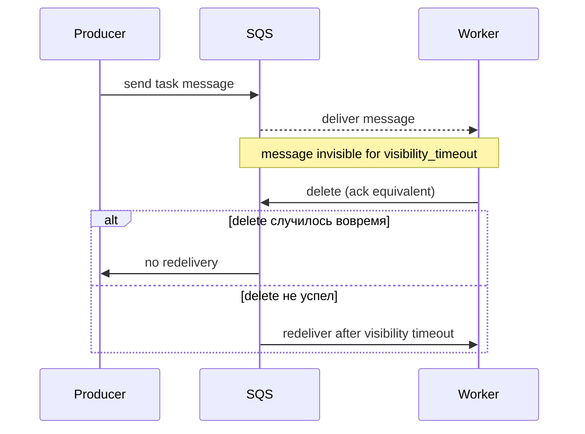

[← Назад к индексу части](index.md)
[↑ К глобальному плану](../celery_mastery_plan.md)

## 6.3. SQS и managed brokers

### Цель раздела

Понять, как SQS меняет модель работы Celery: ты меньше управляешь брокером и больше управляешь “инфраструктурными контрактами” через managed параметры, ключевой среди которых `visibility timeout`.

### В этом разделе главное

- SQS — managed очередь: ops меньше, но есть модель стоимости и функциональные ограничения.
- Ключевой механизм надежности и redelivery — **visibility timeout**.
- Для latency часто важны механики polling и long polling.
- FIFO vs standard отличается моделью порядка и требованиями к message group.
- Повторная доставка в SQS возможна: идемпотентность и дедупликация неизбежны.
- Интеграция с облаком включает IAM, region, cross-account ограничения.

### Термины

- **Managed broker** — брокер, которым ты не управляешь напрямую: поведение задается интерфейсом сервиса и SLA провайдера.
- **Visibility timeout** — время “невидимости” сообщения после получения worker’ом.
- **Polling** — как клиент опрашивает очередь на наличие сообщений.
- **Long polling** — уменьшение пустых запросов за счет ожидания сообщений на стороне сервиса.
- **FIFO vs standard** — типы очередей с отличиями по ordering и гарантии доставки.
- **Message group** — механизм, который позволяет упорядочивание в FIFO очередях внутри группы.

### Теория и правила

#### Когда нужен managed вариант

Managed broker выбирают, когда:

- команда хочет минимизировать ops,
- важна горизонтальная масштабируемость без self-hosted broker’а,
- команда зрелая в cloud IAM и network.

При этом managed решения не убирают необходимость думать про delivery semantics: они просто “вшиты” в платформу.

#### Visibility timeout: главный рычаг

В SQS ключевой цикл такой:

- worker получает сообщение,
- сообщение становится невидимым на `visibility_timeout` секунд,
- если worker не “подтвердил” (в SQS это delete сообщения) до истечения тайм-аута, сервис снова делает сообщение доступным.

Отсюда правило:

- visibility_timeout должен быть больше worst-case времени обработки,
- иначе дубликаты становятся системной нормой, а не редким failure.

#### Ограничения по latency и функциональности

SQS не имеет “богатой AMQP топологии” уровня RabbitMQ.

Это влияет на то, как ты строишь:

- retry topologies,
- DLQ,
- маршрутизацию по routing keys.

Часто решение — проектировать retry/delay и routing на уровне очередей (или на уровне приложения), а не обменников/биндингов.

#### Polling: что ты платишь запросами и как это влияет на SLA

Если polling короткий и частый:

- ты платишь cost запросами,
- ты повышаешь нагрузку на API и можешь ухудшить latency при пикировках.

Long polling и batch receive/delete уменьшают пустые запросы и делают cost более предсказуемым.

#### IAM, регионы и cross-account ограничения

SQS живёт внутри AWS-аккаунта и региона, а доступ к очередям контролируется через **IAM-политику** и настройки самой очереди.

Практически это означает:

- worker-ы должны иметь **право читать/удалять сообщения** из нужных очередей (IAM role/пользователь);
- producer-ы — **право публиковать** в эти очереди;
- cross-account сценарии (один аккаунт пишет, другой читает) требуют явной настройки trust policy и прав на очереди;
- region нужно выбирать осознанно: latency и стоимость зависят от географии и cross-region трафика.

Для Celery это выглядит как:

- `broker_url = "sqs://"` + окружение (IAM role, переменные среды) → **доступ к очередям определяется не только строкой URL, а IAM**;
- если при миграции окружения забыть про политику, Celery будет “молчать” из-за отсутствия прав, и это нужно уметь диагностировать (ошибки подключения и 403 от API, а не “сломалась задача”).

#### Идемпотентность при повторной доставке

Даже если visibility timeout настроен правильно, сбои случаются:

- worker падает после получения сообщения, но до delete,
- network проблемы и таймауты,
- сбои в side effects.

Поэтому повторная доставка в SQS — это не “редкая аномалия”, а ожидаемая реальность.

### Пошагово: настройка SQS под длительные задачи

1. Установи upper bound на длительность выполнения задачи.
   - Если не знаешь — начни с измерений и добавь запас.
2. Выставь `visibility_timeout` с запасом.
3. Протестируй failure scenario.
   - Например, “worker умер до delete” и проверка redelivery в реальном окружении.
4. Проектируй idempotency.
   - Делай безопасными side effects и внешние эффекты.
5. Настрой polling и long polling.
   - Балансируй cost и latency.
6. Планируй retry через отдельные очереди или delay механизмы.

### Простыми словами: картинка в голове

Представь, что SQS — это “витрина товара”.

- Worker взял товар и поставил “занято” на заданное время (visibility).
- Если он не успел “закрыть сделку” (delete) до окончания таймера, витрина снова делает товар доступным.

Поэтому любые side effects должны быть безопасны, если товар “вернётся в витрину”.

### Картинка в голове



### Как запомнить

Формула: **SQS = managed, а `visibility timeout` = “когда сообщение считается потерянным для обработки и возвращается”**.

### Примеры

#### Пример: базовая конфигурация SQS broker и visibility_timeout

```python
from celery import Celery

app = Celery("myapp")
app.conf.broker_url = "sqs://"

app.conf.broker_transport_options = {
    "region": "us-west-2",
    "visibility_timeout": 3600,
    "polling_interval": 1,
    "queue_name_prefix": "myapp-",
}
```

Конкретные способы указания credentials зависят от окружения (IAM role, env variables, параметры в URL). Важно помнить только одно: без корректных creds SQS transport не подключится.

#### Пример: когда думать про FIFO

FIFO полезен, когда:

- тебе нужен порядок обработки внутри message group,
- ты готов “заплатить” снижением параллелизма.

Если у тебя все задачи попадают в одну группу, throughput будет ограничен.

Если у тебя несколько независимых потоков (например, per-customer), message group id можно делать по ключу бизнес-операции. Точный способ задания group id зависит от твоего слоя интеграции с транспортом: если Celery транспорт не управляет group id, FIFO порядок может быть ограничен или отсутствовать в ожидаемом виде.

### Практика / реальные сценарии

1. **Облачный сервис с минимумом ops**
   - SQS дает менеджмент очередей и отказоустойчивость “из коробки”.
   - Но ты получаешь другой класс ограничений: polling/cost и необходимость идемпотентности.
2. **Долгие ETL задачи**
   - visibility timeout должен покрыть worst-case обработки.
   - retry делай через отдельные очереди/стратегии delay.
3. **Оптимизация cost**
   - long polling и batch receive/delete помогают уменьшить нагрузку на API.

### Типичные ошибки

- Поставить visibility_timeout “по умолчанию” и потом удивляться дубликатам на long-running задачах.
- Ожидать сложную AMQP routing topology и пытаться решать это через `task_routes` без понимания возможностей SQS.
- Игнорировать cost модели: слишком агрессивный polling может стать дорогим и ухудшить SLA.
- Недооценить FIFO: это не “включи и получишь порядок везде”, это “порядок внутри группы” и снижение параллелизма.

### Что будет, если…

... visibility_timeout меньше фактического времени обработки.

Сообщение станет видимым снова и другая копия worker возьмет его. Если side effects не идемпотентны — ты получишь двойной эффект.

... polling слишком частый.

Появится рост пустых запросов, cost и потенциальная нагрузка на API, что ухудшит устойчивость при пикирующей нагрузке.

### Проверь себя

1. Почему `visibility_timeout` в SQS — это фактически часть delivery semantics?

<details><summary>Ответ</summary>

Потому что именно `visibility_timeout` определяет окно, после которого сообщение вернётся на доставку при отсутствии delete. Это напрямую влияет на redelivery и, значит, на риск повторов.

</details>

2. Что практичнее для безопасности side effects: “настроить visibility правильно” или “сделать идемпотентность”?

<details><summary>Ответ</summary>

Практичнее всегда иметь оба слоя: visibility_timeout снижает частоту повторов, но сбои всё равно возможны. Идемпотентность гарантирует безопасность дублей, даже если таймеры и сбои сыграли против тебя.

</details>

3. Почему FIFO не всегда решает проблему порядка?

<details><summary>Ответ</summary>

FIFO гарантирует порядок внутри message group. Если все сообщения идут в одну группу или group id выставлен не так, как ты ожидаешь, то “порядок для всего мира” не получается. Кроме того, FIFO ограничивает параллелизм.

</details>

### Запомните

- SQS уменьшает ops, но не отменяет delivery semantics: всё крутится вокруг `visibility_timeout`.
- Дубликаты возможны почти всегда: делай side effects безопасными к повтору.
- FIFO — это про порядок внутри группы, а не глобальную “упорядоченность всей очереди”.

#### Дополнительные вопросы по разделу 6.3

1. Как ты поймёшь по метрикам и логам, что `visibility_timeout` выбран слишком маленьким для конкретного типа задач?

<details><summary>Ответ</summary>

Ты увидишь повторные доставки одних и тех же сообщений (по idempotency key или бизнес‑ключу), при этом часть задач будет успевать завершаться “почти вовремя”. В логах worker’ов и в метриках очереди будет расти количество redelivery, хотя явных ошибок выполнения может не быть; это признак того, что сообщение возвращается в очередь из‑за истечения `visibility_timeout`, а не из‑за фатальной ошибки.

</details>

2. Почему даже при правильном `visibility_timeout` SQS нельзя рассматривать как механизм строгого “ровно один раз” выполнения задачи?

<details><summary>Ответ</summary>

Потому что сбои возможны и после успешного выполнения side effects, но до delete сообщения: network‑глюки, падение worker’а, проблемы на стороне AWS. В таких случаях сообщение будет выдано повторно, и без идемпотентности бизнес‑эффект может удвоиться. SQS даёт at‑least‑once семантику; exactly‑once нужно проектировать на уровне приложения.

</details>

3. В чём отличие риска при неверной IAM‑конфигурации от риска при неверном `visibility_timeout`?

<details><summary>Ответ</summary>

Неверная IAM‑конфигурация приводит к тому, что Celery вообще не может корректно читать/писать в SQS: сообщения могут не публиковаться или не забираться, и это проявляется как ошибки доступа (403/Auth) или “молчание” потребителей. Неверный `visibility_timeout` не ломает доступ, но меняет частоту и характер redelivery, что влияет на дубликаты и нагрузку; это уже вопрос поведения, а не авторизации.

</details>

---
