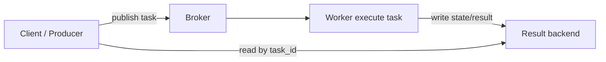

[← Назад к индексу части](index.md)
[↑ К глобальному плану](../../mastery_plan.md)

## 6.4. Result backend варианты

### Цель раздела

Научиться выбирать backend для статусов/результатов и понимать, сколько он стоит: по производительности, по надежности и по “информационной поверхности” (traceback/meta и retention).

### В этом разделе главное

- Result backend бывает разным по модели хранения: **Redis**, **SQL**, **RPC**, **cache-like**.
- Подход “backend всегда нужен” неверен: часто достаточно статусов из приложения, а не длительного хранения результатов.
- TTL, очистка и ожидания консистентности важны: backend может “быстро исчезать” данные.
- Backend нельзя превращать в долговечное бизнес-хранилище: он рассчитан на техслужебные метаданные, а не на “истину”.
- Стоимость backend — это не только storage: это write amplification (число операций) и нагрузка на сеть/БД.
- Chord/group result логически завязаны на наличие backend там, где требуется сборка/счетчик результатов.

### Термины

- **Task state** — служебные статусы (`PENDING`, `STARTED`, `SUCCESS`, `FAILURE`, и т.п.).
- **Result payload** — результат выполнения задачи (если включено сохранение).
- **TTL** — время жизни результата/метаданных.
- **Cleanup** — процесс удаления старых данных.
- **Consistency expectations** — ожидания “когда статус появится и когда исчезнет”.
- **Write amplification** — рост числа записей на backend относительно “события в приложении”.
- **Chord dependency** — зависимость композиций от backend, когда нужно собрать результаты группы.

### Теория и правила

#### Почему backend не стоит делать долговечным business-хранилищем

Backend в Celery чаще всего используется для:

- статусов выполнения,
- трассировки ошибок (traceback),
- опционально результата задачи.

Он обычно:

- имеет TTL или механизмы очистки,
- пишет метаданные специфичным форматом,
- может иметь ограничения по индексации и поиску,
- может быть не рассчитан на “аудит через годы”.

Поэтому правило:

- “истина по бизнесу” должна жить в твоей БД/хранилище домена,
- backend — это техническое табло и короткий жизненный цикл “диагностических фактов”.

#### TTL, cleanup и ожидания консистентности

Если backend поддерживает TTL:

- ты должен понимать, сколько времени ты можешь читать результат/статус после публикации;
- если TTL маленький, UI/интеграции могут внезапно перестать видеть результат.

Консистентность тут не такая, как “строгая транзакционная истина в БД”.

В более простом варианте:

- backend может не гарантировать моментальную доступность статуса во всех компонентах,
- может зависеть от настроек и нагрузки.

#### Write amplification и cost profile разных backend-ов

Backend может увеличивать нагрузку:

- task state меняется несколько раз (started/success/failure),
- в зависимости от настроек может писаться больше метаданных,
- traceback может быть большим.

Отсюда cost профиль:

- Redis backend — быстрый, но память и persistence дорогие,
- SQL backend — требует индексации/поддержки схемы и может стать “узким горлом”,
- RPC backend — строит путь ответа через broker-подобный канал,
- cache-like backend — быстрее, но с большими ограничениями по длительности жизни.

#### Чувствительные данные: traceback/meta и политика хранения

Traceback часто содержит:

- фрагменты кода,
- строки исключений,
- иногда часть payload (если логировал так, как не надо).

Если backend хранит это надолго или доступен шире, чем нужно, ты рискуешь комплаенсом.

Поэтому политика:

- минимизировать payload,
- не включать секреты в exception сообщения,
- согласовать retention/очистку backend метаданных.

#### Backend зависимость для chord/group result

Композиции:

- `group` и `chord` часто требуют знания, когда все элементы группы завершились.
- Это может зависеть от backend, потому что нужно сохранить состояния/результаты элементов.

Если backend выключен или недоступен, поведение chord/group может быть ограниченным: композиции могут “не собрать callback” или оставить задачи в неопределенности.

### Пошагово: как выбирать result backend под цели

1. Определи, нужно ли хранить результат вообще.
   - Часто достаточно “успешно/неуспешно” и факт выполнения фиксируется в вашей БД.
2. Определи потребителей статусов.
   - UI/алерты/оркестрация: как быстро нужно видеть изменение?
3. Определи требования к TTL и ретенции.
4. Оцени cost profile и узкие места.
5. Проверь security/комплаенс: что попадет в traceback/meta и где это хранится.
6. Для chord/group — проверь, что backend поддерживает нужную механику.

### Простыми словами: картинка в голове

Result backend — это как “онлайн-табло у прохода”.

Worker приходит и обновляет табло, а клиент (или UI) смотрит по номеру билета (`task_id`).

Если табло быстро чистится, ты можешь не успеть посмотреть результат. Если табло недоступно, ты можешь “видеть выполнение” только по косвенным признакам (например, доменная запись в БД).

### Картинка в голове



### Как запомнить

Формула: **backend = табло, а не источник истины**. TTL и retention определяют “до какого момента ты можешь доверять видимости”.

### Примеры

#### Пример: Redis result backend

```python
from celery import Celery

app = Celery("myapp")
app.conf.result_backend = "redis://redis:6379/1"

app.conf.result_backend_transport_options = {
    "global_keyprefix": "celery:rb:",
}
```

Redis backend обычно быстрый по чтению статусов, но требует дисциплины по TTL и размерам данных.

#### Пример: SQL result backend

```python
from celery import Celery

app = Celery("myapp")
app.conf.result_backend = "db+sqlite:///celery_results.db"
```

В production чаще используется Postgres/MySQL (и то, что Celery ожидает по SQLAlchemy/драйверам). SQL backend полезен, если тебе нужны более “БД-совместимые” ожидания и интеграция с доменными ретеншн-политиками.

#### Пример: RPC backend

RPC backend использует механизм ответа через очередь/канал, чтобы вернуть результат клиенту.

```python
from celery import Celery

app = Celery("myapp")
app.conf.result_backend = "rpc://"
```

RPC backend может быть удобным для сценариев “ответ нужен быстро и сразу”, но он меняет модель зависимости: клиент начинает сильнее зависеть от транспортных путей и ответного канала.

#### Пример: cache-like backend (memcached)

```python
from celery import Celery

app = Celery("myapp")
app.conf.result_backend = "cache+memcached://127.0.0.1:11211/"
```

Cache-like backends обычно быстры, но живут как кэш: TTL и исчезновение статусов — нормальная часть модели.

### Практика / реальные сценарии

1. **UI показывает прогресс, но результат уже фиксируется в доменной БД**
   - Выбирай backend с коротким TTL.
   - Истина — в доменной БД, backend — для статусов/UX.
2. **Композитные workflow с chord**
   - Убедись, что backend доступен и хранение статусов/результатов для элементов группы корректно поддерживается.
3. **Наблюдаемость и ретраи без утечки секретов**
   - Сразу проверь, что traceback/meta не содержит PII/секреты.
   - Настрой retention/очистку.

### Типичные ошибки

- Долго хранить backend данные “чтобы было чем пользоваться”, превращая его во вторую БД.
- Игнорировать TTL: UI/интеграция читают результат, но backend уже успел удалить запись.
- Вставлять большие payload в exception/traceback (например, сериализованные вебхуки целиком).
- Не учитывать, что chord/group нуждаются в backend-механике.

### Что будет, если…

... backend хранит traceback/meta дольше, чем ты думаешь.

Ты увеличиваешь “окно компрометации” для PII/секретов и усложняешь GDPR/удаление по запросу.

... backend недоступен в момент, когда нужно собрать chord.

Тогда композиция может зависнуть или не выполнить callback так, как ожидается. Это приводит к “логически выполнено, но workflow не завершился”.

### Проверь себя

1. Почему result backend — не “источник истины”?

<details><summary>Ответ</summary>

Потому что backend обычно рассчитан на техслужебные метаданные и имеет TTL/очистку, а также отличную от доменной БД модель консистентности и индексации. Бизнес-инварианты должны быть в доменной БД.

</details>

2. Как TTL backend влияет на UX?

<details><summary>Ответ</summary>

Если TTL меньше времени, когда пользователь/сервис успевает запросить результат, вы получите “пропажа” результатов: задача могла выполниться, но табло больше не хранит запись.

</details>

3. Почему chord иногда требует backend?

<details><summary>Ответ</summary>

Потому что chord должен знать, когда завершились все части группы и/или иметь доступ к состояниям/результатам элементов, чтобы запустить callback. Эта информация часто берется из backend.

</details>

### Запомните

- backend — табло и диагностическая поверхность с TTL, а не бизнес-хранилище.
- Выбор backend влияет на cost и security: write amplification и traceback retention.

#### Дополнительные вопросы по разделу 6.4

1. Почему увеличение TTL для result backend может одновременно улучшить UX и ухудшить эксплуатационные характеристики системы?

<details><summary>Ответ</summary>

Больший TTL позволяет дольше видеть статусы/результаты задач, что удобно для UI и отложенных интеграций. Но при этом возрастает объём хранимых метаданных и traceback’ов, растёт нагрузка на backend (write/read), усложняется очистка и усиливаются риски комплаенса (PII/секреты живут дольше). Поэтому TTL всегда баланс между удобством и стоимостью/рисками.

</details>

2. В каких случаях логичнее вообще отказаться от сохранения результата задачи в backend, оставив только доменную запись в своей БД?

<details><summary>Ответ</summary>

Когда результат уже фиксируется в доменной БД (например, статус заказа, операция списания, флаг завершения обработки файла), а UI и другие сервисы могут опираться на эту запись. В таких сценариях хранить результат ещё и в result backend избыточно: это добавляет write amplification и поверхность для утечек, не давая дополнительной “истины”.

</details>

3. Почему chord/group особенно чувствительны к выбору и здоровью result backend?

<details><summary>Ответ</summary>

Потому что chord должен знать, что все задачи группы завершились, и часто использует backend как место, где хранятся статусы/результаты элементов. Если backend недоступен, медленный или агрессивно чистит данные, callback может не выполниться или выполниться некорректно, даже если сами задачи группы отработали успешно.

</details>

---
