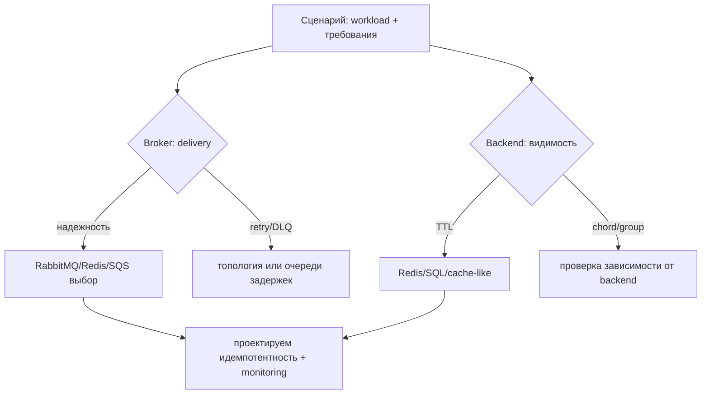

[← Назад к индексу части](index.md)
[↑ К глобальному плану](../../mastery_plan.md)

## 6.5. Как выбирать broker/backend под сценарий

### Цель раздела

Научиться “переводить” требования бизнеса в инженерные критерии выбора transport и result backend и обосновывать решение так, чтобы оно выдержало реальную эксплуатацию.

### В этом разделе главное

- “Единый брокер для всех” почти всегда компромисс с рисками.
- При выборе broker важнее всего предсказуемость поведения при сбоях и наблюдаемость.
- При выборе backend — TTL, стоимость записи/хранения, безопасность traceback/meta и зависимость chord/group.
- Всегда есть trade-off между ops cost, latency и надежностью.

### Термины

- **Scenario mapping** — сопоставление сценария (workload и требования) с транспортными и backend-возможностями.
- **Diagnosability** — возможность быстро локализовать проблему по метрикам/логам.
- **Cost profile** — стоимость: compute, storage, сеть, API calls, write amplification.
- **Workload isolation** — разделение разных типов задач на отдельные очереди/воркеры.

### Теория и правила

#### Чеклист выбора broker

1. Что для тебя “потерять задачу” означает?
   - допустима ли потеря,
   - допустимы ли “похожие” семантики с повтором,
   - как ты компенсируешь/дедуплицируешь.
2. Какой worst-case по длительности задач?
   - влияет на visibility_timeout (SQS) и retry delay.
3. Нужны ли routing/topology сложности?
   - RabbitMQ удобнее, Redis чаще про отдельные очереди.
4. Требования к ordering и fairness.
   - Если порядок критичен — думай о topology и ограничении concurrency.
5. Какой уровень ops-требований?
   - Self-hosted broker требует SRE дисциплины.
6. Как устроена наблюдаемость и алертинг?
   - сможешь ли ты увидеть: publish прошло, message в очереди, worker принял, ack случился.

#### Чеклист выбора result backend

1. Нужен ли результат вообще?
   - если результат не нужен, отключай его хранение (или ограничь).
2. Какие потребители статусов?
   - UI, API, orchestration, monitoring.
3. Какой TTL “достаточен”?
   - сколько времени после публикации нужно видеть SUCCESS/FAILURE.
4. Что попадёт в traceback/meta?
   - есть ли риск PII/секретов.
5. Сценарии chord/group:
   - есть ли зависимости от backend для сборки/счётчиков.

### Пошагово: выбирать под scenario

1. Описать workload словами.
   - CPU-bound или I/O-bound,
   - короткие или длинные задачи,
   - важность latency,
   - допустимость дубликатов.
2. Оценить критичность delivery.
   - нужен ли durable/persistent,
   - какой уровень “временной потери” приемлем.
3. Выбрать класс broker.
   - AMQP-топология (RabbitMQ),
   - in-memory store с persistence (Redis),
   - managed очередь (SQS).
4. Запланировать retry/DLQ стратегию.
   - RabbitMQ: DLX/TTL удобнее,
   - Redis/SQS: часто через отдельные очереди + идемпотентность.
5. Выбрать result backend под требования видимости.
   - если нужен UX на минуты — выбирай быстрый backend с TTL,
   - если нужна более стабильная отчетность — SQL/доменная БД как истина.
6. Сразу определить мониторинг-индикаторы.
   - глубина очередей, redelivery/ retry рост, latency publish/consume, ошибки записи backend.
7. Провести мини-испытания failure modes.
   - симуляция отключения backend/broker, kill worker до ack, задержка side effects.

### Простыми словами: “мозг” решения

Думай так:

- Broker — это “дорога для письма”.
- Backend — это “табло по билету”.

Если дорога иногда “теряет письмо”, ты не можешь без идемпотентности: получатель должен пережить повтор.

Если табло иногда “забывает запись”, пользователь увидит не то, что произошло “в реальности”.

Значит, нужно согласовать дорогу, табло и бизнес-истину.

### Картинка в голове

### Как запомнить

Формула: **“broker решает delivery, backend решает видимость”**, а idempotency решает safety, когда доставка всё равно допускает повторы.

### Примеры

#### Сценарий 1: Малый внутренний сервис

Подход:

- стартовать с Redis или простого транспорта,
- backend тоже можно взять Redis, но с TTL,
- при этом обязательно внедрить идемпотентность и мониторинг очередей.

Почему:

- скорость разработки,
- ops минимальны,
- риски управляются через дисциплину и тестирование failure modes.

#### Сценарий 2: Высокая нагрузка и много типов workload

Подход:

- разделение очередей и приоритетов по классам задач,
- брокер с богатой топологией чаще предпочтительнее,
- DLQ и retry топологии лучше держать на broker’е (если RabbitMQ).

Почему:

- тебе нужна diagnosability и контролируемость retry,
- иначе backlog и retry storm быстро “съедают” SLA.

#### Сценарий 3: Облако и минимум ops

Подход:

- managed broker (SQS) как основной класс,
- long polling и настройки cost,
- строгая идемпотентность задач.

Почему:

- ты покупаешь стабильность платформы ценой ограничения топологии.

#### Сценарий 4: Требование к маршрутизации и гибкой topology

Подход:

- RabbitMQ и AMQP топология (exchange/binding) дают более гибкую модель.
- Для Redis/ SQS обычно нужно больше дизайна “на уровне приложений и очередей”.

### Практика / реальные сценарии

1. **Переписать retry без изменения бизнес-кода**
   - смена DLQ/TTL topology может снизить storm дубликатов.
2. **Стабилизировать latency хвосты**
   - разделение очередей, умеренный prefetch, отдельные worker pools.
3. **Сделать отказ backend безопасным**
   - если backend недоступен, клиент должен уметь продолжать ограниченно работать и/или опираться на доменную БД.

### Типичные ошибки

- Выбирать broker по “latency в среднем”, не тестируя failure modes.
- Ожидать, что “один и тот же task code” даст одинаковые свойства на разных транспортах.
- Не планировать наблюдаемость publish/consume/ack и ловить проблемы “по бизнес-логам”.
- Смешать “истину” (доменные инварианты) и “табло” (backend), получив неустойчивую модель консистентности.

### Что будет, если…

... выбрать broker из “самого популярного”, не проверив диагнозику.

Ты можешь получить ситуацию, когда симптомы видны, а причина — нет: например, “в очереди depth растет” без понимания, где именно застряли сообщения (publish, reserve, ack, backend write).

... выбрать backend без учета TTL.

Тогда система может успешно выполнить задачи, но статусные UI/интеграции “не увидят” результат: backend очистился.

### Проверь себя

1. Почему failure modes должны быть частью решения, а не “позже после инцидента”?

Ответ

Потому что именно при сбоях проявляются redelivery, задержки, зависание обработки и расхождения между publish/consume/ack/backend write. Средние метрики в норме не показывают, как система ведет себя при нарушении предположений.

2. Какой критерий чаще “ломает” решения при выборе result backend?

Ответ

TTL и стоимость записи/очистки: можно выбрать быстрый backend, но если он удаляет статусы раньше, чем они нужны UI/оркестрации, или если write amplification становится узким местом, система деградирует.

3. Можно ли сделать безопасность повторов только через retries на уровне broker?

Ответ

Нет. Broker и delivery topology могут уменьшить частоту и управлять delay/DLQ, но повтор все равно возможен. Без идемпотентности/дедупликации на уровне приложения side effects не будут надежными.

### Запомните

- Выбирай broker/backend как часть delivery контракта и observability модели.
- Думай сразу про failure modes и TTL.
- Делай business-эффекты безопасными к повтору.

#### Дополнительные вопросы по разделу 6.5

1. Почему при выборе broker сначала формулируют “что для нас значит потерять задачу”, а не “какая технология у нас уже есть в инфраструктуре”?

Ответ

Потому что именно допустимость потерь и характер дубликатов определяют, какие delivery семантики нужны (durable/persistent, ack‑point, retry/DLQ, visibility). Наличие той или иной технологии в стеке — это ограничение/подсказка, но если она не покрывает бизнес‑требования по потерям, её использование принесёт скрытые риски, которые проявятся в инцидентах.

2. В чём разница между “малый внутренний сервис на Redis broker + backend” и “high‑load система на RabbitMQ + SQL backend” с точки зрения diagnosability?

Ответ

В первом случае конфигурация проще, но риски (память, persistence Redis, смешение ролей broker/backend) выше, и диагностика может опираться на меньшее количество специализированных метрик/топологий. Во втором случае сложнее конфигурация, но есть более богатая топология, раздельные зоны отказа broker/backend и более чёткие сигналы: где находится сообщение, как оно ретраится, что пишет backend и где именно “ломается” pipeline.

3. Почему нельзя считать, что “раз у нас есть один надёжный broker, его достаточно для всех типов задач без дополнительной изоляции очередей и воркеров”?

Ответ

Потому что разные workload’ы (долгие, короткие, CPU‑heavy, I/O‑heavy, денежные, вспомогательные) по‑разному влияют на backlog, latency и риск дубликатов. Без изоляции очередей и воркеров тяжёлые или проблемные задачи могут “забивать” общую очередь, ухудшая SLA для всего; diagnosability тоже падает, так как невозможно быстро понять, какой класс задач создаёт проблему.

---
