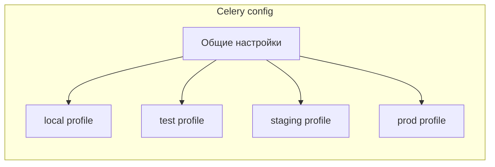

[← Назад к индексу части](index.md)
[↑ К глобальному плану](../../mastery_plan.md)

## 7.3. Конфигурация по средам

### Цель раздела

Научиться **осознанно различать** конфигурацию Celery на разных окружениях (local/test/stage/prod) и делать это так, чтобы:

- поведение на stage **максимально похоже** на prod;
- локальная разработка была удобной;
- тесты были быстрыми, но не «совсем оторванными» от реальности.

### В этом разделе главное

- Разные среды — это не только разные URL‑ы, но и **разные бюджеты риска и стоимости**.
- Dev‑настройки (например, без аутентификации к Redis) **не должны утекать на prod**.
- Prod‑настройки (например, высокие ретраи, тяжёлые мониторинги) **не всегда полезны** локально.

### Термины

| Термин | Кратко |
| --- | --- |
| **local dev** | Окружение разработчика: удобство и скорость важнее всего. |
| **test env** | CI/автотесты: предсказуемость и изоляция. |
| **staging** | Среда, максимально близкая к prod, но без боевых данных. |
| **production** | Боевая среда: SLA, стоимость, безопасность. |

### Теория и правила

**Принцип:** конфигурация должна быть **явно привязана к окружению**, а не зависеть от случайного набора переменных на сервере.

Подход:

- Вводим **`CELERY_ENV`** (`local`, `test`, `staging`, `prod`).
- В модуле конфигурации **по значению `CELERY_ENV`** выбираем профиль настроек.
- Общие параметры задаём единообразно, меняем только то, что действительно должно отличаться.

```python
ENV = os.getenv("CELERY_ENV", "local")

if ENV == "local":
    from .profiles.local import *  # noqa
elif ENV == "test":
    from .profiles.test import *  # noqa
elif ENV == "staging":
    from .profiles.staging import *  # noqa
elif ENV == "prod":
    from .profiles.prod import *  # noqa
else:
    raise RuntimeError(f"Unknown CELERY_ENV={ENV}")
```

### Пошагово

1. Определи **перечень окружений**, которые реально используются в проекте.
2. Для каждого окружения зафиксируй:
   - broker/backend;
   - topology очередей;
   - важные лимиты (`prefetch`, `concurrency`, `result_expires`);
   - режимы логирования/мониторинга.
3. Вынеси различия в отдельные профили (`profiles/local.py`, `profiles/prod.py` и т.п.).
4. Обеспечь, чтобы **stage и prod** были максимально близки по конфигурации (разница только в URL‑ах и секретах).

### Простыми словами

Среда — это как **разные трассы для одной и той же машины**:

- локально ты ездишь по двору (можно не пристёгиваться, но всё ломкое сразу видно);
- на тестовом полигоне ты проверяешь управление и тормоза;
- на трассе (prod) действуют **другие правила** и другие скорости.

Конфигурация должна **учитывать, где ты едешь**.

### Картинка в голове



### Как запомнить

> **«Окружение — это профиль поведения Celery»**.  
> Не только URL‑ы, но и лимиты, мониторинг, topology.

### Примеры

#### Чем может отличаться local от prod

- Local:
  - брокер и backend — локальный Redis/Docker;
  - `task_always_eager=True` для части тестов;
  - `result_expires` маленький;
  - меньше worker‑ов, меньше concurrency.
- Prod:
  - управляемый брокер (RabbitMQ cluster, managed Redis/SQS);
  - полный мониторинг;
  - ack/retry‑политики настроены строго под SLA.

#### Таблица: что обычно отличается по средам

| Параметр | Local | Test/CI | Staging | Prod |
| --- | --- | --- | --- | --- |
| `broker_url` / `result_backend` | Локальный Redis/Docker | Тестовый брокер/БД, изолированные от dev | Такие же типы, как в prod, но другие инстансы | Боевые managed сервисы |
| `task_always_eager` | Иногда `True` для unit‑тестов | Чаще `True` или спец‑профиль | `False` | `False` |
| `worker_concurrency` | Небольшое | Меньше/равно prod | Близко к prod | Выбрано под capacity |
| Мониторинг/логирование | Минимальный | Минимальный, но структурированный | Почти как в prod | Полный стек observability |
| Очереди и маршруты | Упрощённые, без приоритетов | Упрощённые | Как в prod (префиксы `stg-`) | Боевое topology |

#### Проверь себя: таблица различий окружений (7.3)

1. Почему staging должен быть «почти как prod», а не «как dev, только на сервере»?

<details><summary>Ответ</summary>

Потому что staging нужен для проверки поведения под «боевой» конфигурацией: очереди, маршруты, ограничения, мониторинг. Если staging похож на dev, то самые опасные проблемы всплывут только в проде.

</details>

2. В каких случаях `task_always_eager=True` в тестах может дать ложную уверенность?

<details><summary>Ответ</summary>

Когда тесты должны проверять распределённые свойства: сериализацию, маршрутизацию, поведение при падении worker, ack‑семантику. Eager‑режим обходит брокер и часть инфраструктурной реальности.

</details>

3. Почему topology очередей в prod обычно нельзя «упростить как в local», даже если задач пока немного?

<details><summary>Ответ</summary>

Потому что topology — это архитектурная подготовка к росту: изоляция доменов, разные SLA, возможность выделять worker‑пулы. Если начать с «одной очереди навсегда», миграция станет больной.

</details>
### Практика / реальные сценарии

- В CI часто включают **eager‑режим** (`task_always_eager=True`) для юнит‑тестов, но для интеграционных тестов разворачивают **реальный брокер**. Конфигурация должна поддерживать оба подхода через разные профили.
- В staging нередко используют **те же очереди**, что и в prod, но с другими префиксами (`stg-...`), чтобы можно было тестировать topology без риска для боевых задач.

### Типичные ошибки

- **Разные версии Celery** и разные конфигурации на stage и prod, из‑за чего баги воспроизводятся только в бою.
- Отсутствие отдельного профиля для тестов: тесты «случайно зависят» от локальной Redis‑установки разработчика.
- Использование боевого брокера и очередей из dev‑окружения (попадание тестовых задач в боевую систему).

### Что будет, если…

- …запускать локально с `CELERY_ENV=prod`?
  - Ты начнёшь ловить «продовые» режимы (например, тяжёлые ретраи, сложные маршруты), что может быть полезно, но **дорого** и неудобно.
- …в prod оставить конфигурацию из `local`?
  - Потеря мониторинга, неправильные лимиты, отсутствие защиты от дублей/потерь, и всё это **на реальных данных**.

### Проверь себя

1. Почему `CELERY_ENV` полезен даже в маленьком проекте?

<details><summary>Ответ</summary>

Даже в маленьком проекте есть минимум два режима: локальная разработка и прод. `CELERY_ENV` формализует разницу и помогает не «забыть» поменять параметры при выкладке.

</details>

2. Как проверить, что staging действительно близок к prod?

<details><summary>Ответ</summary>

Сравнить конфигурацию профилей (`staging` и `prod`) в коде или сгенерировать «дампы конфигурации» и убедиться, что различаются только **URL‑ы, секреты и, возможно, уровни логирования**.

</details>

3. Почему использовать боевой broker из dev‑окружения опасно, даже если у задач другой `queue`‑префикс?

<details><summary>Ответ</summary>

Ошибки конфигурации или кода могут привести к попаданию задач не в ту очередь; кроме того, **нагрузка от dev** может влиять на SLA боевого брокера.

</details>

### Запомните

- Среды — это **разные контексты риска и стоимости**, и конфигурация должна это отражать.
- Stage должен быть **похож на prod**, а не на dev.
- Профили конфигурации — инструмент не только SRE, но и разработчика.

---
