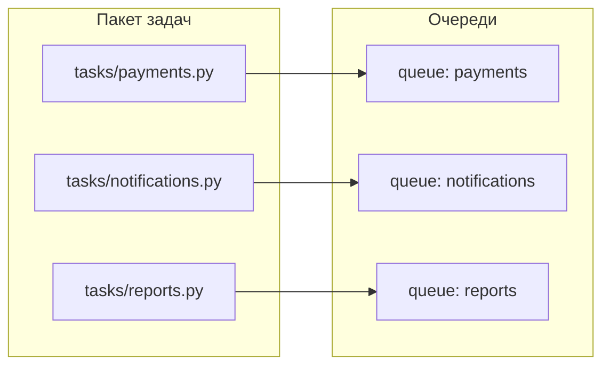

[← Назад к индексу части](index.md)
[↑ К глобальному плану](../mastery_plan.md)

## 7.4. Организация модуля задач

### Цель раздела

Показать, как **структура модулей задач** связана с конфигурацией и архитектурой, и научить избегать `god-module` `tasks.py`, где перемешаны все домены и политики.

### В этом разделе главное

- Задачи должны быть **разложены по доменам**, а не по одному файлу «на все случаи».
- Общие политики (ретраи, логирование, метрики) выносятся в **базовые классы задач**.
- Имена задач и очередей — это **часть контракта** между сервисами.

### Термины

| Термин | Кратко |
| --- | --- |
| **god‑module** | Огромный `tasks.py`, где смешано всё подряд. |
| **base task class** | Базовый класс `Task` с общей логикой (ретраи, логирование). |
| **naming convention** | Соглашение об именовании задач и очередей. |

### Теория и правила

Если все задачи лежат в одном `tasks.py`, со временем:

- теряется понимание доменов;
- сложно настроить разные очереди/пулы;
- каждая задача сама решает, как ей логироваться/ретраиться.

**Хорошая практика**:

- завести **пакет задач** по доменам:
  - `app/tasks/payments.py`;
  - `app/tasks/notifications.py`;
  - `app/tasks/reports.py`.
- определить **общий базовый класс** (`AppTask`) с:
  - унифицированным логированием;
  - метриками;
  - точками расширения (`on_failure`, `on_retry` и т.д.).
- настроить **имена задач** так, чтобы по ним можно было понять домен: `payments.charge`, `notifications.send_email`.
  - задать **политику ретраев на уровне домена** (например, все платежные задачи ретраятся ограниченное число раз с backoff, а отчётные — дольше, но реже);
  - явно **задокументировать контракт задачи**: какие аргументы принимает, какие побочные эффекты создаёт, какие ошибки считаются бизнес‑ошибками.

### Пошагово

1. Разбей текущие задачи на **домены** (платежи, уведомления, отчёты, интеграции).
2. Создай пакет `tasks/` и модули по доменам.
3. Введи базовый класс задач (`AppTask`) и убедись, что все новые задачи наследуют его.
4. Настрой `task_routes` так, чтобы домены попадали в свои очереди.

### Простыми словами

Думай о задачах как о **микросервисах внутри Celery**. Ты не стал бы складывать все эндпоинты разных сервисов в один файл. Так же и здесь: каждый домен — свой модуль, свои очереди, свои политики.

### Картинка в голове



### Как запомнить

> **«Один домен — один модуль задач и одна главная очередь»** (пусть и с вариациями).

### Примеры

```python
# app/tasks/base.py
import logging
from celery import Task


class AppTask(Task):
    autoretry_for = (ConnectionError,)
    retry_backoff = True
    retry_backoff_max = 600
    retry_jitter = True

    def on_failure(self, exc, task_id, args, kwargs, einfo):
        logger = logging.getLogger("celery.task")
        logger.exception(
            "Task failed",
            extra={
                "task_name": getattr(self, "name", None),
                "task_id": task_id,
                "args": args,
                "kwargs": kwargs,
            },
        )
```

```python
# app/tasks/payments.py
from ..celery_app import app
from .base import AppTask


@app.task(
    base=AppTask,
    name="payments.charge",
    queue="payments",
)
def charge(payment_id: str):
    # Здесь — бизнес‑логика: списание, запись в БД, публикация события и т.п.
    # Важно: вход — стабильный сериализуемый идентификатор, а не ORM‑объект.
    return {"payment_id": payment_id, "status": "accepted"}
```

```markdown
<!-- docs/celery_tasks/payments.charge.md -->
