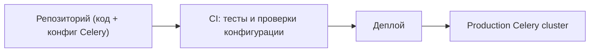

[← Назад к индексу части](index.md)
[↑ К глобальному плану](../mastery_plan.md)

## 7.5. Конфигурация как часть архитектуры

### Цель раздела

Показать, как конфигурация Celery входит в **общий инженерный контур**: infrastructure‑as‑code, версионирование, фичефлаги, проверки совместимости при деплое.

### В этом разделе главное

- Конфигурация Celery должна быть **описана в коде/манифестах**, а не храниться в устных договорённостях.
- Изменения конфигурации — это **миграции**, их нужно планировать, тестировать и документировать.
- Feature flags позволяют **поэтапно вводить новые очереди, маршруты и политики**, а не переключать всё «рубильником».

### Термины

| Термин | Кратко |
| --- | --- |
| **IaC** | Описание инфраструктуры (очередей, пользователей, мониторинга) в коде/манифестах. |
| **feature flag** | Флаг включения/выключения конкретной функции или конфигурации. |
| **config migration** | Последовательное изменение конфигурации с понятным планом отката. |

### Теория и правила

**Infrastructure‑as‑code** для Celery включает:

- описание очередей и обменников (для RabbitMQ) в коде/скриптах;
- настройку пользователей/прав доступа;
- описание dashboards/alert‑ов в конфигурации мониторинга;
- хранение всего этого в VCS.

Конфигурация Celery в коде должна быть:

- **версионируемой** (commit‑ы с понятными сообщениями);
- **проверяемой** (lint/тесты конфигурации);
- **привязанной к релизам** (мы знаем, на какой версии кода какая конфигурация действовала).

### Пошагово

1. Вынеси конфигурацию Celery в отдельный модуль/пакет (если ещё не сделал).
2. Оформи **простые проверки**:
   - что все значения `broker_url`, `result_backend` валидны;
   - что `task_routes` указывают на существующие задачи/очереди.
3. Добавь в CI шаг, который **инициализирует Celery с конфигурацией** и проверяет, что он стартует.
4. Для крупных изменений (новые очереди, новые broker‑ы) **опиши миграционный план**:
   - как включаем;
   - как откатываем;
   - какие риски.

### Простыми словами

Относись к конфигурации Celery как к **схеме базы данных**: её тоже надо мигрировать, проверять и документировать, а не менять «на лету» на проде.

### Картинка в голове



### Как запомнить

> **«Конфигурация — это код, а не комментарий к коду»**.

### Примеры

#### Пример проверки конфигурации в тесте

```python
def test_celery_config_is_valid():
    from app.celery_app import app

    # Например, убедиться, что все маршруты ведут к существующим очередям
    queues = {q.name for q in app.conf.task_queues}
    for pattern, route in app.conf.task_routes.items():
        queue = route.get("queue")
        assert queue in queues, f"Route for {pattern} points to unknown queue {queue}"
```

#### Проверь себя: проверки конфигурации (7.5)

1. Почему проверка «маршрут указывает на существующую очередь» — это именно защита от production‑инцидентов?

<details><summary>Ответ</summary>

Потому что ошибка в `task_routes` не всегда проявляется сразу как падение: задачи могут «утекать» в default или не обрабатываться нужным worker‑ом. Проверка ловит это до деплоя, когда исправление дешевле.

</details>

2. Что ещё стоит проверять в конфигурации, кроме существования очередей?

<details><summary>Ответ</summary>

Например: `accept_content` и сериализаторы, наличие обязательных env‑переменных, корректность `result_expires`, согласованность `timezone/enable_utc`, ограничения `prefetch` и ack‑параметров для критичных доменов.

</details>

3. Почему такие проверки лучше держать в CI, а не как «ручной чеклист перед релизом»?

<details><summary>Ответ</summary>

CI выполняется всегда и одинаково. Ручной чеклист пропускают в спешке, а конфигурационные ошибки обычно всплывают в самый неподходящий момент.

</details>
### Практика / реальные сценарии

- При переходе с Redis на RabbitMQ:
  - описывается **новый транспорт** в конфигурации;
  - добавляются очереди и обменники через IaC;
  - проводится **dual‑write/dual‑read** фаза;
  - все изменения живут в одном PR, где видны изменения кода и конфигурации вместе.

- При вводе новых очередей с помощью feature flag:
  - добавляешь новую очередь и маршруты в конфигурацию, но **по флагу** отправляешь в неё пока только часть low‑risk задач;
  - разворачиваешь отдельный worker, смотришь на метрики (latency, ошибки, нагрузка на брокер);
  - постепенно увеличиваешь долю задач, переключаемых флагом, пока не переведёшь весь нужный домен;
  - после стабилизации убираешь старую очередь и код фичефлага.

### Типичные ошибки

- Править конфигурацию Celery **вручную на серверах**.
- Не документировать изменения, а потом не понимать, почему в одном инциденте поведение было другим.
- Добавлять новые очереди без понятного плана утилизации старых.

### Что будет, если…

- …не версионировать конфигурацию?
  - Ты не сможешь ответить на вопрос «какая конфигурация действовала в момент инцидента».
- …давить все изменения через «горячие правки»?
  - Инциденты станут **непредсказуемыми и плохо воспроизводимыми**.

### Проверь себя

1. Как ты можешь убедиться, что конфигурация Celery совместима с текущей версией брокера?

<details><summary>Ответ</summary>

Запускать Celery с этой конфигурацией в CI/stage, проверять логи и предупреждения, а также сверять поддерживаемые опции транспорта с документацией версии брокера.

</details>

2. Зачем нужны feature flags при вводе новых очередей?

<details><summary>Ответ</summary>

Чтобы включать новые очереди/маршруты **поэтапно**, измерять эффект, уметь быстро выключить их при проблемах и не менять поведение всех задач сразу.

</details>

3. Почему концепция «конфигурация = код» важна именно для Celery?

<details><summary>Ответ</summary>

Потому что Celery — распределённая система: маленькие изменения конфигурации могут иметь **большие последствия** (дубли задач, потери, задержки). Без явного кода и версионирования эти изменения невозможно анализировать.

</details>

### Запомните

- Конфигурация Celery — часть **архитектуры и инфраструктуры**, а не «деталь реализации».
- Любое серьёзное изменение конфигурации — это **миграция**, её нужно проектировать.
- IaC, проверки в CI и feature flags делают изменения безопаснее и прогнозируемее.

---
