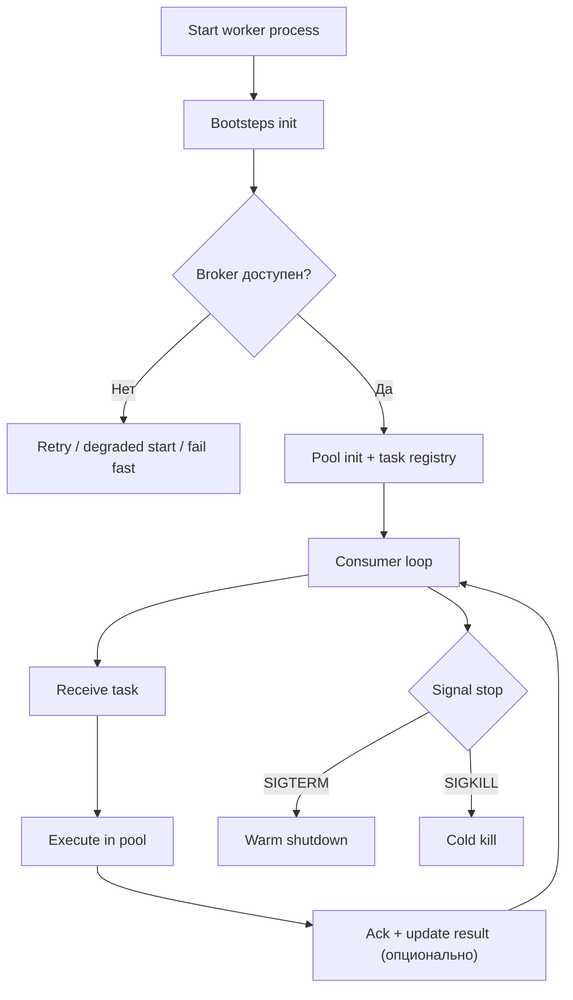
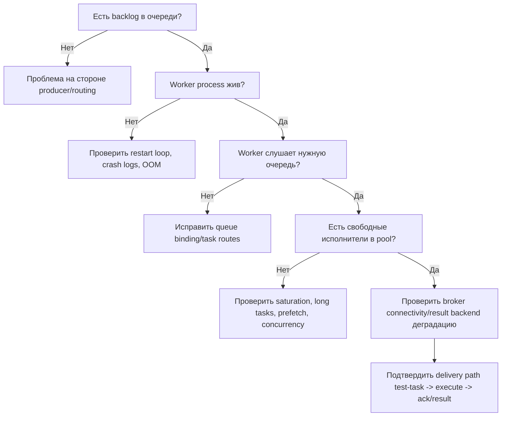

[← Назад к индексу части](index.md)
[↑ К глобальному плану](../celery_mastery_plan.md)

## 8.1. Жизненный цикл worker

### Цель раздела

Понять, что worker - это не "один бесконечный процесс", а система состояний: старт, инициализация, подключение, потребление, остановка. Это нужно, чтобы уверенно диагностировать запуск, деградацию и shutdown.

### В этом разделе главное

- Worker проходит предсказуемые фазы, и в каждой фазе свои риски.
- `SIGTERM` и `SIGKILL` принципиально по-разному влияют на задачи в работе.
- Стабильность старта зависит не только от кода задач, но и от доступности брокера/бэкенда и конфигурации.

### Термины

| Термин | Кратко |
| --- | --- |
| **Bootsteps** | Последовательность внутренних этапов запуска Celery worker. |
| **Mingle/Gossip/Heartbeat** | Служебные механизмы обмена состоянием между worker-ами и мониторингом. |
| **Graceful shutdown** | Корректная остановка с завершением текущих задач. |
| **Warm shutdown** | Мягкий вариант graceful остановки. |
| **Cold shutdown** | Немедленная остановка с прерыванием исполнения. |

### Теория и правила

Упрощенный жизненный цикл worker-а выглядит так:

1. Старт master-процесса worker.
2. Инициализация bootsteps (логирование, конфиг, consumer-компоненты).
3. Подключение к broker.
4. Регистрация задач и подготовка worker-pool.
5. Запуск consumer loop.
6. Получение и исполнение задач.
7. Получение сигнала остановки.
8. Warm или cold shutdown.

Ключевой инженерный момент:  
**ошибка в любой из фаз выглядит по-разному**, и от этого зависит диагностика:

- если проблема до consumer loop, задачи "висят в очереди", worker их не берет;
- если проблема внутри pool, worker берет задачи, но execution нестабилен;
- если проблема при shutdown, получаешь "оборванные" задачи, redelivery и дубли.

#### Что важно про сигналы

- `SIGTERM` обычно трактуется как запрос на корректную остановку.
- `SIGKILL` (`kill -9`) нельзя обработать в Python-коде: процесс умирает немедленно.
- При `SIGKILL` высок риск частично выполненного side effect без финального ack/cleanup.

##### Проверь себя: сигналы

1. Почему одинаковый рестарт worker через `SIGTERM` и `SIGKILL` дает разный бизнес-результат, даже если код задач не менялся?

<details><summary>Ответ</summary>

`SIGTERM` позволяет worker-у завершить текущую работу и закрыть жизненный цикл задачи более предсказуемо. `SIGKILL` обрывает процесс мгновенно, поэтому часть операций может остаться в промежуточном состоянии: side effect начат, ack не отправлен, cleanup не выполнен.

</details>

2. В каком случае `SIGKILL` все же допустим как операционный инструмент?

<details><summary>Ответ</summary>

Как аварийная мера, когда graceful-остановка не срабатывает и есть риск системной деградации (например, зависание процесса). Но после него обязателен post-check на дубли/частичные эффекты.

</details>

#### Mingle, gossip, heartbeat

Эти механизмы помогают cluster-level наблюдаемости и координации, но:

- при нестабильной сети могут давать "шум" в логах;
- на очень больших кластерах требуют аккуратного тюнинга;
- их включенность/выключенность влияет на видимость состояния, но не заменяет бизнес-метрики задач.

Практический ориентир по умолчаниям (проверяй на своей версии Celery):

| Механизм | Что дает | Когда обычно оставляют включенным | Когда иногда отключают |
| --- | --- | --- | --- |
| `heartbeat` | Сигнал "worker жив" для мониторинга/кластера | Почти всегда в production | Крайне редко, если есть особые сетевые ограничения и альтернативная проверка liveness |
| `mingle` | Обмен метаданными при старте worker-а | Стандартный кластерный режим | Иногда при очень больших кластерах и требованиях к быстрому cold start |
| `gossip` | Распространение служебных событий между worker-ами | Когда нужна богатая observability и cluster-awareness | Иногда для снижения служебного шума/нагрузки, если это осознанный компромисс |

Важно: отключая служебные механизмы, ты почти всегда платишь снижением диагностируемости.

##### Проверь себя: mingle/gossip/heartbeat

1. Почему heartbeat чаще оставляют включенным почти в любых production-сценариях?

<details><summary>Ответ</summary>

Потому что это базовый сигнал "worker жив", на котором строятся мониторинг и алертинг. Без heartbeat резко падает качество диагностики и скорость обнаружения деградации.

</details>

2. Какой тип компромисса обычно принимается при отключении gossip/mingle?

<details><summary>Ответ</summary>

Команда снижает служебный шум/нагрузку, но теряет часть кластерной наблюдаемости и удобства диагностики. Это допустимо только при явном понимании потерь и наличии альтернативных метрик.

</details>

#### Старт без доступного broker/result backend

Это частый реальный сценарий в production (деплой, сетевой инцидент, DNS-проблема, ротация секретов):

- worker может уйти в цикл reconnect и формально быть "живым", но не приносить полезной работы;
- при недоступном result backend часть сценариев оркестрации и мониторинга будет деградировать, даже если задачи исполняются;
- без явной политики команда спорит во время инцидента: "держать процесс живым и ждать" или "падать быстро".

Практические режимы:

1. **Fail fast**  
   Worker завершается, оркестратор перезапускает. Подходит, когда важна быстрая явная сигнализация о проблеме.
2. **Retry/degraded mode**  
   Worker остается в процессе reconnect. Подходит, когда ожидаются краткие сетевые сбои и важно избежать churn запуска.

Выбор делай заранее, не в момент аварии. Зафиксируй его в runbook.

##### Проверь себя: старт при недоступном broker/backend

1. Почему решение "fail fast vs retry/degraded" нужно принимать до инцидента?

<details><summary>Ответ</summary>

Во время инцидента команда действует под давлением времени и может принять непоследовательные решения. Предварительный runbook снижает хаос и делает поведение системы предсказуемым.

</details>

2. Что важнее проверить в деградированном режиме reconnect: факт жизни процесса или факт полезной обработки?

<details><summary>Ответ</summary>

Факт полезной обработки. Процесс может быть живым, но не выполнять задач из-за отсутствия доступа к broker/backend.

</details>

#### `pool_restart` и повторная инициализация зависимостей

`pool_restart` используют как операционный механизм "перезагрузки исполнительного пула" без полного перезапуска всего worker-процесса (доступность и детали зависят от версии и pool-модели).

Зачем это нужно на практике:

- безопасно переинициализировать проблемные клиентские объекты после изменений окружения;
- восстановить корректное состояние зависимостей после деградации в child-процессах;
- сократить время обслуживания по сравнению с полным stop/start, когда это допустимо.

Важно:

- `pool_restart` не заменяет полноценный deployment process;
- перед использованием проверь поддержку в своей версии Celery и конкретном pool;
- после рестарта пула обязательно проверяй метрики ошибок, latency и memory profile.

##### Проверь себя: pool_restart

1. Когда `pool_restart` уместен, а когда лучше полный stop/start worker-кластера?

<details><summary>Ответ</summary>

`pool_restart` уместен для точечной реинициализации пула при контролируемом сценарии. Полный stop/start нужен при крупных релизных изменениях, где важно гарантированно обновить весь процессный контур.

</details>

2. Почему после `pool_restart` обязательно смотреть не только ошибки, но и latency/memory?

<details><summary>Ответ</summary>

Потому что часть проблем проявляется не мгновенным падением, а постепенной деградацией: ростом задержек, утечками памяти, нестабильным поведением под нагрузкой.

</details>

### Пошагово

Практический маршрут проверки старта worker-а:

1. Проверить доступность broker и credentials.
2. Запустить worker с явным лог-уровнем (`INFO` или `DEBUG` на диагностику).
3. Убедиться, что видны зарегистрированные задачи.
4. Проверить, что worker вошел в состояние готовности к потреблению.
5. Отправить тестовую задачу и проверить полный цикл "получил -> исполнил -> ack/result".
6. Выполнить controlled shutdown (`SIGTERM`) и убедиться, что активные задачи завершаются ожидаемо.
7. Смоделировать недоступность broker/result backend и проверить, что поведение соответствует runbook.
8. При необходимости выполнить controlled `pool_restart` и убедиться, что зависимости инициализировались корректно.

### Простыми словами

Worker можно представить как "цех":

- сначала открыли цех и включили оборудование (bootsteps),
- потом проверили склад и логистику (broker connection),
- затем пустили поток заказов (consumer loop),
- вечером закрыли смену аккуратно или "рубильником".

Если закрыть "рубильником", незавершенные операции часто остаются в странном состоянии.

### Картинка в голове



### Как запомнить

> **"Worker стабилен, если стабилен его жизненный цикл, а не только код задач."**

### Примеры

#### Пример запуска worker с явными параметрами

```bash
celery -A myapp.celery_app worker \
  --loglevel=INFO \
  --hostname=orders@%h \
  --concurrency=8 \
  --queues=orders,orders_priority
```

##### Проверь себя: пример запуска worker

1. Зачем в учебном и production-примере явно указывать `--queues`, а не полагаться на default queue?

<details><summary>Ответ</summary>

Явные очереди делают контракт запуска прозрачным: понятно, какой контур задач обслуживает этот worker. Это уменьшает риск "слушаем не ту очередь" и упрощает диагностику.

</details>

2. Почему явный `hostname` полезен для эксплуатации?

<details><summary>Ответ</summary>

Он помогает различать инстансы в логах и мониторинге, быстрее локализовать проблемный worker и корректно выполнять операционные команды по конкретному узлу.

</details>

#### Пример корректной остановки (systemd/k8s концептуально)

```text
1) Остановить прием нового трафика на pod/instance (readiness false).
2) Отправить SIGTERM worker-процессу.
3) Дождаться завершения активных задач в пределах grace period.
4) Если вышли за лимит - принудительное завершение (как исключение, а не норма).
```

##### Проверь себя: корректная остановка

1. Почему перед `SIGTERM` важно снять readiness/входящий трафик?

<details><summary>Ответ</summary>

Чтобы не принимать новые задачи в момент дренажа и не увеличивать "хвост" незавершенной работы перед остановкой.

</details>

2. Что означает, если worker регулярно не укладывается в grace period?

<details><summary>Ответ</summary>

Это сигнал архитектурной или операционной проблемы: слишком длинные задачи, неудачные таймауты, неверные лимиты ресурсов или отсутствие разделения workload.

</details>

### Практика / реальные сценарии

- **Сценарий:** после деплоя worker стартует, но не берет задачи.  
  **Частая причина:** не совпали имена очередей/роутинг, worker слушает другие очереди.

- **Сценарий:** при рестарте кластера наблюдаются массовые повторы задач.  
  **Частая причина:** shutdown был не graceful, ack-политика + prefetch дали redelivery.

#### Быстрый диагностический flow при инциденте "задачи не исполняются"



##### Проверь себя: диагностический flow

1. Почему первый вопрос в flow — "есть ли backlog", а не "жив ли worker"?

<details><summary>Ответ</summary>

Потому что без backlog проблема может быть на стороне producer/routing, и диагностика worker-а в таком случае вторична.

</details>

2. Что обычно означает ситуация "worker жив, очередь правильная, но исполнителей нет"?

<details><summary>Ответ</summary>

Чаще всего saturation пула, длинные задачи, неудачный prefetch или ресурсные лимиты, из-за которых исполнители заняты и не освобождаются вовремя.

</details>

### Типичные ошибки

- Запускать worker "по умолчанию" без явного `hostname`, `queues`, `loglevel`.
- Игнорировать поведение сигналов и не тестировать shutdown-сценарии.
- Считать, что "если процесс жив, значит контур здоров".

### Что будет, если...

- ...использовать только `kill -9` для рестартов?  
  Получишь непредсказуемые частичные выполнения, redelivery и сложные инциденты.

- ...не проверять стартовые фазы в CI/stage?  
  Ошибки bootsteps/коннектов проявятся уже в production под нагрузкой.

### Проверь себя

1. Почему полезно отдельно диагностировать "worker запущен" и "worker реально потребляет задачи"?

<details><summary>Ответ</summary>

Потому что это разные состояния. Процесс может быть жив, но из-за проблем с broker/очередями/pool не брать или не исполнять задачи. Нужны признаки именно consumer-активности.

</details>

2. Что принципиально меняется между `SIGTERM` и `SIGKILL` для задач в работе?

<details><summary>Ответ</summary>

`SIGTERM` дает шанс корректно завершить активные задачи и сохранить предсказуемость. `SIGKILL` обрывает процесс мгновенно: cleanup и корректный конец задачи не гарантируются.

</details>

3. Зачем отдельно думать о старте без доступного broker/result backend?

<details><summary>Ответ</summary>

Потому что это частый реальный failure mode при деплое и сетевых проблемах. Нужно заранее выбрать стратегию: fail fast или деградация с retry, иначе поведение кластера будет хаотичным.

</details>

### Запомните

- У worker есть наблюдаемый жизненный цикл, и им нужно управлять.
- Graceful shutdown - это часть надежности, а не "операционная косметика".
- Диагностика должна различать фазы: init, consume, execute, stop.

---
