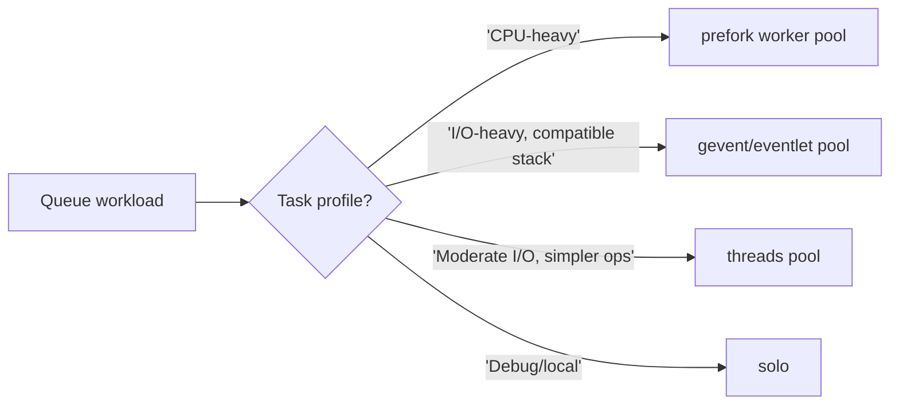

[← Назад к индексу части](index.md)
[↑ К глобальному плану](../../mastery_plan.md)

## 8.2. Concurrency модели

### Цель раздела

Научиться выбирать pool-модель по природе задач и ограничениям платформы, а не по шаблону из чужого проекта.

### В этом разделе главное

- Нет "лучшего pool для всего": выбор зависит от CPU/I/O профиля и библиотек.
- GIL делает `threads` слабым вариантом для CPU-bound Python-кода.
- `gevent/eventlet` полезны для I/O, но требуют дисциплины и проверки совместимости.

### Термины

| Термин | Кратко |
| --- | --- |
| **CPU-bound** | Задачи, где основное время уходит на вычисления CPU. |
| **I/O-bound** | Задачи, где время уходит на ожидание сети/диска/внешних сервисов. |
| **GIL** | Глобальная блокировка интерпретатора CPython, ограничивающая параллелизм потоков для Python-байткода. |
| **Cooperative concurrency** | Конкуренция, где задачи добровольно отдают управление в точках ожидания I/O. |
| **Monkey patching** | Подмена стандартных I/O примитивов для кооперативной модели. |

### Теория и правила

#### `prefork`

- Основной и самый безопасный путь для смешанных и CPU-heavy задач.
- Каждая задача исполняется в отдельном дочернем процессе (изоляция лучше, чем у потоков).
- Выше накладные расходы на процессы и память.

##### Проверь себя: prefork

1. Почему `prefork` часто считается baseline-моделью для production, несмотря на более высокую стоимость процессов?

<details><summary>Ответ</summary>

Он обычно дает более предсказуемую изоляцию исполнения и меньше сюрпризов совместимости, особенно в mixed/CPU-heavy нагрузке.

</details>

2. Какой главный инженерный минус `prefork`, который нужно заранее учитывать?

<details><summary>Ответ</summary>

Повышенные накладные расходы на память и управление процессами, что требует тюнинга лимитов и мониторинга memory profile.

</details>

#### `threads`

- Удобно, когда у тебя mostly I/O и библиотеки хорошо работают в потоках.
- Для CPU-bound Python-кода GIL ограничивает реальный параллелизм.
- Часто проще в эксплуатации, чем gevent/eventlet, но не универсально.

##### Проверь себя: threads

1. Почему `threads` может быть хорошим выбором для части I/O-нагрузок, но слабым для CPU-heavy задач?

<details><summary>Ответ</summary>

Для I/O потоки помогают скрывать ожидания внешних операций, а для CPU Python-код упирается в GIL и не получает полноценного параллелизма на ядрах.

</details>

2. Как понять, что ты ошибочно выбрал `threads` для CPU-домена?

<details><summary>Ответ</summary>

Наблюдается высокий CPU contention при слабом росте throughput и ухудшении latency, несмотря на увеличение concurrency.

</details>

#### `gevent` / `eventlet`

- Эффективны для большого числа I/O-операций с кооперативным планированием.
- Требуют аккуратного monkey patching и проверки библиотек (БД-драйверы, HTTP-клиенты, telemetry SDK).
- Ошибки совместимости могут проявляться нестабильными подвисаниями и "странной" латентностью.

##### Проверь себя: gevent/eventlet

1. Почему высокая "логическая" конкуренция в cooperative-модели не гарантирует реальный выигрыш?

<details><summary>Ответ</summary>

Потому что выигрыш есть только там, где задачи действительно много ждут I/O и корректно отдают управление. CPU-heavy или несовместимые библиотеки ломают ожидаемый эффект.

</details>

2. Какой обязательный этап перед production-rollout gevent/eventlet?

<details><summary>Ответ</summary>

Интеграционные и нагрузочные тесты с реальными зависимостями (БД, HTTP, telemetry), а не только функциональная проверка "задача завершилась".

</details>

#### Подводные камни monkey patching

Когда ты включаешь monkey patching, меняется поведение сетевых/временных примитивов стандартной библиотеки. Это может затронуть:

- таймауты и retry-циклы в HTTP-клиентах;
- поведение connection pool в драйверах БД;
- telemetry SDK (спаны/контексты могут течь между задачами, если библиотека не рассчитана на модель конкуренции).

Мини-чеклист перед выбором `gevent/eventlet`:

1. Проверить официальную совместимость ключевых библиотек.
2. Прогнать интеграционные тесты с реальными таймаутами и retry.
3. Снять профили latency и ошибок под нагрузкой (а не только "функционально работает").
4. Проверить корректность лог-корреляции и trace context.

##### Проверь себя: monkey patching

1. Почему monkey patching особенно опасен для "тихих" ошибок наблюдаемости?

<details><summary>Ответ</summary>

Система может продолжать выполнять бизнес-логику, но ломается перенос контекста логов/трейсов. В итоге инциденты труднее расследовать, хотя "вроде всё работает".

</details>

2. Какой минимальный признак, что patching повлиял на runtime-поведение негативно?

<details><summary>Ответ</summary>

Появление нестабильных таймаутов/зависаний под нагрузкой, которые не воспроизводятся в baseline-пуле.

</details>

#### `solo`

- Один исполнитель, часто полезен для локальной отладки.
- Не production-режим для throughput-нагрузки.

##### Проверь себя: solo

1. Почему `solo` полезен в обучении и отладке, но почти бесполезен для production-throughput?

<details><summary>Ответ</summary>

Он дает простую и прозрачную модель исполнения, но выполняет задачи последовательно и не обеспечивает масштабируемый параллелизм.

</details>

2. Какой тип проблем проще локализовать в `solo`?

<details><summary>Ответ</summary>

Логические ошибки самой задачи и детерминированные баги без влияния сложной конкуренции.

</details>

#### Базовое правило выбора

1. Если есть CPU-heavy задачи - смотри в сторону `prefork`.
2. Если доминирует I/O и все библиотеки совместимы - можно рассматривать `gevent/eventlet`.
3. Если нужна простота и умеренный I/O - `threads` иногда практичнее.
4. Для mixed workload лучше разделять worker-ы и pool-режимы по очередям.

##### Проверь себя: правило выбора pool

1. Почему правило выбора pool начинается с профиля задач, а не с личных предпочтений команды?

<details><summary>Ответ</summary>

Потому что физика workload (CPU/I/O, длительность, SLA) определяет эффективность модели исполнения. Предпочтения без профиля ведут к случайному тюнингу.

</details>

2. Какой самый частый анти-паттерн при mixed workload?

<details><summary>Ответ</summary>

Попытка найти "один идеальный pool" вместо разделения очередей и специализированных worker-контуров.

</details>

#### Мини-матрица совместимости pool-моделей с типами библиотек

Это не "абсолютная истина", а безопасная стартовая карта для проверки:

| Тип зависимостей | `prefork` | `threads` | `gevent/eventlet` |
| --- | --- | --- | --- |
| Классические ORM/DB-драйверы | обычно безопасно при корректном fork lifecycle | часто работает, но упирается в GIL/locking-паттерны | требует тщательной проверки и нередко дополнительной настройки |
| HTTP-клиенты с таймаутами/retry | обычно предсказуемо | обычно предсказуемо | проверять после monkey patching и под нагрузкой |
| Telemetry/Tracing SDK | обычно предсказуемо при корректной инициализации | в целом предсказуемо, но следить за контекстом | высокий риск контекстных артефактов без специальных проверок |

Принцип: сначала совместимость и нагрузочный профиль, потом масштабирование.

##### Проверь себя: матрица совместимости

1. Почему даже "обычно безопасная" строка в матрице не отменяет нагрузочных тестов?

<details><summary>Ответ</summary>

Потому что матрица дает ориентир, а реальное поведение зависит от конкретных версий библиотек, паттернов кода и окружения.

</details>

2. Какой риск у попытки масштабировать пул до проверки совместимости?

<details><summary>Ответ</summary>

Ты масштабируешь потенциально некорректную модель и получаешь больше нестабильности вместо большего throughput.

</details>

### Пошагово

Как выбрать pool в проекте:

1. Классифицируй задачи на CPU-heavy, I/O-heavy, latency-sensitive, long-running.
2. Проверь библиотеки на совместимость с выбранной моделью.
3. Запусти нагрузочный тест на representative трафике.
4. Сравни не только throughput, но и p95/p99 latency, ошибки, потребление памяти.
5. Зафиксируй выбор в runbook: где какой pool и почему.

### Простыми словами

Pool - это "тип бригады", которой ты выдаешь работу:

- `prefork` - много отдельных мастеров со своими столами;
- `threads` - одна мастерская, много потоков внутри;
- `gevent/eventlet` - очень быстрые "диспетчеры ожиданий", если все работают по правилам.

### Картинка в голове



### Как запомнить

> **"Pool выбирается не по вкусу команды, а по физике нагрузки."**

### Примеры

#### Пример 1: CPU-ориентированный worker

```bash
celery -A myapp.celery_app worker \
  --queues=pdf_render,video_transcode \
  --pool=prefork \
  --concurrency=6
```

##### Проверь себя: CPU-пример

1. Почему в CPU-примере важно, что задачи вынесены в отдельные очереди?

<details><summary>Ответ</summary>

Это изолирует CPU-heavy workload от других доменов и позволяет отдельно тюнить процессы, не ухудшая SLA соседних задач.

</details>

2. Что будет первым кандидатом на пересмотр, если CPU-очередь растет быстрее обработки?

<details><summary>Ответ</summary>

Комбинация concurrency/масштабирования worker-кластера и гранулярность задач, а не только "добавить один флаг".

</details>

#### Пример 2: I/O-ориентированный worker (после проверки совместимости)

```bash
celery -A myapp.celery_app worker \
  --queues=webhooks,notifications \
  --pool=gevent \
  --concurrency=200
```

##### Проверь себя: I/O-пример

1. Почему формулировка "после проверки совместимости" здесь критична, а не декоративна?

<details><summary>Ответ</summary>

Потому что при несовместимом стеке высокий concurrency в cooperative-модели может дать нестабильность и деградацию вместо ускорения.

</details>

2. Какой метрикой нужно подтвердить, что этот пример реально лучше baseline?

<details><summary>Ответ</summary>

Минимум p95/p99 latency и error rate под рабочей нагрузкой, а не только число задач в минуту.

</details>

### Практика / реальные сценарии

- **Сценарий:** одна команда держала все на `prefork`, но 90% задач были короткими HTTP-вызовами.  
  После выделения отдельного I/O worker-а (cooperative pool) уменьшили latency хвостов и снизили стоимость.

- **Сценарий:** попытались перевести все на `gevent`, не проверив библиотеку БД.  
  Итог - нестабильные таймауты и "залипшие" соединения, откат к `prefork` + разделение workload.

### Типичные ошибки

- Выбирать `gevent/eventlet` только ради "большого `concurrency`" без тестов совместимости.
- Пытаться лечить CPU-bound задачи потоками.
- Держать mixed workload в одном pool-режиме.

### Что будет, если...

- ...CPU-heavy задачи запускать в pool, где нет реального параллелизма CPU?  
  Throughput вырастет слабо, а latency и contention ухудшатся.

- ...не учитывать совместимость библиотек с cooperative model?  
  Получишь трудноуловимые подвисания и деградацию под пиками нагрузки.

### Проверь себя

1. Почему высокий `concurrency` в `gevent` не означает автоматический выигрыш для любых задач?

<details><summary>Ответ</summary>

Потому что это модель для I/O и кооперативных точек ожидания. Если задача CPU-heavy или библиотека не отдает управление корректно, реальная выгода исчезает, а сложность растет.

</details>

2. Как связан GIL и выбор между `threads` и `prefork`?

<details><summary>Ответ</summary>

GIL ограничивает параллельное выполнение Python-байткода в потоках, поэтому для CPU-bound задач чаще нужен `prefork` (процессы), чтобы использовать ядра CPU эффективнее.

</details>

3. Почему разделение workload по очередям часто важнее "идеального выбора одного pool"?

<details><summary>Ответ</summary>

Потому что в реальной системе workload неоднороден. Разделив очереди, можно подобрать отдельный pool и тюнинг под каждый класс задач, снизив взаимное влияние и инциденты.

</details>

4. Почему перед миграцией на `gevent/eventlet` обязательно проверять telemetry/лог-контекст, а не только бизнес-результат?

<details><summary>Ответ</summary>

Потому что система может "работать функционально", но потерять наблюдаемость: ломается корреляция логов, контекст трассировки течет между задачами, затрудняется диагностика инцидентов.

</details>

### Запомните

- Выбор pool - это инженерная гипотеза, которую нужно проверять на нагрузке.
- CPU и I/O требуют разных стратегий исполнения.
- Универсальный worker-пул почти всегда уступает специализированным.

---
