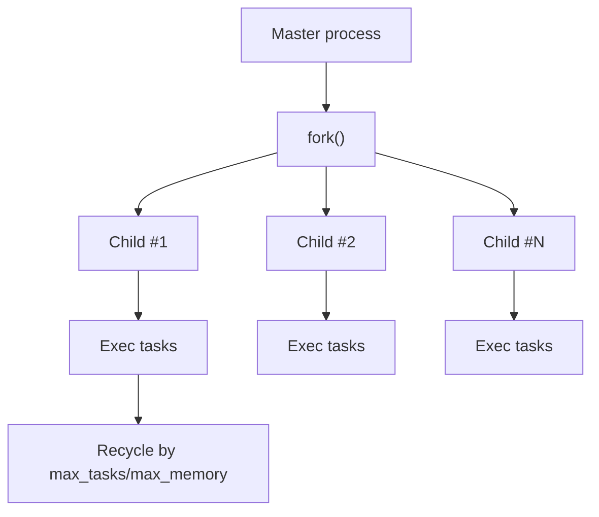

[← Назад к индексу части](index.md)
[↑ К глобальному плану](../mastery_plan.md)

## 8.3. Prefork подробно

### Цель раздела

Понять внутреннюю механику prefork, чтобы безопасно работать с памятью, соединениями и жизненным циклом child-процессов.

### В этом разделе главное

- Fork наследует состояние процесса, и это полезно, и опасно одновременно.
- Открытые соединения после fork часто нужно переинициализировать в child.
- `max_tasks_per_child` и `max_memory_per_child` - практический инструмент стабилизации.

### Термины

| Термин | Кратко |
| --- | --- |
| **Master process** | Родительский процесс worker-а, управляющий child-процессами. |
| **Child process** | Дочерний процесс, исполняющий задачи. |
| **Fork semantics** | Правила копирования состояния процесса при создании child. |
| **Copy-on-write** | Экономия памяти: страницы разделяются, пока не модифицируются. |
| **Memory fragmentation** | Накопление фрагментированной памяти, увеличивающее footprint процесса. |

### Теория и правила

#### Почему prefork популярен

- Хорошо изолирует выполнение задач.
- Меньше сюрпризов совместимости по сравнению с green-thread моделями.
- Проще reasoning для CPU-bound задач.

##### Проверь себя: почему prefork популярен

1. Какая из причин популярности prefork важнее всего для production-рисков: скорость или предсказуемость?

<details><summary>Ответ</summary>

Обычно предсказуемость. Даже если в отдельных сценариях скорость не максимальна, стабильная и понятная модель исполнения снижает цену инцидентов.

</details>

2. Почему "проще reasoning" считается инженерным преимуществом?

<details><summary>Ответ</summary>

Потому что упрощает диагностику, тюнинг и эксплуатационные решения: команда быстрее понимает причинно-следственные связи при сбоях.

</details>

#### Где тонкие места

1. **Fork и соединения**  
   Если master открыл соединение к БД или внешнему сервису, child может унаследовать его в некорректном состоянии.  
   Практическое правило: критичные клиенты и коннекты инициализируй в child-контексте.

2. **Copy-on-write и импорт модулей**  
   Импорт тяжелых модулей до fork иногда экономит память (shared страницы), но при модификации объектов выгода снижается.

3. **Утечки/фрагментация памяти**  
   Даже без явной утечки процесс может "толстеть" из-за фрагментации или сторонних библиотек.  
   Поэтому child recycling - не костыль, а нормальная production-практика.

4. **Telemetry и hooks**  
   Клиенты логирования/трейсинга/метрик тоже нужно проверять на fork-safety.

##### Проверь себя: тонкие места prefork

1. Почему проблема "соединение унаследовано после fork" часто проявляется только под нагрузкой?

<details><summary>Ответ</summary>

Под нагрузкой возрастает конкуренция за соединения и частота операций, поэтому скрытые race/состояния клиента проявляются значительно чаще, чем в локальной проверке.

</details>

2. Какой практический сигнал подсказывает, что пора усиливать child recycling?

<details><summary>Ответ</summary>

Стабильный рост memory footprint и деградация worker-ов во времени без явного изменения нагрузки.

</details>

### Пошагово

Маршрут hardening для prefork worker-а:

1. Определи, какие клиенты/соединения создаются на импорте.
2. Перенеси инициализацию небезопасных ресурсов в жизненный цикл child.
3. Задай `max_tasks_per_child` как защиту от memory drift.
4. При необходимости добавь `max_memory_per_child`.
5. Проведи soak-тест (длительный прогон) и сравни memory profile.

### Простыми словами

Prefork похож на "ксерокопию мастерской":

- ты копируешь мастерскую (process state),
- но не все инструменты после копии работают одинаково надежно,
- и со временем каждая копия накапливает "мусор", поэтому ее полезно периодически заменять.

### Картинка в голове



### Как запомнить

> **"Fork копирует состояние, но не гарантирует корректность всех унаследованных ресурсов."**

### Примеры

#### Пример базового тюнинга child recycling

```python
app.conf.update(
    worker_max_tasks_per_child=1000,
    worker_max_memory_per_child=512000,  # пример в KB; сверяй с версией Celery
)
```

##### Проверь себя: пример recycling

1. Почему эти значения нельзя копировать "как есть" между проектами?

<details><summary>Ответ</summary>

Потому что оптимальные лимиты зависят от профиля задач, размеров payload, библиотек и инфраструктурных ограничений конкретного проекта.

</details>

2. Что важнее при подборе лимитов: минимальный расход памяти или стабильный throughput без OOM?

<details><summary>Ответ</summary>

Практически важнее стабильный throughput без OOM/деградации. Слишком агрессивная экономия памяти может убить производительность постоянным churn процессов.

</details>

#### Пример архитектурного правила

```text
Никогда не считать "подключение к БД, созданное до fork" автоматически безопасным для child.
Для конкретного драйвера/ORM всегда проверять рекомендацию по fork и реинициализации.
```

##### Проверь себя: архитектурное правило

1. Почему правило про re-init после fork относится к архитектуре, а не к "мелкой технике"?

<details><summary>Ответ</summary>

Оно определяет надежность целого домена задач в production: ошибка в этом месте влияет на весь контур доступа к данным и внешним сервисам.

</details>

2. Какое минимальное подтверждение, что правило реально соблюдается?

<details><summary>Ответ</summary>

Тест/процедура, где после перезапуска child-процессов задачи стабильно проходят без аномалий соединений под нагрузкой.

</details>

### Практика / реальные сценарии

- **Сценарий:** worker через 2-3 дня потребляет в 2-3 раза больше RAM.  
  Решение: ввести recycling child-процессов, затем локализовать источник memory growth.

- **Сценарий:** после релиза начали появляться ошибки соединения к БД только под нагрузкой.  
  Причина: клиент создавался до fork; исправили инициализацию в child-контексте.

### Типичные ошибки

- Инициализировать тяжелые и небезопасные ресурсы глобально "на импорт".
- Отключать recycling "ради производительности", не проверив долгоживущий профиль памяти.
- Считать, что раз код проходит локально, значит fork-safe в production.

### Что будет, если...

- ...игнорировать fork safety?  
  Рандомные ошибки соединений, дублирующиеся клиенты, нестабильное поведение при пиках.

- ...не контролировать memory drift в child?  
  OOM, убийства процессов платформой и волны redelivery задач.

### Проверь себя

1. Почему `max_tasks_per_child` часто полезен даже при "идеальном" коде задачи?

<details><summary>Ответ</summary>

Потому что memory growth может идти из зависимостей, аллокатора, фрагментации или побочных библиотек. Recycling ограничивает накопление проблем во времени.

</details>

2. В чем риск "наследованного" подключения к внешним сервисам после fork?

<details><summary>Ответ</summary>

Дескрипторы и внутреннее состояние клиента могли копироваться некорректно для независимого child-процесса. Это приводит к нестабильным ошибкам и гонкам.

</details>

3. Почему prefork не отменяет необходимость observability?

<details><summary>Ответ</summary>

Потому что prefork только модель исполнения. Без метрик/логов/алертов ты не увидишь утечки памяти, saturation, redelivery и деградацию latency до инцидента.

</details>

### Запомните

- Prefork надежен, если ты учитываешь fork-семантику явно.
- Child recycling - стандартный инструмент production-устойчивости.
- Память и соединения нужно проверять в долгом прогоне, не только в коротком тесте.

---
