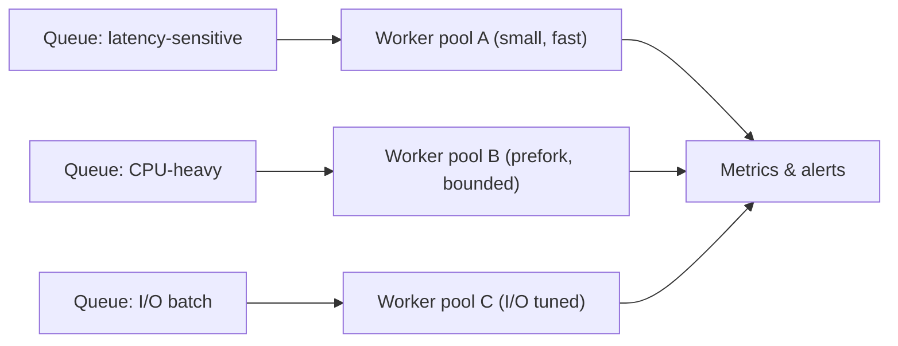

[← Назад к индексу части](index.md)
[↑ К глобальному плану](../../mastery_plan.md)

## 8.4. Управление ресурсами worker

### Цель раздела

Научиться управлять вычислительными и инфраструктурными ресурсами worker-а так, чтобы система была предсказуемой по latency, throughput и стоимости.

### В этом разделе главное

- `--concurrency` - только один рычаг, а не универсальный ответ.
- Ограничения child-процессов защищают от деградации долгоживущих worker-ов.
- Смешивать разнотипные очереди в одном пуле без изоляции - частый путь к нестабильности.

### Термины

| Термин | Кратко |
| --- | --- |
| **Concurrency** | Максимальное число одновременно исполняемых задач в worker-е. |
| **Autoscale** | Динамическое изменение числа child-исполнителей в заданном диапазоне. |
| **CPU saturation** | Состояние, когда CPU почти постоянно загружен до предела. |
| **I/O wait** | Время, когда процесс ждет внешние операции и не исполняет полезные вычисления CPU. |
| **Fair scheduling** | Справедливое распределение ресурсов между задачами, чтобы тяжелые не "съедали" все. |

### Теория и правила

#### О чем реально говорит `--concurrency`

- В `prefork` это число child-процессов.
- В thread/greenlet моделях это "логическая" конкуренция другого типа.
- "Больше" не всегда "лучше": рост `concurrency` повышает давление на CPU, RAM, DB/API.

##### Проверь себя: смысл concurrency

1. Почему одинаковое значение `--concurrency` в разных pool-моделях нельзя сравнивать напрямую?

<details><summary>Ответ</summary>

Потому что единица конкуренции разная: процессы, потоки, greenlet-ы. Реальное давление на CPU и внешние зависимости будет различаться.

</details>

2. Какой первый риск от бездумного увеличения concurrency?

<details><summary>Ответ</summary>

Перегрузка внешних зависимостей и рост ошибок/ретраев, который может уничтожить фактическую полезную производительность.

</details>

#### `max_tasks_per_child` и `max_memory_per_child`

- Вводятся как защитные стабилизаторы.
- Подбираются по наблюдаемому профилю задач и памяти.
- Слишком агрессивные значения увеличивают churn процессов и могут просадить throughput.

#### Autoscale

- Полезен для переменной нагрузки.
- Требует аккуратного выбора min/max и проверки, как быстро система "разгоняется" и "схлопывается".
- Без ограничения внешних ресурсов (БД/API) autoscale может превратиться в "ускоритель аварий".

##### Проверь себя: autoscale

1. Почему autoscale без лимитов downstream-сервисов опаснее, чем фиксированный консервативный размер пула?

<details><summary>Ответ</summary>

Потому что динамический рост исполнителей может лавинообразно увеличить внешнюю нагрузку и запустить каскад ошибок, вместо контролируемой деградации.

</details>

2. Как понять, что autoscale настроен "слишком агрессивно"?

<details><summary>Ответ</summary>

Резкие колебания числа исполнителей, скачки latency/error rate и отсутствие стабильного плато производительности.

</details>

#### Queue mix и изоляция

Если в одной очереди смешаны:

- долгие CPU-heavy задачи;
- короткие latency-sensitive задачи;
- массовые I/O batch-задачи,

то почти гарантированно появится starvation части workload-а.  
Практика production: разделение очередей + отдельные worker-пулы.

##### Проверь себя: queue mix

1. Почему starvation возникает даже при большом общем числе worker-ов?

<details><summary>Ответ</summary>

Потому что проблема в структуре конкуренции задач, а не только в количестве исполнителей: длинные задачи занимают ресурсы и вытесняют короткие.

</details>

2. Какой признак в метриках чаще указывает на неправильный mix очередей?

<details><summary>Ответ</summary>

Рост start delay у latency-sensitive задач при нормальном среднем throughput по всему кластеру.

</details>

#### Fair scheduling на практике

Fair scheduling в контексте Celery - это не один "волшебный флаг", а комбинация решений:

- ограниченный и осознанный prefetch;
- разделение длинных и коротких задач по очередям;
- отдельные worker-пулы под разные SLA;
- ограничение конкуренции к узким внешним ресурсам (БД/API).

Если одна очередь содержит и очень долгие, и очень короткие задачи, "справедливости" почти не будет независимо от числа worker-ов.

#### Ограничение числа соединений к DB/API на worker/pool

Это критично для production, потому что внешний ресурс часто становится bottleneck раньше CPU.

Простая инженерная формула:

```text
максимальные активные операции в контуре
~ число исполнителей * среднее число одновременных внешних вызовов в задаче
```

Если этот максимум больше лимитов БД/API, ты сам генерируешь 429/5xx и ретрай-шторм.

Практические меры:

- задавать лимиты connection pool на уровне клиента;
- ограничивать `concurrency` для queue с "тяжелыми" внешними вызовами;
- разносить такие задачи в отдельные worker-контуры;
- проверять лимиты не только на одном worker-е, а на всем кластере суммарно.

##### Проверь себя: лимиты внешних соединений

1. Почему "локально всё хорошо" не доказывает безопасность лимитов в production?

<details><summary>Ответ</summary>

Локально обычно один worker, а в production эффект суммируется по всему кластеру. Лимит API/БД превышается именно агрегированным параллелизмом.

</details>

2. Что важнее ограничивать первым делом: CPU или внешний API?

<details><summary>Ответ</summary>

То, что является реальным bottleneck в текущем домене. Часто первым ломается внешний API/DB, даже если CPU еще не насыщен.

</details>

#### Tuning prefetch/QoS по типу workload

Ориентир, от которого удобно стартовать:

| Тип workload | Типичная цель | Стартовый профиль prefetch/QoS | Риск, если завысить |
| --- | --- | --- | --- |
| Короткие однотипные задачи | Максимальный throughput | умеренно выше 1, проверка на p95 latency | Локальные очереди в worker, волны redelivery при падении |
| Длинные CPU-heavy | Предсказуемость исполнения | ближе к консервативному значению | Большой in-flight хвост, ухудшение fairness |
| Latency-sensitive | Минимальный start delay | обычно низкий prefetch + отдельная очередь | Задержки старта при "прилипании" задач |
| I/O-batch с внешними лимитами | Контролируемое давление на API/DB | prefetch под реальный лимит downstream | 429/5xx, retry storm, каскадная деградация |

#### CPU saturation vs I/O wait: как не перепутать диагноз

Это ключевая развилка тюнинга:

| Наблюдение | Что это чаще всего означает | Типичные действия |
| --- | --- | --- |
| CPU близок к 100%, I/O wait низкий | Упираешься в вычисления (CPU-bound) | Разнести CPU-heavy задачи, тюнить `prefork`, профилировать код |
| CPU умеренный, I/O wait высокий | Упираешься во внешние ожидания (API/DB/network) | Ограничить внешний параллелизм, проверить таймауты/retry/pool соединений |
| CPU и I/O wait высокие одновременно | Смешанная деградация или каскадная проблема | Изолировать очереди, тюнить контуры по отдельности, проверять downstream-лимиты |
| CPU низкий, но latency высокая | Проблема в очередях/роутинге/prefetch/fairness | Проверить queue topology, start delay и worker affinity |

Главная мысль: симптом "медленно" один, а причины принципиально разные. Сначала диагноз, потом тюнинг.

##### Проверь себя: CPU vs I/O диагноз

1. Почему рост latency при низком CPU не доказывает, что "ресурсов достаточно"?

<details><summary>Ответ</summary>

Потому что узкое место может быть во внешних ожиданиях (API/DB), маршрутизации или prefetch/fairness, а не в вычислительной мощности.

</details>

2. Какой риск у решения "сразу увеличить concurrency", если I/O wait уже высокий?

<details><summary>Ответ</summary>

Можно резко усилить давление на внешние сервисы и ускорить каскадную деградацию (429/5xx, рост ретраев, увеличение backlog).

</details>

### Пошагово

Чеклист ресурсного тюнинга:

1. Измерь текущий профиль: CPU, RAM, queue depth, task runtime p95/p99.
2. Раздели задачи по классам нагрузки и SLA.
3. Для каждого класса задай отдельные очереди и worker-профили.
4. Подбери `concurrency` и лимиты child на representative нагрузке.
5. Проверь влияние на внешние зависимости (БД, API, cache).
6. Зафиксируй безопасный baseline и операционные границы.
7. Зафиксируй лимиты соединений и "budget" внешних вызовов на кластер.
8. Проверь fairness: отдельные метрики start delay для коротких и длинных задач.

### Простыми словами

Управление worker-ресурсами - это как управление полосами на дороге:

- если пустить все виды транспорта в одну полосу, будут пробки и аварии;
- если разделить потоки и поставить правила, движение становится предсказуемым.

### Картинка в голове



### Как запомнить

> **"Сначала раздели workload, потом тюнь `concurrency`."**

### Примеры

#### Пример запуска специализированных worker-ов

```bash
# latency-sensitive
celery -A myapp worker -Q critical -n critical@%h --pool=prefork --concurrency=4

# CPU-heavy
celery -A myapp worker -Q cpu_heavy -n cpu@%h --pool=prefork --concurrency=8 --max-tasks-per-child=300

# I/O-heavy
celery -A myapp worker -Q io_batch -n io@%h --pool=gevent --concurrency=300
```

#### Пример опции autoscale

```bash
celery -A myapp worker -Q io_batch --pool=prefork --autoscale=20,4
```

##### Проверь себя: пример autoscale

1. Как интерпретировать диапазон `20,4` с точки зрения эксплуатации?

<details><summary>Ответ</summary>

Это верхняя и нижняя границы числа исполнителей: система масштабируется внутри этого диапазона, а не "бесконечно".

</details>

2. Что нужно проверить до включения autoscale в production?

<details><summary>Ответ</summary>

Лимиты downstream-сервисов, скорость реакции autoscale, влияние на latency/error rate и отсутствие oscillation-паттернов.

</details>

#### Пример ограничения внешнего давления (концептуально)

```text
Контур: notifications
- worker concurrency: 10
- среднее внешних HTTP-вызовов в задаче одновременно: 1
- кластер из 6 worker-ов

Потенциальный параллелизм к API: 10 * 1 * 6 = 60 вызовов
Если API-квота = 40, нужно снижать concurrency/масштаб или вводить rate-limit/очередь.
```

##### Проверь себя: внешний параллелизм

1. Почему проверять нужно кластерный параллелизм, а не только один worker?

<details><summary>Ответ</summary>

Потому что квоты и лимиты внешнего API применяются к суммарной нагрузке, а не к одному процессу.

</details>

2. Если расчетный параллелизм выше лимита API, что исправлять первым?

<details><summary>Ответ</summary>

Эффективную конкуренцию (concurrency/масштаб/queue policy), чтобы сразу снизить риск ошибок и ретрай-штормов.

</details>

### Практика / реальные сценарии

- **Сценарий:** после "оптимизации" concurrency вырос в 3 раза, а latency API-очереди стала хуже.  
  Причина: saturation БД и API лимитов, отсутствие разделения queue-потоков.

- **Сценарий:** memory footprint worker-а со временем рос до OOM.  
  Решение: лимит child + отдельный профиль для тяжелых задач + профилирование payload.

### Типичные ошибки

- Тюнить только один параметр и игнорировать системный контекст.
- Использовать autoscale без лимитов на downstream-сервисы.
- Пытаться обслужить все workload-ы одинаковым worker-профилем.

### Что будет, если...

- ...не ограничить конкуренцию к внешнему API?  
  Резкий рост 429/5xx, ретрай-шторм и лавинообразная нагрузка.

- ...задать слишком низкий `max_tasks_per_child`?  
  Слишком частые перезапуски child, лишний overhead и деградация throughput.

### Проверь себя

1. Почему "идеальный" `concurrency` не существует вне конкретного workload-а?

<details><summary>Ответ</summary>

Потому что оптимум зависит от профиля задач, ограничений CPU/RAM, внешних сервисов и SLA. Для разных очередей оптимальные значения отличаются.

</details>

2. Когда autoscale может навредить вместо пользы?

<details><summary>Ответ</summary>

Когда downstream-зависимости (БД/API) не выдерживают рост параллелизма и система начинает генерировать больше ошибок и ретраев, чем полезной работы.

</details>

3. В чем польза queue affinity с точки зрения операционной диагностики?

<details><summary>Ответ</summary>

Она упрощает локализацию проблем: видно, какой тип задач деградирует, и можно тюнить/масштабировать конкретный worker-контур, не трогая весь кластер.

</details>

4. Почему fair scheduling нельзя "включить" одной настройкой?

<details><summary>Ответ</summary>

Потому что fairness формируется совокупностью факторов: queue topology, prefetch, длительность задач, pool-модель и лимиты downstream-сервисов. Один параметр не компенсирует архитектурное смешение workload.

</details>

### Запомните

- Тюнинг worker-а всегда системный: CPU, RAM, queues, downstream, SLA.
- Разделение workload-ов обычно дает больше пользы, чем "магические" флаги.
- Лимиты child-процессов - важная часть устойчивости.

---
