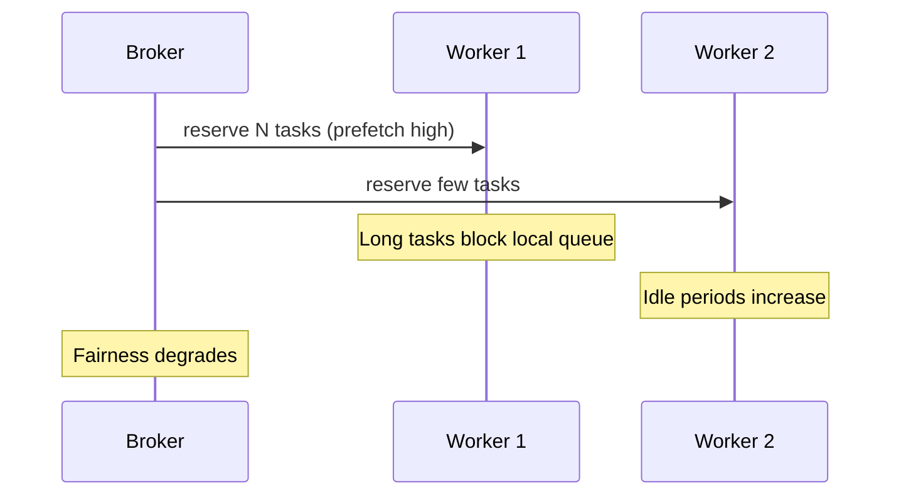

[← Назад к индексу части](index.md)
[↑ К глобальному плану](../celery_mastery_plan.md)

## 8.5. Prefetch и fairness

### Цель раздела

Понять, как `prefetch` (QoS) влияет на latency, throughput и поведение системы при падениях, и научиться выбирать разумный компромисс.

### В этом разделе главное

- Высокий prefetch увеличивает "запас забранных задач" у worker-а.
- Это может повысить throughput, но ухудшить fairness и хвосты latency.
- При падении worker-а prefetch влияет на объем redelivery.

### Термины

| Термин | Кратко |
| --- | --- |
| **QoS** | Механизм ограничения числа задач, резервируемых consumer-ом заранее. |
| **Prefetch multiplier** | Коэффициент, определяющий размер prefetch относительно числа исполнителей. |
| **Fairness** | Насколько равномерно задачи и ресурсы распределяются без "голодания". |
| **Redelivery window** | Объем задач, которые могут быть доставлены повторно при сбое. |

### Теория и правила

Интуиция:

- Низкий prefetch -> worker берет меньше "в запас", быстрее освобождает очередь для других worker-ов.
- Высокий prefetch -> worker "загребает" больше задач, что может быть выгодно для throughput, но рискованно для fairness.

Особенно опасно для mixed workload:

- длинные задачи могут блокировать обработку коротких, если короткие уже "прилипли" к занятым worker-ам;
- latency-sensitive задачи начинают ждать дольше, хотя "в очереди вроде пусто".

#### Компромисс throughput vs responsiveness

- Для коротких однотипных задач высокий prefetch иногда оправдан.
- Для разнообразных и SLA-чувствительных задач prefetch обычно держат более консервативным.

##### Проверь себя: throughput vs responsiveness

1. Почему максимум throughput может быть плохой целью для критичных пользовательских задач?

<details><summary>Ответ</summary>

Потому что бизнесу часто важнее предсказуемая задержка и соблюдение SLA, чем максимальное число обработок в минуту.

</details>

2. Какой компромисс в этом блоке нужно фиксировать явно в runbook?

<details><summary>Ответ</summary>

Допустимый диапазон latency/throughput и условия, при которых команда выбирает "быстрее" или "стабильнее".

</details>

### Пошагово

1. Измерь распределение длительности задач (не только среднее, но p95/p99).
2. Посмотри, как меняются queue latency и task start delay при разных prefetch.
3. Проверь поведение при controlled crash worker-а (объем redelivery).
4. Выбери профиль prefetch отдельно по классам очередей.

### Простыми словами

Prefetch - это "сколько заказов курьер забрал заранее":

- если курьер берет слишком много, другим курьерам достается меньше работы;
- если у курьера авария, все эти заказы возвращаются в систему повторно.

### Картинка в голове



### Как запомнить

> **"Prefetch ускоряет поток, но может испортить справедливость."**

### Примеры

#### Пример конфигурации prefetch

```python
app.conf.update(
    worker_prefetch_multiplier=1,
)
```

#### Пример reasoning

```text
Если у тебя критичные короткие задачи и длинные batch в одном домене,
то сначала раздели очереди, а потом подбирай prefetch отдельно.
```

### Практика / реальные сценарии

- **Сценарий:** "иногда критичные задачи стартуют через минуту, хотя CPU не забит".  
  Выяснилось, что соседний worker с большим prefetch держал длинные задачи локально.

- **Сценарий:** при падении ноды резко выросло число дублей.  
  Причина: большой prefetch + `acks_late`, много задач было "в резерве без ack".

### Типичные ошибки

- Выбирать prefetch по "чувству", без измерений latency и start delay.
- Одинаковый prefetch для всех очередей.
- Считать, что prefetch решит архитектурную проблему смешанного workload.

### Что будет, если...

- ...ставить очень высокий prefetch в latency-critical контуре?  
  Ухудшатся хвосты latency и предсказуемость старта задач.

- ...игнорировать влияние prefetch на аварийные redelivery?  
  При сбоях получишь крупные волны повторной доставки.

### Проверь себя

1. Почему "очередь почти пустая" не всегда означает хорошую responsiveness?

<details><summary>Ответ</summary>

Потому что задачи могут быть уже зарезервированы worker-ами (prefetch), но ждать локально за длинными задачами. На брокере это выглядит "чисто", а фактически старт задерживается.

</details>

2. Как prefetch связан с риском дублей при падении worker-а?

<details><summary>Ответ</summary>

Чем больше задач worker зарезервировал без финального ack, тем больше задач вернется на redelivery при потере процесса/ноды.

</details>

3. Какой первый шаг перед тюнингом prefetch?

<details><summary>Ответ</summary>

Классифицировать workload и измерить длительности/латентности. Без этого тюнинг prefetch превращается в угадывание.

</details>

### Запомните

- Prefetch - мощный, но опасный рычаг.
- В mixed workload приоритет - изоляция очередей, затем prefetch-тюнинг.
- Смотри на p95/p99 и start delay, а не только на throughput.

---
