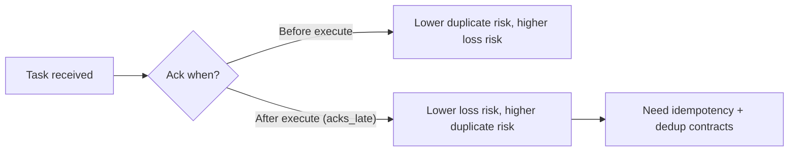
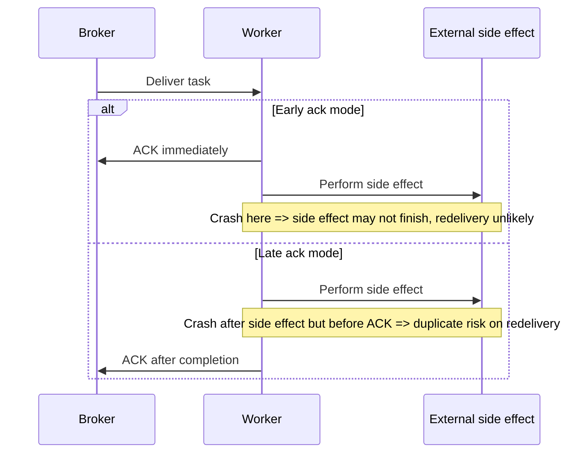

[← Назад к индексу части](index.md)
[↑ К глобальному плану](../celery_mastery_plan.md)

## 8.6. Ack-семантика и потеря worker

### Цель раздела

Зафиксировать практическую модель "потери vs дубли" при разных ack-настройках и сценариях падения worker-а.

### В этом разделе главное

- Ack до выполнения и ack после выполнения дают разные риски.
- `acks_late=True` обычно безопаснее для потерь, но увеличивает вероятность дублей.
- `kill -9` - стресс-тест твоей идемпотентности и rollback-логики.

### Термины

| Термин | Кратко |
| --- | --- |
| **Early ack** | Подтверждение задачи до полного завершения исполнения. |
| **Late ack** | Подтверждение после завершения задачи. |
| **Worker lost** | Ситуация потери worker-процесса/ноды во время обработки задачи. |
| **Redelivery** | Повторная доставка задачи после сбоя/отсутствия корректного ack. |

### Теория и правила

#### Базовая интуиция

- **Early ack**: меньше дублей, но выше риск "задача пропала после ack".
- **Late ack (`acks_late=True`)**: меньше риск потери, но выше вероятность повторного выполнения.

#### `task_reject_on_worker_lost`

Этот параметр влияет на реакцию при потере worker-процесса: задача может быть возвращена для redelivery, а не считаться "безвозвратно обработанной".

Важно: точные эффекты зависят от транспорта и версии Celery, всегда сверяй с документацией своей версии и проверяй в staging.

##### Проверь себя: task_reject_on_worker_lost

1. Почему этот параметр нельзя оценивать "в вакууме", без учета транспорта?

<details><summary>Ответ</summary>

Потому что итоговая redelivery-семантика определяется совместно настройками Celery и поведением конкретного broker/transport.

</details>

2. Какой минимальный тест подтверждает корректность этого параметра в вашем стеке?

<details><summary>Ответ</summary>

Контролируемая потеря worker-процесса в staging с проверкой судьбы задачи: redelivery, дубли и целостность side effects.

</details>

#### Матрица комбинаций: меньше потерь vs больше дублей

Ниже упрощенная инженерная карта (для практического reasoning, не формальная спецификация всех transport edge-cases):

| `acks_late` | `task_reject_on_worker_lost` | Риск потери | Риск дубля | Когда уместно |
| --- | --- | --- | --- | --- |
| `False` | `False` | выше | ниже | Некритичные задачи, где дубль дороже потери |
| `False` | `True` | средний (зависит от транспорта) | средний | Промежуточный режим, обязательно проверять в staging |
| `True` | `False` | ниже | средний/высокий | Частый baseline при идемпотентных задачах |
| `True` | `True` | минимизируется (обычно) | выше | Критичные задачи, где потеря недопустима и есть строгая дедупликация |

Практический вывод:

- "идеальной" комбинации без компромиссов нет;
- чем сильнее защита от потерь, тем выше требования к идемпотентности;
- итоговое поведение нужно подтверждать crash-тестами на вашем транспорте.

##### Проверь себя: матрица ack-комбинаций

1. Почему переход к "меньше потерь" автоматически повышает требования к контракту задачи?

<details><summary>Ответ</summary>

Потому что растет вероятность повторного выполнения, и без идемпотентности/дедупликации дубли превращаются в бизнес-инциденты.

</details>

2. Какая типичная ошибка при чтении этой матрицы?

<details><summary>Ответ</summary>

Считать строки матрицы абсолютной гарантией, а не ориентиром, который нужно подтверждать на конкретной версии и транспорте.

</details>

#### Что происходит при `kill -9`

- Процесс обрывается без возможности cleanup.
- Если задача уже сделала side effect (например, списание/запись во внешний сервис), но ack/финал не дошли, возможен дубль при redelivery.
- Поэтому идемпотентность - не "опция", а обязательный контракт.

##### Проверь себя: kill -9

1. Почему `kill -9` считается полезным тестом, хотя это "жесткий" сценарий?

<details><summary>Ответ</summary>

Он проверяет устойчивость к внезапной потере процесса и показывает, выдерживает ли система реальные аварийные условия, а не только graceful-остановку.

</details>

2. Что нужно проверить после принудительной остановки в первую очередь?

<details><summary>Ответ</summary>

Судьбу in-flight задач: были ли потери/дубли, корректно ли сработали redelivery и дедупликация, нет ли незамеченных частичных side effects.

</details>

### Пошагово

Чеклист выбора ack-стратегии:

1. Определи цену потери задачи vs цену дубля в бизнес-контексте.
2. Классифицируй side effects задачи (обратимые/необратимые).
3. Настрой `acks_late` и `task_reject_on_worker_lost` под класс задач.
4. Протестируй crash-сценарии: `SIGTERM`, `SIGKILL`, перезапуск ноды.
5. Зафиксируй идемпотентный контракт и ключи дедупликации.

### Простыми словами

Ack - это момент, когда ты говоришь брокеру: "Считай работу выполненной".  
Если сказал слишком рано - можно потерять задачу.  
Если сказал в конце - возможны дубли при аварии.  
Нужно выбирать то, что безопаснее для твоего бизнеса, и проектировать код под это.

### Картинка в голове



#### Crash timeline: где именно рождаются потери и дубли



##### Проверь себя: crash timeline

1. Где в late-ack режиме находится главный риск дубля?

<details><summary>Ответ</summary>

В окне после выполнения side effect и до отправки ack: при падении здесь redelivery может повторить то же действие.

</details>

2. Где в early-ack режиме находится главный риск потери?

<details><summary>Ответ</summary>

После раннего ack и до фактического завершения задачи: при падении работа может быть незавершенной, а повторной доставки уже не быть.

</details>

### Как запомнить

> **"В Celery чаще платят дублями, чтобы не платить потерями."**

### Примеры

#### Пример настроек (иллюстративно)

```python
app.conf.update(
    task_acks_late=True,
    task_reject_on_worker_lost=True,
)
```

##### Проверь себя: пример ack-конфига

1. Почему этот конфиг без идемпотентности опасен?

<details><summary>Ответ</summary>

Потому что повышается вероятность повторного выполнения, и без дедупликации это превращается в дубли бизнес-действий.

</details>

2. Какой минимум проверок нужен после включения этого конфига?

<details><summary>Ответ</summary>

Crash-тесты на staging, проверка redelivery-поведения, отсутствие "немых потерь" и контроль хвостовых задержек.

</details>

#### Пример контракта задачи

```text
Task: payments.charge_invoice
- idempotency_key: invoice_id + payment_attempt_id
- side effect: external payment API
- policy: late ack + strict dedup in DB
```

##### Проверь себя: пример контракта

1. Почему idempotency_key должен быть бизнес-осмысленным?

<details><summary>Ответ</summary>

Только бизнес-осмысленный ключ надежно связывает повторные запуски с одним логическим действием и позволяет корректно отфильтровать дубли.

</details>

2. Что будет, если контракт задачи не синхронизирован между командами?

<details><summary>Ответ</summary>

Появятся рассогласования в retry/дедупликации и возрастет риск финансовых или операционных инцидентов.

</details>

#### Мини-лаборатория crash-тестов для ack-семантики

Цель: не "верить" конфигу, а увидеть фактическое поведение на своем стеке.

Шаги:

1. Подготовь тестовую задачу с контролируемым side effect (например, запись в отдельную таблицу/лог с `idempotency_key`).
2. Запусти тест при `acks_late=False` и зафиксируй:
   - была ли потеря задачи при падении worker;
   - было ли повторное выполнение.
3. Запусти тот же тест при `acks_late=True` (и при необходимости с `task_reject_on_worker_lost=True`), снова зафиксируй исходы.
4. Повтори оба сценария для:
   - `SIGTERM` во время выполнения;
   - `SIGKILL` (`kill -9`) во время выполнения;
   - рестарта ноды/pod.
5. Сравни результаты с ожидаемой матрицей рисков и обнови runbook.

Что считать успешной валидацией:

- ты можешь предсказать outcome для каждого crash-сценария;
- дубли не приводят к бизнес-инциденту благодаря дедупликации;
- нет "немых потерь", которые команда не может объяснить.

Упрощенная таблица ожиданий:

| Режим | Crash-точка | Что обычно ожидаем | Что проверяем обязательно |
| --- | --- | --- | --- |
| `acks_late=False` | Падение после раннего ack | Риск потери факта выполнения | Есть ли необъяснимо исчезнувшие задачи |
| `acks_late=True` | Падение после side effect, до ack | Риск дубля при redelivery | Работает ли idempotency/dedup |
| `acks_late=True` + worker lost handling | Потеря worker-процесса | Более "живучее" поведение к потере | Корректен ли redelivery на конкретном транспорте |

##### Проверь себя: мини-лаборатория

1. Почему лабораторию нужно повторять для нескольких crash-точек, а не одного теста?

<details><summary>Ответ</summary>

Потому что результат зависит от момента падения: до side effect, после side effect, до/после ack — это разные режимы риска.

</details>

2. Как понять, что лаборатория дала инженерную ценность?

<details><summary>Ответ</summary>

Команда получила предсказуемую модель поведения, обновила runbook и может быстро объяснить последствия реального инцидента.

</details>

### Практика / реальные сценарии

- **Сценарий:** при сбое ноды пользователь получил два письма.  
  Причина: late ack + отсутствие дедупликации по message key.

- **Сценарий:** часть задач "исчезла" после аварии worker-а.  
  Причина: ранний ack, side effect не завершился, redelivery не произошло.

### Типичные ошибки

- Выставлять ack-политику один раз "для всего проекта".
- Игнорировать crash-тесты и верить только "теоретической" конфигурации.
- Отсутствие идемпотентных ключей в задачах с необратимыми side effect.

### Что будет, если...

- ...использовать `acks_late`, но не проектировать идемпотентность?  
  Периодические дубли станут бизнес-инцидентами (повторные действия).

- ...использовать ранний ack для критичных задач?  
  Риск безвозвратной потери факта обработки вырастет.

### Проверь себя

1. Почему `acks_late=True` одновременно "правильный" и "опасный" выбор?

<details><summary>Ответ</summary>

Он уменьшает риск потери задач при сбоях, но увеличивает вероятность повторного выполнения. Поэтому "правильность" достигается только вместе с идемпотентным контрактом.

</details>

2. Что именно нужно тестировать в crash-сценариях, кроме "процесс упал"?

<details><summary>Ответ</summary>

Нужно проверять fate задачи и side effects: было ли действие выполнено, был ли ack, произошла ли redelivery, появился ли дубль, и корректно ли отработала дедупликация.

</details>

3. Почему `task_reject_on_worker_lost` нельзя рассматривать без учета транспорта?

<details><summary>Ответ</summary>

Потому что фактическая модель redelivery зависит от брокера/транспорта и его семантики. То, что ожидается логически, нужно валидировать на конкретном стеке.

</details>

### Запомните

- Ack-политика - это бизнес-решение о рисках, а не только технический флаг.
- Crash-тесты обязательны для задач с важными side effects.
- Идемпотентность и дедупликация - фундамент надежности при late ack.

---
