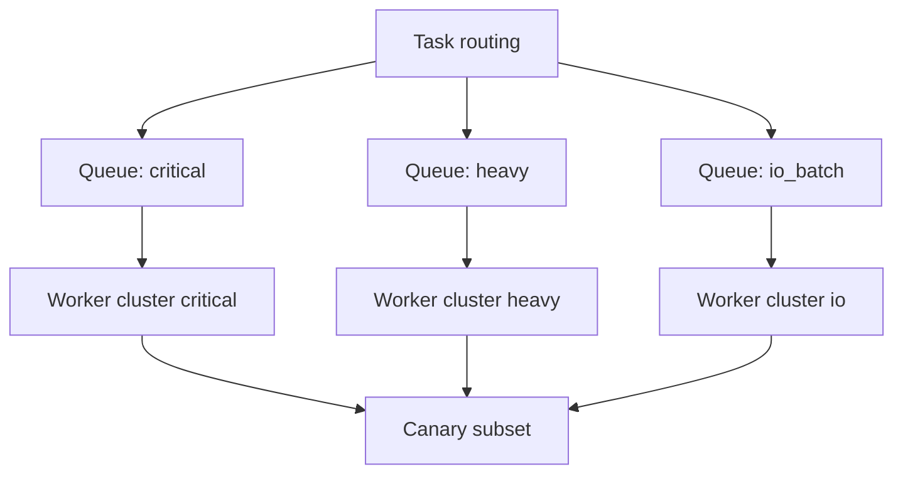

[← Назад к индексу части](index.md)
[↑ К глобальному плану](../mastery_plan.md)

## 8.7. Управление worker-ами в реальной системе

### Цель раздела

Собрать рабочую production-модель: как разделять worker-контуры, как делать безопасный rollout и как обслуживать рост нагрузки без хаоса.

### В этом разделе главное

- Один "монолитный" worker-кластер редко выдерживает зрелую нагрузку.
- Нужны выделенные контуры под разные SLA и профили задач.
- Canary и blue/green для Celery так же важны, как для веб-сервисов.

### Термины

| Термин | Кратко |
| --- | --- |
| **Dedicated workers** | Отдельные worker-контуры под конкретный тип задач. |
| **Latency-sensitive queue** | Очередь, где важна минимальная задержка старта и исполнения. |
| **Queue affinity** | Строгая привязка worker-ов к определенным очередям. |
| **Canary rollout** | Пошаговое включение изменений на малой доле worker-ов. |
| **Blue/Green** | Параллельные старый и новый контуры с контролируемым переключением трафика. |

### Теория и правила

#### Почему specialization работает

Разные классы задач конкурируют за разные ресурсы:

- CPU;
- память;
- соединения к БД/API;
- пропускную способность очередей.

Если все смешать, ты теряешь управляемость. Если разделить:

- проще тюнить конкретный контур;
- проще локализовать инцидент;
- проще масштабировать только то, что действительно нужно.

#### Canary worker

Используется для проверки:

- новых версий кода задач;
- новых retry/ack/prefetch параметров;
- новых зависимостей и клиентов.

Преимущество - ограниченный blast radius.

##### Проверь себя: canary

1. Почему canary особенно ценен для изменений конфигурации, а не только кода задач?

<details><summary>Ответ</summary>

Потому что даже маленькая ошибка конфигурации (prefetch/ack/routes) может массово изменить поведение доставки и SLA. Canary ограничивает радиус такого сбоя.

</details>

2. Когда canary считается "недостаточным" по масштабу?

<details><summary>Ответ</summary>

Когда его трафик нерепрезентативен и не отражает реальный профиль нагрузки домена, из-за чего риски проявляются только после массового переключения.

</details>

#### Blue/green rollout для Celery

Схема:

1. Поднимаешь новый контур worker-ов (green) параллельно старому (blue).
2. Частично или полностью переключаешь routing/трафик.
3. Наблюдаешь latency, ошибки, redelivery, memory profile.
4. При успехе фиксируешь green как основной.
5. При проблеме - быстрый rollback на blue.

##### Проверь себя: blue/green

1. Почему blue/green для worker-ов требует контроля очередей/роутинга, а не только "поднять новые процессы"?

<details><summary>Ответ</summary>

Потому что ключ в том, какие задачи реально идут в какой контур. Без управляемого routing переключение не контролируется и rollback становится медленным.

</details>

2. Что делает rollback по-настоящему быстрым в этой модели?

<details><summary>Ответ</summary>

Предварительно подготовленный механизм обратного переключения трафика и проверенный runbook с метриками триггеров.

</details>

#### Gate-критерии canary и blue/green (что должно быть "зеленым" перед расширением)

| Фаза rollout | Что проверяем | Минимальный критерий перехода |
| --- | --- | --- |
| Canary (первые % задач) | `success rate`, p95/p99 latency, redelivery, рост ошибок внешних API | Метрики не хуже baseline в заданном коридоре, нет новых критичных ошибок |
| Частичное переключение | Стабильность под нагрузкой, queue lag, memory drift worker-ов | Нет тренда на деградацию, backlog контролируем, memory profile стабилен |
| Полное переключение | Бизнес-SLO домена, инциденты, качество observability | SLO соблюдается, алерты в норме, runbook rollback проверен |

Практика: пороги лучше фиксировать в runbook заранее, а не согласовывать "на глаз" во время релиза.

##### Проверь себя: gate-критерии rollout

1. Почему "на глаз всё вроде нормально" — плохой критерий для перехода между фазами rollout?

<details><summary>Ответ</summary>

Это субъективная оценка, которая не защищает от скрытой деградации. Нужны заранее определенные количественные гейты по latency/error/redelivery/SLO.

</details>

2. Что чаще всего забывают включить в gate-критерии, кроме success rate?

<details><summary>Ответ</summary>

Хвостовые задержки (p95/p99), рост backlog, redelivery и memory drift — именно они часто предвещают инцидент.

</details>

### Пошагово

1. Раздели очереди по доменам и SLA.
2. Назначь каждому домену целевой worker-профиль (pool, concurrency, prefetch, ack).
3. Введи canary-группу для каждого критичного домена.
4. Прогоняй изменения через canary -> частичный rollout -> полный rollout.
5. Документируй runbook rollback для каждого домена.

### Простыми словами

Это как управление флотом машин:

- не отправляешь один и тот же тип машины на все задачи;
- важные и срочные рейсы обслуживаются отдельными экипажами;
- новую модель машины сначала тестируешь на маленьком маршруте.

### Картинка в голове



### Как запомнить

> **"Специализация worker-ов снижает цену ошибок и ускоряет диагностику."**

### Примеры

#### Пример запуска canary worker

```bash
celery -A myapp worker \
  -Q critical \
  -n critical-canary@%h \
  --concurrency=1 \
  --loglevel=DEBUG
```

##### Проверь себя: пример canary

1. Почему для canary часто задают маленький `--concurrency`?

<details><summary>Ответ</summary>

Чтобы ограничить blast radius: даже при ошибке затронута будет малая доля задач.

</details>

2. Зачем canary нередко запускают с более подробным логированием?

<details><summary>Ответ</summary>

Чтобы быстрее увидеть аномалии и принять решение о расширении rollout или откате.

</details>

#### Пример blue/green идеи на уровне очередей

```text
blue: critical.v1 queue -> worker set A
green: critical.v2 queue -> worker set B
routing flag: switch 10% -> 50% -> 100%
```

##### Проверь себя: пример blue/green

1. Почему разные очереди `v1/v2` упрощают rollback?

<details><summary>Ответ</summary>

Потому что возврат на старый контур делается переключением routing-флага без полной перестройки кластера.

</details>

2. Что нужно подтвердить на 50% фазе перед переходом на 100%?

<details><summary>Ответ</summary>

Стабильность SLO, отсутствие тренда роста ошибок/redelivery и предсказуемую задержку на новом контуре.

</details>

### Практика / реальные сценарии

- **Сценарий:** после обновления библиотеки HTTP-клиента выросло число таймаутов.  
  Canary позволил локализовать проблему без массовой деградации.

- **Сценарий:** "тяжелые отчеты" иногда блокировали обработку пользовательских уведомлений.  
  Разделение очередей и выделенный worker-контур стабилизировали SLA критичных задач.

### Типичные ошибки

- Держать все задачи в default queue "пока не вырастем".
- Делать крупные изменения worker-конфигурации без canary.
- Не иметь документированного rollback-плана.

### Что будет, если...

- ...не разделять latency-critical и heavy batch задачи?  
  Критичные задачи будут регулярно проигрывать конкуренцию за ресурсы.

- ...деплоить новые настройки worker-ов сразу на весь кластер?  
  Любая ошибка быстро станет инцидентом большого радиуса.

### Проверь себя

1. Почему "один огромный worker" часто хуже нескольких специализированных?

<details><summary>Ответ</summary>

Потому что смешанный workload создает взаимные блокировки и непредсказуемость. Специализация дает изоляцию SLA, точечный тюнинг и более безопасный rollout.

</details>

2. Как canary снижает операционный риск в Celery-контуре?

<details><summary>Ответ</summary>

Он ограничивает blast radius: новые настройки и код сначала проверяются на малой доле задач/worker-ов, а не на всем проде одновременно.

</details>

3. Что обязательно должно быть в runbook для blue/green worker-rollout?

<details><summary>Ответ</summary>

Шаги переключения трафика, метрики успеха/отката, тайм-бокс наблюдения, и четкий сценарий быстрого возврата на старый контур.

</details>

### Запомните

- Специализация worker-контуров - норма для зрелых Celery-систем.
- Canary и blue/green нужны не только веб-сервисам, но и фоновому исполнению.
- Операционная дисциплина (метрики, runbooks, rollback) прямо влияет на надежность бизнеса.

---
