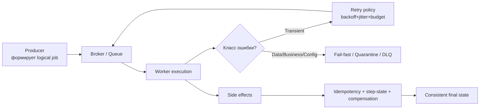

[← Назад к индексу части](index.md)
[↑ К глобальному плану](../../mastery_plan.md)

## Сквозная карта надёжности (как всё связано)

Эта схема нужна, чтобы видеть тему части 9 как единую систему, а не набор отдельных техник.

Как читать схему:

- левая часть (`Producer/Broker/Worker`) показывает технический путь задачи;
- развилка `Класс ошибки?` подчёркивает, что реакция зависит от причины, а не от факта исключения;
- нижняя ветка (`Side effects`) напоминает: главный риск - не stack trace, а неконтролируемый бизнес-эффект.

#### Проверь себя по карте надёжности

1. Почему в схеме ветка side effects выделена отдельно от ветки retry?

Ответ

Потому что повтор обработки и побочные эффекты - разные оси риска. Retry может восстанавливать выполнение, но без идемпотентности и step-state он увеличивает риск повторного бизнес-эффекта. Поэтому side effects требуют отдельного контроля.

2. Что будет, если всегда идти только по ветке retry и не использовать quarantine/DLQ?

Ответ

Система начнёт бесконечно перерабатывать нерешаемые ошибки, будет расти backlog, ухудшится throughput полезных задач и усложнится диагностика. Нужна ветка изоляции и triage.

---
