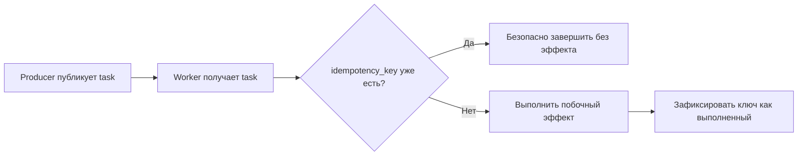

[← Назад к индексу части](index.md)
[↑ К глобальному плану](../../mastery_plan.md)

## 9.1. Идемпотентность как базовый принцип

### Цель раздела

Понять идемпотентность не как абстрактное слово, а как главный механизм безопасности для Celery-системы с at-least-once доставкой.

### В этом разделе главное

- Повторное выполнение задачи - не баг сам по себе.
- Идемпотентность может быть естественной или искусственно добавленной.
- `idempotency key` часто важнее, чем "идеальный lock".

### Термины

| Термин | Кратко |
| --- | --- |
| **Natural idempotency** | Операция сама по себе повторяемая (например, "проставить статус `processed=true`"). |
| **Artificial idempotency** | Идемпотентность добавляют через ключи, уникальные индексы, таблицы дедупа. |
| **Idempotency key** | Устойчивый ключ бизнес-операции, по которому обнаруживают повтор. |
| **Logical job id** | Идентификатор бизнес-операции поверх конкретного `task_id`. |
| **Upsert** | Запись "вставить или обновить", которая помогает безопасно повторять фиксацию состояния. |
| **Compare-and-set (CAS)** | Обновление только если текущее состояние совпадает с ожидаемым (защита от гонок). |

### Теория и правила

Интуиция: Celery гарантирует не "строго один запуск", а скорее "запуск минимум один раз".  
Значит, задача должна выдерживать повторы.

Формально:

- если операция идемпотентна, повторный запуск с тем же входом не меняет итог;
- если операция неидемпотентна, повтор создаёт новый побочный эффект (второе письмо, второй платёж, повторный webhook).

Практический каркас проектирования:

1. Определи **единицу бизнес-эффекта** (что именно не должно дублироваться).
2. Привяжи к ней **устойчивый ключ** (`order_id + action_type`, `invoice_id`, `message_uuid`).
3. Зафиксируй ключ в месте истины (обычно БД с unique constraint).
4. Сделай обработку "повтор = безопасный no-op или возврат уже известного результата".

#### Upsert и compare-and-set в реальной задаче

Когда операция состоит из нескольких шагов, одной проверки `idempotency_key` бывает мало.  
Нужна ещё защита переходов состояния:

- **Upsert** удобен для "зафиксировать текущее состояние шага", если запись могла уже существовать.
- **CAS** полезен, когда важно не позволить другому конкурентному исполнению "перепрыгнуть" этап или перезаписать более свежее состояние.

Пример идеи:

- разрешаем переход только `initiated -> external_done`;
- если текущее состояние уже `external_done` или `finished`, шаг повторно не выполняем.

#### Проверь себя по блоку Upsert/CAS

1. Почему `upsert` и CAS часто используются вместе, а не вместо друг друга?

<details><summary>Ответ</summary>

`upsert` помогает безопасно зафиксировать запись, если она уже существует, а CAS контролирует корректность перехода состояния во времени. Вместе они дают и устойчивую запись, и защиту от гонок.

</details>

2. Какой риск остаётся, если есть только `upsert`, но нет проверки допустимого перехода состояний?

<details><summary>Ответ</summary>

Можно перезаписать состояние некорректным шагом (например, поздний поток затрёт более новое состояние), что нарушит логику recovery и приведёт к неконсистентной истории исполнения.

</details>

### Пошагово

1. Выбери границу logical job (например, "отправить чек по заказу").
2. Сгенерируй `idempotency_key` на producer-стороне.
3. Передай ключ в задачу (`headers` или явный аргумент).
4. В задаче первым шагом проверь/зарегистрируй ключ в хранилище уникальности.
5. Если ключ уже обработан - заверши задачу без повторного эффекта.
6. Если нет - выполни эффект и зафиксируй успешный статус.

### Простыми словами

Представь турникет в метро: билет можно приложить дважды, но второй раз система понимает, что проход уже совершен, и не "засчитывает новый проход".  
Идемпотентность в Celery - такой же турникет для побочных эффектов.

### Картинка в голове



### Как запомнить

**Повтор будет. Вопрос только в том, безопасен ли он.**

### Примеры

```python
from celery import shared_task
from django.db import IntegrityError, transaction
from billing.models import PaymentAction

@shared_task(bind=True, autoretry_for=(TimeoutError,), retry_backoff=True, retry_jitter=True)
def capture_payment(self, payment_id: int, idempotency_key: str) -> str:
    try:
        with transaction.atomic():
            # unique index на (idempotency_key)
            action = PaymentAction.objects.create(
                idempotency_key=idempotency_key,
                payment_id=payment_id,
                status="started",
            )
    except IntegrityError:
        return "duplicate_ignored"

    # внешний вызов (условно)
    provider_response = "captured"

    action.status = provider_response
    action.save(update_fields=["status"])
    return provider_response
```

### Практика / реальные сценарии

- **Email/SMS:** хранить `message_fingerprint`, не отправлять второй раз при redelivery.
- **Webhook:** проверять уникальность `(provider_event_id, consumer_name)`.
- **Файловая обработка:** фиксировать "этот файл этой версии уже обработан".
- **Payment-like операции:** всегда иметь внешний и внутренний idempotency key.
- **Внешние API c идемпотентными ключами:** повторять сетевой вызов только с тем же ключом, чтобы провайдер сам отфильтровал дубль.
- **Workflow из нескольких шагов:** разделять идемпотентность уровня `logical job` и уровня отдельного шага.

### Типичные ошибки

- использовать случайный ключ при каждом retry (теряется смысл дедупа);
- считать `task_id` бизнес-идентификатором (он может меняться при повторной публикации);
- делать idempotency check после внешнего вызова (слишком поздно).

### Что будет, если...

- **...не сделать идемпотентность?** Рано или поздно будет дубль побочного эффекта.
- **...делать дедуп только в памяти worker?** После рестарта защита исчезнет.
- **...вынести ключ в стабильное хранилище?** Повтор становится контролируемым, инциденты - диагностируемыми.

### Проверь себя

1. Почему `unique` в БД часто надёжнее distributed lock для дедупликации?

<details><summary>Ответ</summary>

`unique` опирается на транзакционные гарантии хранилища и не зависит от TTL lock-а и сетевой нестабильности lock-сервиса. Lock полезен как дополнительный механизм, но не заменяет устойчивую бизнес-уникальность.

</details>

2. Когда `task_id` подходит как idempotency key, а когда нет?

<details><summary>Ответ</summary>

Подходит редко: только если гарантированно один `task_id` на весь жизненный цикл logical job. На практике producer может переопубликовать работу с новым `task_id`, поэтому чаще нужен отдельный бизнес-ключ.

</details>

3. Чем отличается "естественная" идемпотентность от "искусственной"?

<details><summary>Ответ</summary>

Естественная - операция сама повторяема по природе. Искусственная - мы добавляем слой контроля повторов (ключи, таблицы дедупа, проверки статуса), потому что операция изначально неидемпотентна.

</details>

### Запомните

- Идемпотентность - фундамент надёжности Celery.
- Любая задача с побочным эффектом обязана переживать повторный запуск.
- Лучшая точка контроля - устойчивое хранилище и бизнес-ключ, а не "надежда на один запуск".

---
