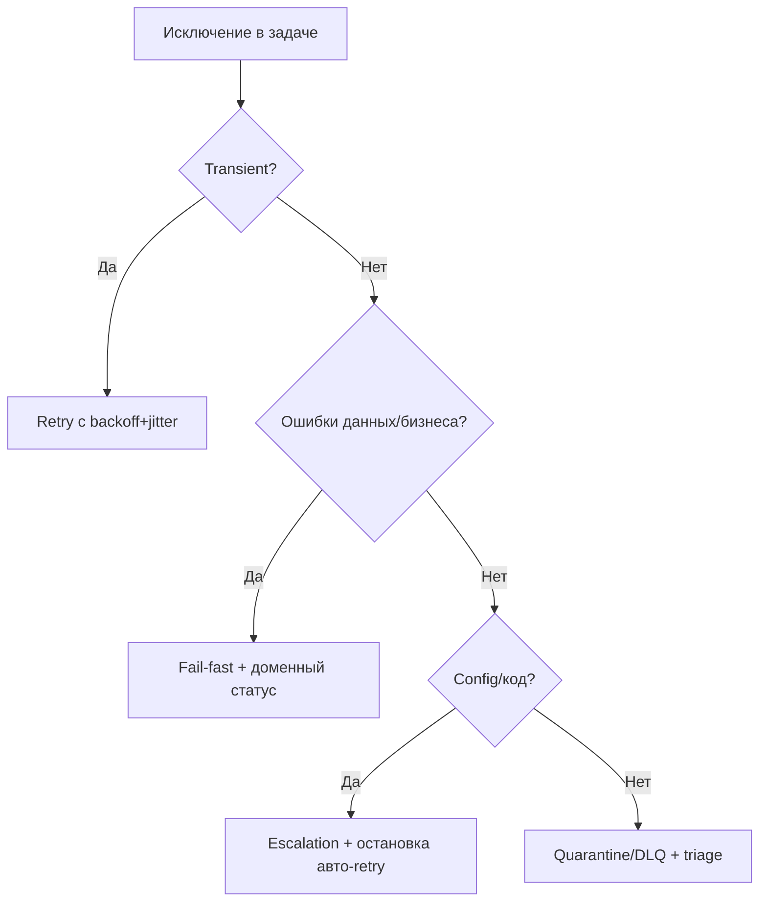

[← Назад к индексу части](index.md)
[↑ К глобальному плану](../../mastery_plan.md)

## 9.2. Классификация ошибок

### Цель раздела

Научиться классифицировать ошибки так, чтобы policy действий была предсказуемой: retry, fail-fast, quarantine, ручная эскалация.

### В этом разделе главное

- Не все ошибки нужно ретраить.
- Ошибка - это не только stack trace, но и контекст бизнес-операции.
- "Один `except Exception: retry`" - антипаттерн.

### Термины

| Термин | Кратко |
| --- | --- |
| **Transient error** | Временная ошибка, которая может пройти сама (сетевой таймаут, 503). |
| **Permanent error** | Ошибка, которая не исчезнет от повторов (битые данные, нарушение бизнес-правила). |
| **Quarantine** | Перевод задачи в отдельный поток разбирательства вместо бесконечных retry. |
| **Escalation** | Передача проблемы на другой уровень (алерт, ручная обработка, тикет). |
| **DLQ (dead-letter queue)** | Техническая "очередь выбытия" после отказа по policy брокера/приложения. |
| **Configuration error** | Ошибка настройки окружения/кредов/URL/маршрута, которую не лечит retry самой задачи. |

### Теория и правила

Рекомендуемая матрица:

- **Инфраструктурные transient** (`ConnectionError`, `Timeout`) -> retry с backoff.
- **Внешние quota/rate limit** -> retry с учётом `Retry-After`, возможно parking queue.
- **Ошибки данных** (невалидный payload) -> не ретраить, отправлять в quarantine.
- **Бизнес-ошибки** (например, заказ уже отменён) -> чаще fail-fast, иногда компенсация.
- **Программные ошибки** (`TypeError`, `AttributeError`) -> не ретраить автоматически, чинить код.
- **Конфигурационные ошибки** (неверный DSN, недоступный secret, неправильный routing) -> fail-fast + срочная операционная эскалация.
- **Необратимые доменные ошибки** (например, "период закрыт", "документ архивирован") -> не ретраить, а завершать задачу с явным бизнес-статусом.

#### Quarantine vs DLQ: что выбрать

- **Quarantine** чаще используется как управляемый прикладной поток: сохранить контекст, разобрать, при необходимости исправить и переотправить.
- **DLQ** часто технически привязан к брокеру/топологии и полезен как буфер отказов и источник сигналов для мониторинга.

На практике зрелые системы используют оба механизма: DLQ как инфраструктурный контур, quarantine как процесс бизнес-разбора.

#### Проверь себя по блоку Quarantine vs DLQ

1. В каком случае DLQ недостаточно без отдельного quarantine-процесса?

<details><summary>Ответ</summary>

Когда требуется осмысленный разбор бизнес-контекста, коррекция данных и контролируемый re-drive. DLQ хранит "технический факт отказа", но не заменяет процесс triage и восстановления.

</details>

2. Почему quarantine без инфраструктурного DLQ тоже может быть слабым решением?

<details><summary>Ответ</summary>

Потому что без технического контура dead-letter можно потерять ранние сигналы перегрузки/системных отказов на уровне брокера и усложнить наблюдаемость по транспортным сбоям.

</details>

### Пошагово

1. Составь список ожидаемых исключений по каждой задаче.
2. Для каждого класса укажи действие: retry/fail/quarantine.
3. Зафиксируй это в коде и в runbook.
4. Добавь метки в логах/метриках по классу ошибки.
5. Проверяй, что алерты различают "временный шум" и "структурный дефект".

### Простыми словами

Врачу нельзя лечить все болезни одним антибиотиком.  
В Celery точно так же: одна стратегия на все ошибки ухудшает систему.

### Картинка в голове

```text
Ошибка в задаче
   |
   +--> Временная инфраструктурная? --> Retry с backoff/jitter
   |
   +--> Бизнес-правило нарушено? --> Fail-fast (без retry)
   |
   +--> Плохой payload? --> Quarantine / parking queue
   |
   +--> Баг в коде? --> Остановить автоматические повторы, чинить релиз
```

### Как запомнить

**Сначала класс ошибки, потом механизм реакции.**

#### Быстрое decision-дерево по реакции на ошибку



Короткая интерпретация:

- если причина временная и лечится ожиданием, работаем retry;
- если причина содержательная (данные/бизнес-правила), обычно нужен fail-fast;
- если это код/конфигурация, сначала исправление причины, а не повтор;
- если класс неясен, безопаснее отправить в controlled triage, чем бездумно ретраить.

#### Проверь себя по decision-дереву

1. Почему "класс неясен" в дереве ведёт в triage, а не в автоматический retry?

<details><summary>Ответ</summary>

Потому что неопределённый класс ошибки может быть неретрайным (данные, код, конфиг). Автоматический retry в таком случае повышает риск шторма и маскирует первопричину.

</details>

2. Что нужно сделать перед тем, как перевести ошибку из ветки triage в ветку retry?

<details><summary>Ответ</summary>

Подтвердить, что это действительно transient-класс ошибки, и определить bounded policy: backoff, jitter, max_retries, escalation path и метрики контроля.

</details>

### Примеры

```python
class RetryableNetworkError(Exception):
    pass

class InvalidPayloadError(Exception):
    pass

@shared_task(bind=True, max_retries=7)
def sync_partner(self, payload: dict):
    try:
        if "partner_id" not in payload:
            raise InvalidPayloadError("missing partner_id")
        # условный внешний вызов
        raise RetryableNetworkError("upstream timeout")
    except RetryableNetworkError as exc:
        raise self.retry(exc=exc, countdown=2 ** self.request.retries)
    except InvalidPayloadError:
        # без retry: задача требует ручной коррекции payload
        raise
```

### Практика / реальные сценарии

- **REST API интеграция:** 500/503 ретраим, 400/422 обычно нет.
- **Платёжный шлюз:** `insufficient_funds` не ретраим автоматически, `gateway_timeout` ретраим.
- **ETL:** schema mismatch уводим в quarantine, а временный отказ хранилища ретраим.

### Типичные ошибки

- ретраить 4xx как будто это сеть;
- прятать ошибку в "успешный" статус без алерта;
- не разделять метрики retry по типам исключений.

### Что будет, если...

- **...ретраить бизнес-ошибки?** Получишь шум, дубли и ложное ощущение "система работает".
- **...не ретраить transient-сбои?** Потеряешь устойчивость к кратковременным отказам.
- **...ввести quarantine?** Снимешь нагрузку с основной очереди и ускоришь диагностику.

### Проверь себя

1. Почему `HTTP 429` лучше считать отдельным классом ошибок?

<details><summary>Ответ</summary>

Потому что это не просто "ошибка", а сигнал про лимит со стороны внешнего API. Нужен специальный policy: учитывать `Retry-After`, возможно снижать rate и избегать агрессивных повторов.

</details>

2. Почему программную ошибку (`TypeError`) обычно нельзя лечить retry?

<details><summary>Ответ</summary>

Потому что она детерминированна: повтор запускает тот же дефект кода. Нужен фикс релиза, а не циклические попытки.

</details>

3. Когда quarantine лучше fail-fast?

<details><summary>Ответ</summary>

Когда payload потенциально ценный, но требует ручного анализа/исправления, и важно не потерять контекст для последующей дообработки.

</details>

### Запомните

- Ошибка без класса = хаотичная эксплуатация.
- Retry должен зависеть от причины сбоя.
- Quarantine и escalation - нормальные элементы production-системы.

---
