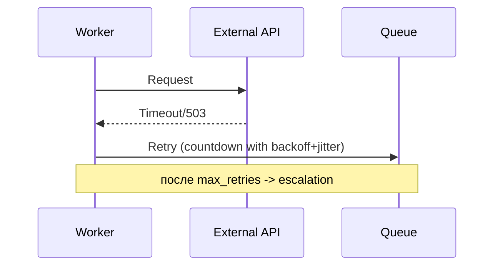

[← Назад к индексу части](index.md)
[↑ К глобальному плану](../celery_mastery_plan.md)

## 9.3. Retry-стратегия

### Цель раздела

Собрать управляемую retry-стратегию, которая повышает надёжность, а не создаёт retry storm.

### В этом разделе главное

- У retry есть цена: нагрузка, дубли, задержка.
- Backoff + jitter - базовый минимум для устойчивости.
- `max_retries` и escalation path обязательны.

### Термины

| Термин | Кратко |
| --- | --- |
| **Exponential backoff** | Пауза растёт экспоненциально: 1s, 2s, 4s, 8s... |
| **Jitter** | Случайный шум к паузе, чтобы задачи не "просыпались строем". |
| **Bounded retries** | Ограниченное число повторов. |
| **Escalation path** | Что делать после исчерпания повторов (алерт, parking queue, ручная операция). |
| **Retry budget** | Ограничение "сколько повторов допустимо" за период/класс задач, чтобы не сжечь ресурсы. |

### Теория и правила

Надёжная retry-политика обычно отвечает на 5 вопросов:

1. **Что ретраим?** (классы исключений)
2. **Сколько раз?** (`max_retries`)
3. **С какой паузой?** (backoff + jitter)
4. **Когда перестаём?** (bounded retries)
5. **Куда идёт задача после лимита?** (escalation)

Критическая мысль: бесконечный retry - это не "надёжность", а отложенный инцидент.

#### Bounded vs "почти бесконечные" ретраи по классам задач

Полностью бесконечные ретраи почти всегда плохи.  
Но допустимы задачи с очень длинным горизонтом восстановления, где применяют "практически бесконечный" режим через:

- редкие повторы с большим верхним интервалом;
- строгий retry budget;
- обязательный алерт и отдельный контур наблюдаемости;
- явный stop-condition (например, TTL logical job, дедлайн SLA, ручной stop flag).

Пример ориентира:

| Класс задачи | Рекомендуемый подход |
| --- | --- |
| Сетевой transient к внешнему API | bounded retries + backoff + jitter + `Retry-After` |
| Критичное уведомление с дедлайном | bounded retries до дедлайна, затем эскалация |
| Batch восстановление после outage | длинный backoff, но с budget и stop-condition |

#### Проверь себя по блоку bounded retries

1. Почему "почти бесконечный" retry без stop-condition опасен даже с большим backoff?

<details><summary>Ответ</summary>

Потому что отсутствие конечного условия приводит к вечной переработке отказов, накоплению долгов в очередях и операционной усталости. Нужны дедлайн, TTL logical job или явный stop flag.

</details>

2. Как понять, что задаче нужен retry budget, а не просто `max_retries`?

<details><summary>Ответ</summary>

Когда важен контроль повторов на интервале времени/по классу задач (например, ограничение нагрузки на внешнюю систему), а не только предел попыток одной конкретной задачи.

</details>

### Пошагово

1. Задай whitelist retryable исключений.
2. Включи backoff + jitter.
3. Ограничь верхний интервал и число попыток.
4. Добавь метрики: retry count, age задачи, класс ошибки.
5. Определи post-retry маршрут: DLQ/parking/manual.

### Простыми словами

Retry - как попытки дозвониться: если абонент занят, пробуешь позже и реже, а не 100 раз подряд в секунду.

### Картинка в голове



### Как запомнить

**Retry лечит временные сбои, но должен быть дозирован.**

### Примеры

```python
@shared_task(
    bind=True,
    autoretry_for=(ConnectionError, TimeoutError),
    retry_backoff=True,
    retry_backoff_max=300,   # до 5 минут
    retry_jitter=True,
    max_retries=8,
)
def call_vendor(self, vendor_id: str) -> dict:
    # ваш код вызова внешнего API
    raise TimeoutError("temporary timeout")
```

```python
@shared_task(bind=True, max_retries=5)
def call_vendor_manual_retry(self, payload: dict):
    try:
        return do_request(payload)
    except VendorRateLimit as exc:
        retry_after = max(exc.retry_after_seconds, 10)
        raise self.retry(exc=exc, countdown=retry_after)
```

### Практика / реальные сценарии

- **Высокая нагрузка + лимиты API:** обязательны jitter и upper bound, иначе синхронная волна повторов.
- **Партнёр нестабилен ночью:** можно увеличить backoff ночью и ужесточить днём.
- **Критичный бизнес-процесс:** ограниченное число retry + обязательный алерт и ручная операция.
- **Quota exhaustion:** отдельный класс ошибок с более длинным интервалом и ограничением параллелизма.

### Типичные ошибки

- `except Exception: retry` без фильтра;
- отсутствие jitter (thundering herd);
- бесконечные ретраи без наблюдаемости;
- одинаковая policy для всех задач системы.

### Что будет, если...

- **...сделать агрессивный retry?** Перегрузишь внешний API и собственный broker.
- **...не задать max_retries?** Возможен бесконечный цикл и рост backlog.
- **...сделать escalation?** Ошибка станет управляемой, а не "вечной".

### Проверь себя

1. Почему backoff без jitter может быть недостаточен?

<details><summary>Ответ</summary>

Потому что одинаковые задачи с одинаковой формулой паузы будут повторяться синхронно и создавать пики нагрузки (retry storm). Jitter разносит повторы по времени.

</details>

2. Когда `autoretry_for` уместен, а когда лучше `self.retry` вручную?

<details><summary>Ответ</summary>

`autoretry_for` хорош для типового, однообразного класса transient-ошибок. Ручной `self.retry` нужен, когда нужно учитывать контекст: `Retry-After`, тип payload, приоритет, возраст задачи и бизнес-ограничения.

</details>

3. Что должно происходить после `max_retries`, кроме "задача упала"?

<details><summary>Ответ</summary>

Должен быть заранее определённый путь: алерт, parking queue, создание тикета, возможно компенсация или ручной re-drive. Иначе ошибка теряется в потоке.

</details>

### Запомните

- Retry - инструмент, а не стратегия сам по себе.
- Стратегия без лимитов и escalation опасна.
- Backoff + jitter + наблюдаемость - обязательный минимум.

---
