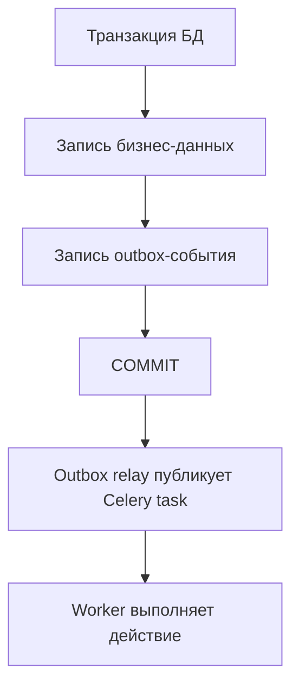

[← Назад к индексу части](index.md)
[↑ К глобальному плану](../mastery_plan.md)

## 9.5. Компенсации и транзакционные границы

### Цель раздела

Понять, как согласовать БД и асинхронную публикацию, чтобы не возникало "email ушёл, а заказ не закоммитился" и других расхождений.

### В этом разделе главное

- Порядок "побочный эффект -> commit" часто опасен.
- Паттерн outbox снижает риск рассинхронизации.
- Компенсации нужны, когда полного атомарного rollback нет.

### Термины

| Термин | Кратко |
| --- | --- |
| **Publish-after-commit** | Публикация задачи только после успешного коммита транзакции. |
| **Transactional outbox** | Сначала записываем событие в БД вместе с основной транзакцией, отправляем отдельно. |
| **Compensation** | Логическое "обратное" действие при частичном успехе. |
| **Saga-like flow** | Последовательность шагов с компенсирующими действиями вместо глобальной транзакции. |

### Теория и правила

Классическая проблема:

1. Сервис делает изменения в БД.
2. Публикует Celery-задачу.
3. Коммит не проходит или падает приложение.

В итоге задача может стартовать на данных, которых "официально" нет.

Устойчивые варианты:

- publish строго после commit hook;
- или outbox: запись бизнес-изменения и "события к отправке" в одной транзакции.

#### Publish-after-commit vs transactional outbox

| Подход | Сильная сторона | Ограничение | Когда уместен |
| --- | --- | --- | --- |
| **Publish-after-commit** | Проще реализовать и быстрее внедрить | Остаётся окно между commit и фактической публикацией | Небольшие/средние системы с умеренной критичностью |
| **Transactional outbox** | Лучшая управляемость доставки и восстановления | Сложнее реализация: relay, retry, очистка outbox | Критичные процессы, высокий объём событий, строгий аудит |

Практический вывод: если процесс критичен для денег/договоров/комплаенса, outbox почти всегда оправдан.

#### Проверь себя по сравнению publish-after-commit и outbox

1. Почему publish-after-commit проще, но оставляет операционный риск?

<details><summary>Ответ</summary>

Потому что между подтверждённым commit и фактической публикацией остаётся окно сбоя (процесс упал, транспорт недоступен). Outbox уменьшает этот разрыв за счёт отдельного надёжного relay-контура.

</details>

2. Какой признак подсказывает, что пора переходить от post-commit к outbox?

<details><summary>Ответ</summary>

Рост критичности и объёма событий, требования аудита/воспроизводимости, а также инциденты рассинхронизации "данные закоммичены, а событие не доставлено".

</details>

### Пошагово

1. Определи бизнес-критичные события, которые не должны теряться/дублироваться.
2. Для них используй post-commit публикацию или outbox.
3. Добавь idempotency key на уровне downstream задачи.
4. Определи компенсацию для частичного провала.
5. Документируй "точки невозврата" в runbook.

### Простыми словами

Нельзя сначала отправить курьера, а потом только проверять, оформлен ли заказ.  
Сначала подтверждаешь заказ в "журнале", потом запускаешь доставку.

### Картинка в голове



### Как запомнить

**Сначала консистентность факта, потом асинхронное действие.**

### Примеры

```python
def place_order(order_data):
    with db.transaction():
        order = Order.create(**order_data)
        OutboxEvent.create(
            event_type="order_created",
            aggregate_id=order.id,
            payload={"order_id": order.id},
        )
    return order.id

@shared_task
def relay_outbox_event(event_id: int):
    event = OutboxEvent.get(event_id)
    process_order.delay(order_id=event.payload["order_id"], idempotency_key=str(event.id))
    event.mark_sent()
```

### Практика / реальные сценарии

- **Интернет-магазин:** заказ в БД и отправка чека/уведомлений только через outbox-поток.
- **CRM:** изменение статуса лида и webhook наружу без потери событий при рестарте.
- **Финансовые операции:** компенсация "refund/reverse" при частичном успехе в downstream.

### Типичные ошибки

- публиковать задачу до commit;
- считать, что "если редко падает, то безопасно";
- не хранить состояние compensation шагов.

### Что будет, если...

- **...отправлять внешние побочные эффекты до commit?** Возможны "фантомные" действия.
- **...применить outbox?** Появится управляемость доставки и восстановление после сбоев.
- **...игнорировать компенсации?** При частичном успехе будут зависшие бизнес-состояния.

### Проверь себя

1. Почему outbox часто выигрывает у "прямой публикации в конце функции"?

<details><summary>Ответ</summary>

Потому что outbox связывает факт изменения данных и факт необходимости отправки события одной транзакцией. Это уменьшает окна рассинхронизации между БД и очередью.

</details>

2. В чём разница между rollback SQL-транзакции и бизнес-компенсацией?

<details><summary>Ответ</summary>

Rollback отменяет локальные изменения в БД. Компенсация нужна, когда внешний эффект уже произошёл и его нужно отменять отдельным осмысленным действием.

</details>

3. Когда publish-after-commit может быть достаточным без полного outbox?

<details><summary>Ответ</summary>

В относительно простых сценариях с умеренными требованиями к гарантии доставки и контролируемой операционной средой. Но при росте критичности и объёма событий outbox обычно надёжнее и прозрачнее.

</details>

### Запомните

- Граница транзакции - центральная точка надёжности.
- Outbox не "бюрократия", а защита от тихих расхождений.
- Компенсации - часть нормального дизайна распределённых процессов.

---
