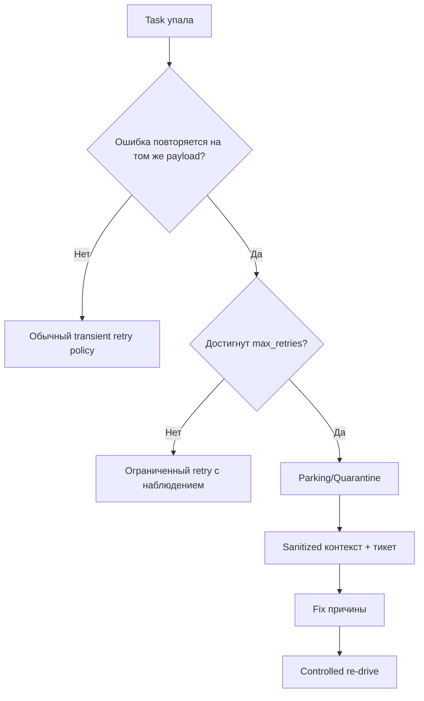

[← Назад к индексу части](index.md)
[↑ К глобальному плану](../../mastery_plan.md)

## 9.6. Poison tasks и bad payloads

### Цель раздела

Научиться быстро обнаруживать и изолировать задачи, которые гарантированно падают, чтобы они не отравляли весь worker-контур.

### В этом разделе главное

- Poison task не исправляется количеством retry.
- Нужны quarantine/parking очереди и отдельный процесс разбора.
- Payload логируется с метаданными, но без утечки чувствительных данных.

### Термины

| Термин | Кратко |
| --- | --- |
| **Poison task** | Сообщение, которое детерминированно ломает обработчик. |
| **Parking queue** | Очередь "на парковку" для проблемных задач после лимита попыток. |
| **Sanitized logging** | Логирование данных без PII/секретов. |

### Теория и правила

Признаки poison payload:

- повторяемый падёж на одинаковом входе;
- одинаковый stack trace и та же стадия выполнения;
- успех для других payload в той же задаче.

Тактика:

1. Ограничить retries.
2. После лимита - уводить в quarantine.
3. Сохранять контекст для последующего re-drive (после фикса).

### Пошагово

1. Определи критерии "ядовитости" (ошибка данных, schema mismatch, version mismatch).
2. Введи parking queue и policy маршрутизации после `max_retries`.
3. Добавь dashboard по количеству parked задач.
4. Подготовь процедуру re-drive после исправления причины.

### Простыми словами

Если одна коробка каждый раз ломает конвейер, её не пускают в общий поток снова и снова - её убирают в отдельную зону проверки.

### Картинка в голове

```text
Main queue -> Worker -> FAIL -> Retry(1..N) -> still FAIL -> Parking queue -> Manual/automated triage
```



### Как запомнить

**Poison task нужно изолировать, а не "бить retry до победы".**

### Примеры

```python
@shared_task(bind=True, max_retries=3)
def import_customer(self, payload: dict):
    try:
        validate_payload(payload)  # может бросить InvalidSchema
        process_customer(payload)
    except InvalidSchema as exc:
        if self.request.retries >= self.max_retries:
            send_to_parking_queue(payload, reason=str(exc))
            raise
        raise self.retry(exc=exc, countdown=30)
```

### Практика / реальные сценарии

- **Смена версии payload у producer:** старые worker-ы видят "неизвестные поля".
- **Поток от внешнего партнёра:** часть событий приходит в несогласованном формате.
- **Старые задачи в очереди после релиза:** новый код не умеет их десериализовать.

### Типичные ошибки

- хранить полный payload с персональными данными в открытых логах;
- не иметь отдельного ownership на разбор parked задач;
- автоматически re-drive без исправления первопричины.

### Что будет, если...

- **...не изолировать poison tasks?** Они съедят retry-бюджет и деградируют throughput.
- **...парковать и triage-ить?** Основной поток останется здоровым, а инцидент - локализованным.

### Проверь себя

1. Почему poison task опасен даже при низкой доле от общего потока?

<details><summary>Ответ</summary>

Потому что может создавать непропорциональную нагрузку на retries, логи, алерты и внешние зависимости, а также вытеснять полезные задачи при ограниченных worker ресурсах.

</details>

2. Что обязательно сохранить при отправке задачи в parking queue?

<details><summary>Ответ</summary>

Минимальный набор для восстановления контекста: идентификаторы, версия схемы, класс ошибки, timestamp, correlation id, но без лишних чувствительных данных.

</details>

3. Почему re-drive без фикса первопричины - плохая идея?

<details><summary>Ответ</summary>

Потому что задача снова упадёт и повторит цикл, увеличив backlog и шум. Сначала исправляем причину, потом запускаем controlled replay.

</details>

### Запомните

- Poison tasks - нормальное явление в живых системах.
- Их нужно быстро изолировать.
- Quarantine/parking - признак зрелости эксплуатации, а не "признание поражения".

---
