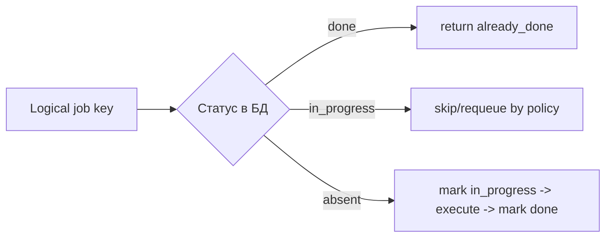
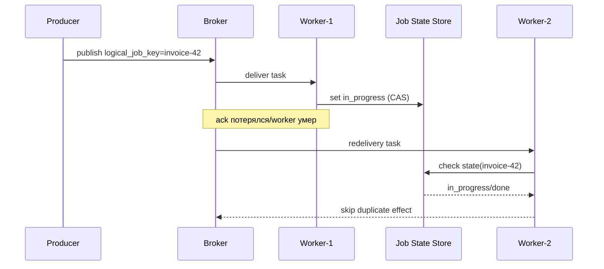

[← Назад к индексу части](index.md)
[↑ К глобальному плану](../../mastery_plan.md)

## 9.7. Дубли и race conditions

### Цель раздела

Разобрать источники дублей и гонок и научиться закрывать их архитектурно, а не точечными "костылями".

### В этом разделе главное

- Дубликаты приходят не только из broker redelivery.
- Один logical job может конкурировать сам с собой.
- Distributed lock полезен ограниченно и не заменяет бизнес-уникальность.

### Термины

| Термин | Кратко |
| --- | --- |
| **Redelivery duplicate** | Дубль из-за повторной доставки одного и того же сообщения. |
| **Producer duplicate** | Дубль из-за повторной публикации producer-ом. |
| **Race condition** | Несколько исполнений одновременно меняют одно состояние. |
| **Lock expiry** | Истечение lock до окончания реальной работы (ложная безопасность). |

### Теория и правила

Три типовых источника дублей:

1. Ack не дошёл -> broker переотдал сообщение.
2. Producer не получил подтверждение публикации и отправил ещё раз.
3. Пользователь/сервис инициировал ту же бизнес-операцию повторно.

Практический вывод: защита нужна на **бизнес-уровне** (идентичность операции), а не только на транспортном.

### Пошагово

1. Определи logical job key.
2. Введи уникальность на уровне БД/хранилища состояния.
3. Добавь "already_in_progress / already_done" ветки.
4. При необходимости добавь lock как вспомогательный слой.
5. Мониторь процент дублей и время удержания lock.

### Простыми словами

Если два курьера одновременно доставляют один и тот же заказ, проблема не в их скорости, а в том, что система не распознала "это один и тот же заказ".

### Картинка в голове





### Как запомнить

**Дедупликация = идентичность + состояние + правила переходов.**

### Примеры

```python
@shared_task
def recalc_invoice(invoice_id: int):
    row = acquire_job_state(invoice_id)  # транзакционно
    if row.status == "done":
        return "already_done"
    if row.status == "in_progress":
        return "already_running"

    set_job_state(invoice_id, "in_progress")
    try:
        do_recalculation(invoice_id)
        set_job_state(invoice_id, "done")
    except Exception:
        set_job_state(invoice_id, "failed")
        raise
```

### Практика / реальные сценарии

- **Массовый импорт:** один файл могут запустить повторно "на всякий случай".
- **Webhooks:** provider шлёт повторные события, пока не увидит подтверждение.
- **Ручной re-run оператором:** конкурирует с авто-retry.

#### Distributed lock: когда помогает, а когда вредит

| Ситуация | Lock полезен | Риск/ограничение |
| --- | --- | --- |
| Короткий критичный участок (секунды) | Да, снижает вероятность параллельного захода | Нужен fallback, если lock не взят |
| Долгий job (минуты/часы) | Ограниченно | TTL может истечь раньше завершения и дать ложную безопасность |
| Нет устойчивого состояния операции в БД | Почти бесполезен | Не защищает от producer duplicates и повторных запусков после рестарта |
| Есть state machine + unique ключи | Как доп. слой | Всё равно не заменяет бизнес-идемпотентность |

#### Проверь себя по distributed lock

1. Почему lock с TTL не гарантирует защиту long-running задачи от дублей?

<details><summary>Ответ</summary>

TTL может истечь до завершения обработки, после чего второй исполнитель войдёт в критичную секцию и создаст параллельный эффект. Без state machine и идемпотентности это приведёт к гонкам.

</details>

2. В какой архитектуре lock даёт наибольшую пользу?

<details><summary>Ответ</summary>

Когда он используется как дополнительный барьер поверх устойчивой модели состояния (`in_progress/done/failed`) и уникальных бизнес-ключей, а не как единственная защита от дублей.

</details>

### Типичные ошибки

- "Мы поставили Redis lock - значит защищены";
- lock TTL меньше фактического времени задачи;
- отсутствие "state machine" для logical job.

### Что будет, если...

- **...полагаться только на lock?** При истечении TTL получишь параллельные исполнения.
- **...вести состояние logical job?** Появится детерминированное поведение при повторах.
- **...игнорировать producer duplicates?** Будут необъяснимые "случайные" дубли.

### Проверь себя

1. Почему lock без устойчивого состояния `done/in_progress` недостаточен?

<details><summary>Ответ</summary>

Lock ограничивает параллелизм в моменте, но не даёт истории и не защищает от повторного запуска после истечения TTL/рестарта. Нужна явная модель состояния операции.

</details>

2. Чем producer duplicate отличается от redelivery duplicate?

<details><summary>Ответ</summary>

Producer duplicate - это повторная публикация нового сообщения (часто с новым `task_id`). Redelivery - повторная доставка уже существующего сообщения из-за проблем с ack/visibility.

</details>

3. Когда lock всё же уместен?

<details><summary>Ответ</summary>

Как дополнительный слой для защиты "горячих" секций и снижения вероятности гонок, но только вместе с идемпотентностью и устойчивым учётом состояния logical job.

</details>

### Запомните

- Дубли - неизбежны, хаос - необязателен.
- Основная защита живёт в бизнес-контракте.
- Lock - вспомогательный, не главный механизм.

---
