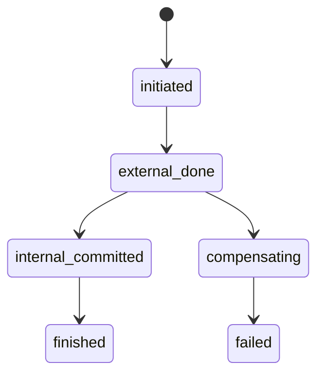

[← Назад к индексу части](index.md)
[↑ К глобальному плану](../celery_mastery_plan.md)

## 9.9. Частично применённые побочные эффекты

### Цель раздела

Научиться проектировать задачи, которые могут безопасно восстанавливаться после "полууспеха" (часть шагов прошла, часть нет).

### В этом разделе главное

- Partial success - нормальная реальность распределённых задач.
- Идемпотентность нужна на уровне шагов, а не только всей задачи целиком.
- Нужен явный recovery plan.

### Термины

| Термин | Кратко |
| --- | --- |
| **Partial success** | Часть операций выполнена, часть - нет. |
| **Step-level idempotency** | Каждый шаг workflow выдерживает повтор отдельно. |
| **Recovery point** | Точка, откуда можно безопасно продолжить или компенсировать. |

### Теория и правила

Опасный сценарий:

1. Задача списала деньги.
2. До записи "успешно" в БД worker умер.
3. Задача ретраится.

Без step-level идемпотентности возможен двойной платёж.

Устойчивый подход:

- хранить статус каждого шага (`initiated`, `external_done`, `internal_committed`);
- на retry продолжать с нужного recovery point;
- использовать внешние idempotency keys для сторонних API.

#### Две фазы внутри задачи: до внешнего вызова и после

Это важный практический шаблон, который часто спасает от "тихих" дублей:

1. **Фаза A: подготовка и проверка**  
   Внутренние проверки, фиксация intent, получение/проверка idempotency key.
2. **Фаза B: внешний необратимый эффект**  
   Вызов внешнего API, отправка письма, списание, публикация webhook.
3. **Фаза C: пост-фиксация**  
   Запись "внешний эффект применён", переход состояния, уведомление соседних компонентов.

Если сбой случился между B и C, на retry мы не должны повторять B вслепую.  
Нужно восстановиться по состоянию шага и внешнему корреляционному идентификатору.

```text
Фаза A (safe) -> Фаза B (необратимый внешний эффект) -> Фаза C (внутренняя фиксация)
                          ^ самый опасный разрыв при падении worker
```

#### Проверь себя по двухфазной модели

1. Почему разрыв между фазами B и C считается самым опасным?

<details><summary>Ответ</summary>

Внешний эффект уже произошёл, но внутренний статус ещё не зафиксирован. При повторе система "не видит" факт выполнения и может повторить необратимое действие.

</details>

2. Что уменьшает риск повторного эффекта в этой точке?

<details><summary>Ответ</summary>

Step-state в устойчивом хранилище, внешний idempotency key и recovery-логика, которая на retry сначала проверяет факт выполнения B, а не исполняет B повторно вслепую.

</details>

### Пошагово

1. Декомпозируй задачу на шаги с явными статусами.
2. Для каждого шага определи idempotency и компенсацию.
3. Фиксируй прогресс в устойчивом хранилище.
4. На retry читай статус и продолжай безопасно.
5. Документируй, какие шаги необратимы.

### Простыми словами

Не "делай всё одним махом", а как в чек-листе пилота: каждый шаг отмечается. Если прервали, видно, где продолжать.

### Картинка в голове



### Как запомнить

**Надёжная задача хранит не только результат, но и прогресс шагов.**

### Примеры

```python
@shared_task(bind=True, max_retries=5)
def fulfill_order(self, order_id: int, idem_key: str):
    st = load_state(order_id)
    if st == "finished":
        return "already_done"

    if st == "initiated":
        charge_payment(order_id, idem_key=idem_key)  # внешний key
        save_state(order_id, "external_done")

    if st in ("initiated", "external_done"):
        reserve_inventory(order_id)
        save_state(order_id, "internal_committed")

    notify_customer(order_id)
    save_state(order_id, "finished")
    return "ok"
```

### Практика / реальные сценарии

- **Заказ:** платёж прошёл, склад не зарезервирован -> нужна компенсация или дозавершение.
- **Email + DB update:** письмо ушло, запись статуса упала -> на retry не отправлять письмо повторно.
- **ETL:** часть батча записана, часть нет -> повтор только непройденного окна.

### Типичные ошибки

- "один большой try/except" без учёта прогресса;
- отсутствие отдельного статуса на внешний необратимый шаг;
- повтор всей задачи вместо продолжения с recovery point.

### Что будет, если...

- **...не хранить шаги?** После сбоя непонятно, что уже применено.
- **...хранить step-state?** Recovery становится детерминированным.
- **...не проектировать компенсации?** Останутся "зависшие" полуоперации.

### Проверь себя

1. Почему идемпотентность "только на всю задачу" может не спасти?

<details><summary>Ответ</summary>

Потому что в середине задачи могут быть необратимые внешние шаги. Без контроля на уровне этапов повтор может заново выполнить уже пройденный критичный шаг.

</details>

2. Что важно зафиксировать после внешнего необратимого вызова?

<details><summary>Ответ</summary>

Факт выполнения шага и его корреляционный идентификатор (transaction id, provider idempotency key), чтобы повтор не продублировал эффект.

</details>

3. Что лучше: "сразу компенсировать" или "дозавершить"?

<details><summary>Ответ</summary>

Зависит от домена. Если восстановление до целевого состояния безопасно и быстро, часто лучше дозавершить. Если риск/стоимость продолжения высоки, выбирают компенсацию. Главное - чтобы стратегия была явно определена заранее.

</details>

### Запомните

- Partial effects неизбежны в реальных системах.
- Храни прогресс шагов и recovery point.
- Компенсация и дозавершение - архитектурные решения, а не "ручная магия".

---
