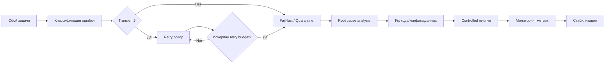

[← Назад к индексу части](index.md)
[↑ К глобальному плану](../celery_mastery_plan.md)

## Справочник по части

| Тема | Ключевые пункты |
| --- | --- |
| Идемпотентность | Бизнес-ключ, dedup в устойчивом хранилище, безопасный повтор |
| Ошибки | Классификация: transient/business/data/programming/config |
| Retry | Backoff + jitter, max_retries, escalation path |
| Таймауты | Внешние client timeout + soft/hard time limit |
| Транзакционные границы | publish-after-commit, outbox, компенсации |
| Poison tasks | Parking queue, triage, controlled re-drive |
| Дубли и гонки | logical job state machine, lock как вспомогательный слой |
| Отмена | revoke до старта, cooperative cancel во время работы, terminate как авария |
| Partial effects | Step-level идемпотентность, recovery points, compensations |

#### Проверь себя по справочнику

1. Зачем использовать справочник после изучения, если весь материал уже прочитан?

Ответ

Справочник помогает быстро восстановить ментальную карту и принять решение в рабочей ситуации без перечитывания полной главы.

2. Какой пункт справочника обычно первым проверяют при симптоме "дубли бизнес-эффектов"?

Ответ

Пункты про идемпотентность и раздел "Дубли и гонки": бизнес-ключ, state machine logical job, повторная публикация/redelivery и ограничения lock.

---

### Ключевые тезисы части 9

- Надёжность Celery держится на идемпотентности, а не на надежде "выполнится ровно один раз".
- Повтор выполнения - штатный сценарий распределённой обработки.
- Retry без классификации ошибок быстро превращается в источник аварий.
- Таймауты, транзакционные границы и компенсации определяют реальную устойчивость при частичных сбоях.
- Quarantine/DLQ и controlled re-drive - обязательные элементы зрелой эксплуатации.

#### Проверь себя по ключевым тезисам

1. Какой тезис лучше всего объясняет, почему retry сам по себе не равен надёжности?

Ответ

Тезис про идемпотентность как основу: без неё повторы усиливают риск дублей, а не повышают устойчивость.

2. Почему controlled re-drive включён в ключевые тезисы, а не только в сценарии?

Ответ

Потому что восстановление после инцидента - часть архитектуры надёжности, а не "разовая операция". Неправильный re-drive может повторно обрушить систему.

---

### Production-чеклист по части 9

Перед запуском критичных Celery-задач в production проверь:

- есть ли у каждой важной операции явный `idempotency_key` и место его устойчивой фиксации;
- разделены ли классы ошибок и определена ли retry-policy для каждого класса;
- есть ли `max_retries`, backoff, jitter, retry budget и escalation path;
- выставлены ли таймауты внешних клиентов и корректные soft/hard limits задач;
- определены ли транзакционные границы (`publish-after-commit` или outbox);
- есть ли parking/quarantine поток и процедура controlled re-drive;
- есть ли модель шагов (`step-state`) для задач с необратимыми внешними эффектами;
- предусмотрена ли кооперативная отмена long-running задач;
- есть ли метрики/алерты по retry rate, age задач, parked задачам и дублям;
- документированы ли runbook-и для on-call с конкретными действиями.

#### Проверь себя по production-чеклисту

1. Какой пункт чеклиста чаще всего пропускают при первом внедрении и почему это опасно?

Ответ

Часто пропускают explicit escalation path и процедуру re-drive. В инциденте это приводит к хаотичным действиям, повторным сбоям и потере времени на координацию.

2. Почему наличие метрик без runbook-ов недостаточно?

Ответ

Метрики показывают "что плохо", но не определяют "что делать дальше". Runbook переводит наблюдаемость в конкретные безопасные шаги восстановления.

---

### Мини-runbook: controlled re-drive после фикса

Когда причина падений исправлена, re-drive должен быть управляемым:

1. Подтверди, что root cause действительно устранён (код, конфиг, схема, внешняя зависимость).
2. Выбери маленький canary-пакет parked задач и прогони вручную.
3. Проверь метрики: success rate, latency, повторные падения, дубль-эффекты.
4. Если canary стабилен, увеличивай объём re-drive ступенчато.
5. Держи rollback-план: быстро остановить re-drive и вернуть задачи в quarantine при регрессе.

Принцип: **лучше медленный предсказуемый re-drive, чем быстрый повтор инцидента.**

#### Проверь себя по mini-runbook re-drive

1. Почему re-drive начинается с canary, а не с полного объёма?

Ответ

Canary снижает риск повторного массового инцидента и даёт быструю обратную связь: исправлена ли причина и не появился ли новый класс ошибок.

2. Как понять, что можно переходить к следующей ступени объёма re-drive?

Ответ

Когда на текущем шаге стабильно растёт success rate, нет всплеска дублей/таймаутов/ошибок и внешние зависимости не показывают деградации.

---

### Операционная матрица: симптом -> действие -> проверка

| Симптом | Первое действие | Что проверить, что стало лучше |
| --- | --- | --- |
| Резко растёт `RETRY` | Ограничить агрессивные ретраи, включить/усилить backoff+jitter | Снижается retry rate, выравнивается latency, падает нагрузка на внешнее API |
| Много `FAILURE` с одинаковым payload | Перевести в quarantine/parking, остановить массовый re-drive | Уменьшается шум ошибок, полезный throughput восстанавливается |
| Дубли уведомлений/списаний | Проверить idempotency key и step-state | Прекращаются повторные бизнес-эффекты при redelivery |
| Зависшие long-running задачи | Проверить таймауты клиентов и soft/hard limits | Уменьшается доля hung tasks, освобождаются worker slots |
| Частые отмены не останавливают задачи | Проверить cooperative cancel checkpoints | Отмена начинает отражаться в предсказуемых статусах job |
| После фикса запускается re-drive | Начать с canary и ступенчатого увеличения | Рост success rate без повторного всплеска ошибок |

#### Проверь себя по операционной матрице

1. Почему в матрице для каждого симптома есть отдельная колонка "что стало лучше"?

Ответ

Чтобы проверять результат действий на данных, а не по ощущению. Без измеримой проверки легко принять ложную стабилизацию и пропустить повторную деградацию.

2. Что делать, если симптом пропал, но метрики улучшения не подтверждаются?

Ответ

Считать инцидент незакрытым: продолжить диагностику, проверить лаг в метриках, качество данных и скрытые очереди/ретраи. Восстановление считается успешным только при устойчивом подтверждении метриками.

---

### Жизненный цикл инцидента надёжности (от сбоя до восстановления)

Эта схема полезна как ментальный чек-лист on-call:  
сначала классифицируй, затем изолируй, потом исправляй причину, и только после этого запускай дозированное восстановление.

#### Проверь себя по жизненному циклу инцидента

1. Почему шаг RCA (root cause analysis) стоит до re-drive, а не после?

Ответ

Без устранения первопричины re-drive просто переигрывает тот же сбой на большем объёме. Сначала причина, потом восстановление.

2. На каком шаге обычно возникает самый частый операционный антипаттерн?

Ответ

На переходе от фикса к re-drive: команды часто запускают массовое восстановление без canary и без мониторинга, что приводит к повторной аварии.

---
