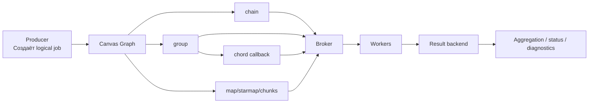

[← Назад к индексу части](index.md)
[↑ К глобальному плану](../celery_mastery_plan.md)

## Сквозная схема Canvas (ментальная модель)

Прочтение схемы:

- Canvas находится "сверху" как декларация графа, но исполняется через обычные сообщения в broker.
- `group/chord` дополнительно нагружают result backend, потому что нужно отслеживать много дочерних результатов.
- Чем богаче граф, тем важнее correlation ID и наблюдаемость в каждом узле.

---
