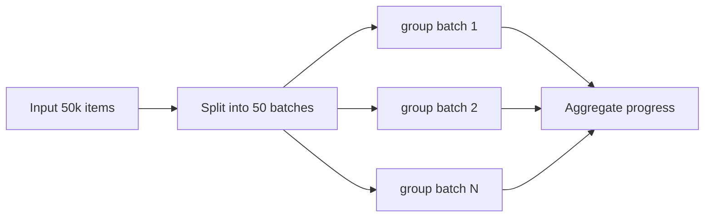

[← Назад к индексу части](index.md)
[↑ К глобальному плану](../../mastery_plan.md)

## 10.3. Group

### Цель раздела

Понять, как применять `group` для fan-out обработки и как не уронить систему из-за избыточного параллелизма.

### В этом разделе главное

- `group` запускает независимые задачи параллельно.
- "Независимые" означает отсутствие строгой зависимости по данным/порядку между дочерними задачами.
- Большой fan-out может перегрузить broker, workers и result backend.
- Размер группы - архитектурное решение, а не просто "поставим побольше".

### Термины

| Термин | Кратко |
| --- | --- |
| **Fan-out** | Разветвление на много параллельных подзадач. |
| **Task burst** | Всплеск отправки большого числа задач за короткий интервал. |
| **Backpressure** | Ограничение скорости отправки, чтобы не перегрузить систему. |
| **GroupResult** | Агрегированный объект для отслеживания статусов задач в группе. |

### Теория и правила

Интуиция: `group` - это "раздать одинаковую работу многим исполнителям".

Ограничения:

1. Каждая дочерняя задача - отдельное сообщение.
2. Каждая задача добавляет overhead сериализации/маршрутизации.
3. При очень больших группах может вырасти latency и стоимость хранения результатов.

Правила проектирования:

- ограничивай размер fan-out батчированием;
- учитывай лимиты внешних систем (API, БД, rate limits);
- не смешивай radically different SLA в одной группе.

Практическая эвристика ограничения размера `group`:

| Признак | Что наблюдаешь | Что делать |
| --- | --- | --- |
| Растёт publish latency | Producer дольше отправляет группу | Уменьши размер группы, включи staged fan-out |
| Растёт queue depth при том же входе | Worker-ы не успевают разгребать burst | Ограничь входной поток, раздели очереди |
| Растёт доля 429/5xx внешнего API | Параллелизм "ломает" зависимость | Снизь concurrency/rate, добавь throttling |
| Растёт tail latency группы | Последние 5-10% задач завершаются непропорционально долго | Делай меньшие пакеты и выравнивай время задач |

#### Проверь себя по ограничению размера group

1. Как понять, что `group` упирается не в worker CPU, а во внешний контур?

<details><summary>Ответ</summary>

По росту ошибок внешних зависимостей (429/5xx), нестабильной tail latency и деградации при повышении параллелизма. Это признак, что bottleneck вне worker.

</details>

2. Почему staged fan-out часто устойчивее "одного большого выстрела"?

<details><summary>Ответ</summary>

Он ограничивает burst-нагрузку, даёт более управляемое давление на broker/backend и упрощает контроль прогресса и откат при массовых сбоях.

</details>

### Пошагово

1. Определи размер входного набора.
2. Оцени среднее время одной подзадачи и нагрузку на внешние зависимости.
3. Выбери лимит параллелизма (через маршрутизацию/очереди/concurrency).
4. При больших объёмах используй `chunks` или staged fan-out.
5. Добавь метрики: group size, completion latency, failure ratio.

### Простыми словами

`group` ускоряет работу, когда много похожих независимых операций.  
Но "слишком быстро отправили всё" часто означает "долго разгребаем хвост и падения".

### Картинка в голове

```text
             +--> [Task 1]
[Group Start]+--> [Task 2]
             +--> [Task 3]
             +--> [Task N]
```

Staged fan-out (когда единый burst слишком тяжёлый):



### Как запомнить

**Group = параллельно, но не бесплатно.**

### Примеры

```python
from celery import group

@celery_app.task
def process_user(user_id: int) -> dict:
    return {"user_id": user_id, "status": "ok"}

user_ids = list(range(1, 21))
job = group(process_user.s(uid) for uid in user_ids)
result = job.apply_async()
```

### Практика / реальные сценарии

- Массовая валидация профилей пользователей.
- Обработка пачки изображений/файлов.
- Расчёт персональных KPI для списка сотрудников.

### Типичные ошибки

- Отправить fan-out на сотни тысяч задач без ограничения входного потока.
- Не учитывать цену хранения результатов каждой подзадачи.
- Считать, что "больше fan-out всегда быстрее".

### Что будет, если...

- **...группа огромная, а backend медленный?**  
  Группа завершится поздно, мониторинг станет шумным, callback-и (если дальше `chord`) будут задерживаться.

### Проверь себя

1. Почему размер `group` - это не только вопрос worker-concurrency?

<details><summary>Ответ</summary>

Потому что нагрузка ложится не только на workers, но и на broker, backend, сеть, сериализацию и внешние системы, куда задачи ходят.

</details>

2. Когда лучше разбить один гигантский `group` на несколько этапов?

<details><summary>Ответ</summary>

Когда единый fan-out создаёт burst-нагрузку, повышает вероятность массовых ошибок и усложняет контроль прогресса/повторов.

</details>

3. Какой ключевой признак, что параллелизм уже "вредит"?

<details><summary>Ответ</summary>

Растут backlog и latency при снижении доли успешных выполнений, а внешние сервисы начинают отвечать таймаутами/429/5xx.

</details>

### Запомните

- `group` применяй для независимых задач.
- Параллелизм должен быть дозированным и наблюдаемым.

---
