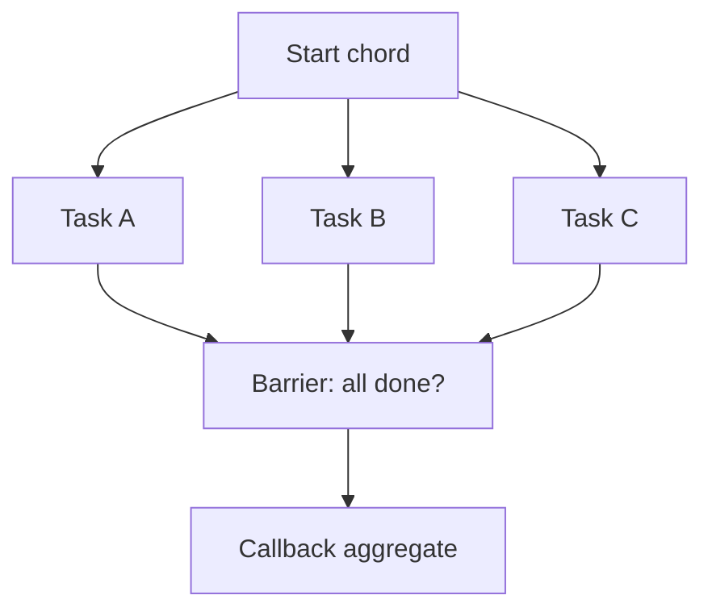

[← Назад к индексу части](index.md)
[↑ К глобальному плану](../celery_mastery_plan.md)

## 10.4. Chord

### Цель раздела

Освоить `chord` как главный примитив fan-out/fan-in: понять его устройство, роль backend, ограничения и стратегию обработки частичных сбоев.

### В этом разделе главное

- `chord` = `group` (header) + callback (body) после завершения всех задач header.
- `chord` критично зависит от result backend.
- В больших `chord` bottleneck часто в агрегации/хранении, а не в вычислениях.
- Callback должен быть идемпотентным: возможна повторная доставка.

### Термины

| Термин | Кратко |
| --- | --- |
| **Header** | Параллельная часть `chord` (обычно `group`). |
| **Body / callback** | Финальная задача, запускаемая после завершения header. |
| **Fan-in barrier** | Барьер "все дочерние задачи завершены". |
| **Chord unlock** | Внутренний механизм Celery, который проверяет готовность header и активирует callback. |
| **Partial failure** | Часть задач header упала, часть выполнилась. |

### Теория и правила

Интуиция: `chord` - это "собрание комиссии": пока все участники не сдали отчёт, финальное решение не принимается.

Почему backend важен:

1. Нужно хранить и читать состояния/результаты множества дочерних задач.
2. Нужно определить момент "все готово".
3. Нужно передать callback агрегированные данные.

Критичные технические условия для корректного `chord`:

1. Нужен рабочий result backend с предсказуемой latency под пиком нагрузки.
2. Header-задачи должны сохранять результат, иначе callback теряет входные данные.
3. Для задач в `chord` нельзя бездумно включать `ignore_result`: это частая причина "зависшего" fan-in.

Быстрый preflight перед большим `chord`:

- backend доступен и стабилен;
- политика хранения результатов согласована с размером header;
- callback идемпотентен и умеет работать с частично неполным набором.

Если backend медленный или нестабилен:

- callback запускается поздно;
- возможны повторные попытки unlock;
- возрастает риск сложной диагностики частичного состояния.

#### Механика chord unlock пошагово

Ниже упрощённая модель того, что происходит внутри:

1. Producer публикует header-задачи и метаданные chord.
2. Каждая header-задача после завершения пишет state/result в backend.
3. Механизм unlock проверяет: все ли задачи header в terminal state.
4. Если да - публикуется callback (body).
5. Если нет - unlock повторяется позже.

ASCII-схема:

```text
publish chord
   |
   v
[header tasks] --> [result backend states] --> [unlock check] --> [callback task]
                                           \-> not ready -> retry unlock
```

Ключевой вывод: "готовность chord" вычисляется через backend-состояние, поэтому его производительность и консистентность напрямую влияют на итог.

Типовой edge case:

- если часть header-задач не сохраняет результат, unlock-логика не может корректно подтвердить барьер;
- на практике это выглядит как "callback не стартует", хотя проблема в контракте результатов, а не в broker.

#### Проверь себя по chord unlock

1. Почему проблемы `chord` часто диагностируются как "брокер сломан", хотя корень в backend/result contract?

<details><summary>Ответ</summary>

Потому что symptom виден на этапе запуска callback, а это финальная стадия. На самом деле причина обычно в том, что fan-in не может корректно определить готовность header через backend.

</details>

2. Что нужно проверить первым при "зависшем" callback chord?

<details><summary>Ответ</summary>

Состояния всех header-задач, правила сохранения результатов (включая `ignore_result`) и доступность/latency result backend.

</details>

#### Частичный провал header: стратегии

| Ситуация | Что делать | Почему |
| --- | --- | --- |
| 1-2 дочерних шага упали transient-ошибкой | bounded retry этих шагов | Высокий шанс восстановления без доменных потерь |
| Дочерний шаг упал permanent/data-ошибкой | fail-fast + quarantine/ручной разбор | Ретраи только ухудшат нагрузку |
| Часть данных можно агрегировать без упавших элементов | callback в degraded mode + флаг качества | Бизнес иногда предпочитает "неполный, но быстрый" результат |
| Полный набор обязателен по контракту | не запускать финальный бизнес-эффект до полной валидности | Иначе финальный результат недостоверен |

#### Проверь себя по partial failure в chord

1. Когда допустим degraded mode в callback?

<details><summary>Ответ</summary>

Когда бизнес-контракт разрешает неполный результат, и это явно маркируется флагом качества/полноты. Без явного флага degraded mode опасен для потребителей данных.

</details>

2. Почему fail-fast для permanent/data ошибок лучше "бесконечного retry"?

<details><summary>Ответ</summary>

Потому что такие ошибки обычно не лечатся повтором: retry только тратит ресурсы и маскирует реальную причину. Нужны quarantine и разбор данных/контракта.

</details>

### Пошагово

1. Определи размер header и формат результатов дочерних задач.
2. Убедись, что backend выдержит объём результатов.
3. Сделай callback идемпотентным и tolerant к частичным данным.
4. Добавь корреляцию: `logical_job_id`, `group_id`, `chord_id`.
5. Проверь поведение при отказе одной дочерней задачи.

### Простыми словами

`chord` полезен, когда нужно "сначала параллельно сделать много, потом один раз собрать итог".  
Цена удобства - зависимость от надёжной агрегации состояния.

### Картинка в голове



### Как запомнить

**Chord = "много параллельно" + "один агрегатор", backend в центре риска.**

### Примеры

```python
from celery import chord

@celery_app.task
def process_part(part_id: int) -> dict:
    return {"part_id": part_id, "score": 10}

@celery_app.task
def aggregate(parts: list[dict]) -> dict:
    total = sum(p["score"] for p in parts)
    return {"total_score": total, "count": len(parts)}

parts = range(100)
wf = chord((process_part.s(p) for p in parts), aggregate.s())
wf.apply_async()
```

Идемпотентный callback-паттерн (упрощённо):

```python
@celery_app.task
def aggregate_once(job_id: str, parts: list[dict]) -> dict:
    # уникальный ключ в БД: (job_id, step='aggregate')
    # если запись уже есть -> вернуть её как no-op
    total = sum(p["score"] for p in parts)
    return {"job_id": job_id, "total": total}
```

### Практика / реальные сценарии

- Разбить большой файл на части, обработать параллельно, собрать общий отчёт.
- Проверить много внешних источников и сформировать единый итог.
- Массовый расчёт признаков и финальная сборка модели/выгрузки.

### Типичные ошибки

- Использовать `chord` для очень больших header без оценки backend capacity.
- Делать callback тяжёлым и неидемпотентным.
- Не продумать, что делать при частичном провале header.

### Что будет, если...

- **...callback неидемпотентен, а запускается повторно?**  
  Возможны дубли итоговых побочных эффектов (двойная запись отчёта, повторные уведомления, повторный экспорт).

### Проверь себя

1. Почему `chord` чаще "упирается" в backend, чем в broker?

<details><summary>Ответ</summary>

Потому что для fan-in нужен учёт состояний/результатов большого числа дочерних задач и синхронизация барьера готовности, а это ответственность backend.

</details>

2. Какой минимальный контракт нужен callback в `chord`?

<details><summary>Ответ</summary>

Идемпотентность, устойчивость к повторной доставке и понятное поведение при частичных/неполных входных данных.

</details>

3. Когда `group + отдельная внешняя агрегация` может быть лучше `chord`?

<details><summary>Ответ</summary>

Когда объём header огромен, нужна сложная бизнес-логика сборки и требуется более контролируемая оркестрация/хранение состояния, чем штатный механизм chord.

</details>

### Запомните

- `chord` мощный, но дорогой и чувствительный к backend.
- Callback - это "второй критический сервис", а не "маленький хвостик".

---
