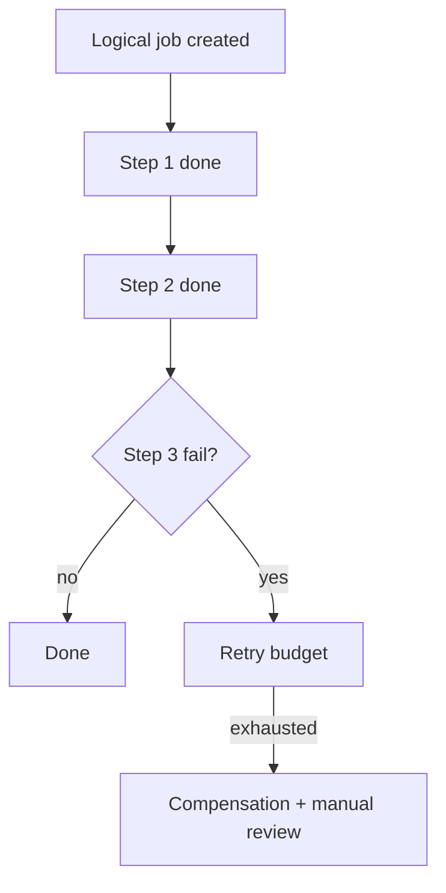

[← Назад к индексу части](index.md)
[↑ К глобальному плану](../../mastery_plan.md)

## 10.6. Дизайн workflow

### Цель раздела

Собрать практическую архитектурную модель workflow: как дробить шаги, где ставить границы, как обеспечивать переигрывание и компенсации.

### В этом разделе главное

- Гранулярность задач определяет скорость, стабильность и стоимость.
- Сильная связность шагов усложняет retries и эволюцию workflow.
- Компенсации нужны для бизнес-консистентности при частичном успехе.
- Correlation между logical job и `task_id` обязателен для диагностики.

### Термины

| Термин | Кратко |
| --- | --- |
| **Granularity** | Размер шага: сколько полезной работы в одной задаче. |
| **Coupling** | Степень связанности шагов по данным и порядку. |
| **Replay** | Переигрывание отдельного шага или ветки без полного перезапуска workflow. |
| **Compensation** | Обратное действие, которое нейтрализует уже применённый эффект. |
| **Workflow state store** | Хранилище этапов logical job (progress, markers, checkpoints). |

### Теория и правила

Интуиция: хороший workflow похож на модульную систему, где каждый шаг имеет ясный контракт и может быть независимо переигран или компенсирован.

Практические принципы:

1. **Шаги по бизнес-смыслу, не по строкам кода.**  
   Разделяй там, где есть естественная граница ответственности.

2. **Явная state-модель logical job.**  
   Не надейся только на task states backend; храни бизнес-прогресс отдельно.

3. **Idempotency на каждом шаге.**  
   Повтор шага не должен ломать целостность.

4. **План компенсаций заранее.**  
   Не после инцидента, а при проектировании.

5. **Трассировка end-to-end.**  
   В каждом шаге логируй `logical_job_id`, `step_name`, `attempt`.

Минимальная схема корреляции, которую удобно держать в state store:

| Поле | Пример | Зачем |
| --- | --- | --- |
| `logical_job_id` | `job-2026-03-29-00041` | Сквозная идентичность бизнес-операции |
| `step_name` | `reserve_inventory` | Понять, какой этап сейчас/упал |
| `task_id` | `f8b2...` | Связать бизнес-состояние с Celery execution |
| `attempt` | `3` | Видеть повторы и ретраи |
| `step_status` | `running/success/failed` | Управлять replay и компенсациями |
| `compensation_status` | `not_needed/done/failed` | Контроль обратных действий |

Ключевой практический эффект: на инциденте ты отвечаешь не на вопрос "что-то где-то упало?", а на точный вопрос "какой шаг какого logical job в каком состоянии?".

#### Проверь себя по корреляции workflow

1. Почему связка `logical_job_id` + `step_name` + `task_id` важнее одного `task_id`?

<details><summary>Ответ</summary>

Один `task_id` описывает отдельный запуск, а не весь бизнес-процесс. Для диагностики и replay нужен контекст: какой это logical job, какой шаг и какая попытка.

</details>

2. Что даёт поле `compensation_status` на практике?

<details><summary>Ответ</summary>

Оно показывает, выполнено ли обратное действие после сбоя. Без него трудно понять, можно ли безопасно закрыть инцидент или нужно продолжать восстановление.

</details>

### Пошагово

1. Опиши цель logical job одной фразой.
2. Разбей на этапы с явным входом/выходом.
3. Для каждого этапа зафиксируй:
   - идемпотентный ключ,
   - стратегию retry,
   - компенсацию (если применимо),
   - условия "готово/не готово".
4. Добавь state store и correlation.
5. Прогони tabletop-сценарии с отказами.

Tabletop-сценарии, которые стоит прогнать обязательно:

- шаг упал до побочного эффекта;
- шаг упал после побочного эффекта, но до фиксации state;
- retry исчерпан, нужна компенсация;
- callback сработал повторно;
- ручной replay конкретного шага через 2 часа после первого запуска.

### Простыми словами

Workflow - это не "цепочка функций", а "управление жизненным циклом бизнес-операции".  
Если не думать про состояния и переигрывание, при первом серьёзном сбое придётся чинить данные вручную.

### Картинка в голове



### Как запомнить

**Дизайн workflow = Контракт шагов + State + Replay + Compensation.**

### Примеры

```python
@celery_app.task(bind=True, autoretry_for=(TimeoutError,), retry_backoff=True)
def reserve_inventory(self, job_id: str, order_id: str) -> dict:
    # идемпотентная резервация по (order_id, step='reserve')
    return {"job_id": job_id, "order_id": order_id, "reserved": True}

@celery_app.task
def charge_payment(ctx: dict) -> dict:
    # внешняя система: обязателен idempotency key
    return {**ctx, "charged": True}

@celery_app.task
def finalize_order(ctx: dict) -> str:
    return f"finalized:{ctx['order_id']}"
```

### Практика / реальные сценарии

- Заказ: резерв -> оплата -> фиксация -> уведомление.
- ETL: extract -> normalize -> validate -> load -> publish signal.
- Реконсиляция: собрать источники -> сравнить -> построить отчёт -> зафиксировать разницу.

### Типичные ошибки

- Нет отдельного state store, надеются только на AsyncResult.
- Нет стратегии replay: "если упало, запускаем всё заново".
- Нет compensation для необратимых побочных эффектов.

### Что будет, если...

- **...не связывать `logical_job_id` и `task_id`?**  
  На инциденте не получится быстро восстановить картину: какие шаги уже применены, какие можно безопасно повторить.

### Проверь себя

1. Почему replay отдельного шага лучше полного рестарта workflow?

<details><summary>Ответ</summary>

Он дешевле и безопаснее: не дублирует уже корректно применённые шаги и уменьшает риск новых побочных эффектов.

</details>

2. Зачем workflow state store, если есть task states в backend?

<details><summary>Ответ</summary>

Task states описывают техническое выполнение задач, а не бизнес-состояние logical job и его инварианты.

</details>

3. В каких случаях compensation обязательна?

<details><summary>Ответ</summary>

Когда шаги создают внешние или финансовые побочные эффекты, которые нельзя оставить "как есть" при последующих сбоях.

</details>

### Запомните

- Хороший workflow проектируют как систему состояний, а не как случайный граф задач.
- Без correlation и replay у тебя не orchestration, а лотерея.

---
