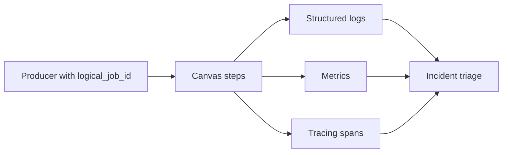

[← Назад к индексу части](index.md)
[↑ К глобальному плану](../celery_mastery_plan.md)

## 10.7. Ограничения Canvas

### Цель раздела

Понять, где заканчивается комфортная зона Canvas, и по каким признакам стоит переходить к более специализированным orchestration-решениям.

### В этом разделе главное

- Canvas отлично работает для умеренно сложных task-graph и stateless шагов.
- При очень сложной логике состояний, длительных процессах и богатой компенсации может потребоваться другой инструмент.
- Критерий выбора - не "модность", а цена сопровождения и риск ошибок.

### Термины

| Термин | Кратко |
| --- | --- |
| **Long-running workflow** | Процессы с длительностью от часов до дней и множеством развилок. |
| **Durable orchestration** | Оркестрация с устойчивым хранением состояния и детерминированным replay истории. |
| **State explosion** | Взрыв количества состояний/переходов, который сложно контролировать вручную. |
| **Operational complexity** | Трудозатраты на поддержку, диагностику и эволюцию решения. |

### Теория и правила

Признаки, что Canvas становится "тесным":

1. Сотни узлов и ветвлений в одном logical job.
2. Частые ручные восстановления состояния после сбоев.
3. Сложные правила компенсации и человеко-центричные approval-шаги.
4. Нужна детальная история переходов состояния как первичный артефакт.

Когда смотреть альтернативы:

- **Temporal**: сложные долгоживущие workflow с сильной state-моделью.
- **Airflow/Prefect**: data-пайплайны и планирование DAG с мощной оркестрацией.
- **Собственный orchestration layer**: когда доменная логика уникальна и хорошо формализована.

Сравнение по критериям (упрощённая ориентир-матрица):

| Критерий | Celery Canvas | Temporal | Airflow/Prefect |
| --- | --- | --- | --- |
| Короткие task-графы в сервисе | Сильная сторона | Возможен overkill | Обычно избыточно |
| Долгоживущие stateful workflow | Ограниченно | Сильная сторона | Средне (зависит от сценария) |
| Data-пайплайны и расписания DAG | Базово/ограниченно | Не основной фокус | Сильная сторона |
| Простота встраивания в существующий Celery-стек | Сильная сторона | Нужна отдельная платформа | Отдельный стек/операции |
| Fine-grained replay бизнес-шагов | Требует ручной дисциплины | Встроенная модель | Частично, зависит от инструмента |

#### Наблюдаемость сложных graph execution

Минимум, без которого сложный Canvas быстро становится "чёрным ящиком":

1. Сквозной `logical_job_id` в каждом шаге и callback.
2. Метрики по стадиям: `queued`, `started`, `succeeded`, `failed`, `retried`.
3. Метрика fan-in для `chord`: время между "header completed" и "callback started".
4. Дашборд "top failing steps" и "tail latency per step".



#### Проверь себя по наблюдаемости graph execution

1. Почему метрика "header done -> callback start" критична именно для `chord`?

<details><summary>Ответ</summary>

Она измеряет здоровье fan-in стадии. Если этот интервал растёт, проблема часто в unlock/backend, даже если сами header-задачи выполняются нормально.

</details>

2. Почему одних логов недостаточно для triage сложного Canvas?

<details><summary>Ответ</summary>

Логи дают детали событий, но без метрик и трассировок сложно увидеть системный паттерн: где bottleneck, какой шаг стабильно деградирует, как меняется latency под нагрузкой.

</details>

#### Стоимость хранения состояния больших workflow

Где обычно растёт стоимость:

- массовые результаты дочерних задач в `group/chord`;
- длинное хранение промежуточных статусов без TTL;
- повторные записи при множественных retries.

Практические правила:

1. Храни "достаточно для восстановления", а не "всё навсегда".
2. Применяй TTL и периодическую очистку task/result state.
3. Для тяжёлых payload храни ссылку в object storage, а не весь blob в backend.
4. Разделяй технический state выполнения и финальные бизнес-артефакты.

#### Проверь себя по стоимости хранения state

1. Зачем разделять техническое состояние и бизнес-артефакты?

<details><summary>Ответ</summary>

Потому что у них разный жизненный цикл и ценность: технический state нужен для управления выполнением и может чиститься по TTL, а бизнес-артефакты часто требуют более долгого хранения и другого доступа.

</details>

2. Почему TTL в state store — это не "оптимизация по желанию", а эксплуатационная необходимость?

<details><summary>Ответ</summary>

Без TTL хранилище быстро разрастается, ухудшаются latency и стоимость, а диагностика становится шумной из-за старых нерелевантных записей.

</details>

### Пошагово

1. Оцени текущий workflow по сложности и числу переходов.
2. Посчитай стоимость инцидентов и ручных восстановлений.
3. Сравни "усложняем Canvas" vs "выносим orchestration".
4. Сделай пилот на критичном сценарии.
5. Зафиксируй критерии миграции официально.

### Простыми словами

Canvas - отличный "рабочий инструмент", но не универсальный ответ на любую orchestration-задачу.  
Если ты тратишь больше времени на "управление сложностью графа", чем на бизнес-логику, пора пересматривать стек.

### Картинка в голове

```text
Сложность workflow
^
|            [Нужен другой orchestrator]
|         /
|      /
|   / [Canvas комфортная зона]
+------------------------------> Масштаб/длительность/ветвления
```

### Как запомнить

**Инструмент хорош, пока стоимость его эксплуатации ниже стоимости альтернативы.**

### Примеры

- До 5-10 шагов и умеренный fan-out: обычно Canvas достаточен.
- Длительный бизнес-процесс с человеческими approval и откатами: часто лучше durable orchestrator.
- Огромные data-DAG с расписаниями и SLA-окнами: чаще Airflow/Prefect класс.

### Практика / реальные сценарии

- Команда годами наращивала вложенные `chord`/`chain`, потом мигрировала критичный процесс в Temporal из-за сложности replay.
- Batch-ETL перевели в Airflow, а Celery оставили для отдельных вычислительных worker-задач.

### Типичные ошибки

- "Мы уже на Celery, значит всё должно быть в Celery".
- Не считать стоимость on-call и ручной triage сложного Canvas-графа.
- Мигрировать слишком поздно, когда инциденты уже регулярны.

### Что будет, если...

- **...игнорировать сигнал, что workflow перерос Canvas?**  
  Рост техдолга, длинные инциденты, fragile-изменения, сложные регрессы при любом рефакторинге.

### Проверь себя

1. Какой технический признак чаще всего показывает "state explosion"?

<details><summary>Ответ</summary>

Постоянно растущее число специальных веток/исключений и ручных процедур восстановления, которые не укладываются в простой граф задач.

</details>

2. Почему выбор оркестратора - это не только вопрос функционала?

<details><summary>Ответ</summary>

Потому что важны эксплуатационная стоимость, качество диагностики, скорость изменений и устойчивость команды в on-call режиме.

</details>

3. Когда разумно оставить Canvas даже при росте нагрузки?

<details><summary>Ответ</summary>

Когда логика остаётся понятной, шаги хорошо идемпотентны, инциденты редки и затраты на переход выше потенциальной выгоды.

</details>

### Запомните

- У Canvas есть сильная зона применимости.
- Своевременная переоценка инструмента снижает риск архитектурного тупика.

---
