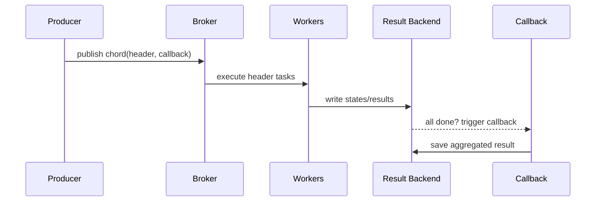

[← Назад к индексу части](index.md)
[↑ К глобальному плану](../mastery_plan.md)

## 10.8. Ошибки, частичный успех и callback-и в Canvas

### Цель раздела

Освоить практическую обработку ошибок в composition-графах: как ведут себя `chain/group/chord`, где применимы `link`/`link_error`, и как сделать callbacks безопасными к повторной доставке.

### В этом разделе главное

- Ошибки в середине `chain` обычно стопорят дальнейшие шаги.
- `group` может завершиться частично успешно, и это нужно обрабатывать явно.
- `chord` требует ясной стратегии на случай падения части header-задач.
- `link`/`link_error` полезны, но не заменяют полноценную модель ошибок workflow.

### Термины

| Термин | Кратко |
| --- | --- |
| **`link`** | Callback при успешном завершении задачи. |
| **`link_error`** | Callback при ошибке задачи. |
| **Error propagation** | Как исключение в одном узле влияет на соседние узлы графа. |
| **Retry storm** | Массовые ретраи, которые сами становятся причиной деградации. |
| **Idempotent callback** | Callback, безопасный к повторной доставке. |

### Теория и правила

Интуиция: сложный граф обязан иметь "политику отказов", иначе частичный успех превращается в хаос.

Поведение по примитивам:

1. **Chain**: ошибка в шаге N -> шаги N+1..M обычно не запускаются.
2. **Group**: часть задач может быть success, часть fail; агрегировать нужно осознанно.
3. **Chord**: ошибка в header влияет на запуск/семантику callback (зависит от реализации и политики).

`link`/`link_error`:

- хороши для локальных реакций (логирование, уведомление, лёгкая компенсация);
- недостаточны как единственный механизм управления сложным workflow.

Матрица поведения при ошибках:

| Примитив | Где возникла ошибка | Типичный эффект | Что делать |
| --- | --- | --- | --- |
| `chain` | шаг N | шаги N+1.. не запускаются | triage шага N, replay/compensation |
| `group` | часть дочерних задач | mixed success/failure | policy агрегации + quarantine failed items |
| `chord` | часть header-задач | риск срыва/искажения callback | clear policy: strict vs degraded mode |

Ограничения `link` / `link_error`, которые часто недооценивают:

1. Это callback на уровень отдельной задачи, а не полный orchestrator.
2. Порядок/гарантии вызова при сложных графах могут быть неочевидны без явной модели.
3. Через них удобно послать сигнал/лог, но опасно строить сложную бизнес-сага-логику.

#### Проверь себя по `link` / `link_error`

1. Когда `link_error` уместен, а когда уже недостаточен?

<details><summary>Ответ</summary>

Уместен для локального side-effect (лог, маркер инцидента, уведомление). Недостаточен, когда нужна координация нескольких шагов, управление компенсациями и полной моделью состояния workflow.

</details>

2. Почему перенос сложной recovery-логики в `link_error` — плохой паттерн?

<details><summary>Ответ</summary>

Потому что callback уровня одной задачи не даёт надёжной модели оркестрации всего графа и усложняет предсказуемость поведения при повторных доставках/частичных сбоях.

</details>

### Пошагово

1. Определи классы ошибок для каждого шага.
2. Для transient-ошибок задай bounded retry с backoff+jitter.
3. Для permanent/data-ошибок - fail-fast и quarantine path.
4. Для callback сделай идемпотентный контракт.
5. Для partial success зафиксируй recovery-план: replay, compensation, manual review.

### Простыми словами

В distributed-графе "всё идеально и с первого раза" бывает редко.  
Надёжность приходит, когда ты заранее решаешь: что повторяем, что останавливаем, что компенсируем.

### Картинка в голове



### Как запомнить

**Ошибка в графе - это не "исключение в коде", а "переход в новое состояние системы".**

Мини-схема решений при partial success:

```text
Ошибка в графе
   |
   +--> transient? ---- yes --> bounded retry
   |                         \
   |                          exhausted --> compensation/manual review
   |
   +--> permanent/data? -- yes --> fail-fast + quarantine
   |
   +--> можно degraded-result? -- yes --> callback в degraded mode + quality flag
```

### Примеры

```python
@celery_app.task
def on_success(result):
    # lightweight callback
    return {"observed": True}

@celery_app.task
def on_error(request, exc, traceback):
    # error handler: лог + инцидентная метка
    return {"error": str(exc)}

sig = process_user.s(42).set(
    link=on_success.s(),
    link_error=on_error.s()
)
sig.apply_async()
```

Пример безопасного `link_error`: не делать в нём тяжёлую бизнес-логику, а только фиксировать факт и ставить задачу triage.

```python
@celery_app.task
def mark_failed_step(job_id: str, step: str, reason: str) -> None:
    # запись в incident/state store
    return None

@celery_app.task
def handle_error(request, exc, traceback):
    mark_failed_step.delay(
        job_id=request.headers.get("logical_job_id", "unknown"),
        step=request.task,
        reason=str(exc),
    )
```

### Практика / реальные сценарии

- `chain` обработки документа, где на шаге OCR временно падает внешний сервис.
- `group` массовой валидации, где 2% элементов приходят с некорректным payload.
- `chord` агрегации отчёта, где один источник недоступен, но нужен fallback-режим.

### Типичные ошибки

- Ретраить всё подряд без классификации.
- Делать callback с побочными эффектами без идемпотентности.
- Не иметь стратегии для partial success.

### Что будет, если...

- **...не контролировать retry budget в графах?**  
  Локальный сбой легко превращается в retry storm с деградацией всей Celery-платформы.

### Проверь себя

1. Почему `link_error` не заменяет общую политику обработки ошибок workflow?

<details><summary>Ответ</summary>

Потому что это локальный callback конкретной задачи, а не централизованная модель состояний и recovery для всего графа.

</details>

2. Зачем callback в `chord` делать идемпотентным, даже если "обычно он вызывается один раз"?

<details><summary>Ответ</summary>

В распределённой системе возможны повторы и повторные доставки; без идемпотентности callback может создать дубли итоговых эффектов.

</details>

3. Что важнее при partial success: "починить быстро" или "починить воспроизводимо"?

<details><summary>Ответ</summary>

В production обычно важнее воспроизводимость: понятный recovery-процесс, который можно повторять без новых рисков и ручной магии.

</details>

### Запомните

- В Canvas-графах главное не отсутствие ошибок, а управляемость ошибок.
- Partial success должен быть нормальным, заранее описанным сценарием.

---
