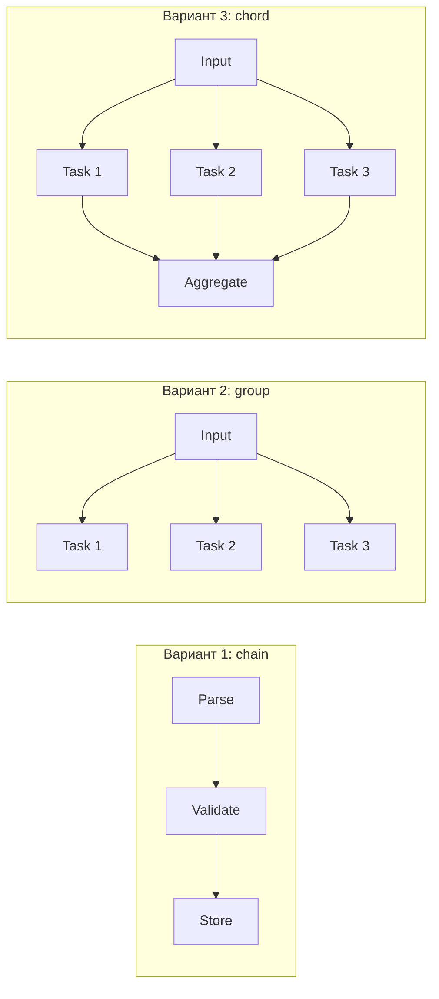
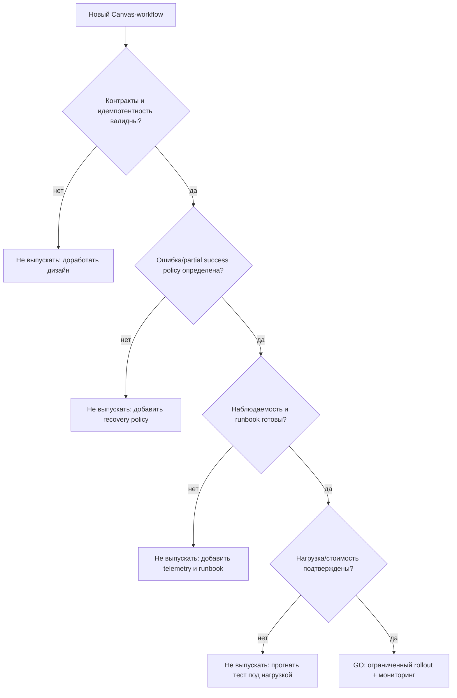

[← Назад к индексу части](index.md)
[↑ К глобальному плану](../celery_mastery_plan.md)

## Частые сценарии

### Сценарий 1. "Нужно последовательно обработать заказ"

- Рекомендуемо: `chain` с явными контрактами шагов.
- Обязательно: idempotency key на внешних эффектах (платёж, уведомления).
- Ошибка: делать один гигантский шаг "всё сразу".

### Сценарий 2. "Нужно обработать 50k независимых элементов"

- Рекомендуемо: staged fan-out + `chunks`.
- Обязательно: backpressure, лимиты на внешний API.
- Ошибка: отправить все задачи одновременно в один burst.

### Сценарий 3. "Нужно параллельно посчитать и один раз агрегировать"

- Рекомендуемо: `chord` с идемпотентным callback.
- Обязательно: capacity-check для result backend.
- Ошибка: тяжёлый callback без retry-контракта и без дедупликации эффекта.

### Сценарий 4. "Часть workflow уже выполнена, один шаг упал"

- Рекомендуемо: replay конкретного шага по checkpoint-state.
- Обязательно: фиксировать applied-steps в state store.
- Ошибка: бездумно перезапускать весь workflow.

### Сценарий 5. "Один и тот же бизнес-кейс, но неясно: chain/group/chord?"

Быстрая эвристика:

- если шаги строго зависят друг от друга -> `chain`;
- если шаги независимы и итог по каждому нужен отдельно -> `group`;
- если шаги независимы, но нужен единый финальный результат -> `chord`.

Визуальное сравнение на одном кейсе:

Что часто путают:

- использовать `chain` там, где шаги можно распараллелить;
- использовать `group`, когда на самом деле нужен обязательный fan-in callback;
- запускать `chord` по привычке, хотя финальная агрегация не нужна.

---

### Мини-runbook диагностики Canvas

| Симптом | Вероятная причина | Что проверить первым шагом | Действие |
| --- | --- | --- | --- |
| `chord` callback не стартует | Нет/сломан result contract у header (в т.ч. `ignore_result`) или деградация backend | Статусы header-задач, доступность backend, политику результата задач | Восстановить контракт результатов, стабилизировать backend, перезапустить fan-in безопасно |
| Очень медленный `group` при большом fan-out | Burst-нагрузка, saturation worker-ов, внешний API throttling | Queue depth, tail latency, долю 429/5xx внешних вызовов | Staged fan-out, уменьшить batch/concurrency, добавить backpressure |
| `chain` "толстеет" и тормозит на поздних шагах | Рост payload между шагами и дорогая сериализация | Размер сообщений/результатов по шагам | Передавать ID/pointer вместо blob, хранить крупные артефакты во внешнем storage |
| Worker резко тратит CPU на "пустой" нагрузке | Пересериализация тяжёлых структур и избыточные поля в payload | Размер/структуру payload и частоту отправки | Упростить контракт payload, вынести тяжёлые данные в storage, сократить verbosity сообщений |
| Частые дубли итогового эффекта | Неидемпотентный callback или некорректный replay | Наличие idempotency key/unique constraint на финальном шаге | Ввести идемпотентный контракт callback и явную дедупликацию эффекта |
| Сложно понять, где "сломался" workflow | Нет сквозной корреляции logical job | Логи/метрики по `logical_job_id`, связка `task_id` со step state | Обязательная correlation-модель и единый triage-dashbord по шагам |

Короткий порядок действий при инциденте:

1. Зафиксировать `logical_job_id` и границы инцидента по времени.
2. Найти первое звено, где состояние отклонилось от ожидаемого.
3. Разделить причину на transient/permanent/data/config.
4. Решить тактику: bounded retry, replay шага, compensation или manual review.
5. Зафиксировать пост‑инцидентный guardrail (лимит, метрика, правило маршрутизации).

#### Проверь себя по мини-runbook

1. Почему в runbook после локализации причины сразу фиксируется guardrail?

Ответ

Чтобы инцидент не повторился в той же форме: guardrail переводит разбор из "разового тушения" в устойчивое системное улучшение (лимит, алерт, политика маршрутизации).

2. Что важнее на первом шаге triage: "быстро перезапустить" или "зафиксировать границы инцидента"?

Ответ

Сначала зафиксировать границы и факты. Иначе легко потерять контекст и принять действие, которое усугубит состояние (например, создаст дубли при повторном запуске).

---

### Pre-release чек-лист Canvas-workflow

Перед выпуском новой `chain/group/chord`-композиции в production пройди короткий **go/no-go** чек:

| Проверка | Вопрос | Go-критерий |
| --- | --- | --- |
| Контракты шагов | Понятны ли вход/выход каждого шага и их совместимость? | Есть явная схема данных и валидация |
| Идемпотентность | Может ли каждый критичный шаг быть безопасно повторён? | Есть idempotency key/unique guard |
| Ошибки и retries | Ошибки разделены на transient/permanent/data? | Retry только там, где это лечит проблему |
| Partial success | Понятно, что делать при частично успешном графе? | Есть documented recovery path |
| Chord readiness | Для `chord` корректно настроено хранение результатов? | Backend стабилен, `ignore_result` не ломает fan-in |
| Наблюдаемость | Хватает ли сигналов для triage? | Есть `logical_job_id`, метрики, логи, алерты |
| Стоимость | Не "съедает" ли orchestration полезную работу? | Batch size и fan-out подтверждены замерами |
| Эксплуатация | Есть ли простой runbook для on-call? | Команда может воспроизвести диагностику по шагам |

Быстрый decision flow:

Почему это важно: в Canvas чаще всего ломается не «код функции», а связка из контрактов, retries, fan-in механики и наблюдаемости. Чек-лист защищает от выпуска «логически красивого», но операционно хрупкого workflow.

#### Проверь себя по pre-release чек-листу

1. Почему workflow нельзя выпускать в production, если "код работает", но нет наблюдаемости и runbook?

Ответ

Потому что рабочий код без операционной управляемости превращается в риск при первом сбое: команда не сможет быстро локализовать причину, безопасно восстановить состояние и предотвратить повтор.

2. Что означает `GO` в decision-flow: "выпускаем всем сразу"?

Ответ

Нет. `GO` означает контролируемый rollout с мониторингом и готовностью быстро откатить/ограничить влияние при ухудшении метрик.

---
