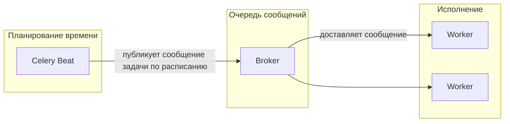
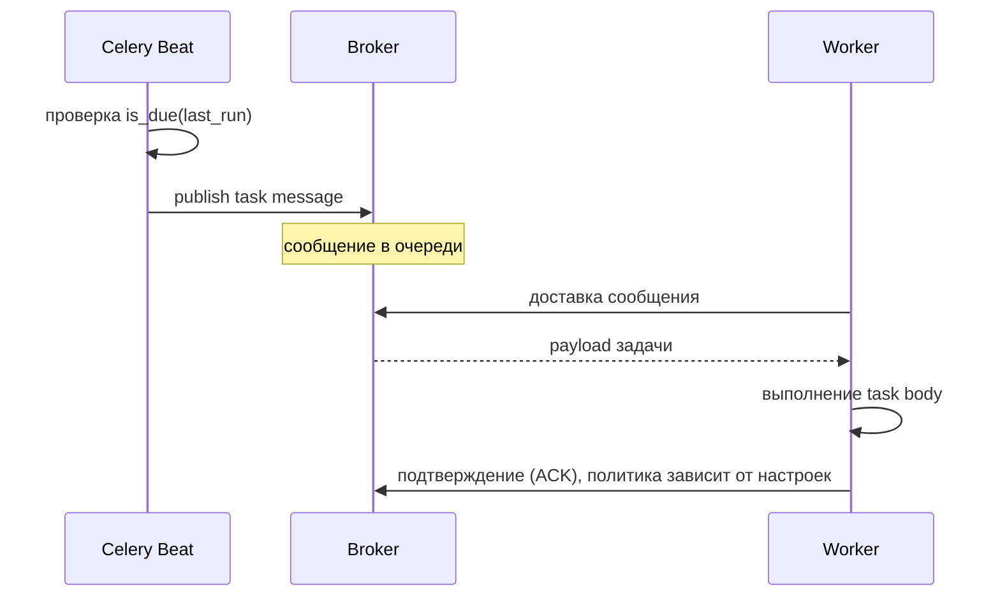

[← Назад к индексу части](index.md)
[↑ К глобальному плану](../../mastery_plan.md)

## Сквозная схема: кто кого запускает

**Простыми словами:** beat говорит «сейчас нужно поставить задачу в очередь», broker хранит/маршрутизирует сообщение, worker его забирает и выполняет.

Важно: beat **не обязан** знать, **какой именно** worker возьмёт задачу. Он лишь инициирует постановку в очередь согласно маршрутизации.

Если beat или broker отстают, сообщения **накапливаются** в очереди; worker обработает их позже — это уже вопрос **политики нагрузки** (см. 11.3), а не «точности cron».

### Диаграмма последовательности: одно срабатывание расписания

**Эксплуатационный вывод:** момент **постановки** и момент **начала исполнения** разделены очередью. Фраза «задача запланирована на 02:00» означает «beat попытался поставить в очередь около 02:00», а не «работа завершилась к 02:01».

#### Проверь себя: сквозная схема beat → broker → worker

1. Почему на схеме несколько **worker**, но обычно один **beat** на набор периодических правил?

Ответ

**Масштабирование исполнения** — горизонтально через пул worker-ов, они конкурируют за сообщения. **Планировщик** без координации при нескольких экземплярах дублирует **публикацию** одинаковых тиков; поэтому beat по умолчанию **один** или координируемый.

2. Что изменится в понимании SLA, если забыть про разрыв между **постановкой** и **стартом** worker?

Ответ

Вы обещаете бизнесу «в 02:00 готово», хотя в 02:00 только **сообщение встало в очередь**; при перегруженной очереди работа начнётся позже. SLA нужно вешать на **завершение** с метриками очереди или на явный контракт «поставлено до».

3. На каком участке **sequenceDiagram** искать причину, если задача «должна была тикнуть», но worker ничего не видит?

Ответ

Между **Beat** и **Broker** (публикация прошла?) и далее **маршрутизация/очередь** (сообщение не в той очереди, которую слушает worker). Само выполнение `task body` наступает только после доставки из broker.

---
