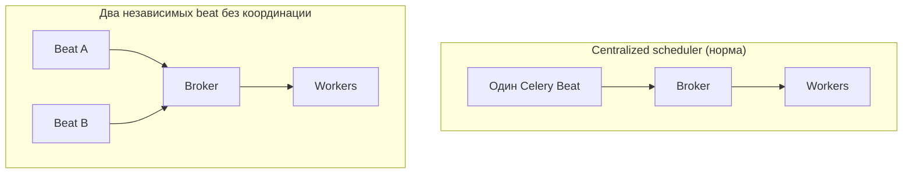
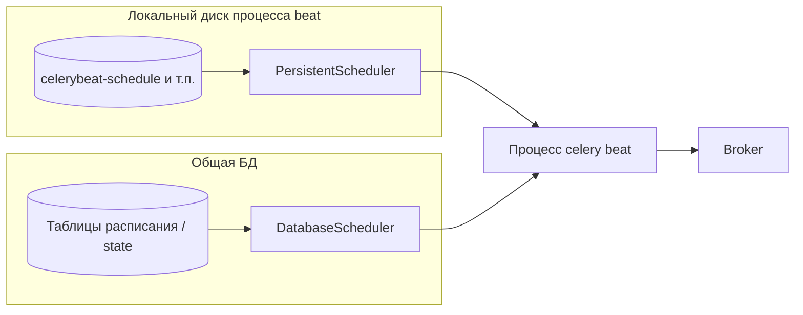

[← Назад к индексу части](index.md)
[↑ К глобальному плану](../../mastery_plan.md)

## 11.1. Celery Beat

### Цель раздела

Отделить в голове **планирование** от **исполнения** и понять эксплуатационные правила, без которых периодика почти гарантированно даёт дубликаты.

### В этом разделе главное

- Beat — это **отдельный процесс** (`celery -A proj beat`), который читает расписание и **публикует задачи**.
- Архитектурный паттерн: **centralized scheduler** — один планировщик на связку расписаний (если нет специальной координации).
- Несколько beat **без координации** ≈ несколько независимых cron, которые дублируют друг друга.
- Расписание может жить в **коде** или в **БД** (через расширения), и это меняет операционную модель.

### Термины

| Термин | Кратко |
| --- | --- |
| **Producer** | Компонент, который отправляет сообщения задач в broker. Beat выступает producer-ом для периодики. |
| **Entry** | Элемент расписания: что запускать и каким расписанием. |
| **Scheduler implementation** | Внутренняя реализация: как хранится состояние «когда следующий запуск». |
| **PersistentScheduler** | Планировщик, который может хранить **последнее время** срабатывания в файле (`celerybeat-schedule`). |

### Теория и правила

**Интуиция:** представь офис, где **диспетчер** каждые утра ставит заявки в общую корзину, а **исполнители** берут заявки из корзины. Beat — диспетчер расписания, workers — исполнители.

**Формально:**

1. Beat периодически просыпается и проверяет: **наступило ли время** для каких-то entries.
2. Если да — формируется **отправка задачи** (как правило, эквивалент `apply_async` с нужными аргументами и опциями).
3. Worker-ы конкурируют за сообщение (в зависимости от брокера и prefetch), и один из них выполнит задачу.

**Centralized scheduler pattern** означает:

- есть **один компонент**, который отвечает за decision «запускать сейчас или нет» для данного набора периодических правил;
- если их несколько **независимых**, decision дублируется.



**Почему несколько beat-инстансов опасны**

- Каждый beat читает **то же расписание** и считает себя полномочным.
- В стандартной модели **нет встроенного распределённого консенсуса** «только один из вас должен стрелять».
- Итог: **двойная публикация** → две одинаковые задачи в очереди → два параллельных исполнения.

Когда «несколько beat» бывает осознанно?

- Редко и только с **координацией**: разные beat с **разными** расписаниями/разделением ответственности, либо **лидерский** beat (leader election), либо **database scheduler** с блокировками (см. 11.6), либо внешний планировщик (Airflow/Temporal/cron+k8s Job) вместо beat для части процессов.

**Локальный файл расписания (`celerybeat-schedule`)**

- Некоторые scheduler-ы хранят **состояние** последних запусков на диске.
- Это важно для **интервальных** расписаний: чтобы после рестарта beat не «наверстал» слишком агрессивно или, наоборот, вёл себя предсказуемо.
- В контейнерах/Kubernetes **локальный диск** часто эфемерный: файл состояния может **теряться** при рестарте pod → меняется поведение «следующего запуска». Это не всегда баг, но это **всегда** предмет осознанной политики.

**Database-backed scheduler**

- Идея: расписание и/или состояние живут в **БД**, чтобы:
  - менять расписание **без деплоя**;
  - иногда — координировать несколько инстансов (зависит от реализации);
  - централизовать аудит «что должно запускаться».

**Файл состояния vs БД (где живёт «память» планировщика):**



- **Файл:** проще для «голого» Celery без Django; в k8s без volume — **сброс** last_run и сюрпризы для interval после рестарта.
- **БД:** операции над расписанием и аудит; требует миграций и доступа; поведение при **нескольких beat** — только по доке вашей связки версий.

**Внутренний цикл beat (как «тикает» планировщик)**

Beat — не «спящий cron на секунду в секунду», а процесс с **циклом опроса** расписаний:

- между итерациями есть **пауза** (в конфигурации Celery задаётся через параметр вроде **`beat_max_loop_interval`** — имя и умолчание зависят от версии, сверяйте документацию);
- если интервал опроса **больше**, чем ваш короткий период задачи, возможны **задержки срабатывания** относительно «идеальных» секунд на часах;
- для задач с интервалом **меньше** цикла beat практическая точность запуска определяется этим циклом, а не только `schedule`.

**Простыми словами:** beat просыпается «порциями», проверяет, кому пора, снова засыпает на короткое время. Если вы ожидаете математически ровные интервалы с микросекундной дисциплиной — это уже не тот класс систем.

**Структура записи в `beat_schedule` (контракт entry)**

Типичные ключи словаря для одной периодической задачи:

| Поле | Назначение |
| --- | --- |
| `task` | Строковое имя задачи Celery (`"proj.tasks.foo"`). |
| `schedule` | Объект расписания (`schedule`, `crontab`, `solar`, кастом). |
| `args` / `kwargs` | Позиционные и именованные аргументы вызова. |
| `options` | Опции `apply_async`: `queue`, `routing_key`, `expires`, `priority` и т.д. |

Поле **`options`** — мост между периодикой и **частью 12**: отсюда же задают очередь, чтобы ночной отчёт не конкурировал с интерактивными задачами в одной default-очереди.

#### Проверь себя: запись `beat_schedule` и цикл beat

1. Зачем в entry указывать **`options.queue`**, если задача и так зарегистрирована в приложении?

<details><summary>Ответ</summary>

Чтобы **маршрутизировать** периодику в выделенную очередь с отдельными worker-ами, лимитами и SLA: иначе всё уходит в default и может **вытеснять** или быть вытеснённым интерактивным трафиком. Это мост к **части 12** про topology.

</details>

2. Как **`beat_max_loop_interval`** (или аналог) может испортить ожидания для задачи «каждые 5 секунд»?

<details><summary>Ответ</summary>

Beat просыпается **пакетами**; если ваш период **короче** практического шага цикла опроса, срабатывания будут **грубее**, чем «идеальные» 5 секунд на часах. Для критичной точности нужны другой класс планировщика или осознанный приём погрешности + метрики.

</details>

3. Чем поле **`task`** в entry должно совпадать с реальным кодом?

<details><summary>Ответ</summary>

Со **строковым именем**, под которым задача **зарегистрирована** в Celery (`"package.module.task_name"`). Опечатка даёт «не зарегистрирована» при исполнении; то же риск для `PeriodicTask.task` в БД.

</details>

### Пошагово: минимальный контур с beat

1. В приложении Celery определи `app.conf.beat_schedule` (или эквивалентную конфигурацию).
2. Запусти worker: `celery -A proj worker -l info`.
3. Запусти beat: `celery -A proj beat -l info`.
4. Убедись в логах beat, что entries **срабатывают**, а в логах worker — что задачи **приходят**.

### Простыми словами

Beat — это **будильник**, который не делает работу сам, а **ставит напоминание в очередь**. Worker — тот, кто **выполняет напоминание**.

### Картинка в голове

Один будильник на комнату — ок. Два будильника на одну и ту же встречу без договорённости — вы проснётесь, условно, **дважды**.

### Как запомнить

**Beat публикует, worker исполняет. Один beat без координации — золотое правило по умолчанию.**

### Примеры

**Пример A. Расписание в конфиге (идея кода)**

```python
# celeryconfig.py или модуль настроек Celery
from celery.schedules import crontab

beat_schedule = {
    "echo-every-30s": {
        "task": "proj.tasks.ping",
        "schedule": 30.0,  # каждые 30 секунд (см. также schedule объект ниже)
        "options": {"queue": "periodic"},
    },
    "daily-report": {
        "task": "proj.tasks.build_daily_report",
        "schedule": crontab(hour=2, minute=15),  # 02:15 (в контексте настроек TZ см. 11.2)
        "args": (),
        "kwargs": {"mode": "incremental"},
    },
}
```

Замечание по `30.0`: в документации Celery обычно используют явный объект расписания; число — удобная форма «интервала в секундах» в конфиге, но в проектах часто предпочитают **`celery.schedules.schedule(seconds=30)`** для явности.

**Пример B. Запуск процессов**

```bash
celery -A proj worker -Q periodic,celery -l info
celery -A proj beat -l info
```

### Расширение: CLI beat, файл состояния и pidfile

**Зачем знать:** в production диагностика «beat не тикает» часто упирается в путь к schedule-db и pidfile.

- **`--schedule` / `beat_schedule_filename`**: где лежит файл состояния планировщика (часто `celerybeat-schedule`). В контейнере без persistent volume файл **сбрасывается** при рестарте pod.
- **`--pidfile`**: pidfile процесса beat; полезен для init-скриптов и systemd; в Docker иногда отключают или перенаправляют в tmpfs — смотри, чтобы оркестратор не «убивал» процесс из-за дублирующего запуска.
- **`--loglevel`**: стандартная диагностика; для периодики полезно видеть **какие entries** сработали.

Идея **PersistentScheduler** (термин из экосистемы Celery): планировщик, который помнит **последние времена** срабатывания на диске, чтобы после рестарта не «наслоить» странное поведение на interval-задачи. Точное имя класса и умолчания зависят от версии Celery — в проекте это стоит **сверить с документацией вашей версии**.

**Связь с координацией:** если вы хотите HA beat, обычно не поднимают два процесса с одним и тем же файлом состояния на общем диске без строгой документации — чаще выбирают **один** beat или **database scheduler** с понятной моделью блокировок.

#### Проверь себя: файл состояния, CLI, pidfile

1. Что изменится в поведении **interval**-задачи после рестарта pod, если `celerybeat-schedule` лежит на **эфемерном** диске?

<details><summary>Ответ</summary>

Состояние **last_run** часто **теряется**; при следующем старте beat может вести себя иначе относительно «наверстать» или сдвинуть следующий тик по сравнению с непрерывно работавшим процессом. Это не всегда баг, но должно быть **осознанной** политикой.

</details>

2. Зачем в проде смотреть флаг **`--schedule`** / `beat_schedule_filename` при инциденте «beat врёт по времени»?

<details><summary>Ответ</summary>

Чтобы убедиться, что смотрите **тот же файл состояния**, что реально использует процесс (не другой путь в контейнере, не смонтированный volume, не старый артефакт деплоя).

</details>

3. Как **pidfile** связан с риском **двух процессов beat**?

<details><summary>Ответ</summary>

Если pidfile отключён или в tmpfs, **init/systemd/оркестратор** может не распознать уже работающий процесс и запустить **второй** beat с тем же расписанием → дубли постановки. Нужна дисциплина запуска: один процесс на конфиг или явная координация.

</details>

### Практика / реальные сценарии

- В **Kubernetes** обычно отдельные Deployment для worker и beat; у beat часто **1 реплика** (HPA на beat почти всегда подозрителен).
- В **docker-compose** — два сервиса: `worker` и `beat`, не «масштабировать beat горизонтально без причины».

### Типичные ошибки

- Запустить **два beat** «для надёжности» без координации.
- Хранить `celerybeat-schedule` на эфемерном томе и удивляться сдвигам после рестартов.
- Думать, что beat «выполняет задачи быстрее», если поднять ещё один beat (на самом деле это часто **дублирование**).

### Что будет, если…

- **Если beat остановлен, а worker работает:** периодические задачи **не ставятся** в очередь (если их не инициирует кто-то ещё).
- **Если worker остановлен, а beat работает:** сообщения **будут копиться** в broker (до лимитов/политик retention), затем обработаются, когда worker вернётся — это может вызвать **лавину** и нарушить предположения о «раз в сутки одна работа».

### Проверь себя

1. Почему «два beat для отказоустойчивости» — опасная формулировка без уточнений?

<details><summary>Ответ</summary>

Потому что отказоустойчивость достигается **координацией** (лидерство, БД-локи, внешний scheduler), а не вторым независимым публикатором. Два независимых beat чаще дают **дубликаты**, чем «HA».

</details>

2. Чем beat принципиально отличается от cron, который вызывает `celery call`?

<details><summary>Ответ</summary>

Cron — внешний планировщик, который тоже является **producer** сообщений/команд. Beat — **встроенный** планировщик Celery с единым конфигом и типовыми механизмами хранения состояния. Семантически оба публикуют работу, но отличаются эксплуатацией, интеграцией с кодом Celery и рисками дублирования, если оба используются одновременно для одного и того же.

</details>

3. Нужен ли result backend для работы beat?

<details><summary>Ответ</summary>

Для **постановки периодических задач** result backend не является обязательным компонентом. Он нужен, если вы **читаете результаты** задач или используете механики, завязанные на хранение результатов/состояний (это ближе к темам задач и canvas, не к beat).

</details>

### Запомните

- **Один beat** — дефолтная безопасная модель.
- Beat **публикует**, worker **исполняет**.
- Файл состояния и **эфемерные диски** — частая причина «странного» времени следующего запуска.

---
