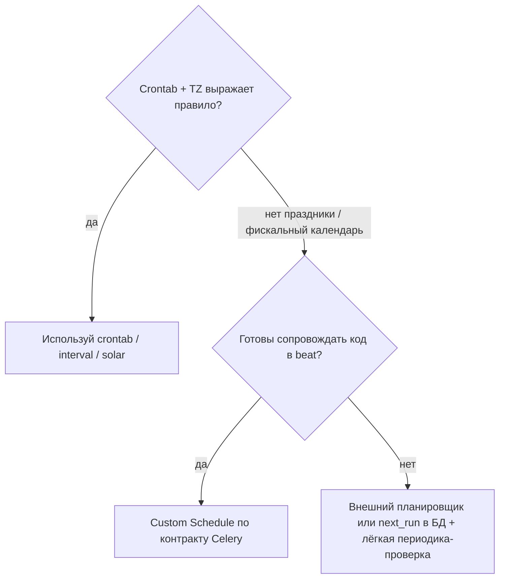
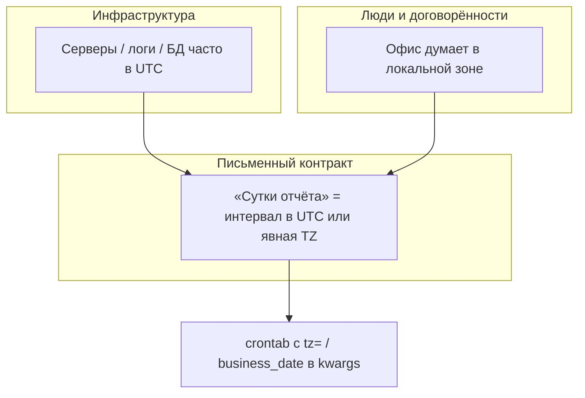
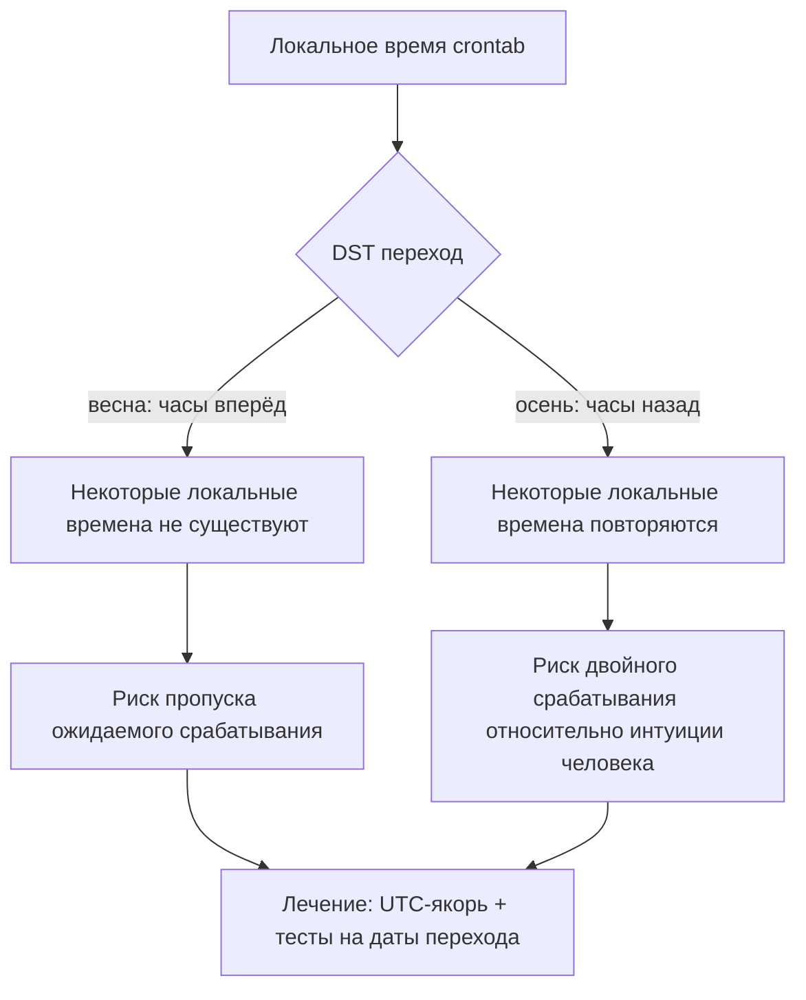

[← Назад к индексу части](index.md)
[↑ К глобальному плану](../celery_mastery_plan.md)

## 11.2. Виды расписаний

### Цель раздела

Научиться выбирать тип расписания так, чтобы требование бизнеса к «когда» было выражено **однозначно** и предсказуемо с учётом времени.

### В этом разделе главное

- **`schedule` / interval** — «каждые N секунд».
- **`crontab`** — «в такие моменты календаря».
- **`solar`** — «около восхода/заката».
- **Пользовательские schedule classes** — когда стандартных кирпичиков мало.
- **Timezone и DST** — отдельный источник багов.

### Термины

| Термин | Кратко |
| --- | --- |
| **Timezone-aware schedule** | Расписание, интерпретируемое с привязкой к конкретной зоне (важно для crontab). |
| **UTC vs локальное время** | Production почти всегда стремится к **UTC** как к «линейке», но бизнес-требования часто в локальной зоне. |
| **DST** | Переход часов: «пропавший» час и «повторяющийся» час в локальном времени. |

### Теория и правила

#### Interval schedule (`celery.schedules.schedule`)

**Интуиция:** таймер «сработало → подожди N секунд → снова».

Нюансы:

- После простоя beat/брокера поведение «наверстать пропущенное» **не является универсальным догмой Celery**: многое зависит от scheduler state и того, как давно beat не работал. Поэтому для критичных бизнес-процессов **политика catch-up** должна быть в **задаче** (см. 11.3).
- Короткие интервалы при большой длительности задачи → **overlap** (снова 11.3).

##### Проверь себя: interval

1. Почему после простоя beat нельзя **автоматически** считать, что Celery «наверстает» все пропущенные тики interval в ожидаемом виде?

<details><summary>Ответ</summary>

Поведение зависит от **scheduler state**, длительности простоя и реализации: универсальной семантики «как Quartz misfire» в Celery нет. Критичную **catch-up/skip** политику задают в **коде задачи** и мониторинге, а не предполагают по умолчанию.

</details>

2. Сравни **interval** и **crontab** с точки зрения чувствительности к **DST**.

<details><summary>Ответ</summary>

**Interval** — относительный шаг «через N секунд», к календарным переходам часов привязан слабее. **Crontab** в **локальной** зоне напрямую страдает от пропавшего/повторившегося часа; в **UTC** с явным `tz` риски ниже, но бизнес-интерпретация «суток» всё равно требует договора.

</details>

#### Crontab (`celery.schedules.crontab`)

**Интуиция:** как cron: «в 02:15 каждый день», «каждые 5 минут в будни» и т.п.

Поля (обычно): `minute`, `hour`, `day_of_week`, `day_of_month`, `month_of_year`.

**Синтаксис полей (как в cron-подобных системах):**

- `*` — любое допустимое значение;
- `*/5` — каждые 5 единиц поля (например, каждые 5 минут);
- `1-5` — диапазон;
- `1,3,5` — перечень;
- комбинации вроде `hour='*/2', minute='30'` — каждые 2 часа в :30 минут.

```text
 ┌───────────── минута (0–59)
 │ ┌──────────── час (0–23)
 │ │ ┌────────── день месяца (1–31)
 │ │ │ ┌──────── месяц (1–12)
 │ │ │ │ ┌────── день недели (0–7, 0 и 7 часто = воскресенье — уточняйте по доке Celery)
 │ │ │ │ │
 * * * * *
```

Важно:

- Указание `crontab(hour=9)` без явной TZ-логики требует понимания, **в какой зоне** живёт beat и как настроены **`timezone`** / **`enable_utc`** в Celery: одно и то же поле `hour=9` может означать разное «на стене» в разных окружениях.
- Практика: фиксировать в коде/доке **явно**: «отчёт строится в 09:00 **Europe/Moscow**» и задавать `tz=` у `crontab` или единый `timezone` в конфиге — но **не полагаться** на «у нас сервер вроде в UTC».

**Сравнение: interval vs crontab**

| Критерий | Interval (`schedule`) | Crontab |
| --- | --- | --- |
| Вопрос бизнеса | «Как часто опрашивать/подтягивать?» | «В какие календарные моменты?» |
| Пример | Каждые 5 минут | Каждый день в 02:15 |
| Чувствительность к DST | Ниже (интервал относительный) | Выше при локальной зоне |
| Риск overlap | Если период < длительности задачи | Если задача длиннее окна до следующего срабатывания |

##### Проверь себя: crontab

1. Что означает выражение `hour='*/2', minute='30'` в духе cron?

<details><summary>Ответ</summary>

Запуск **каждые два часа** в минуту **:30** (в контексте полей часа/минуты и выбранной TZ). Точную семантику границ лучше проверить тестом на вашей версии Celery.

</details>

2. Почему `crontab(hour=9)` без `tz=` и без зафиксированного `timezone` в конфиге — источник «плавает на staging/prod»?

<details><summary>Ответ</summary>

Интерпретация «9:00» зависит от **дефолтной зоны процесса**, `enable_utc` и окружения сервера; staging и prod часто расходятся. Явный **`tz=`** или письменный контракт + единый конфиг убирают неоднозначность.

</details>

#### Solar schedule

**Интуиция:** запуск относительно **астрономических событий** для координат (широта, долгота).

Типовые события в API Celery (имена могут слегка отличаться по версии): **dawn**, **sunrise**, **sunset**, **dusk** — это разные пороги освещённости относительно горизонта, а не «одно и то же сдвинутое на час».

Применение:

- редкое, но полезное для доменов, завязанных на освещённость, энергопотребление, агро, умный дом (с оговорками точности);
- требует **корректных координат** и понимания, что расчёт — **модельный** (атмосфера, рельеф, высота здания не учитываются в базовой формуле).

**Ограничения solar:**

- смещение момента в течение года сильнее, чем у crontab;
- при смене географии объекта нужно обновлять координаты;
- тестировать сложнее, чем «фиксированный час» — обычно мокают дату/библиотеку или используют заранее рассчитанные эталонные значения.

**Цепочка данных для solar (ментальная модель):**


##### Проверь себя: solar

1. Чем **sunset** принципиально отличается от **dusk** в типовой модели Celery solar?

<details><summary>Ответ</summary>

Это разные **пороги освещённости** относительно горизонта (астрономические/гражданские сумерки и т.д. по определению библиотеки), а не просто сдвиг на фиксированное число минут. Для домена важно выбрать событие по смыслу и зафиксировать в требованиях.

</details>

2. Почему solar **сложнее тестировать**, чем crontab на фиксированный час?

<details><summary>Ответ</summary>

Момент срабатывания **плавает** с датой, широтой/долготой и моделью; нужны **моки** времени/библиотеки или эталонные расчёты. Без тестов легко словить сезонный баг.

</details>

#### Пользовательские schedule classes

**Интуиция:** если вам нужно «каждый последний рабочий день месяца» или сложная бизнес-календарика (праздники), стандартного crontab может не хватить.

Практика:

- реализовать **`is_due(last_run_at)`**-подобную семантику в духе celery schedules (см. документацию Celery schedules);
- обязательно покрыть тестами **краевые даты**;
- документировать **часовой пояс** и поведение при DST.



##### Проверь себя: custom schedule vs альтернативы

1. Когда **внешний планировщик** или `next_run` в БД предпочтительнее custom-класса внутри beat?

<details><summary>Ответ</summary>

Когда календарь сложный (праздники, фискальные правила), нужен **аудит**, UI, backfill или команда не готова сопровождать нетривиальный код в процессе beat. Отдельный сервис или БД дают явную модель изменений и меньше «магии» в рантайме beat.

</details>

2. Что обязательно покрыть тестами при внедрении **своего** `Schedule`?

<details><summary>Ответ</summary>

**Краевые даты** (конец месяца, високосный год, переход DST в выбранной TZ), поведение **`is_due`/`remaining_delta`** после простоя и согласованность с документацией **вашей версии** Celery по контракту базового класса.

</details>

### Пошагово: выбрать тип расписания

1. Если нужно «ровно каждые N секунд/минут» независимо от календаря → **interval**.
2. Если нужно «в конкретные часы дней» → **crontab**.
3. Если нужно «вокруг восхода/заката» → **solar**.
4. Если правила календаря бизнеса сложнее → **custom schedule** + тесты + явная TZ-политика.

### Простыми словами

- **Interval** — как «каждые 30 секунд проверь почту».
- **Crontab** — как «каждый понедельник в 10:00».
- **Solar** — как «после заката выключи витринный режим» (условно).

### Картинка в голове

**Crontab** — будильник по **календарю**. **Interval** — метроном. **Solar** — будильник по **солнцу** для конкретного адреса на карте.

### Как запомнить

**Календарь → crontab. Метроном → interval. Солнце → solar. Бизнес-календарь → custom.**

### Примеры

**Интервал каждые 5 минут (явный объект)**

```python
from datetime import timedelta
from celery.schedules import schedule

beat_schedule = {
    "every-5-min": {
        "task": "proj.tasks.sync_external_status",
        # run_every — timedelta или число секунд (зависит от версии; timedelta читается однозначно)
        "schedule": schedule(run_every=timedelta(minutes=5)),
        "options": {"expires": 240},  # сообщение «протухнет», если не успели взять — см. политику
    },
}
```

Числовая форма `"schedule": 300.0` (секунды) в конфиге тоже встречается: она короче, но хуже **самодокументируемости**. В командных стандартах часто выбирают **явный** `timedelta` или `schedule(...)`.

**Crontab по будням**

```python
from celery.schedules import crontab

beat_schedule = {
    "weekday-morning": {
        "task": "proj.tasks.send_ops_digest",
        "schedule": crontab(hour=9, minute=0, day_of_week="1-5"),
    },
}
```

**Solar (иллюстративно)**

```python
from celery.schedules import solar

beat_schedule = {
    "after-sunset": {
        "task": "proj.tasks.arm_night_mode",
        "schedule": solar("sunset", 48.8566, 2.3522),  # примерные координаты
    },
}
```

### Пользовательский класс расписания (скелет идеи)

Когда crontab «не выражает» бизнес-календарь (праздники, последний рабочий день, фискальные периоды), в Celery можно подключать **свой** класс, повторяющий контракт расписаний: главное — предсказуемая семантика **«следующее срабатывание»** и корректная работа с **timezone**.

Упрощённый учебный скелет (не копируйте слепо в production: **базовый класс и имена методов** возьмите из `celery.schedules` для вашей версии Celery и покройте тестами):

```python
# Псевдокод: наследуйтесь от актуального Schedule-базового класса в вашей версии Celery.
class BusinessCalendarSchedule:  # (Schedule)
    """Идея: 'срабатывать в 09:00 по Europe/Moscow в рабочие дни по внутреннему календарю'."""

    def __init__(self, tz="Europe/Moscow"):
        self.tz = tz

    def remaining_delta(self, last_run_at, ffwd, **kwargs):
        # Вычисление timedelta до следующего разрешённого момента
        # с учётом last_run_at, ffwd (fast forward) и tz-aware datetime.
        raise NotImplementedError("реализуйте по документации Celery")

    def is_due(self, last_run_at):
        # Обычно возвращает пару (bool, next_time) в духе celery.schedules
        raise NotImplementedError("реализуйте по документации Celery")
```

**Практический совет:** прежде чем писать свой класс, оцените **внешний планировщик** (Airflow, cloud scheduler) или **хранение next_run в БД** с обычной периодической задачей «раз в минуту проверить, кто due». Часто это дешевле сопровождения, чем нестандартный schedule внутри beat.

##### Проверь себя: скелет пользовательского расписания

1. Зачем в скелете фигурируют и **`remaining_delta`**, и **`is_due`** (в терминах контракта Celery)?

<details><summary>Ответ</summary>

Планировщику beat нужна согласованная семантика **«когда следующий запуск»** и **«пора ли стрелять сейчас»** относительно `last_run_at` и TZ; оба куска участвуют в цикле опроса (конкретные имена/сигнатуры — по доке вашей версии).

</details>

2. Почему в docstring примера указана **Europe/Moscow** явно?

<details><summary>Ответ</summary>

Чтобы не полагаться на неявную зону процесса: пользовательский schedule обязан **документировать и кодировать** TZ-политику, иначе DST и деплой в другом регионе сломают ожидания.

</details>

### Timezone: настройки Celery и crontab

| Настройка / приём | Смысл |
| --- | --- |
| **`timezone`** в конфиге Celery | Имя зоны (например, `Europe/Moscow`) для интерпретации расписаний, где это применимо. |
| **`enable_utc`** | Если `True`, внутренние представления часто держат в UTC; сочетание с `timezone` нужно понимать целиком. |
| **`crontab(..., tz=...)`** (в актуальных версиях) | Явно привязать поля crontab к зоне, чтобы не зависеть от «дефолта процесса». |
| **Единый договор в команде** | «Все отчёты — граница суток по UTC» или «по локали офиса X» — зафиксировать письменно. |

**Две «стрелки времени» (чтобы не путать уровни):**



Инциденты чаще всего там, где **контракт не записан**: все говорят «ночной отчёт», но один имеет в виду **00:00 UTC**, другой — **00:00 в офисе**.

Пример **явного** crontab с зоной (синтаксис уточните по документации вашей версии Celery — параметр может называться иначе):

```python
from celery.schedules import crontab

beat_schedule = {
    "moscow-morning": {
        "task": "proj.tasks.ops_digest",
        "schedule": crontab(hour=9, minute=0, day_of_week="1-5", tz="Europe/Moscow"),
    },
}
```

##### Проверь себя: timezone и контракт

1. Зачем в таблице настроек отдельная строка про сочетание **`enable_utc`** и **`timezone`**?

<details><summary>Ответ</summary>

Внутренние представления и логи часто в **UTC**, а поля crontab — в **именованной зоне**; несогласованное смешение даёт сдвиг «на час» и ошибки в отчётах. Нужно понимать **всю** связку, а не один флаг.

</details>

2. Как **две стрелки времени** (инфра vs люди) связаны с полем **`business_date`** в периодических отчётах?

<details><summary>Ответ</summary>

Инфраструктура и офис думают о времени по-разному; **письменный контракт** фиксирует, как из UTC/локали получается **дата отчёта**, и это передаётся в задачу явно (`kwargs`/правило), а не через «что сейчас на сервере».

</details>

3. Почему недостаточно «у нас везде UTC на серверах» без строки в Confluence про отчёты?

<details><summary>Ответ</summary>

Бизнес всё равно формулирует «вчера», «календарный день в стране X»; без перевода правил в **явный алгоритм** инженеры и аналитики поймут «вчера» по-разному при границе суток.

</details>

### DST: картинка в голове и типовые эффекты



**Запомните:** для **критичных** процессов (финансы, биллинг, юридические сроки) локальный crontab без тестов на DST — классический источник инцидентов.

##### Проверь себя: DST

1. Какой **осенний** эффект DST создаёт риск **двойного** срабатывания crontab в локальной зоне?

<details><summary>Ответ</summary>

**Повторяющийся** локальный час: одно и то же локальное время проходит **дважды**; если триггер привязан к локальному «02:30», событие может соответствовать двум разным UTC-моментам без UTC-якоря и тестов.

</details>

2. Что может случиться с «несуществующим» локальным временем при **весеннем** переходе?

<details><summary>Ответ</summary>

Часть локальных меток **пропадает** при переводе часов вперёд; срабатывание может **перепрыгнуть** на ближайшее валидное время — поведение зависит от TZ-библиотеки и настроек, его нужно **проверить** на вашей связке версий.

</details>

3. Почему для биллинга часто выбирают **UTC** + тесты, а не «удобный локальный cron»?

<details><summary>Ответ</summary>

UTC даёт **монотонную линейку** без пропавших/дублирующихся часов; локальный crontab без тестов на переходы ломает **границы суток** и юридически значимые окна.

</details>

### Практика / реальные сценарии

- Для «каждые N минут» в распределённой системе часто лучше думать не «ровно N», а **окно идемпотентности** + метрики опозданий.
- Для отчётов «в 02:00 ночи» почти всегда нужен явный ответ: **02:00 в какой зоне** и что будет в день DST.

### Типичные ошибки

- Писать crontab «на глаз» без фиксации TZ, а потом удивляться сдвигу на сервере в UTC.
- Использовать интервал 60 секунд для задачи, которая в среднем идёт 5 минут, без политики overlap.
- Смешивать **внешний cron** и **beat** для одной и той же периодики.

### Что будет, если…

- **DST «прыгнул» вперёд:** локальное время «02:30» может **не существовать** — срабатывание может перескочить на ближайшее валидное время (зависит от реализации TZ-библиотеки и настроек). Это нужно **проверять** для вашей связки версий.
- **DST «повторил час»:** локальное время может **повториться** — риск **двойного** срабатывания crontab в локальной зоне, если вы полагаетесь на локальное время без UTC-якоря.

### Проверь себя

1. Почему interval-расписание не гарантирует «ровно одно выполнение за интервал»?

<details><summary>Ответ</summary>

Потому что interval задаёт периодичность **постановки**, а не длительность/завершение работы. Если задача длится дольше интервала или произошли повторные публикации, может быть **несколько перекрывающихся** исполнений.

</details>

2. Какая главная опасность crontab, привязанного к локальной зоне офиса?

<details><summary>Ответ</summary>

**DST и изменения политик таймзон** делают «одно и то же локальное время» неоднозначным или приводят к пропускам/дублям. Для критичных процессов часто выбирают **UTC** + явные бизнес-правила перевода.

</details>

3. Когда solar предпочтительнее crontab?

<details><summary>Ответ</summary>

Когда событие должно следовать за **положением солнца** для геолокации, а не за фиксированными часами гражданского времени (с пониманием погрешностей и модели вычислений).

</details>

### Запомните

- **Явно фиксируйте TZ** для crontab в командных договорённостях.
- **Interval ≠ mutex**: перекрытия возможны.
- **DST** — это тест-кейс, а не «редкий баг».

---
