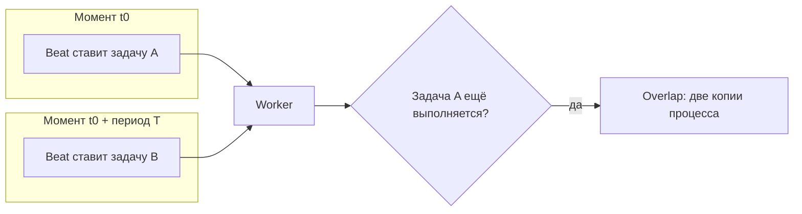
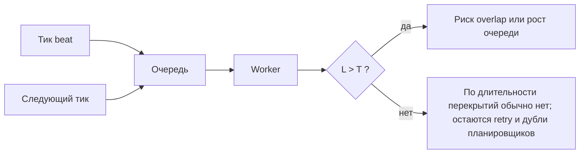
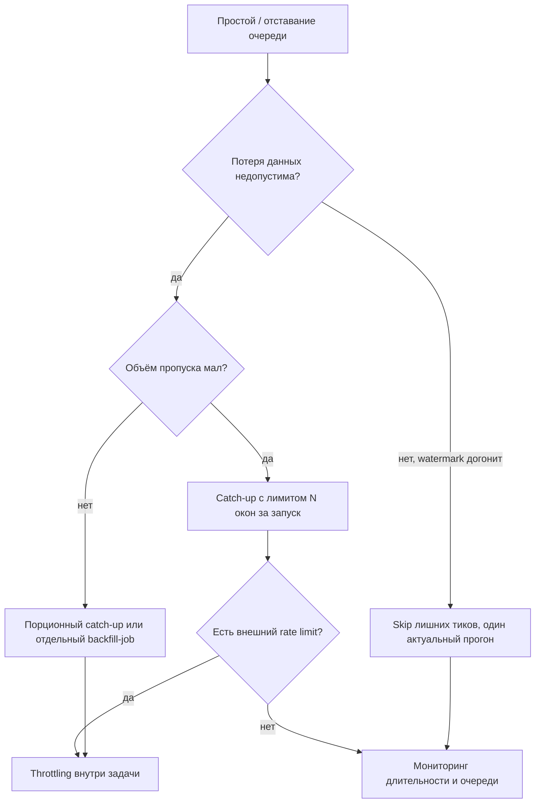
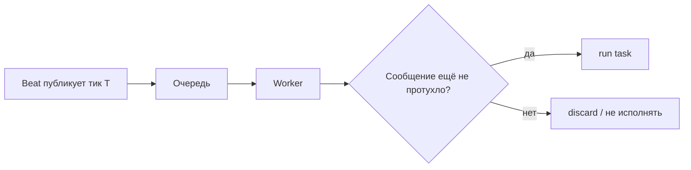

[← Назад к индексу части](index.md)
[↑ К глобальному плану](../../mastery_plan.md)

## 11.3. Проектирование периодических задач

### Цель раздела

Перевести периодику из «запускается по cron» в **управляемый процесс** с политиками overlap, простоя и окна обработки.

### В этом разделе главное

- **Overlap prevention** почти всегда нужен, если задача не тривиальная.
- Если выполнение **дольше периода**, без политики система деградирует (лавина, очередь, конкуренция).
- **Misfire** в Celery чаще проявляется как операционная ситуация: beat не работал, очередь отставала — нужна политика **catch-up vs skip** и **чек-лист после простоя** (см. ниже).
- **Batch window design** помогает заменить «1000 мелких периодик» на «один проход по окну».
- Опция **`expires`** на сообщениях — отдельный рычаг: срезать **устаревшие тики** в очереди, не решая им overlap.

### Термины

| Термин | Кратко |
| --- | --- |
| **Overlap prevention** | Механизмы, не дающие второму запуску начать работу, пока жив первый (mutex/lock/флаг). |
| **Catch-up** | После простоя попытаться **обработать пропущенные** интервалы/дни. |
| **Skip** | После простоя **не пытаться** воспроизводить прошлое, начать «с текущего момента». |
| **Batch window** | Обработка данных за диапазон `[from, to)` одним прогоном. |
| **`expires` (сообщения)** | Срок жизни задачи в очереди: слишком поздний старт может быть отброшен (не путать с overlap-lock). |

### Теория и правила

#### Overlap prevention

**Интуиция:** если уборщик убирает офис 2 часа, не запускай второго уборщика через 30 минут «по расписанию», если первый ещё не закончил — если это нарушает инварианты (двойная отправка писем, двойной пересчёт).

Типовые подходы:

- **distributed lock** (Redis/БД/advisory) на ключ процесса;
- **строка состояния** в БД: `running`, `last_run`, `lease_until`;
- **сериализация через очередь** с concurrency=1 для конкретной очереди (слабее как гарантия, если несколько очередей/роутинг сломан).

**Overlap без защиты (схема):**



Если длительность **A** больше **T**, вторая постановка почти неизбежна без политики **пропуска/блокировки**.

##### Проверь себя: overlap prevention

1. Почему **concurrency=1** на очереди **слабее**, чем distributed lock на ключ процесса?

<details><summary>Ответ</summary>

Задачи могут уйти в **другую очередь**, продублироваться **двумя beat**, прийти из **ручного** `apply_async` или retry; concurrency ограничивает только **один worker-процесс** на одной очереди, а не глобальный бизнес-процесс.

</details>

2. Когда **строка состояния** в БД (`running`, `lease_until`) предпочтительнее advisory lock на всю задачу?

<details><summary>Ответ</summary>

Когда работа **долгая**, нужен **аудит**, продление lease фазами, или нельзя держать **длинную транзакцию** с advisory lock; строка позволяет обновлять аренду и видеть владельца без блокировки сессии на часы.

</details>

#### Длительность больше периода

Даже если overlap запрещён, система может накапливать **отставание**:

- beat продолжает ставить задачи;
- очередь растёт;
- метрики latency деградируют.

**Визуально:** период постановки **T** короче, чем время исполнения **L**.

```text
Время  →  |----T----|----T----|----T----|
Beat      ^         ^         ^    (публикации)
Worker    [=========L=========]
               ↑ второй тик пришёл до конца первого прогона
```



На временной оси второй тик приходит **до** завершения первого прогона → без lock/skip появляется **overlap**; с жёстким «только один прогон» в очереди копятся **отложенные** сообщения, пока worker не разгребёт хвост.

Полезные стратегии:

- **увеличить период** или **разнести** работу на части;
- **динамически отключать** постановку, пока идёт предыдущий прогон (флаг в БД);
- **объединять** триггеры в batch window.

##### Проверь себя: длительность > периода

1. Что произойдёт с очередью, если **запретить overlap** через lock, но **не** отключать beat от постановки при длинном прогоне?

<details><summary>Ответ</summary>

Сообщения будут **накапливаться** в broker, расти latency; worker после освобождения lock начнёт разгребать хвост. Нужны **метрики очереди**, возможно `expires`, увеличение периода или флаг «не ставить, пока идёт прогон».

</details>

2. Как **batch window** снижает давление от соотношения **L > T**?

<details><summary>Ответ</summary>

Вместо множества тиков «каждые T» с отдельной тяжёлой работой вы делаете **реже** срабатывание с **одним проходом** по диапазону данных по watermark, уменьшая взаимные перекрытия и шторм постановок.

</details>

#### Misfire semantics (практическая модель для Celery)

В отличие от некоторых Java-планировщиков, где «misfire policy» формализована из коробки, в Celery ты часто проектируешь её сам:

- **Skip:** задача при старте смотрит на `last_success_at` и решает, есть ли смысл работать.
- **Catch-up:** задача обрабатывает **все пропущенные окна** последовательно (осторожно с объёмом!).
- **Catch-up с лимитом:** «не больше N пропусков за один запуск».

**Временная линия (упрощённо):** тики `t1, t2, t3` должны были поставить задачи, но beat/брокер молчали до `t4`. После восстановления в очереди может оказаться **несколько** сообщений или одно — в зависимости от того, как долго не работал beat и как устроен scheduler state. Семантику «что делать с пропущенным интервалом [t2, t3)» задаёт **код задачи** (skip / догнать / догнать с лимитом), а не одна настройка Celery.

```text
  t1    t2    t3    t4
  |     |     |     |
  ✓     ✗     ✗     ✓  ← простой между t2 и t3; политика решает, обрабатывать ли «дыру»
```

##### Проверь себя: misfire и после простоя

1. Почему **catch-up с лимитом** предпочтительнее «обработать все пропущенные недели за один запуск»?

<details><summary>Ответ</summary>

Неконтролируемый catch-up создаёт **всплеск нагрузки** на БД, API и очередь — второй инцидент после восстановления. Лимит **N окон** или порционный backfill ограничивает скорость догона.

</details>

2. Назови **первые два шага** операционного чек-листа после простоя из текста раздела.

<details><summary>Ответ</summary>

**Оценить масштаб** (сколько тиков/сообщений накопилось) и **зафиксировать политику** (catch-up с лимитом, skip, комбинация с алертами для критичных данных).

</details>

3. Чем **skip** на уровне кода задачи отличается от ситуации «beat просто не ставил задачи»?

<details><summary>Ответ</summary>

При skip задача **осознанно** решает не воспроизводить прошлые окна при старте, читая `last_success_at`/watermark; при молчащем beat сообщений могло **не быть вообще** — это другой класс диагностики (11.1, runbook).

</details>

#### Batch window design

**Интуиция:** вместо «каждую минуту обработать всё новое» сделать «каждую минуту обработать **минутный срез** с идемпотентными границами».

Паттерн:

- хранить **watermark** `processed_until` (монотонный курсор: время, `id`, offset Kafka — что устойчиво для вашего источника);
- новый запуск обрабатывает полуоткрытый интервал **`[processed_until, now_safe)`**, где `now_safe` чуть отстаёт от «прямо сейчас», если нужно избежать гонок с почти одновременно пишущими транзакциями;
- **коммит** watermark — только когда вы уверены, что обработка окна **либо полностью успешна**, либо у вас есть стратегия **идемпотентного** повтора «хвоста».

**Частичный успех внутри окна**

Если вы обработали 80% батча и упали:

- **опасно** сразу сдвинуть watermark на конец окна — вы потеряете 20%;
- **лучше** фиксировать подпрогресс (чекпоинт внутри окна) или обрабатывать элементы **идемпотентно**, чтобы безопасно переиграть всё окно;
- для больших объёмов комбинируют **мелкие подокна** внутри одного периодического тика.

```mermaid
flowchart TD
    subgraph window["Одно срабатывание периодики"]
        W[watermark = a] --> R[прочитать события в a .. b)
        R --> P[обработать батчами]
        P --> C{всё успешно?}
        C -->|да| U[watermark := b]
        C -->|нет| K[политика: retry окна / чекпоинт / алерт]
    end
```

##### Проверь себя: batch window и watermark

1. Зачем вводят **`now_safe`** чуть «в прошлом» от текущего момента?

<details><summary>Ответ</summary>

Чтобы не захватывать события, которые **ещё дописываются** транзакциями «почти сейчас», и не сдвинуть watermark так, что часть данных окажется **вне** окна без повторной обработки.

</details>

2. Почему после **частичного** успеха опасно сразу ставить `watermark := b`?

<details><summary>Ответ</summary>

Вы **потеряете** необработанный хвост окна (например, 20% батча). Нужен чекпоинт, идемпотентный повтор окна или явная политика алерта до сдвига курсора.

</details>

#### Catch-up vs skip: матрица решений

| Ситуация | Catch-up | Skip / «с текущего момента» |
| --- | --- | --- |
| Пропуск 1–2 тиков, данные критичны | Да, **лимитированно** (N окон за запуск) | Риск потери бизнес-событий |
| Простой неделю, объём огромный | Опасно без порций | Часто выбирают skip + ручной backfill по отдельному сценарию |
| Задача и так «догонит» по watermark | Избыточно дублировать логику | Достаточно следующего нормального прогона |
| Внешний API с rate limit | Только с **throttle** и очередью | Иначе catch-up = шторм 429 |

**Связь с misfire:** в Celery нет одной кнопки «misfire_policy»; вы выбираете строку таблицы выше и реализуете в теле задачи.

**После простоя (beat/broker/worker): операционный порядок мыслей**

1. **Оценить масштаб:** сколько тиков пропущено и сколько сообщений уже в очереди (метрики брокера, длина очереди).
2. **Зафиксировать политику:** catch-up с лимитом, skip до «сейчас», или комбинация (например, financial — не skip без алерта).
3. **Защитить внешние системы:** throttle, отдельная «медленная» очередь, `expires` только если осознанно принимаете потерю тиков.
4. **Проверить дубли планировщиков:** не включился ли второй beat/cron, пока инфраструктура крутилась.
5. **Задокументировать инцидент:** что пропущено, был ли ручной backfill, какие метрики добавить.

**Решение catch-up vs skip (к матрице выше):**



##### Проверь себя: catch-up vs skip (матрица и flowchart)

1. Почему для внешнего API с **rate limit** ячейка «catch-up без throttle» помечена как опасная?

<details><summary>Ответ</summary>

После простоя задача попытается **догнать** много вызовов подряд → **429**, бан, каскад ретраев. Нужны **лимит**, очередь и уважение `Retry-After`.

</details>

2. В какой строке матрицы **skip** естественен, хотя данные «важные»?

<details><summary>Ответ</summary>

Когда задача **и так догонит** состояние по **watermark** следующим нормальным прогоном — отдельный catch-up тиков избыточен и дублирует логику.

</details>

#### `expires`, `eta` и «протухание» сообщений периодики

Beat кладёт в broker обычное сообщение задачи; к нему применимы те же опции `apply_async`, что и при ручной постановке (через `options` в entry `beat_schedule` или эквивалент в django-celery-beat, если поддерживается версией).

| Опция | Смысл для периодики |
| --- | --- |
| **`expires`** (секунды или `datetime`) | Если worker **не успел начать** исполнение до истечения срока, брокер/воркер может **отбросить** сообщение как устаревшее. Это не mutex и не overlap-защита: это политика «**не выполнять слишком поздний тик**». |
| **`eta` / `countdown`** | Реже задаются из beat напрямую; чаще встречаются в ручных вызовах. Для периодики важно помнить: отложенное сообщение **ещё конкурирует** за ресурсы очереди и может накладываться на следующий тик. |

**Когда `expires` уместен:** задача про **свежие** данные (курсы, кэш, короткоживущие срезы), и прогон через 10 минут после планового слота **хуже**, чем пропуск (следующий тик подхватит актуальное). **Когда опасен:** финансовые/юридические отчёты — «молча пропустить» может нарушить compliance; там обычно **не** полагаются только на `expires`, а делают явный catch-up, алерты и идемпотентные артефакты.

**Связь с лавиной:** после простоя в очереди лежит пачка старых сообщений; **`expires`** на каждом тике ограничивает, насколько глубоко worker будет «доигрывать» прошлое **без изменения логики задачи**. Это компромисс: проще операционно, но нужно осознанно принять риск **потери** отдельных запланированных прогонов.



##### Проверь себя: `expires` и `eta`

1. Почему **`expires`** не считается заменой **Redis lock** для overlap?

<details><summary>Ответ</summary>

`expires` отбрасывает **просроченное сообщение** в очереди, если worker не успел **начать** в срок; он не запрещает **два активных исполнения**, если оба сообщения взяты вовремя. Mutex — отдельная политика.

</details>

2. Как **`countdown`/`eta`** на периодическом сообщении могут усугубить перекрытие тиков?

<details><summary>Ответ</summary>

Сообщения **висят** в отложенном состоянии и **конкурируют** за worker с новыми тиками beat, удлиняя хвост очереди и создавая неочевидные пики нагрузки.

</details>

3. В каком бизнес-сценарии **`expires`** уместен, а в каком опасен?

<details><summary>Ответ</summary>

**Уместен**, когда устаревший прогон **хуже**, чем пропуск (кэш, котировки «на сейчас»). **Опасен**, когда нужен **юридически/финансово полный** набор прогонов без молчаливой потери тика — там нужны алерты и явный catch-up.

</details>

### Пошагово: спроектировать периодическую задачу

1. Определи **инварианты**: что нельзя сделать дважды?
2. Оцени **длительность** p95/p99 и сравни с периодом.
3. Выбери политику overlap: **lock** / **single queue worker** / **state machine**.
4. Выбери политику простоя: **catch-up**, **skip**, **лимитированный catch-up**.
5. При необходимости зафиксируй политику **протухания** очереди: нужен ли `expires` на сообщениях (см. подраздел выше), чтобы старые тики не доигрывались вечно.
6. Добавь **метрики**: время выполнения, размер окна, отставание watermark, количество пропусков и (если используете) отброшенные по `expires` сообщения.

##### Проверь себя: шаги проектирования периодики

1. Почему шаг 1 («инварианты») должен идти **раньше** выбора lock и `expires`?

<details><summary>Ответ</summary>

Без понимания **что нельзя удвоить** нельзя честно выбрать overlap-политику и протухание сообщений: разные инварианты требуют разной строгости catch-up и мониторинга.

</details>

2. Зачем в шаге 2 сравнивать именно **p99** с периодом, а не только среднее?

<details><summary>Ответ</summary>

Хвост задержек создаёт **перекрытия** и отставание очереди даже при «нормальном» среднем; p99 ближе к эксплуатационной реальности инцидентов и деградаций.

</details>

3. Как шаг 6 (метрики) помогает отличить проблему **overlap** от проблемы **лавины catch-up**?

<details><summary>Ответ</summary>

Overlap даёт **параллельные** прогоны и рост длительности/lock contention; лавина — **рост глубины очереди** и числа сообщений после простоя. Разные метрики (skip по lock vs длина очереди vs отброшенные по `expires`) указывают на разные корневые причины.

</details>

### Простыми словами

Периодическая задача — это мини-процесс с состоянием: «я уже бегу?», «до куда я успел?», «что делать, если опоздал?».

### Картинка в голове

**Поезд расписания.** Если предыдущий поезд ещё на путях, следующий либо **ждёт**, либо **отменяется**, либо **не догоняет всё подряд**, а везёт пассажиров **пакетом** по правилам.

### Как запомнить

**Инварианты → overlap. Простой → catch-up/skip. Большие объёмы → batch window + watermark.**

### Примеры

**Идея: mutex через Redis (псевдокод)**

```python
# tasks.py
from celery import shared_task
import redis

r = redis.Redis.from_url("redis://localhost:6379/0")

@shared_task(bind=True)
def nightly_rebuild(self):
    lock_key = "lock:periodic:nightly_rebuild"
    # NX с EX — попытка взять lock с TTL, чтобы не зависнуть навсегда при падении воркера
    got = r.set(lock_key, self.request.id, nx=True, ex=60 * 60)
    if not got:
        return "skipped: overlap"
    try:
        do_rebuild()
    finally:
        # аккуратно: сравнить value, чтобы не снять чужой lock
        pipe = r.pipeline(True)
        pipe.get(lock_key)
        cur = pipe.execute()[0]
        if cur and cur.decode() == self.request.id:
            r.delete(lock_key)
```

Это **не идеальная** реализация для всех случаев (нужны детали fencing, продления lease, часов), но показывает мысль: **ранний выход**, если уже идёт прогон. Блок `finally` с `GET`+`DEL` оставлен как иллюстрация намерения; в production для атомарного «удалить только если value совпадает» используй **Lua** (см. раздел про Redis lock в **11.4**).

**Watermark**

```python
@shared_task
def process_incoming_events():
    watermark = load_watermark("events_stream")  # монотонный курсор
    batch = fetch_events_since(watermark, limit=5000)
    if not batch:
        return "noop"
    new_cursor = batch[-1].cursor
    process(batch)
    save_watermark("events_stream", new_cursor)
```

##### Проверь себя: учебные фрагменты (Redis mutex и watermark)

1. Что не так с **атомарностью** снятия lock в псевдокоде с `GET` и `delete` в `finally` по сравнению с рекомендацией про Lua?

<details><summary>Ответ</summary>

Между чтением и удалением другой процесс может перезаписать ключ после **истечения TTL** вашего lock; вы рискуете удалить **чужой** lock. **Lua** выполняет проверку значения и `DEL` **атомарно**.

</details>

2. В примере watermark в каком случае **потеряете** события при падении между `process(batch)` и `save_watermark`?

<details><summary>Ответ</summary>

Если `process` частично применил эффекты, но курсор **не сохранён**, при ретрае возможны **дубли**; если вы продвинете watermark до полного commit бизнес-эффекта — **потеря** необработанного хвоста. Нужны транзакционные границы или идемпотентность по элементам батча.

</details>

3. Зачем в Redis-примере **`ex=60*60`**, даже если прогон обычно 5 минут?

<details><summary>Ответ</summary>

Это **страховка от зависшего** воркера: без TTL lock не освободится после crash; TTL должен покрывать **p99** длительности или сопровождаться **продлением** при долгих прогонах.

</details>

### Практика / реальные сценарии

- **Ночной пересчёт** длится 3 часа, период «каждые 2 часа» → без политики вы получите постоянные перекрытия или очередь. Решение: **один** ночной слот + lock + алерт на превышение длительности.

### Типичные ошибки

- Полагаться на «у нас же одна задача в очереди» без учёта **retry** и **ручных** `apply_async`.
- Делать catch-up без лимита и устроить **шторм** обработки на неделю простоя.
- Путать **`expires`** с **overlap-lock**: первое отбрасывает **устаревшее сообщение**, второе предотвращает **параллельное исполнение** — это разные рычаги.

### Что будет, если…

- **Если отключить overlap prevention** в задаче отправки уведомлений: пользователи получат дубликаты при любом задержании/повторе.
- **Если после длинного простоя включить агрессивный catch-up** без порций: восстановление инфраструктуры превратится во **второй инцидент** (перегруз БД/API).

### Проверь себя

1. Почему «сделать очередь с concurrency=1» не всегда эквивалентно single-run гарантии?

<details><summary>Ответ</summary>

Потому что задачи могут попадать в **разные очереди**, обходить ограничение роутингом, дублироваться **разными producers** (beat + ручной запуск), а также существуют **несколько worker-групп**. Concurrency=1 — локальный механизм исполнения, а не глобальный контракт бизнес-процесса.

</details>

2. Что такое watermark и зачем он в периодике?

<details><summary>Ответ</summary>

**Watermark** — монотонный курсор прогресса (до какого момента/идентификатора система уже обработала данные). Он позволяет безопасно продолжать после сбоев и строить **batch window** без двойной обработки (при идемпотентной обработке элементов).

</details>

3. В чём риск «ловим все пропуски за неделю одним запуском»?

<details><summary>Ответ</summary>

Резкий всплеск нагрузки может **положить** БД/внешние API, увеличить latency очереди и создать каскадные инциденты. Catch-up почти всегда нужно **лимитировать** и делать **порциями**.

</details>

4. В чём разница между **skip** после простоя и политикой **`expires`** на сообщениях?

<details><summary>Ответ</summary>

**Skip** — логика **внутри задачи** (или осознанное решение не обрабатывать прошлые окна): вы явно выбираете «начать с текущего момента». **`expires`** — правило **транспорта**: сообщение, слишком долго пролежавшее в очереди, может **не быть исполнено** вообще. Оба уменьшают «доигрывание» прошлого, но механизм и контроль разные: skip требует кода и тестов, expires — настройки брокера/воркера и принятия риска молчаливой потери тика.

</details>

### Запомните

- Периодика без политики overlap — **частый источник** скрытых дублей.
- **Catch-up** без лимита — опасен.
- **Watermark** — ваш друг для потоков событий.

---
