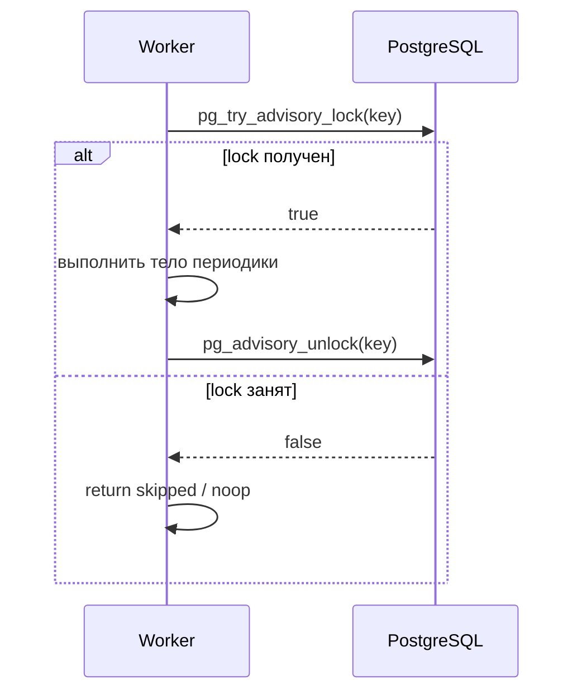
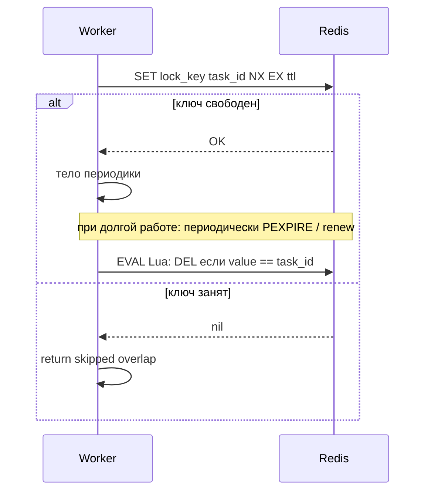
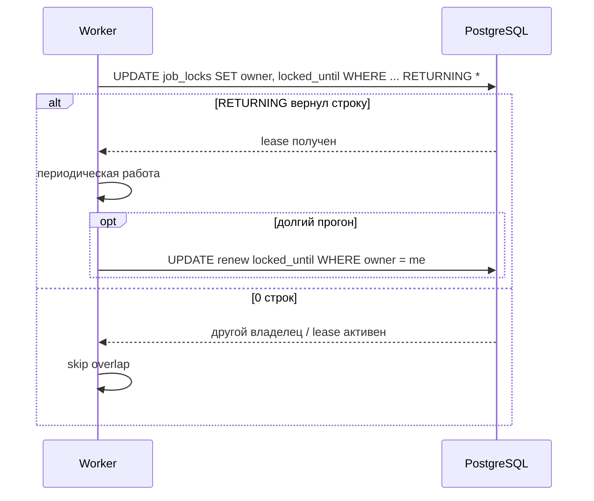
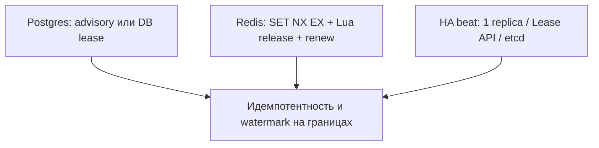
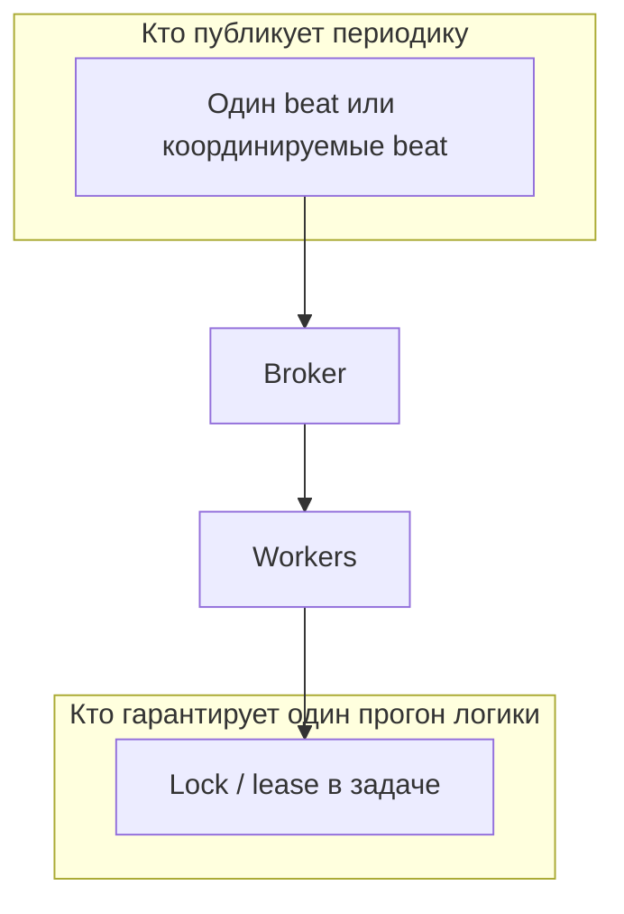
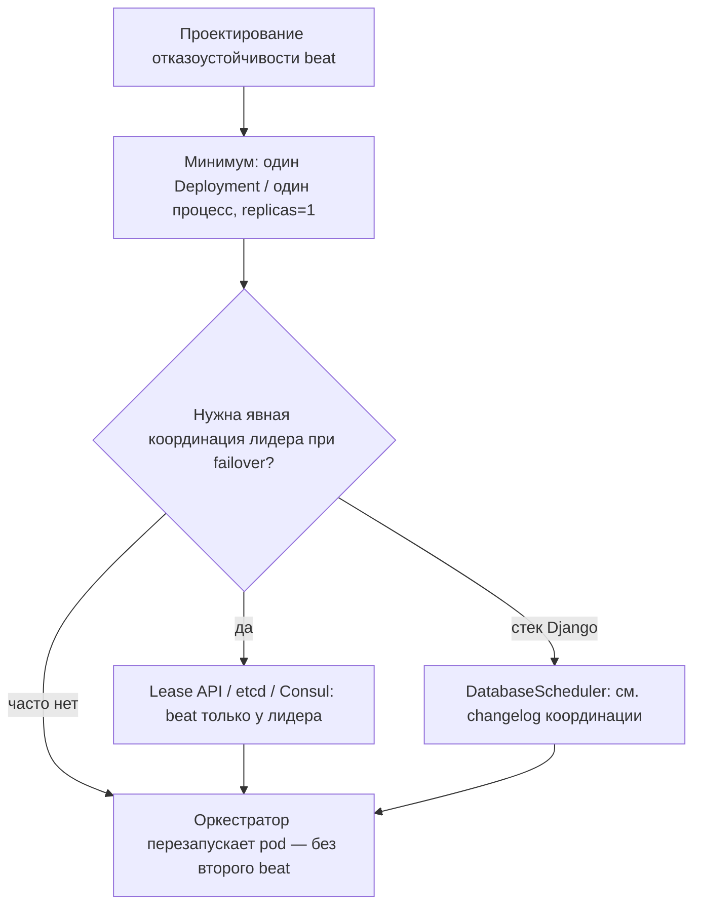
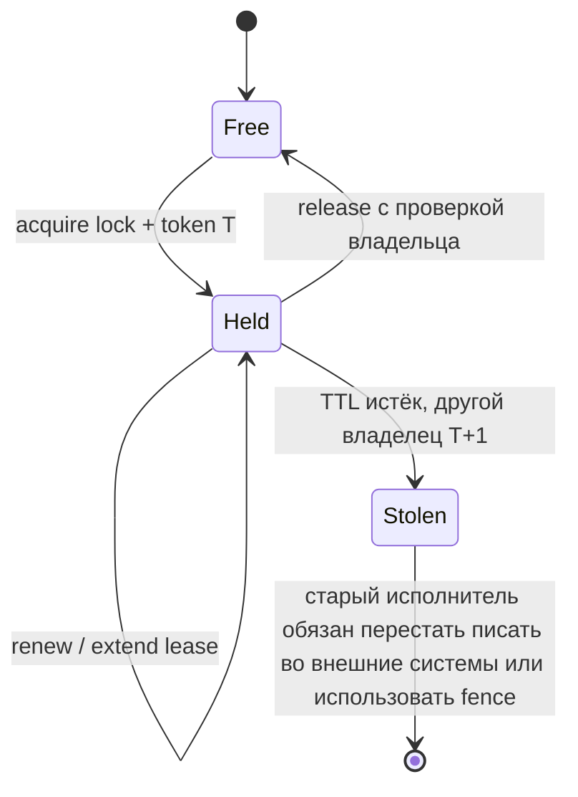

[← Назад к индексу части](index.md)
[↑ К глобальному плану](../../mastery_plan.md)

## 11.4. Дедупликация и single-run гарантия

### Цель раздела

Собрать практичный набор инструментов, чтобы периодический процесс не превратился в «иногда он один, иногда их много».

### В этом разделе главное

- **Advisory lock** в PostgreSQL — сильный инструмент для критичных секций.
- **Redis lock** — быстро и удобно, но требует дисциплины TTL и сравнения владельца.
- **DB-based lease** — запись `locked_until` + owner для прозрачного аудита.
- Lock-based подходы **не отменяют** необходимости идемпотентности.
- **Leader election** иногда нужен не только для beat, но и для «кто именно выполняет периодику» в мульти-tenant среде.

### Термины

| Термин | Кратко |
| --- | --- |
| **Fencing token** | Монотонно растущий токен, чтобы «старый» владелец не мог завершить операцию после потери лидерства (продвинутая тема). |
| **Lease TTL** | Время жизни аренды: защита от зависшего lock после crash. |

### Теория и правила

#### Advisory lock (PostgreSQL)

**Идея:** взять числовой lock, не привязанный к конкретной строке таблицы.

Плюсы:

- быстро;
- хорошо знакомо DBA;
- не требует отдельной инфраструктуры, если Postgres уже есть.

Минусы:

- привязка к Postgres;
- нужно продумать **гранулярность ключей** (per-tenant/per-job).

**Поток для периодики (неблокирующий вариант):** воркер пытается взять lock; если не вышло — **сразу выходит** без ожидания, чтобы не держать connection pool и не блокировать очередь.



##### Проверь себя: advisory lock (PostgreSQL)

1. Почему для периодики в тексте рекомендуют **`pg_try_advisory_lock`** и немедленный выход, а не блокирующий `pg_advisory_lock`?

<details><summary>Ответ</summary>

Блокирующий lock держит **соединение** и **воркер** в ожидании, раздувает пул подключений и может создать цепочку задержек в очереди. **Try + skip** освобождает ресурс и явно кодирует политику «этот тик уже занят — не ждём».

</details>

2. Как **гранулярность ключа** advisory lock связана с multi-tenant?

<details><summary>Ответ</summary>

Один глобальный ключ сериализует **всю** периодику для всех арендаторов; отдельные ключи per-tenant позволяют параллельно гонять разные тенанты, но требуют дисциплины именования и лимитов на число одновременных прогонов.

</details>

3. В каком случае **долгая** периодика может быть **хуже** с session-level advisory lock, чем с lease-строкой в таблице?

<details><summary>Ответ</summary>

Когда работа **часы** вне одной короткой транзакции: долго держать advisory lock — бить по **пулу** и блокировкам сессии; lease позволяет **продлевать** аренду короткими `UPDATE` без удержания одной транзакции на всё время прогона.

</details>

#### Redis lock

Плюсы:

- низкая задержка;
- простая интеграция.

Минусы:

- риски при неправильном TTL;
- необходимость **унификации** снятия lock (только владелец);
- в кластерных сценариях Redis — понимать границы **Redlock**-споров (в проде часто используют прагматичные паттерны с TTL + идемпотентностью).

**Практика снятия lock в Redis:** одной команды «GET + сравни + DEL» недостаточно из-за гонок; надёжнее **Lua-скрипт** или транзакция `WATCH`/`MULTI`, где удаление происходит **только если** значение ключа всё ещё равно `request_id` владельца. Для долгих задач добавляют **продление TTL** (heartbeat) пока исполнение живо — иначе lock истечёт при p99-длительности.

**Учебный фрагмент Lua (атомарное снятие только владельцем):** ключ `lock_key`, ожидаемое значение `expected` — тот же `request_id`, что при `SET NX`.

```lua
-- redis.call('EVAL', script, 1, lock_key, expected)
if redis.call("GET", KEYS[1]) == ARGV[1] then
  return redis.call("DEL", KEYS[1])
else
  return 0
end
```

В приложении передаёте `KEYS[1] = lock_key`, `ARGV[1] = celery_request_id`. Продление: отдельный скрипт или `PEXPIRE`, пока задача жива.

**Поток acquire / skip / release (Redis):**



##### Проверь себя: Redis lock

1. Почему недостаточно «прочитать значение ключа и удалить его», если оно совпадает с моим `task_id`?

<details><summary>Ответ</summary>

Между **GET** и **DEL** другой воркер может **перезаписать** ключ после истечения вашего TTL; вы снимете **чужой** lock. Нужна **атомарность** (Lua/`WATCH`/`MULTI`), чтобы удалять только если значение всё ещё ваше.

</details>

2. Зачем при длинной задаче **продлевать TTL** (heartbeat), а не ставить огромный TTL сразу?

<details><summary>Ответ</summary>

Огромный TTL при **коротком** нормальном прогоне после crash оставляет систему **без координации** на часы; слишком короткий без renew — **преждевременная** сдача lock при p99. Heartbeat балансирует **восстановление после падения** и **защиту от зависаний**.

</details>

3. Как **Redlock** и споры вокруг него влияют на практический выбор для Celery-периодики?

<details><summary>Ответ</summary>

В проде часто применяют **прагматичный** Redis lock (NX+EX, Lua release, идемпотентность) и осознают, что **строгие** гарантии в кластере Redis — отдельная тема; для периодики критична связка **TTL + owner + идемпотентность**, а не только маркетинговое имя алгоритма.

</details>

#### DB-based lease

**Идея:** таблица `job_locks`:

- `name` PK,
- `owner`,
- `locked_until`.

Запуск периодики пытается обновить строку условием `now > locked_until` или владелец совпадает.

**Инвариант:** одна строка на логический job (`name` PK или уникальный ключ). Взять lock = **одна атомарная операция** `UPDATE ... WHERE (locked_until < now() OR owner = :me) RETURNING ...`; если `RETURNING` пустой — кто-то другой успел, задача делает **skip** или ждёт (редко для периодики).

**Продление lease:** пока задача работает, периодически (или в конце фаз) выполнять `UPDATE ... SET locked_until = now() + interval WHERE name = :n AND owner = :me`, чтобы «живой» прогон не потерял строку посреди долгой работы.

**Первичное создание строки:** либо миграция с seed-записями, либо `INSERT ... ON CONFLICT (name) DO NOTHING` перед первым `UPDATE`, чтобы не гоняться за гонкой двух воркеров на пустой таблице.

Плюсы:

- аудит и наблюдаемость;
- проще объяснить бизнесу «кто держит процесс».

Минусы:

- нагрузка на БД;
- нужны индексы и чистка;
- при очень высокой частоте конкуренции за одну строку возможны **hot row** и блокировки — тогда дробят ключи (по шардам/тенантам) или переносят координацию в **Redis** (NX+EX + Lua), чтобы не спорить за одну строку в Postgres на каждом тике.

**Поток взятия lease одной транзакцией (идея):**



##### Проверь себя: DB-based lease

1. Почему в тексте подчёркивают **`UPDATE ... RETURNING`** (или rowcount), а не «сначала SELECT, потом UPDATE»?

<details><summary>Ответ</summary>

Два шага дают **гонку**: два воркера оба увидят «свободно» и начнут работу. **Одна атомарная** попытка обновления с условием по `locked_until`/`owner` гарантирует, что ровно один владелец пройдёт.

</details>

2. Зачем перед первым захватом иногда делают **`INSERT ... ON CONFLICT DO NOTHING`** для строки job?

<details><summary>Ответ</summary>

Чтобы избежать гонки **двух** воркеров на **пустой** таблице: оба делают первый `UPDATE` и получают 0 строк. Seed или upsert создаёт базовую строку для последующих атомарных `UPDATE`.

</details>

3. Когда **hot row** в `job_locks` толкает к Redis вместо Postgres?

<details><summary>Ответ</summary>

Когда **очень высокая** частота тиков и все спорят за **одну** строку — блокировки строки и contention на БД становятся узким местом; Redis NX+EX снижает давление на OLTP, ценой другой зависимости и дисциплины TTL.

</details>

#### Ограничения lock-based подхода

- **Не лечит плохую идемпотентность:** при истечении TTL старый и новый владелец теоретически могут пересечься на границе — идемпотентность спасает.
- **Не заменяет транзакционные границы** внешних систем.
- **Clock skew** между сервисами может ломать naive сравнения времени (лучше опираться на БД time или логические версии).
- **Слишком короткий TTL при длинной задаче** без продления: второй воркер возьмёт lock, пока первый ещё пишет — классический сюжет для **fencing token** или идемпотентности.

**Сводка: куда смотреть при выборе механизма**



Три верхних ветки **не взаимоисключают** друг друга: например, **один** beat и **Redis lock** в задаче — типичная связка; lease в БД может дополнять аудит.

##### Проверь себя: ограничения lock-based подходов

1. Как **clock skew** ломает наивные сравнения `locked_until` на уровне приложения?

<details><summary>Ответ</summary>

Воркер с **сдвинутыми** часами может считать lease истёкшим или активным иначе, чем БД или другие узлы. Надёжнее опираться на **`NOW()` СУБД**, логические версии или явную синхронизацию времени.

</details>

2. Почему «короткий TTL без продления» при **длинной** задаче опаснее, чем кажется с точки зрения «быстрее освободим при crash»?

<details><summary>Ответ</summary>

Второй воркер возьмёт lock, пока первый **ещё пишет** side-effects — классическая граница гонки; без **fencing** или **идемпотентности** получаются дубликаты и порча данных.

</details>

#### Leader election для scheduler

Если вам нужен HA beat, почти никогда не делают «два равноправных beat». Вместо этого:

- **Kubernetes:** Deployment с **`replicas: 1`** для beat + liveness/readiness; отказ pod → перезапуск, **второй** beat не должен появляться без смены манифеста. Для некоторых команд это и есть весь «leader election».
- **Явное лидерство:** sidecar или отдельный процесс, который через **lease в etcd/Consul** или **Kubernetes Lease API** держит роль лидера; только лидер запускает beat. Сложнее в сопровождении, но даёт контролируемый failover.
- **django-celery-beat + DatabaseScheduler:** в ряде версий используется **распределённая блокировка на БД**, чтобы несколько процессов beat не читали расписание одновременно — это *не отменяет* необходимости читать changelog: семантика менялась между релизами.
- **Внешний оркестратор** (Airflow, Temporal, managed Cloud Scheduler): beat вообще не отвечает за эти триггеры — в очередь кладёт внешняя система.

**Два уровня «лидерства» (не путать):**



Лидерство на уровне **beat** убирает дубли **постановки**; **lock в задаче** защищает от overlap, когда сообщения всё же продублировались (ретраи, ручной запуск, границы TTL).

**Выбор уровня HA для процесса beat (упрощённо):**



**Fencing token (зачем упоминать в периодике)**

Если воркер **очень долго** выполняет задачу, TTL lock может истечь, второй воркер возьмёт lock, а первый «допишет» побочные эффекты уже **без** lock — классическая гонка. **Fencing token** — монотонно растущее число, выданное вместе с lock: внешняя система (хранилище, API) отклоняет операции от устаревшего токена. В простых CRUD-периодиках это редкость, в биллинге и платежах — уже ближе к must-read.



##### Проверь себя: лидерство beat и fencing

1. Чем отличается **лидерство на уровне beat** от **lock внутри задачи** в типичной связке «один beat + Redis lock»?

<details><summary>Ответ</summary>

Лидер beat убирает **дубли постановки** из нескольких планировщиков. Lock в задаче ловит **overlap**, когда сообщения всё же продублировались (ретраи, ручной запуск, границы TTL). Они решают **разные слои** проблемы.

</details>

2. Почему `replicas: 1` для Deployment beat часто считают достаточным «leader election»?

<details><summary>Ответ</summary>

Оркестратор гарантирует **не больше одного** pod в штатном режиме; при падении — перезапуск **одной** реплики без второго параллельного beat. Это проще, чем etcd Lease API, пока приемлем window failover.

</details>

3. Зачем внешней системе нужен **fencing token**, если lock уже «передан» новому владельцу?

<details><summary>Ответ</summary>

**Старый** исполнитель может ещё **завершать** I/O после потери lock; токен монотонно растёт с выдачей lock, и хранилище/API отклоняет операции со **устаревшим** токеном — предотвращая «запоздылые» записи прошлого владельца.

</details>

### Пошагово: выбрать механизм

0. Убедиться, что **нет двух независимых beat/cron** на ту же периодику — иначе lock только маскирует симптом, а дубли постановки остаются.
1. Нужен ли аудит и история? → чаще **DB lease**.
2. Нужна минимальная задержка и простота? → **Redis** (с TTL).
3. Уже есть Postgres и критичные финансовые инварианты? → рассмотреть **advisory** + транзакции.

### Простыми словами

Single-run — это «**ключ от комнаты**»: пока ключ у одного, второй не должен начинать уборку. Но если ключник потерялся, ключ должен **вернуться сам** (TTL), иначе комната навсегда «занята».

### Картинка в голове

**Передача эстафетной палочки.** Держит палочку — бежит один. Палочка с таймером — lease.

### Как запомнить

**Locks координируют старт, идемпотентность спасает границы.**

### Примеры

**DB lease (идея SQL)**

```sql
-- псевдосхема: попытка взять lock на 10 минут
UPDATE job_locks
SET owner = :owner, locked_until = NOW() + INTERVAL '10 minutes'
WHERE name = 'nightly_rebuild' AND (locked_until < NOW() OR owner = :owner);

-- затем проверить rowcount / returning
```

**PostgreSQL advisory lock (идея использования)**

Session-level advisory lock удобен, когда критичная секция и так выполняется **в одной транзакции с БД**: вы берёте lock в начале задачи и отпускаете в конце. Важно: при **долгих** задачах длинная транзакция может быть вредна для БД — иногда лучше **lease-строка** в отдельной таблице, чем держать advisory lock часами.

```python
# Учебный псевдокод ( psycopg2 / django.db connection )
# SELECT pg_try_advisory_lock(hashtext('nightly_rebuild'));
# ... работа ...
# SELECT pg_advisory_unlock(hashtext('nightly_rebuild'));
```

Ключи advisory lock — **целые числа** или два int32; часто хэшируют строковый идентификатор задачи. Семантику `try_lock` vs блокирующего `lock` выбирайте осознанно: для периодики обычно нужен **неблокирующий** вариант + «skip если не дали».

### Практика / реальные сценарии

- В мульти-tenant SaaS часто делают **ключ** `lock:tenant:{id}:job:{name}`.

### Типичные ошибки

- Забыть TTL → вечная блокировка после инцидента.
- Снимать lock «просто delete» без проверки владельца → гонка.
- Держать **блокирующий** `pg_advisory_lock` на **часы** вместе с тяжёлой нетранзакционной работой → исчерпание connection pool и долгие блокировки сессий.

### Что будет, если…

- **Если два процесса всё же пересеклись** на границе TTL: без идемпотентности возможны дубликаты side-effects.

### Проверь себя

1. Почему lock не заменяет идемпотентность?

<details><summary>Ответ</summary>

Lock уменьшает вероятность параллельного старта, но не устраняет **повторную доставку** сообщений, ретраи, ручные запуски и гонки на границах TTL. Идемпотентность защищает **семантику** операции при повторе.

</details>

2. Зачем lease с истечением времени?

<details><summary>Ответ</summary>

Чтобы при падении воркера система **самовосстановилась** и могла взять процесс новым владельцем, не оставаясь заблокированной навсегда.

</details>

3. Когда advisory lock предпочтительнее «просто Redis»?

<details><summary>Ответ</summary>

Когда вся критичная логика и так транзакционно живёт в Postgres и вы хотите **атомарно** связать блокировку с бизнес-операциями в одной СУБД, либо когда Redis как отдельная зависимость для locks нежелателен.

</details>

4. Зачем в шаге 0 «Пошагово» проверять **два beat/cron**, если в задаче уже стоит сильный lock?

<details><summary>Ответ</summary>

Lock маскирует **симптом** (параллельный старт), но **два планировщика** продолжают плодить сообщения, ретраи и нагрузку на broker; правильнее устранить **лишнего producer**, а lock оставить как второй рубеж.

</details>

5. В какой ситуации **DB lease** типично выигрывает у **advisory lock** в одном и том же Postgres?

<details><summary>Ответ</summary>

Когда нужны **аудит** (`owner`, история), **продление** аренды без длинной сессии с advisory lock и **наблюдаемость** для SRE в таблице, а не только бинарный факт lock в сессии.

</details>

### Запомните

- **TTL + owner check** — базовая гигиена Redis lock.
- **Lease в БД** — хорош для аудита.
- **Лидерство** нужно на уровне beat, если вы хотите HA без дублей.

---
