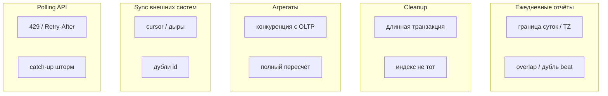

[← Назад к индексу части](index.md)
[↑ К глобальному плану](../../mastery_plan.md)

## 11.5. Практические сценарии

### Цель раздела

Закрепить абстракции на типовых задачах, которые встречаются в реальных сервисах.

### В этом разделе главное

- Каждый сценарий имеет **свои инварианты** и **типовые ошибки**.
- Внешние API требуют **rate limit** дисциплины.
- Отчёты и агрегаты любят **окна** и **watermark**.

### Термины

| Термин | Кратко |
| --- | --- |
| **Backfill** | Догоняющая обработка исторических данных задним числом. |
| **Rate limit** | Ограничение частоты внешних вызовов. |

### Теория и правила

#### Ежедневные отчёты

- Часто crontab на низконагрузочное окно.
- Риски: DST, двойной запуск, долгий отчёт → overlap.
- Практика: **lock**, **идемпотентная выгрузка** в объектное хранилище с именем файла, включающим **дату отчёта**.

**Углубление:** определите **ключ отчёта** как `(business_date, version_schema)`, а не «момент запуска». Тогда повторный запуск перезапишет или дедуплицирует тот же артефакт. Для «вчера» формализуйте: `business_date = UTC_date(today - 1d)` или календарь компании — и покройте тестом границу «в 00:05 UTC это ещё вчера или уже сегодня?».

##### Проверь себя: ежедневные отчёты

1. Почему ключ артефакта лучше строить от **`business_date`**, а не от timestamp старта задачи?

<details><summary>Ответ</summary>

Повторный запуск за тот же календарный день должен попасть в **тот же** объект в хранилище (идемпотентная перезапись/дедуп). Если ключ зависит от момента запуска, каждый retry создаёт **новый** файл и расхождение отчётности.

</details>

2. Как **DST** и **двойной час** ломают отчёт «каждый день в 02:00 локально» без явного контракта?

<details><summary>Ответ</summary>

Ночь перевода часов даёт **пропуск** или **два** локальных «02:00» в одних сутках; без фиксации **календаря** и TZ отчёт за «вчера» смещается относительно ожиданий бизнеса.

</details>

3. Свяжи **overlap** долгого отчёта с **lock** и именованием файла в S3.

<details><summary>Ответ</summary>

Без lock второй тик может **параллельно** писать тот же логический день; идемпотентное имя `daily_{business_date}.parquet` плюс **один** активный прогон (lock) предотвращает порчу артефакта и гонки при записи.

</details>

#### Очистка мусора (cleanup)

- Удаление старых логов, временных файлов, истёкших токенов.
- Риски: долгая транзакция, блокировки БД.
- Практика: **батчи**, **лимиты**, **паузы**, мониторинг строк/байт удаления.

**Углубление:** шаблон `DELETE ... LIMIT 5000` в цикле с короткой паузой часто безопаснее одного «удалить 100M строк». Следите за **индексами** условия `WHERE created_at < ...`, иначе cleanup сам станет DoS таблице. Имеет смысл метрика «сколько ещё осталось» для оценки времени до завершения ночного окна.

##### Проверь себя: cleanup

1. Почему один огромный `DELETE` в транзакции хуже цикла **батчей с паузой**?

<details><summary>Ответ</summary>

Длинная транзакция держит блокировки, раздувает WAL, увеличивает риск **таймаутов** и деградации OLTP. Батчи короче по времени удержания блокировок и дают **дышать** репликам и пользовательскому трафику.

</details>

2. Как отсутствие **индекса** по полю в `WHERE` превращает ночной cleanup в проблему?

<details><summary>Ответ</summary>

Планировщик вынужден **сканировать** огромные объёмы строк → высокий I/O, блокировки, рост latency; «удаление старого» становится полноценным **DoS** для таблицы.

</details>

3. Зачем метрика «сколько строк ещё подлежит удалению»?

<details><summary>Ответ</summary>

Чтобы оценить, **уложится ли** прогон в ночное окно, поймать **застревание** (индекс/план) и не удивиться утром незавершённым cleanup.

</details>

#### Пересчёт агрегатов

- Риски: конкуренция с онлайн-трафиком.
- Практика: отдельная очередь, throttle, материализованные представления, инкрементальные агрегаты.

**Углубление:** полный пересчёт «за всё время» по cron — частый анти-паттерн; предпочтительнее **инкремент** с watermark по событию/версии данных. Если полный пересчёт неизбежен, изолируйте **read replicas** или отдельный **batch-кластер**, чтобы не забить буферы БД в пик пользовательского трафика.

##### Проверь себя: пересчёт агрегатов

1. Почему «полный пересчёт за всё время по cron» часто анти-паттерн по сравнению с **инкрементом**?

<details><summary>Ответ</summary>

Объём данных растёт со временем: каждый тик перечитывает **всю** историю, конкурируя с OLTP и увеличивая длительность прогона. Инкремент по **watermark**/версии ограничивает работу **дельтой**.

</details>

2. Какие два рычага изоляции нагрузки упоминаются для неизбежного тяжёлого пересчёта?

<details><summary>Ответ</summary>

**Read replicas** (или выделенный источник чтения) и отдельный **batch-кластер**/окно, чтобы буферы и CPU основной БД не стали узким местом в пик пользователей.

</details>

3. Зачем выносить периодику агрегатов в **отдельную очередь** с throttle?

<details><summary>Ответ</summary>

Чтобы **не вытеснять** критичные пользовательские задачи воркеров и управлять **параллелизмом** тяжёлых job отдельно от основного трафика (см. также роутинг, часть 12).

</details>

#### Периодический sync с внешними системами

- Риски: частичные сбои, дубли событий.
- Практика: **cursor** на стороне внешней системы, идемпотентные upsert.

**Углубление:** храните **последний успешно применённый** `cursor`/`updated_since` в своей БД отдельно от «последней попытки». Иначе после ошибки на середине страницы легко получить дыры или дубли. Внешняя система может отдавать элементы **не в строгом порядке** — тогда нужна идемпотентность по **стабильному внешнему id**.

##### Проверь себя: sync с внешними системами

1. Почему нельзя путать **«последняя попытка»** и **«последний успешный commit»** для cursor?

<details><summary>Ответ</summary>

После ошибки на середине страницы продвижение «последней попытки» вперёд **теряет** необработанные элементы (**дыра**). Commit cursor только после **атомарного** применения батча сохраняет целостность.

</details>

2. Зачем **идемпотентный upsert** по внешнему id, если API отдаёт страницы не в строгом порядке?

<details><summary>Ответ</summary>

Повторная доставка того же объекта или «откат» курсора не должен создавать **дубликаты** строк у вас; стабильный внешний ключ + upsert дают безопасность при неидеальном порядке и ретраях.

</details>

3. Как **частичный сбой** на одной странице связан с политикой **retry** периодики?

<details><summary>Ответ</summary>

Слепой retry всей страницы без идемпотентности может **удвоить** side-effects; нужно гранулировать успех (что зафиксировано) и повторять только **неприменённый** хвост.

</details>

#### Polling API и адаптация к rate limits

- Риски: 429, бан IP, шторм при catch-up.
- Практика: **token bucket** / **leaky bucket**, экспоненциальные паузы, **jitter** к расписанию.

**Углубление:** при `429 Retry-After` уважайте заголовок; не наращивайте параллелизм worker-ов как «лечение», если упираетесь в лимит провайдера. Для catch-up иногда выгоднее **отдельная** «медленная» очередь с жёстким rate limit, чем гонять ту же задачу с агрессивным retry.

##### Проверь себя: polling и rate limits

1. Почему **увеличение числа воркеров** не лечит упор в **rate limit** внешнего API?

<details><summary>Ответ</summary>

Вы только **быстрее** исчерпываете квоту и получаете **429**/бан; узкое место — политика провайдера, а не локальная пропускная способность Celery. Нужен **token/leaky bucket**, backoff, уважение `Retry-After`.

</details>

2. Как **jitter** к расписанию помогает при множестве независимых poller-ов (даже если у вас один beat)?

<details><summary>Ответ</summary>

Случайный сдвиг размазывает **синхронные пики** запросов; в мульти-инстансных архитектурах это критично против «все ударили API в :00».

</details>

3. Зачем отдельная **медленная очередь** для catch-up после простоя?

<details><summary>Ответ</summary>

Основная очередь может **не справиться** с бурстом без нарушения лимитов API; выделенный контур с жёстким throttle изолирует catch-up и защищает провайдера и ваши креды от шторма.

</details>

### Пошагово: шаблон мыслей для любого сценария

1. Какой **артефакт** считается успехом (файл, строка в БД, событие)?
2. Что будет, если артефакт создан **дважды**?
3. Какая **максимальная длительность** и какой **период**?
4. Нужен ли **backfill** и с каким лимитом?

### Простыми словами

Каждая «простая» периодика — это вопрос: **что считается готово**, и **что если повтор**.

### Картинка в голове

**Уборка офиса** (cleanup), **еженедельный отчёт** (report), **синхронизация складов** (sync) — у каждого разные «вещи нельзя ломать».

### Как запомнить

**Сначала инварианты успеха, потом расписание.**

### Примеры

**Jitter к интервалу (концептуально)**

Вместо ровно каждые 60 секунд для тысячи инстансов (если бы вы когда-то ошиблись архитектурно и сделали так), добавляют случайный сдвиг, чтобы не создавать синхронные пики. Для одного beat это менее актуально, но для **множества producers** критично.

**Ежедневный отчёт: явный `business_date` (учебный фрагмент)**

Идея: задача не спрашивает «какое сегодня на сервере», а получает **дату отчёта** из аргументов, которые формирует обёртка или фиксированное правило.

```python
from datetime import date, timedelta

def previous_utc_day(d: date) -> date:
    return d - timedelta(days=1)

@shared_task(bind=True)
def build_daily_report(self, business_date: str):
    # business_date = "2026-03-29" — согласовано с командой: календарные сутки UTC
    d = date.fromisoformat(business_date)
    path = f"reports/daily_{d.isoformat()}.parquet"
    # идемпотентно: повторная запись того же ключа в S3 — ок
    write_report_to_object_storage(path, compute_for_day(d))
```

В `beat_schedule` можно передавать `kwargs`, но **динамическая** дата «вчера» из кода удобнее через **django-celery-beat** с шаблоном или через тонкую задачу-обёртку без аргументов, которая внутри вычисляет `business_date` по правилу UTC — главное, чтобы правило было **одно** на всю команду.

**Сводная схема пяти сценариев (что ломается)**



<a id="plan-part11-check-yourself"></a>

#### Проверь себя (вопросы из глобального плана, часть 11)

Ниже — те же формулировки, что в `mastery_plan.md` (блок «Проверь себя (11.5)»); ответы совпадают с **п. 1–3** в конце файла, в разделе [«Вопросы для самопроверки»](#вопросы-для-самопроверки).

1. Что произойдёт, если одна и та же периодическая задача запустится в двух beat/worker-контурах?

<details><summary>Ответ</summary>

Скорее всего будут **дублирующие публикации** и **параллельные исполнения** одной и той же логики, что ломает идемпотентные ожидания и может вызвать гонки данных. Worker-контур сам по себе не «отменяет» дубли, если два beat ставят две задачи.

</details>

2. Как проектировать задачу, которая должна работать каждые 5 минут, но иногда исполняется 12 минут?

<details><summary>Ответ</summary>

Нужна явная политика **overlap** (lock/lease и ранний выход), пересмотр **периода** или **разбиение** работы на этапы, плюс метрики отставания. Отдельно решить **catch-up**: догонять ли пропущенное порциями или пропускать, если новый запуск уже «актуализирует» состояние через watermark.

</details>

3. Почему таймзоны и переход на летнее/зимнее время опасны для расписаний?

<details><summary>Ответ</summary>

Локальное время становится **неоднозначным** или **несуществующим** в отдельные часы, что приводит к **пропускам** или **двойным** срабатываниям относительно ожиданий людей. Поэтому критичные расписания часто якорят на **UTC** и явно документируют бизнес-перевод в локальные сутки.

</details>

### Практика / реальные сценарии

- **Billing**: периодические задачи почти всегда с **строгой идемпотентностью** и аудитом.

### Типичные ошибки

- Строить отчёт «за вчера» от **текущего локального времени** сервера без якоря UTC и границ суток.
- **Cleanup:** один `DELETE` на миллионы строк без батчей и без проверки индекса по условию — блокировки и простой продукта.
- **Агрегаты:** полный пересчёт в пик OLTP вместо инкремента/watermark — деградация latency для пользователей.
- **Sync:** хранить «последний cursor» только в памяти процесса или путать «последняя попытка» с «последний успешный commit» — дыры и дубли.
- **Polling:** полагаться только на период beat без **token bucket** и уважения `Retry-After` — 429 и бан.

### Что будет, если…

- **Если polling упирается в rate limit:** вы получите каскад ретраев и «псевдо-DDoS» себя же.

### Проверь себя

1. Какие два риска наиболее характерны для daily report?

<details><summary>Ответ</summary>

**Двойной запуск** (overlap/DST/дублирующие планировщики) и **неправильная граница суток** (таймзона), из-за чего отчёт «за день» становится неконсистентным.

</details>

2. Почему cleanup опасен «одной большой транзакцией»?

<details><summary>Ответ</summary>

Длинные транзакции удерживают блокировки, раздувают WAL/логи, ухудшают доступность таблиц и могут вызвать **таймауты** в продуктивном трафике.

</details>

3. Что важнее для внешнего polling: период beat или внутренний rate limiter?

<details><summary>Ответ</summary>

Для защиты внешней системы критичен **rate limiter** и политика на ретраи; beat задаёт только верхнюю частоту попыток, но не гарантирует поведение при catch-up и ошибках без внутреннего регулятора.

</details>

4. Чем **инкремент агрегатов с watermark** снижает риск из таблицы «полный пересчёт в пик OLTP»?

<details><summary>Ответ</summary>

Обрабатывается только **дельта** с последнего успешного курсора, а не вся таблица за всё время — меньше I/O, короче удержание ресурсов и ниже шанс забить БД в пользовательский пик.

</details>

5. Почему в **sync** опасно хранить cursor только в **памяти** воркера?

<details><summary>Ответ</summary>

После рестарта воркера курсор **теряется** → повторная выборка с начала или из неверной точки → **дубли** или **дыры** относительно внешней системы.

</details>

### Запомните

- **Отчёты** любят фиксированные окна UTC.
- **Cleanup** любит батчи.
- **Polling** любит лимиты.

---
