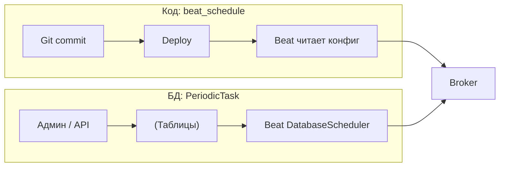
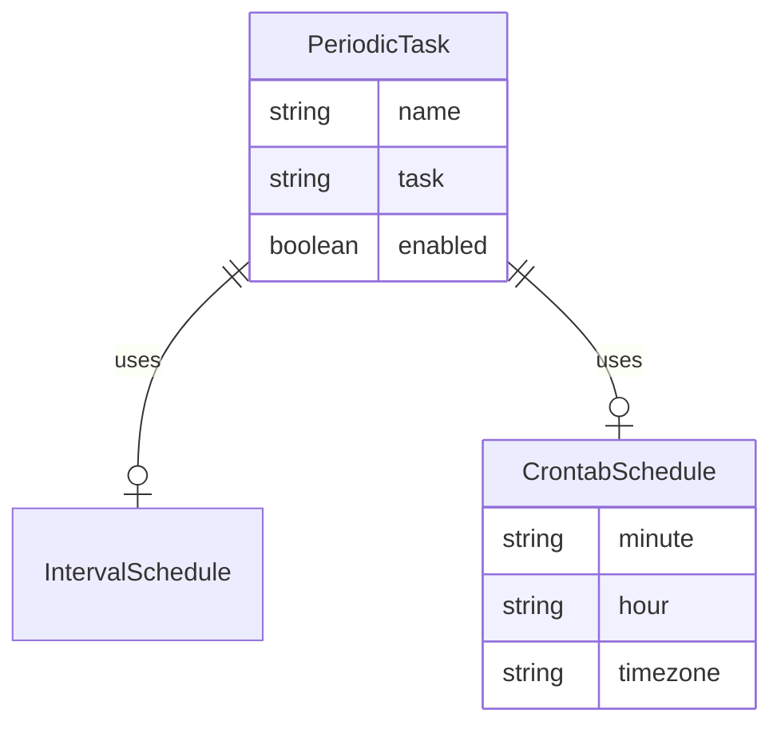

[← Назад к индексу части](index.md)
[↑ К глобальному плану](../../mastery_plan.md)

## 11.6. Динамические расписания и django-celery-beat

### Цель раздела

Понять, зачем переносить расписание в БД, какие операционные выгоды это даёт и какие **риски** появляются при изменении расписаний без деплоя и при нескольких beat.

### В этом разделе главное

- **БД vs `beat_schedule`**: гибкость против простоты git-review.
- Админка и операции «включить/выключить задачу» без релиза — сильная сторона.
- Миграции схемы и консистентность — обязательная дисциплина.
- Несколько beat + DatabaseScheduler — тема для **версионной документации** конкретной библиотеки; относитесь критически и проверяйте поведение.
- django-celery-beat **не заменяет** полноценный workflow-orchestrator для сложных DAG-ов.

### Термины

| Термин | Кратко |
| --- | --- |
| **DatabaseScheduler** | Планировщик beat, читающий расписание из БД. |
| **IntervalSchedule / CrontabSchedule** | Модели django-celery-beat, описывающие параметры расписания. |
| **PeriodicTask** | Запись «какую задачу запускать и с каким расписанием». |

### Теория и правила

**Хранение periodic tasks в БД**

Плюсы:

- изменения без деплоя;
- удобные операции SRE/админов;
- потенциально централизованный источник правды.

Минусы:

- усложнение **GitOps**;
- риск человеческой ошибки в проде;
- необходимость **миграций** и контроля доступа к админке.

**Сводная таблица: `beat_schedule` в коде vs записи в БД (django-celery-beat)**

| Критерий | `app.conf.beat_schedule` (код/конфиг) | `PeriodicTask` + `DatabaseScheduler` |
| --- | --- | --- |
| Изменение расписания | Деплой / релиз конфига | Админка, shell, API — **без** релиза приложения |
| Ревью и история | Git, PR, code owners | Нужны **аудит**, тикеты, возможно event sourcing по изменениям |
| Воспроизводимость окружений | staging ≈ prod при том же коммите | Риск расхождения: в БД staging забыли скопировать продовые правила |
| Миграции схемы | Не зависят от таблиц beat | Зависят от миграций `django_celery_beat` |
| Один источник правды | Просто, если нет гибрида | Просто, если **всё** перенесено из кода в БД или наоборот |



##### Проверь себя: `beat_schedule` в коде vs БД

1. В чём **воспроизводимость** staging отличается для расписания в Git и для `PeriodicTask` в БД?

<details><summary>Ответ</summary>

При коде staging ≈ prod при **одном коммите**. При БД легко забыть **скопировать** продовые правила на staging — окружения **расходятся**, тесты не ловят реальную конфигурацию.

</details>

2. Какой **операционный выигрыш** БД даёт при инциденте, который не покрывает «просто откатить деплой»?

<details><summary>Ответ</summary>

Можно **выключить** задачу, сменить интервал или параметры **без релиза** через админку/shell/API — быстрее реакция, если процесс change management отлажен.

</details>

3. Почему строка таблицы «один источник правды» предупреждает о **гибриде**?

<details><summary>Ответ</summary>

Часть задач в коде, часть в БД ломает **единую картину** периодики, усложняет аудит и онбординг; нужен осознанный перенос в **один** канал или строгий регламент.

</details>

**Админка без деплоя**

Операционные кейсы:

- выключить задачу при инциденте;
- временно увеличить интервал;
- включить задачу для одного тенанта (если модель данных позволяет — осторожно).

**Миграции и консистентность**

- обновления django-celery-beat могут менять схему;
- важно прогонять миграции **до** переключения traffic на новую версию (стандартная дисциплина Django).

**Несколько инстансов приложения + rolling deploy:** пока часть pod-ов на старой версии кода, а часть на новой, **одна** общая БД с `PeriodicTask` уже видит новые поля после `migrate`. Старые процессы могут **не знать** новых колонок/семантики — поэтому порядок обычно такой: **сначала** совместимые миграции и деплой, **затем** использование новых возможностей; либо миграции обратно совместимы по данным. Для **beat** отдельно: при обновлении версии планировщика избегайте ситуации «два разных minor django-celery-beat одновременно пишут в одни таблицы» без чтения upgrade guide.

**Несколько инстансов beat (риски)**

Разные версии библиотек решали это по-разному (locks, синхронизация). Практическое правило:

- **проверяйте документацию вашей версии**;
- в сомнениях — **один beat** как эксплуатационный дефолт.

**Конкретика по django-celery-beat (логика, не привязка к одной версии):**

- при **DatabaseScheduler** beat периодически **читает** таблицы и планирует отправку; если запущено **несколько** процессов beat без координации, вы можете получить **дубли** так же, как с двумя обычными beat — unless библиотека явно сериализует это через БД-лок (проверьте release notes вашей версии);
- при обновлении пакета читайте **миграции**, **CHANGELOG/release notes** и раздел **Upgrading** в документации: менялись ли поля расписания, часовые пояса, поведение `last_run_at`, семантика `enabled`, совместимость с вашей версией Celery;
- **одна** команда `migrate` на всех инстансах приложения до включения новых beat; после апгрейда имеет смысл **smoke-тест** на staging: одна тестовая `PeriodicTask` и просмотр логов beat.

##### Проверь себя: rolling deploy, версии и несколько beat

1. Как **rolling deploy** приложения ломает консистентность, если БД уже после `migrate`, а часть pod-ов на старом коде?

<details><summary>Ответ</summary>

Общая БД может содержать **новые колонки/семантику**, которую старые процессы **не понимают**; нужны обратно совместимые миграции, порядок «migrate → деплой → новые фичи» и избегание двух **разных minor** django-celery-beat, пишущих в одни таблицы.

</details>

2. Почему при `DatabaseScheduler` **несколько** процессов beat без координации опасны, даже если «в доке что-то про lock»?

<details><summary>Ответ</summary>

Поведение **версионно-зависимо**; без проверки release notes вы можете получить **дубли постановки**, как с двумя обычными beat. Практический дефолт — **один** beat, пока явно не подтверждена координация.

</details>

3. Зачем после апгрейда пакета читать **CHANGELOG** именно по полям `last_run_at`, `enabled`, timezone?

<details><summary>Ответ</summary>

Семантика планировщика и расписаний **меняется между релизами**; молчаливое изменение может дать **пропуски**, двойные тики или неверную TZ без изменения вашего прикладного кода.

</details>

**Гибрид: `beat_schedule` в коде + записи в БД одновременно**

Опасная конфигурация: часть задач в `app.conf.beat_schedule`, часть в `PeriodicTask`. Вы теряете **единую картину** «что вообще периодическое в системе», усложняете аудит и onboarding. Если нужен django-celery-beat, обычно **переносят** статическое расписание в фикстуры/миграции данных или держат **один** источник правды.

##### Проверь себя: гибрид и рубильники

1. Назови **два** практических способа убрать гибрид «код + БД» в пользу одного источника.

<details><summary>Ответ</summary>

Перенести всё в **фикстуры/данные миграций** для `PeriodicTask` или, наоборот, **вычистить** БД-задачи и оставить только `beat_schedule`; главное — **документировать** единственный канал правды.

</details>

2. Зачем в тексте упомянут **feature-flag в коде задачи** «если БД недоступна»?

<details><summary>Ответ</summary>

Админка и `PeriodicTask` бесполезны при недоступности БД; последний рубильник в коде позволяет **безопаснее** деградировать поведение (например, не выполнять опасный side-effect), пока восстанавливают БД.

</details>

**Операции без деплоя (кроме админки)**

- Django shell / management command: выставить `PeriodicTask.enabled=False` при инциденте (с записью в тикет);
- API поверх моделей (внутренний tooling) с тем же RBAC, что и админка;
- feature-flag в коде задачи как **последний** рубильник, если БД недоступна.

**Ограничения: не заменять orchestrator без осознанности**

django-celery-beat хорош для **триггеров по времени**. Он не заменяет:

- сложные зависимости DAG;
- визуальное управление workflow;
- сильные семантики компенсаций/саг, если они нужны на уровне платформы.

**Когда «оркестратор» уместен вместо или рядом с beat:** нужны **зависимости** шагов (A → B → C), **повторный запуск** с тем же контекстом, **backfill** больших объёмов с контролем, **data lineage**, SLA на этапы — смотрите Airflow, Temporal, Prefect, managed Cloud Scheduler + отдельные Celery-задачи как workers. Celery Beat остаётся **простым таймером** «пора вызвать задачу».

##### Проверь себя: границы django-celery-beat и оркестраторов

1. Назови **три** возможности полноценного workflow-orchestrator, которых нет у «простого таймера» beat.

<details><summary>Ответ</summary>

Например: **граф зависимостей** шагов (A → B → C) с условными ветвлениями; **контролируемый backfill** и **data lineage** по крупным пайплайнам; **операционный UI** с политиками повторного запуска, версиями артефактов и **SLA**/компенсациями на уровне платформы.

</details>

2. Как можно совместить **Cloud Scheduler** и Celery, не превращая beat в оркестратор?

<details><summary>Ответ</summary>

Внешний планировщик **публикует** работу (HTTP, сообщение в очередь), а Celery-задачи остаются **исполнителями**; beat в приложении не отвечает за эти триггеры — снижается дублирование ролей.

</details>

### Пошагово: внедрить django-celery-beat (логическая последовательность)

1. Установить пакет и добавить в `INSTALLED_APPS`.
2. Выполнить миграции.
3. Настроить Celery на использование `DatabaseScheduler` (см. документацию проекта).
4. Завести записи расписаний (фикстуры/админка).
5. Определить политику доступа к админке и change management.

### Простыми словами

`beat_schedule` в коде — как расписание уроков, напечатанное в книжке: чтобы поменять — нужен **новый выпуск книжки**. БД — как доска объявлений: можно поменять быстро, но кто угодно может наклеить лишнее, если нет правил.

### Картинка в голове

**GitOps** против **оперативной доски**. Оба валидны, но это разные культуры управления изменениями.

### Как запомнить

**Код — review и воспроизводимость. БД — скорость и гибкость. Выбирай осознанно.**

### Примеры

**Идея настройки (псевдо, зависит от версии)**

```python
# celery.py (идея)
from celery import Celery
from django.conf import settings

app = Celery("proj")
app.config_from_object("django.conf:settings", namespace="CELERY")

# Часто добавляют:
# app.conf.beat_scheduler = "django_celery_beat.schedulers:DatabaseScheduler"
```

Конкретные строки могут отличаться по версии — это нормально: в учебных материалах важнее **понимание роли**, чем заученная строка.

**Django `settings.py` (типовые элементы)**

```python
INSTALLED_APPS = [
    # ...
    "django_celery_beat",
]

# Иногда ту же идею задают через префикс CELERY_ и config_from_object — держите один стиль в проекте.
```

После установки приложения обязательны **`python manage.py migrate`** — в БД появятся таблицы расписаний. Пропуск миграций на одном из окружений — классический источник «на staging работает, в prod падает beat».

**Как устроены сущности (логическая модель)**

| Сущность | Роль |
| --- | --- |
| **`PeriodicTask`** | Включает/выключает задачу, хранит имя Celery-задачи (`task`), аргументы, привязку к одному из типов расписания. |
| **`IntervalSchedule`** | «Каждые N секунд/минут/…» |
| **`CrontabSchedule`** | Поля cron-подобного расписания + timezone (в зависимости от версии). |
| **`SolarSchedule`** | Солнечное расписание, если используете. |
| **`ClockedSchedule`** | Разовый запуск в заданное время (полезно для отложенных одноразовых триггеров). |

Связь обычно такая: **одна** `PeriodicTask` ссылается на **один** объект расписания выбранного типа. В админке это выглядит как выбор: interval vs crontab vs …



**Операционный anti-pattern:** править продовую БД вручную без записи в runbook/тикет — быстро, но потом никто не помнит, почему «эта задача выключена».

##### Проверь себя: модель сущностей и операционные ловушки

1. Почему у **одной** `PeriodicTask` обычно **одно** расписание (interval *или* crontab *или* …)?

<details><summary>Ответ</summary>

Модель отражает «одна логическая периодика — один триггер»; смешение нескольких календарей на одну запись размыло бы семантику «когда именно» ставить задачу. Нужны несколько записей, если нужны разные расписания.

</details>

2. Для чего в учебной модели существует **`ClockedSchedule`** рядом с interval/crontab?

<details><summary>Ответ</summary>

Для **разового** запуска в заданное время (отложенный одноразовый триггер) без вечного cron — удобно для операций «включить один прогон», миграций данных по расписанию и т.п.

</details>

3. Что ломается, если **переименовали** Python-функцию задачи, но не обновили строку в поле `task` у `PeriodicTask`?

<details><summary>Ответ</summary>

Beat продолжает слать **старое имя**; worker отвечает «задача не зарегистрирована», периодика **молча** не выполняется при слабом мониторинге.

</details>

### Практика / реальные сценарии

- В крупных Django-компаниях почти всегда есть процесс: **кто имеет право** отключать периодику в проде и как это аудируется.

### Типичные ошибки

- Включить админку для расписаний без RBAC.
- Иметь **два beat** «потому что так получилось» после миграции на DatabaseScheduler.
- **Переименовать** Celery-задачу или сменить путь модуля в коде, **не обновив** поле `task` в `PeriodicTask` — в логах beat «задача не зарегистрирована», мониторинг молчит.
- Менять **сигнатуру** задачи (обязательные `kwargs`), не поправив записи в БД: периодика падает на каждом тике.
- Полагаться на **ручные правки** в prod без фиксации в тикете/фикстурах: staging и prod расходятся, onboarding ломается.

### Что будет, если…

- **Если расписание в БД рассинхронизировали** с кодом задачи (имя задачи удалили, а periodic всё ссылается): получите ошибки исполнения и «тихие» провалы, если мониторинг слабый.
- **Если миграции django-celery-beat применили только на части окружений:** beat на «старой» схеме падает или ведёт себя непредсказуемо при чтении таблиц.
- **Если отключили задачу в админке** и забыли включить после инцидента: бизнес-процесс «молча» не выполняется, пока нет алерта на отсутствие ожидаемых метрик/логов.

### Проверь себя

1. Назови два преимущества и два риска БД-расписаний относительно `beat_schedule` в коде.

<details><summary>Ответ</summary>

**Преимущества:** быстрые операционные изменения без деплоя; удобная централизация для команды эксплуатации. **Риски:** слабее GitOps/ревью; человеческие ошибки в проде; необходимость строгого доступа и мониторинга; потенциальные сложности с несколькими beat (зависит от реализации).

</details>

2. Почему django-celery-beat не «убивает» потребность в Airflow/Temporal для сложных процессов?

<details><summary>Ответ</summary>

Потому что он решает в основном **триггеры по расписанию** и параметрам periodic task, а не полноценное управление **DAG**, зависимостями версий артефактов, backfill-пайплайнами, data lineage и богатыми операционными UI/политиками orchestrator-платформ.

</details>

3. Какая дисциплина нужна, чтобы БД-расписание оставалось безопасным?

<details><summary>Ответ</summary>

RBAC, аудит изменений, мониторинг ошибок задач, согласованные процедуры изменений (change management), тесты на критичные периодики и контроль количества/конфигурации beat-инстансов.

</details>

4. Почему смена **обязательных `kwargs`** в сигнатуре задачи ломает периодику раньше, чем первый бизнес-баг?

<details><summary>Ответ</summary>

`PeriodicTask` в БД передаёт **старый** набор аргументов; при каждом тике Celery падает на **валидации/вызове** задачи — ошибка видна сразу в логах worker/beat, а не только в данных.

</details>

5. Зачем фиксировать ручное `enabled=False` в **тикете/runbook**, а не только в голове?

<details><summary>Ответ</summary>

Иначе после инцидента задачу **забывают включить**, staging/prod расходятся с ожиданиями команды, а новые инженеры не понимают, почему «в коде всё есть», а прогонов нет.

</details>

### Запомните

- БД-расписание — это **операционная суперсила** и **операционный риск** одновременно.
- Сверяйте поведение **вашей версии** django-celery-beat с документацией.
- Сложные workflow — это отдельный класс систем.

---
